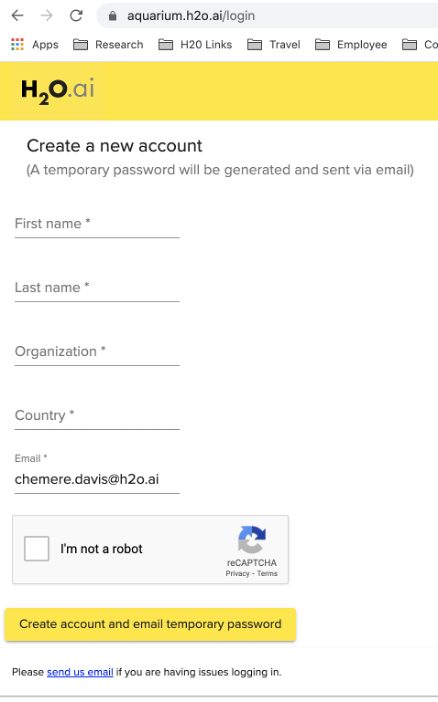
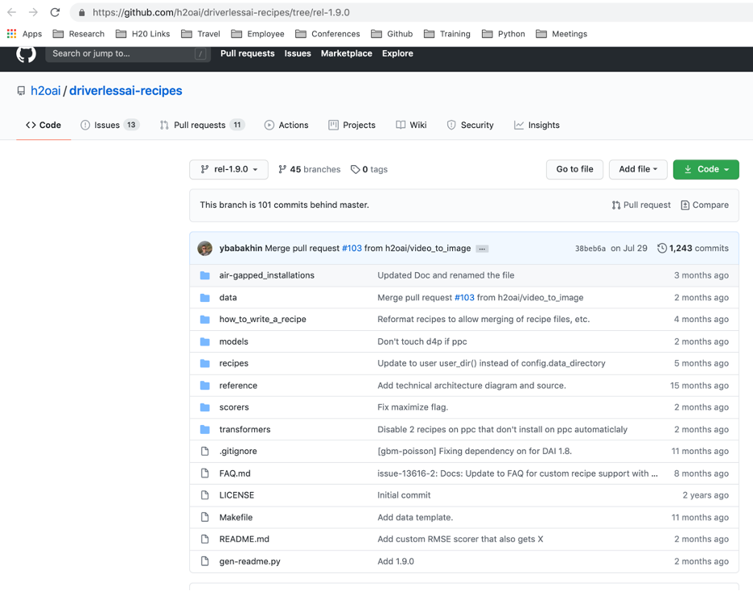

# ML Foundations: Module 2 Session 2: Getting Started With Feature Engineering Hands-On Assignment in H2O-3 (Part 2)

## Objective

This is part 2 of a 2-part exercise examining feature engineering using two different [H2O.ai's](https://www.h2o.ai/) products: the open source machine learning platform, [H2O-3](https://www.h2o.ai/products/h2o/) and the Enterprise automated machine learning platform, [Driverless AI](https://www.h2o.ai/products/h2o-driverless-ai/).

## Part 2 Automated Feature Engineering with Driverless AI

For Part 2 of this assignment, you will learn how to explore data details, launch an experiment, explore feature engineering, and how to extend Driverless AI using Bring Your Own Recipe (BYOR) by accessing the [H2O.ai Recipe Github Repository](https://github.com/h2oai/driverlessai-recipes/tree/rel-1.9.0). 

In this overview of H2O-3, you will learn how to load data, define encoding parameters, train a target econding model, train a tree-based model with target encoding and a baseline model, and compare the results.

**Note: This tutorial has been built on Aquarium, which is H2O.ai's cloud environment providing software access for workshops, conferences, and training. The labs in Aquarium have datasets, experiments, projects, and other content preloaded. If you use your version of H2O-3 or Driverless AI, you will not see preloaded content.**

## Prerequisites

- Basic knowledge of Machine Learning and Statistics
- An [Aquarium](https://aquarium.h2o.ai/) Account to access H2O.ai’s software on the AWS Cloud. 
   - Need an Aquarium account? Follow the instructions in the next section **Task 1 Create An Account & Log Into Aquarium** to create an account
  - Already have an [Aquarium](https://aquarium.h2o.ai/) account? Log in and continue to **Task 2 Launch the H2O-3 & Sparkling Water Lab** to begin your exercise!

**Note: Aquarium's Driverless AI lab has a license key built-in, so you don't need to request one to use it. Each Driverless AI lab instance will be available to you for two hours, after which it will terminate. No work will be saved. If you need more time to further explore Driverless AI, you can always launch another lab instance or reach out to our sales team via the [contact us form](https://www.h2o.ai/company/contact/).**

## Task 1: Create An Account & Log Into Aquarium

Navigate to the following site: https://aquarium.h2o.ai/login and do the following: 

1.  create a new account (if you don’t have one) 
2.  log into the site with your credentials

## Task 2: Open the Automatic Machine Learning Introduction with Driverless AI Tutorial

Once you’ve created your account on Aquarium and/or logged into the site, open the following tutorial: [Tutorial 1A: Automatic Machine Learning Introduction with Driverless AI](https://training.h2o.ai/products/tutorial-1a-automatic-machine-learning-introduction-with-driverless-ai)

- In this exercise, you will follow the steps in the above tutorial, but quiz questions will be focused on the automated feature engineering capabilities
  - You do also have the option to complete the tutorial to earn a badge
 
1. Follow the steps in the tutorial to launch a classification experiment for the Titanic dataset and explore Driverless AI.

## Task 3: Exploring Driverless AI Custom Recipes (BYOR) 

Driverless AI allows you to import custom recipes for machine learning algorithms, feature engineering (transformers), scorers, and configuration. Custom recipes can be used with or instead of the built-in recipes. You have greater flexibility over the Driverless AI Automatic ML Pipeline and control over the choices made by Driverless AI.\

There are 4 types of recipes currently supported by Driverless AI:

- **Data:** Use for custom data preparation
  - Transformations like aggregation, joins & domain specific data cleaning
- **Transformers:** Custom feature engineering
  - Transformation for numeric, categorial , timeseries, image, text data, .etc
- **Models:** Custom algorithms 
   - Extends access to the machine learning custom and even third-party models
- **Scorers:** Custom model performance measurements
  - Optimizations for domain-specific metrics including cost, pricing, ranking, and more

H2O.ai has an array of [custom recipes](https://github.com/h2oai/driverlessai-recipes/tree/rel-1.9.0) that can be used to extend Driverless AI 

 
1. Explore the recipes available in the transformers folder from the repository.
 
### Deeper Dive and Resources:
- [H2O.ai Github Repository: Driverless AI Recipes](https://github.com/h2oai/driverlessai-recipes/tree/rel-1.9.0)
- [Built-In Driverless AI Transformations](http://docs.h2o.ai/driverless-ai/latest-stable/docs/userguide/transformations.html)

## Next Steps

Now that you have completed the Introduction to Automatic Feature Engineering you can take the **Quiz 1: Session 2: Getting Started With Feature Engineering** assessment.

