# Tutorial de Analysis y Puntuacion de Experimentos de Machine Learning - Enfoque Financiero

## Outline
- [Objectivo](#objectivo)
- [Prerrequisitos](#prerequisitos)
- [Task 1:  Launch Experiment](#task-1-launch-experiment)
- [Task 2: Explore Experiment Settings and Expert Settings](#task-2-explore-experiment-settings-and-expert-settings)
- [Task 3: Experiment Scoring and Analysis Concepts](#task-3-experiment-scoring-and-analysis-concepts)
- [Task 4: Experiment Results Summary and Diagnostics](#task-4-experiment-results-summary)
- [Task 5: Diagnostics Scores and Confusion Matrix](#task-5-diagnostics-scores-and-confusion-matrix)
- [Task 6: ER: ROC](#task-6-er-roc)
- [Task 7: ER: Prec-Recall](#task-7-er-prec-recall)
- [Task 8: ER: Gains](#task-8-er-gains)
- [Task 9: ER: LIFT](#task-9-er-lift)
- [Task 10: Kolmogorov-Smirnov Chart](#task-10-kolmogorov-smirnov-chart)
- [Task 11: Experiment AutoDocs](#task-11-experiment-autodocs)
- [Next Steps](#next-steps)


## Objetivo

Muchas herramientas, como ROC y curvas de recuperación de precisión, están disponibles para evaluar qué tan bueno o malo es un modelo de clasificación para predecir resultados. En este tutorial, usaremos un subconjunto del conjunto de datos de nivel de préstamo unifamiliar de Freddie Mac para construir un modelo de clasificación y lo usaremos para predecir si un préstamo quedará en mora. A través de la herramienta de diagnóstico de H2O’s Driverless AI , exploraremos los impactos financieros que tienen las predicciones de falsos positivos y falsos negativos mientras exploramos herramientas como ROC Curve, Prec-Recall, Gain and Lift Charts, K-S Chart. Finalmente, exploraremos algunas métricas como AUC, F-Scores, GINI, MCC y Log Loss para ayudarnos a evaluar el desempeño del modelo generado.

**Note:** Le recomendamos que primero revise todo el tutorial para revisar todos los conceptos, de esa manera, una vez que comience el experimento, estará más familiarizado con el contenido.
  
## Prerrequisitos
Necesitará lo siguiente para poder hacer este tutorial:

- Conocimientos básicos de aprendizaje automático y estadística.
- Un entorno de Driverless AI
- Conocimientos básicos de IA sin conductor o hacer el [Automatic Machine Learning Introduction with Drivereless AI Test Drive](https://h2oai.github.io/tutorials/automatic-ml-intro-test-drive-tutorial/#0) 

- Una **sesión de prueba de dos horas**: la prueba de manejo es Driverless AI de H2O.ai en la nube de AWS. No es necesario descargar software. Explore todas las características y beneficios de la plataforma de aprendizaje automático H2O.

  - ¿Necesita una **sesión de prueba de dos horas**? Siga las instrucciones en [este tutorial rápido](https://h2oai.github.io/tutorials/getting-started-with-driverless-ai-test-drive/#1) para iniciar una sesión de prueba de manejo.

**Note:  El laboratorio Aquarium’s Driverless AI Test Drive tiene una clave de licencia incorporada, por lo que no necesita solicitar una para usarla. Cada Driverless AI Test Drive la instancia estará disponible para usted durante dos horas, después de lo cual terminará. No se guardará ningún trabajo. Si necesita más tiempo para explorar aún más Driverless AI, siempre puede iniciar otra instancia de Test Drive o comunicarse con nuestro equipo de ventas a través del [contáctenos formulario](https://www.h2o.ai/company/contact/).**


## Tarea 1: experimento de lanzamiento

### Sobre el conjunto de datos

Este conjunto de datos contiene información sobre "datos de rendimiento crediticio a nivel de préstamo sobre una porción de hipotecas de tasa fija totalmente amortizadoras que Freddie Mac compró entre 1999 y 2017. Las características incluyen factores demográficos, rendimiento crediticio mensual, rendimiento crediticio incluyendo disposición de propiedades, pagos anticipados voluntarios, MI Recuperaciones, recuperaciones no MI, gastos, UPB diferido actual y fecha de vencimiento de la última cuota pagada."[1]

[1] Nuestro conjunto de datos es un subconjunto de [Freddie Mac Single-Family Loan-Level Dataset. ](http://www.freddiemac.com/research/datasets/sf_loanlevel_dataset.html) Contiene 500,000 filas y tiene aproximadamente 80 MB.

El subconjunto del conjunto de datos que utiliza este tutorial tiene un total de 27 características (columnas) y 500,137 préstamos (filas).

### Descargar el conjunto de datos

Descargue el subconjunto H2O del conjunto de datos de nivel de préstamo unifamiliar Freddie Mac (Freddie Mac Single-Family Loan-Level dataset) en su unidad local y guárdelo como archivo csv.

- [loan_level_500k.csv](https://s3.amazonaws.com/data.h2o.ai/DAI-Tutorials/loan_level_500k.csv)

### Lanzar experimento

1\. Carga el loan_level.csv a Driverless AI haciendo clic en **Add Dataset (agregar conjunto de datos) (or Drag and Drop (o arrastrar y soltar))** sobre el **Datasets overview (Resumen de conjuntos de datos)** página. Haga clic en **Upload File (Subir archivo)**, luego seleccione **loan_level.csv** archivo. Una vez que se carga el archivo, seleccione **Details (Detalles)**.

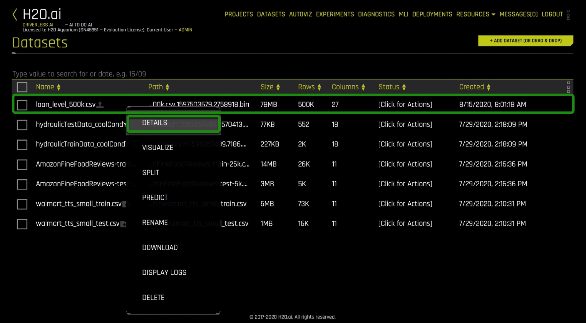

**Note:** Verá cuatro conjuntos de datos más, pero puede ignorarlos, ya que trabajaremos con el`loan_level_500k.csv` archivo. 

2\. Echemos un vistazo rápido a las columnas:


*Cosas a tener en cuenta:*
- C1 - CREDIT_SCORE (PUNTUACIÓN DE CRÉDITO)
- C2 - FIRST_PAYMENT_DATE (PRIMERA FECHA DE PAGO)
- C3 - FIRST_TIME_HOMEBUYER_FLAG (BANDERA DE COMPRADOR DE CASA POR PRIMERA VEZ)
- C4 - MATURITY_DATE (FECHA DE VENCIMIENTO)
- C5 - METROPOLITAN_STATISTICAL_AREA (ÁREA ESTADÍSTICA METROPOLITANA)
- C6 - MORTGAGE_INSURANCE_PERCENTAGE (PORCENTAJE DE SEGURO HIPOTECARIO)
- C7 - NUMBER_OF_UNITS (NÚMERO DE UNIDADES)

3\. Continúe desplazándose por la página actual para ver más columnas (la imagen no está incluida)
- C8 - OCCUPANCY_STATUS (ESTADO DE OCUPACIÓN)
- C9 - ORIGINAL_COMBINED_LOAN_TO_VALUE (PRÉSTAMO COMBINADO ORIGINAL AL VALOR)
- C10 - ORIGINAL_DEBT_TO_INCOME_RATIO (DEUDA ORIGINAL A LA RELACIÓN DE INGRESOS)
- C11 - ORIGINAL_UPB (ORIGINAL_UPB)
- C12 - ORIGINAL_LOAN_TO_VALUE (PRÉSTAMO ORIGINAL AL VALOR)
- C13 - ORIGINAL_INTEREST_RATE (TASA DE INTERÉS ORIGINAL)
- C14 - CHANNEL (CANAL)
- C15 - PREPAYMENT_PENALTY_MORTGAGE_FLAG (PAGO DE PREPAGO BANDERA HIPOTECARIA)
- C16 - PRODUCT_TYPE (TIPO DE PRODUCTO)
- C17- PROPERTY_STATE (Estado de la propiedad)
- C18 - PROPERTY_TYPE (TIPO DE PROPIEDAD)
- C19 - POSTAL_CODE (CÓDIGO POSTAL)
- C20 - LOAN_SEQUENCE_NUMBER (NÚMERO DE SECUENCIA DE PRÉSTAMO)
- C21 - LOAN_PURPOSE** (PROPÓSITO DEL PRESTAMO)
- C22 - ORIGINAL_LOAN_TERM (PLAZO DE PRÉSTAMO ORIGINAL)
- C23 - NUMBER_OF_BORROWERS (NÚMERO DE PRESTATARIOS)
- C24 - SELLER_NAME (NOMBRE DEL VENDEDOR)
- C25 - SERVICER_NAME (NOMBRE DEL SERVIDOR)
- C26 - PREPAID Drop (PREPAGO Drop) 
- C27 - DELINQUENT (DELINCUENTE)- Esta columna es la etiqueta que nos interesa predecir dónde Falso -> no predeterminado y Verdadero -> predeterminado


4\. Regrese a la página de resumen **Datasets**

5\. Haga clic en el **loan_level_500k.csv** archivo luego dividir (split)

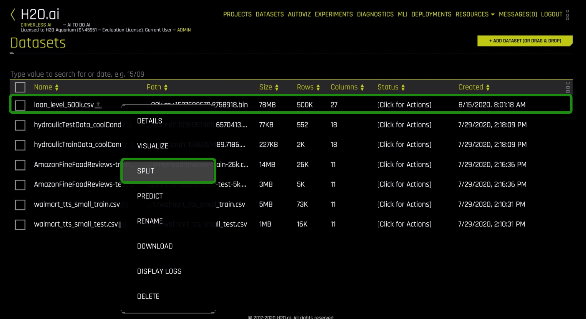

6\.  Divide los datos en dos conjuntos:**freddie_mac_500_train** y **freddie_mac_500_test**. Use la imagen a continuación como guía:

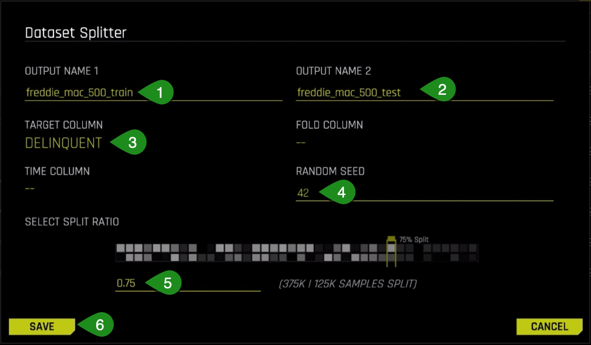
*Cosas a tener en cuenta:*

1. Tipo ```freddie_mac_500_train``` para OUTPUT NAME 1, esto servirá como conjunto de entrenamiento
2. Tipo ```freddie_mac_500_test``` para OUTPUT NAME 2, esto servirá como conjunto de prueba
3. Para la columna de destino, seleccione **Delinquent (Delincuente)**
4. Puede establecer la semilla (Seed) aleatoria en cualquier número que desee, elegimos 42, al elegir una semilla (Seed) aleatoria obtendremos una división consistente
5. Cambie el valor de división a .75 ajustando el control deslizante a 75% o ingresando .75 en la sección que diceTrain/Valid Split Ratio (Tren / Relación de división válida)
6. Salvar


El conjunto de capacitación contiene 375k filas, cada fila representa un préstamo y 27 columnas que representan los atributos de cada préstamo, incluida la columna que tiene la etiqueta que estamos tratando de predecir.

 **Nota:** Los datos reales en la división de entrenamiento y prueba varían según el usuario, ya que los datos se dividen aleatoriamente. El conjunto de prueba contiene 125k filas, cada fila representa un préstamo y 27 columnas de atributos que representan los atributos de cada préstamo.

7\. Verifique que hay tres conjuntos de datos, **freddie_mac_500_test**, **freddie_mac_500_train** y **loan_level_500k.csv**:


8\. Haga clic en el **freddie_mac_500_train** luego seleccione **Predict (Predecir)**.

9\. Seleccione **Not Now (Ahora no)** sobre el **First time Driverless AI, Haga clic en Sí para obtener un recorrido!**. Debería aparecer una imagen similar:


Nombra tu experimento `Freddie Mac Classification Tutorial`

10\. Seleccione **Dropped Cols**, suelte las siguientes 2 columnas: 

- Prepayment_Penalty_Mortgage_Flag 
- PREPAID
- Seleccione **Done (Hecho)**

Estas dos columnas se descartan porque ambas son indicadores claros de que los préstamos se volverán morosos y causarán fugas de datos.


 11\. Seleccione **Target Column (Columna de destino)**, luego seleccione **Delinquent**
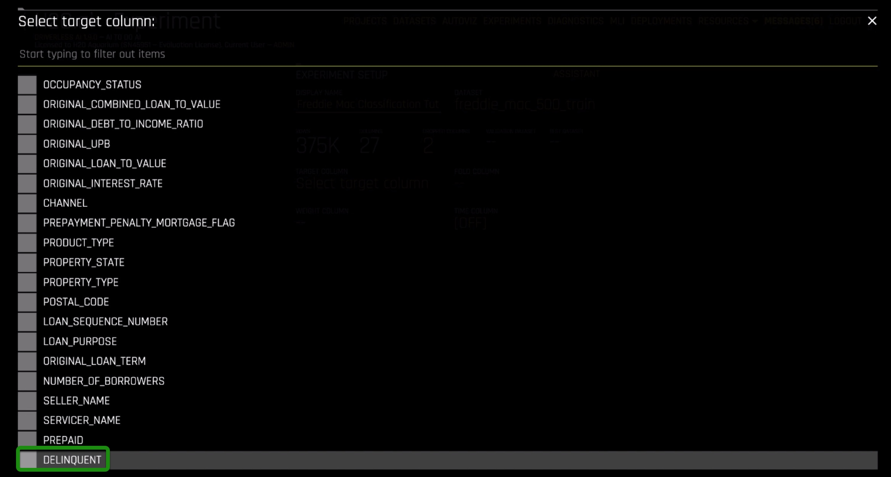

12\. Seleccione **Test Dataset (Conjunto de datos de prueba)**, luego **freddie_mac_500_test**


13\. Debería aparecer una página de Experimento similar:   

    

En la tarea 2, exploraremos y actualizaremos el **Experiment Settings (Configuraciones de experimento)**.

## Tarea 2: Explorar la configuración del experimento y la configuración de expertos

1\.  Pase el mouse sobre **Experiment Settings (Configuraciones de experimento)** y tenga en cuenta las tres perillas, **Accuracy (Exactitud)**, **Time (Hora)** y **Interpretability (Interpretabilidad)**.

El **Experiment Settings** describe la precisión, el tiempo y la interpretabilidad de su experimento específico. Las perillas en la configuración del experimento son ajustables, ya que los valores cambian el significado de la configuración en la página inferior izquierda.

Aquí hay una descripción general de la configuración de Experimentos: 

- **Accuracy** - Precisión relativa: valores más altos deberían conducir a una mayor confianza en el rendimiento del modelo (precisión).
- **Time** - Tiempo relativo para completar el experimento. Los valores más altos tardarán más en completarse.
- **Interpretability**-  La capacidad de explicar o presentar en términos comprensibles a un humano. Cuanto mayor sea la interpretabilidad, más simples serán las características que se extraerán.  


### Accuracy

Al aumentar la configuración de precisión, Driverless AI ajusta gradualmente el método para realizar la evolución y el conjunto. Un conjunto de aprendizaje automático consta de múltiples algoritmos de aprendizaje para obtener un mejor rendimiento predictivo que se podría obtener de cualquier algoritmo de aprendizaje [1]. Con una configuración de baja precisión, Driverless AI varía las características (desde la ingeniería de características) y los modelos, pero todos compiten de manera uniforme entre sí. Con mayor precisión, cada modelo principal independiente evolucionará de forma independiente y será parte del conjunto final como un conjunto sobre diferentes modelos principales. Con precisiones más altas, Driverless AI evolucionará + tipos de características de conjunto, como la codificación de destino, dentro y fuera, que evolucionan de forma independiente. Finalmente, con las precisiones más altas, lDriverless AI realiza el seguimiento tanto del modelo como de las características y combina todas esas variaciones.

### Time

El tiempo especifica el tiempo relativo para completar el experimento (es decir, las configuraciones más altas tardan más). La detención temprana tendrá lugar si el experimento no mejora la puntuación para la cantidad especificada de iteraciones. Cuanto mayor sea el valor de tiempo, más tiempo se asignará para nuevas iteraciones, lo que significa que la receta tendrá más tiempo para investigar nuevas transformaciones en la ingeniería de características y el ajuste de hiperparámetros del modelo.

### Interpretability 

El mando de interpretabilidad es ajustable. Cuanto mayor sea la capacidad de interpretación, más simples serán las características que la rutina de modelado principal extraerá del conjunto de datos. Si la capacidad de interpretación es lo suficientemente alta, se generará un modelo con restricciones monotónicas.

2\.  Para este tutorial, actualice la siguiente configuración del experimento para que coincida con la imagen a continuación:
- Accuracy : 4
- Time: 3
- Interpretability: 4
- Scorer (Goleador): Logloss 

Esta configuración se seleccionó para generar un modelo rápidamente con un nivel de precisión suficiente en el entorno H2O Driverless Test Drive.

    

### Expert Settings (Configuraciones de expertos)

3\. Pase el mouse sobre **Expert Settings (Configuraciones de expertos)** y haga clic en él. Aparecerá una imagen similar a la siguiente:


*Cosas a tener en cuenta:*
1. **Upload Custom Recipe (Subir receta personalizada)**
2. **Load Custom Recipe From URL (Cargar receta personalizada desde URL)** 
3. **Official Recipes (External) (Recetas oficiales (externas))**
4. **Experiment (Experimentar)**
5. **Model (Modelo)**
6. **Features (Caracteristicas)**
7. **Timeseries (Series de tiempo)**
8. **NLP**
9. **Recipes (Recetas)**
10. **System (Sistema)**

**Expert Settings** son opciones que están disponibles para aquellos que desean establecer su configuración manualmente. Explore la configuración experta disponible haciendo clic en las pestañas en la parte superior de la página.

**La configuración experta incluye (La configuración experta incluye)**:

**Configuraciones de experimento (Configuraciones de experimento)**
- Tiempo de ejecución máximo en minutos antes de activar el botón Finalizar
- Tiempo de ejecución máximo en minutos antes de activar el botón 'Abort'
- Receta de construcción de tuberías
- Hacer una tubería de puntuación de Python
- Hacer tubería de puntuación MOJO
- Medir la latencia de puntuación MOJO
- Tiempo de espera en segundos para esperar la creación de MOJO al final del experimento
- Número de trabajadores paralelos a utilizar durante la creación de MOJO
- Hacer visualización de canalización
- Hacer informe automático
- Número mínimo de filas necesarias para ejecutar un experimento
- Nivel de reproducibilidad
- Random Seed (Semilla aleatoria)
- Permitir diferentes conjuntos de clases en todos los trenes / Validation Fold Splits
- Número máximo de clases para problemas de clasificación
- Modelo / Característica Nivel cerebral
- Característica Brain Save Every, que iteración
- Característica de reinicio cerebral desde el cual iteración
- Característica Brain Reit utiliza el mismo mejor individuo
- Feature Brain agrega características con nuevas columnas incluso durante la reentrenamiento del modelo final
- Mínimas iteraciones de Driverless AI
- Seleccione la transformación de destino del objetivo para problemas de regresión
- Modelo de torneo para algoritmo genético
- Número de pliegues de validación cruzada para la evolución de características
- Número de pliegues de validación cruzada para el modelo final
- Habilite el registro adicional para Ensemble Meta Learner
- Número de pliegues de validación cruzada o divisiones máximas basadas en el tiempo para la evolución de características
- Número de pliegues de validación cruzada o divisiones máximas basadas en el tiempo para el modelo final
- Número máximo de ID de plegado para mostrar en los registros
- Número máximo de filas veces Número de columnas para divisiones de datos de evolución de características
- Número máximo de filas veces Número de columnas para reducir el conjunto de datos de entrenamiento
- Tamaño máximo de los datos de validación relativos a los datos de entrenamiento
- Realice un muestreo estratificado para la clasificación binaria si el objetivo está más desequilibrado que esto
- Agregar a config.toml a través de la cadena toml


**Configuraciones de modelo**
- Modelos XGBoost GBM
- Modelos de dardos XGBoost
- Modelos GLM
- Modelos de árbol de decisión
- Modelos LightGBM
- Modelos TensorFlow
- Modelos FTRL
- Modelos RuleFit
- Tipos de refuerzo LightGBM
- Soporte categórico LightGBM
- Modelos constantes
- Si mostrar modelos constantes en el panel de iteración
- Parámetros para TensorFlow
- Número máximo de árboles / iteraciones
- N_estimators List To Sample From para modelos que no utilizaron la detención temprana
- Tasa de aprendizaje mínima para modelos GBM de conjunto final
- Tasa máxima de aprendizaje para modelos GBM de conjunto final
- Factor de reducción para máx. Número de árboles / iteraciones durante la evolución de la característica
- Factor de reducción para el número de árboles / iteraciones durante la evolución de la característica
- Tasa de aprendizaje mínima para modelos GBM de ingeniería de características
- Tasa máxima de aprendizaje para modelos de árbol
- Número máximo de épocas para TensorFlow / FTRL
- Max. Profundidad del árbol
- Max. max_bin para las características del árbol
- Número máximo de reglas para RuleFit
- Nivel de conjunto para la tubería de modelado final
- Validación cruzada del modelo final único
- Número de modelos durante la fase de ajuste
- Método de muestreo para problemas de clasificación binaria desequilibrada
- Relación de la mayoría a la clase minoritaria para la clasificación binaria desequilibrada a las técnicas de muestreo especiales de activación (si está habilitado)
- Relación de la mayoría a la clase minoritaria para la clasificación binaria muy desequilibrada para habilitar solo técnicas de muestreo especiales si está habilitada
- Número de bolsas para métodos de muestreo para clasificación binaria desequilibrada (si está habilitada)
- Límite estricto en el número de bolsas para métodos de muestreo para clasificación binaria desequilibrada
- Límite estricto en el número de bolsas para los métodos de muestreo para la clasificación binaria desequilibrada durante la fase de evolución de características
- Tamaño máximo de datos muestreados durante el muestreo desequilibrado
- Fracción objetivo de la clase minoritaria después de aplicar técnicas de submuestreo / sobremuestreo
- Número máximo de términos de interacción automática FTRL para términos de interacción de segundo, tercer y cuarto orden (cada uno)
- Habilitar información detallada del modelo puntuado
- Si se debe habilitar el muestreo Bootstrap para la validación y los puntajes de prueba
- Para problemas de clasificación con tantas clases, el valor predeterminado es TensorFlow

**Configuración de características**
- Esfuerzo de ingeniería de características
- Detección de cambio de distribución de datos
- Distribución de datos Detección de cambio Caída de características
- Cambio de característica máximo permitido (AUC) antes de descartar la función
- Detección de fugas
- Detección de fugas que reduce el limite de AUC / R2
- Columnas Max Rows Times para fugas
- Informe la importancia de la permutación en las características originales
- Número máximo de filas para realizar la selección de características basadas en permutación
- Número máximo de características originales utilizadas
- Número máximo de características no numéricas originales
- Número máximo de características originales utilizadas para FS Individual
- Número de características numéricas originales para activar el tipo de modelo de selección de características
- Número de características no numéricas originales para activar el tipo de modelo de selección de características
- Fracción máxima permitida de uniques para columnas enteras y categóricas
- Permitir el tratamiento numérico como categórico
- Número máximo de valores únicos para Int / Float para ser categóricos
- Número máximo de características de ingeniería
- Max. Numero de genes
- Limitar características por interpretabilidad
- Correlación más allá de la cual desencadena restricciones de monotonicidad (si está habilitada)
- Profundidad máxima de interacción de características
- Profundidad de interacción de característica fija
- Habilitar la codificación de destino
- Habilitar codificación de etiqueta lexicográfica
- Habilitar codificación de puntuación de anomalía de bosque de aislamiento
- Habilitar One HotEncoding
- Número de estimadores para la codificación de bosque de aislamiento
- Caída de columnas constantes
- Columnas de ID de caída
- No suelte ninguna columna
- Características para soltar
- Características para agrupar por
- Muestra de características para agrupar por
- Funciones de agregación (no series temporales) para agrupar por operaciones
- Número de pliegues para obtener la agregación al agrupar
- Tipo de estrategia de mutación
- Habilitar información detallada de características puntuadas
- Habilite registros detallados para el tiempo y los tipos de características producidas
- Matriz de correlación computacional

**Time Series Settings (Configuración de series de tiempo)**
- Receta basada en el retraso de la serie temporal
- Divisiones de validación personalizadas para experimentos de series temporales
- Tiempo de espera en segundos para la detección de propiedades de series temporales en la interfaz de usuario
- Generar características de vacaciones
- Anulación de retrasos de series temporales
- El tamaño de retraso más pequeño considerado
- Habilitar ingeniería de características desde la columna de tiempo
- Permitir columna de tiempo entero como función numérica
- Transformaciones de fecha y hora permitidas
- Activar ingeniería de características desde la columna de tiempo entero
- Permitir que las características de fecha u hora se transformen directamente en una representación numérica
- Considere las columnas de grupos de tiempo como características independientes
- Qué tipos de características de TGC se deben considerar como características independientes
- Habilitar transformadores de tiempo inconsciente
- Agrupar siempre por columnas de grupos de todos los tiempos para crear características de retraso
- Generar predicciones de resistencia de series temporales
- Número de divisiones basadas en el tiempo para la validación interna del modelo
- Maximum Overlap Between Two Time-Based Splits
- Número máximo de divisiones utilizadas para crear predicciones de resistencia del modelo de serie temporal final
- Si se debe acelerar el cálculo de las predicciones de resistencia de series temporales
- Si se debe acelerar el cálculo de los valores de Shapley para las predicciones de retención de series temporales
- Genere valores Shapley para predicciones de resistencia de series temporales en el momento del experimento
- Límite inferior en la configuración de interpretabilidad para experimentos de series de tiempo, aplicados implícitamente
- Modo de abandono para las características de retraso
- Probabilidad de crear características de retraso no objetivo
- Método para crear predicciones de conjuntos de pruebas continuas
- Probabilidad de que los nuevos transformadores de series temporales utilicen retrasos predeterminados
- Probabilidad de explorar transformadores de retardo basados en interacción
- Probabilidad de explorar transformadores de retardo basados en agregación

**Configuraciones de PNL**
- Max TensorFlow Epochs para PNL
- La precisión anterior habilita TensorFlow NLP de forma predeterminada para todos los modelos
- Habilitar modelos de TensorFlow CNN basados en palabras para PNL
- Habilitar modelos de TensorFlow BiGRU basados en palabras para PNL
- Habilitar modelos CNN TensorFlow basados en caracteres para PNL
- Camino a las incrustaciones preformadas para los modelos TensorFlow NLP
- Permitir el entrenamiento de incrustaciones pre-entrenadas no congeladas
- Si Python / MOJO Scoring Runtime tendrá GPU
- La fracción de columnas de texto de todas las características se considera un problema dominado por texto
- Fracción de texto por todos los transformadores para activar ese texto dominado
- limite para columnas de cadena que se tratarán como texto

**Configuraciones de recetas**
- Incluir transformadores específicos
- Incluir modelos específicos
- Incluir anotadores específicos
- Probabilidad de agregar transformadores
- Probabilidad de agregar los mejores transformadores compartidos
- Probabilidad de podar transformadores
- Probabilidad de mutar los parámetros del modelo
- Probabilidad de podar características débiles
- Tiempo de espera en minutos para probar la aceptación de cada receta
- Ya sea para omitir fallas de transformadores
- Ya sea para omitir fallas de modelos
- Nivel para iniciar sesión por fallas omitidas

**Ajustes del sistema**
- Número de núcleos a usar
- Número máximo de núcleos a usar para el ajuste del modelo
- Número máximo de núcleos a utilizar para predecir el modelo
- Número máximo de núcleos a usar para la transformación y predicción del modelo al hacer MLI, informe automático, puntaje en otro conjunto de datos
- Tuning Workers por lote para CPU
- Num. Funciona para entrenamiento de CPU
- #GPU/Experimento
- Num. Núcleos / GPU
- #GPU/Modelo
- Num. De GPU para predicción / transformación aislada
- Número máximo de subprocesos para usar para datatable y OpenBLAS para Munging y Model Training
- Max. Num. De subprocesos para usar en la tabla de datos de lectura y escritura de archivos
- Max. Num. De subprocesos para usar en estadísticas de tablas de datos y Openblas
- ID de inicio de GPU
- Habilitar rastros detallados
- Habilitar el nivel de registro de depuración
- Habilite el registro de la información del sistema para cada experimento


4\. Para este experimento enciéndelo **RuleFit models (Modelos RuleFit)**, debajo **Model (Modelo)** pestaña la selección **Save (Guardar)**. 

El RuleFit[2] algoritmo crea un conjunto óptimo de reglas de decisión ajustando primero un modelo de árbol y luego ajustando un modelo GLM Lasso (regularizado por L1) para crear un modelo lineal que consta de las hojas (reglas) de árbol más importantes. El modelo RuleFit ayuda a superar la precisión de los bosques aleatorios al tiempo que conserva la explicabilidad de los árboles de decisión.

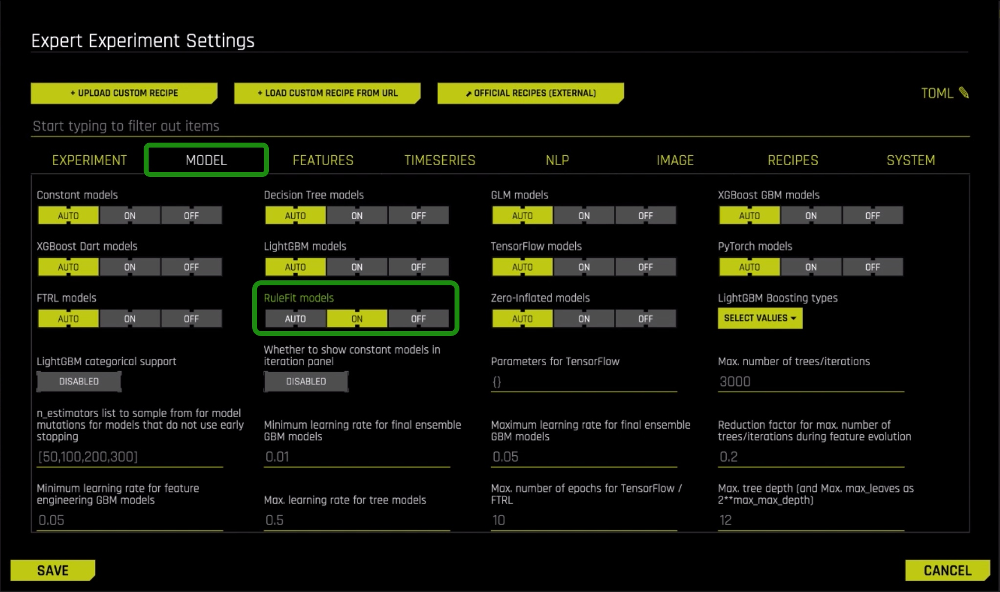

La activación del modelo RuleFit se agregará a la lista de algoritmos que la IA sin controlador considerará para el experimento. La selección del algoritmo depende de los datos y la configuración seleccionada.

5\. Antes de seleccionar **Launch (Lanzamiento)**, asegúrese de que su **Experiment (Experimentar)** la página es similar a la de arriba, una vez que esté lista, haga clic en **Launch (Lanzamiento)**. 

Obtenga más información sobre lo que significa cada configuración y cómo se puede actualizar a partir de sus valores predeterminados visitando la documentación de H2O- [Expert Settings](http://docs.h2o.ai/driverless-ai/latest-stable/docs/userguide/expert-settings.html?highlight=expert%20settings)

### Recursos

[1] [Ensemble Learning](https://en.wikipedia.org/wiki/Ensemble_learning)

[2] [J. Friedman, B. Popescu. “Predictive Learning via Rule Ensembles”. 2005](http://statweb.stanford.edu/~jhf/ftp/RuleFit.pdf)


### Inmersión más profunda 
- Para comprender mejor el impacto de establecer las perillas de precisión, tiempo e interpretabilidad entre 1 y 10 en AI sin controlador H2O](http://docs.h2o.ai/driverless-ai/latest-stable/docs/userguide/experiment-settings.html?highlight=interpretability#accuracy-time-and-interpretability-knobs)

- Para obtener más información sobre la configuración adicional en [Expert Settings for H2O Driverless AI](http://docs.h2o.ai/driverless-ai/latest-stable/docs/userguide/expert-settings.html?highlight=expert%20settings)

## Tarea 3: Conceptos de puntuación y análisis de experimentos

Como aprendimos en el [Conceptos del tutorial de introducción automática al aprendizaje automático](https://github.com/h2oai/tutorials/blob/master/DriverlessAI/automatic-ml-intro-tutorial/automatic-ml-intro-tutorial.md#model-training) Es esencial que una vez que se haya generado un modelo, se evalúe su desempeño. Estas métricas se usan para evaluar la calidad del modelo que se construyó y qué umbral de puntaje del modelo se debe usar para hacer predicciones. Existen múltiples métricas para evaluar los modelos de aprendizaje automático de clasificación binaria, como las características operativas del receptor o la curva ROC, precisión y recuperación o Cartas de Prec-Recall, Lift, Gain y KS por nombrar algunas. Cada métrica evalúa diferentes aspectos del modelo de aprendizaje automático. Los siguientes conceptos son para las métricas utilizadas en H2O’s Driverless AI para evaluar el rendimiento de los modelos de clasificación que generó. Los conceptos están cubiertos en un nivel muy alto, para aprender más en profundidad sobre cada métrica cubierta aquí, hemos incluido recursos adicionales al final de esta tarea.


### Clasificador binario

Echemos un vistazo al modelo de clasificación binaria. Un modelo de clasificación binaria predice a qué dos categorías (clases) pertenecen los elementos de un conjunto dado. En el caso de nuestro ejemplo, las dos categorías (clases) son **impago (Predicted as Positive)** en su préstamo hipotecario y **no impago (Predicted as Negative)**. El modelo generado debería poder predecir en qué categoría se encuentra cada cliente.


Sin embargo, deben considerarse otros dos posibles resultados, los falsos negativos y los falsos positivos. Estos son los casos en que el modelo predijo que alguien no incumplió con su préstamo bancario y lo hizo. El otro caso es cuando el modelo predijo que alguien incumplió con su hipoteca, pero en realidad no lo hizo. Los resultados totales se visualizan a través de una matriz de confusión, que es la tabla de dos por dos que se ve a continuación:

Las clasificaciones binarias producen cuatro resultados:

**Predicho como positivo (Predicted as Positive)**:
True Positive (Verdadero Positivo) = TP (VP)
False Positive (Falso Positivo) = FP (FP)

**Predicho como negativo (Predicted as Negative)**:
True Negative (Verdadero Negativo) = TN (VN)
False Negative (Falso Negativo) = FN (FN)


**Matriz de confusión**:


A partir de esta tabla de confusión, podemos medir la tasa de error, la precisión, la especificidad, la sensibilidad y la precisión, todas métricas útiles para probar qué tan bueno es nuestro modelo para clasificar o predecir. Estas métricas se definirán y explicarán en las siguientes secciones.

En una nota al margen divertida, es posible que se pregunte por qué el nombre "Matriz de confusión"? Algunos podrían decir que es porque una matriz de confusión puede ser muy confusa. Bromas aparte, la matriz de confusión también se conoce como la **matriz de error** ya que facilita la visualización de la tasa de clasificación del modelo, incluida la tasa de error. El término "matriz de confusión" también se usa en psicología y el diccionario de Oxford lo define como "Una matriz que representa las frecuencias relativas con las cuales **cada uno de varios estímulos se confunde con cada uno de los otros** por una persona en una tarea que requiere reconocimiento o identificación de estímulos. El análisis de estos datos permite al investigador extraer factores (2) que indican las dimensiones subyacentes de similitud en la percepción del encuestado. Por ejemplo, en las tareas de identificación de color, la **confusión** relativamente frecuente de rojos con verdes tenderá a sugerir daltonismo ". [1] En otras palabras, con qué frecuencia una persona que realiza una tarea de clasificación confunde un elemento por otro. En el caso de ML, un modelo de aprendizaje automático está implementando la clasificación y evaluando la frecuencia en la que el modelo confunde una etiqueta de otra en lugar de un ser humano.

### Curva ROC (Característica Operativa del Receptor)

Una herramienta esencial para los problemas de clasificación es la curva ROC o la curva de características operativas del receptor. La curva ROC muestra visualmente el rendimiento de un clasificador binario; en otras palabras, "indica cuánto es capaz de distinguir un modelo entre clases" [2] y el umbral correspondiente. Continuando con el ejemplo de Freddie Mac, la variable de salida o la etiqueta es si el cliente incumplirá o no su préstamo y en qué umbral.

Una vez que el modelo ha sido construido y entrenado utilizando el conjunto de datos de entrenamiento, se pasa a través de un método de clasificación (Regresión logística, Clasificador Naive Bayes, máquinas de vectores de soporte, árboles de decisión, bosque aleatorio, etc.), esto dará la probabilidad de cada cliente incumplimiento.

La curva ROC traza la Sensibilidad o tasa positiva verdadera (eje y) versus 1-Especificidad o tasa de falsos positivos (eje x) para cada umbral((límite)) de clasificación posible. Un umbral de clasificación o umbral de decisión es el valor de probabilidad que usará el modelo para determinar a dónde pertenece una clase. El umbral actúa como un límite entre clases para determinar una clase de otra. Como estamos tratando con probabilidades de valores entre 0 y 1, un ejemplo de umbral puede ser 0.5. Esto le dice al modelo que cualquier cosa por debajo de 0.5 es parte de una clase y cualquier cosa por encima de 0.5 pertenece a una clase diferente. El umbral se puede seleccionar para maximizar los verdaderos positivos y minimizar los falsos positivos. Un umbral depende del escenario al que se aplica la curva ROC y del tipo de salida que buscamos maximizar. Obtenga más información sobre la aplicación del umbral y sus implicaciones en [Tarea 6: ER: ROC] (# task-6-er-roc).

Dado nuestro ejemplo de caso de uso de predicción de préstamos, lo siguiente proporciona una descripción de los valores en la matriz de confusión:

 - TP (VP) = 1 = El resultado de las coincidencias de predicción es que alguien incumplió un préstamo
 - TN (VN) = 0 = Las coincidencias de predicción dan como resultado que alguien no haya incumplido un préstamo
 - FP (FP) = 1 = Predecir que alguien fallará pero en realidad no lo hizo
 - FN (FN) = 0 = Predecir que alguien no incumplió con su préstamo bancario, pero sí lo hizo.


¿Qué son la sensibilidad y la especificidad? La tasa positiva verdadera es la proporción del número de predicciones positivas verdaderas dividido por todos los reales positivos. Esta relación también se conoce como **recuperación (recall)** o **sensibilidad (sensitivity)**, y se mide de 0.0 a 1.0 donde 0 es la peor y 1.0 es la mejor sensibilidad. Sensible es una medida de qué tan bien el modelo predice para el caso positivo.

La tasa negativa verdadera es la proporción del número de predicciones negativas verdaderas dividido por todas las predicciones positivas. Esta relación también se conoce como **especificidad (specificity)** y se mide de 0.0 a 1.0 donde 0 es la peor y 1.0 es la mejor especificidad. La especificidad es una medida de qué tan bien el modelo predice el caso negativo correctamente. ¿Con qué frecuencia predice un caso negativo correctamente?

La tasa de falsos negativos es *1- Especificidad*, o es la proporción de falsos positivos dividida por todas las predicciones negativas [3].

La siguiente imagen proporciona una ilustración de las proporciones de sensibilidad, especificidad y tasa de falsos negativos.


**Recuperación** = **Sensibilidad** = Tasa Positiva Verdadera = VP / (VP + FN)

**Especificidad** = Tasa Negativa Verdadera = VN / (FP + VN)

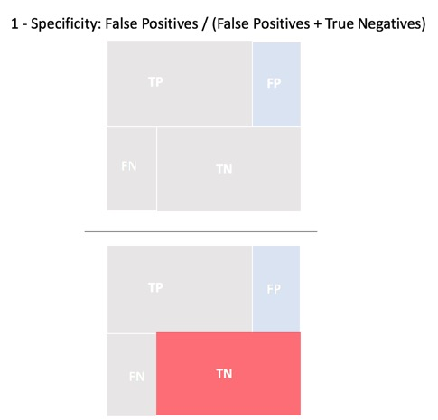

**1 -Especificidad** =  Tasa de Falso Positivo = 1- Tasa Negativa Verdadera = FP / (FP + VN )

Una curva ROC también puede decirle qué tan bien funcionó su modelo al cuantificar su rendimiento. La puntuación está determinada por el porcentaje del área que se encuentra bajo la curva ROC, también conocida como Área bajo la curva o AUC.
Below are four types of ROC Curves with its AUC:

**Nota:** Cuanto más cerca esté la curva ROC a la izquierda (mayor será el porcentaje de AUC), mejor será la separación del modelo entre clases.

La curva ROC perfecta (en rojo) a continuación puede separar las clases con una precisión del 100% y tiene un AUC de 1.0 (en azul):

  			

La curva ROC a continuación está muy cerca de la esquina izquierda y, por lo tanto, hace un buen trabajo al separar las clases con un AUC de 0.7 o 70%:


En el caso por encima del 70% de los casos, el modelo predijo correctamente el resultado positivo y negativo y el 30% de los casos hizo alguna combinación de FP o FN.

Esta curva ROC se encuentra en la línea diagonal que divide el gráfico por la mitad. Como está más lejos de la esquina izquierda, hace un trabajo muy pobre para distinguir entre clases, este es el peor de los casos, y tiene un AUC de .05 o 50%:


Un AUC de 0.5 nos dice que nuestro modelo es tan bueno como un modelo aleatorio que tiene un 50% de posibilidades de predecir el resultado. Nuestro modelo no es mejor que lanzar una moneda, el 50% de las veces el modelo puede predecir correctamente el resultado.

¡Finalmente, la curva ROC a continuación representa otro escenario perfecto! Cuando la curva ROC se encuentra por debajo del modelo del 50% o del modelo de probabilidad aleatoria, entonces el modelo debe revisarse cuidadosamente. La razón de esto es que podría haber un posible etiquetado incorrecto de los negativos y positivos que causaron la reversión de los valores y, por lo tanto, la curva ROC está por debajo del modelo de probabilidad aleatoria. Aunque parece que esta curva ROC tiene un AUC de 0.0 o 0% cuando la volteamos, obtenemos un AUC de 1 o 100%.


Una curva ROC es una herramienta útil porque solo se enfoca en qué tan bien el modelo pudo distinguir entre clases. "Las AUC pueden ayudar a representar la probabilidad de que el clasificador clasifique una observación positiva seleccionada al azar por encima de una observación negativa seleccionada al azar" [4]. Sin embargo, para modelos donde la predicción ocurre raramente, un AUC alto podría proporcionar una falsa sensación de que el modelo predice correctamente los resultados. Aquí es donde la noción de precisión y recuerdo se vuelve importante.

### Prec-Recall (Recordatorio de precisión)

La curva de recuperación de precisión o recuperación de precisión o **P-R** es otra herramienta para evaluar modelos de clasificación que se deriva de la matriz de confusión. Prec-Recall es una herramienta complementaria a las curvas ROC, especialmente cuando el conjunto de datos tiene un sesgo significativo. La curva Prec-Recall traza la precisión o el valor predictivo positivo (eje y) versus la sensibilidad o la tasa positiva verdadera (eje x) para cada umbral de clasificación posible. En un nivel alto, podemos pensar en la precisión como una medida de exactitud o calidad de los resultados mientras que recordamos como una medida de integridad o cantidad de los resultados obtenidos por el modelo. Prec-Recall mide la relevancia de los resultados obtenidos por el modelo.

**Precision (Precisión)** es la proporción de predicciones positivas correctas dividida por el número total de predicciones positivas. Esta relación también se conoce como **positive predictive value (valor predictivo positivo)** y se mide de 0.0 a 1.0, donde 0.0 es lo peor y 1.0 es la mejor precisión. La precisión está más centrada en la clase positiva que en la clase negativa, en realidad mide la probabilidad de detección correcta de valores positivos (TP (VP) y FP).
 
**Nota:** VP = Verdadero Positivo (VP = TP) | FP = Falso Positivo (FP = FP)

**Precision (Precisión)** = Predicciones positivas verdaderas / Número total de predicciones positivas = VP / (VP + FP)

Como se mencionó en la sección ROC, **Recall (Recordatorio)** es la tasa positiva verdadera, que es la razón del número de predicciones positivas verdaderas dividido por todos los reales positivos. Recordar es una métrica de las predicciones positivas reales. Nos dice cuántos resultados positivos correctos se obtuvieron de todas las muestras positivas disponibles durante la prueba del modelo.

**Recuperación** = **Sensibilidad** = Tasa Positiva Verdadera = VP / (VP + FN)


A continuación se muestra otra forma de visualizar Precisión y Recuperación, esta imagen fue tomada de [https://commons.wikimedia.org/wiki/File:Precisionrecall.svg](https://commons.wikimedia.org/wiki/File:Precisionrecall.svg).


Se crea una curva de recuperación previa conectando todos los puntos de recordatorio de precisión mediante interpolación no lineal [5]. La trama previa a la retirada se divide en dos secciones, rendimiento "Bueno" y "Malo". El rendimiento "bueno" se puede encontrar en la esquina superior derecha de la trama y el rendimiento "deficiente" en la esquina inferior izquierda, vea la imagen a continuación para ver la trama de pre-recuperación perfecta. Esta división es generada por la línea de base. La línea de base para recordatorio de precisión está determinada por la relación de Positivos (P) y Negativos (N), donde y = P / (P + N), esta función representa un clasificador con un nivel de rendimiento aleatorio [6]. Cuando el conjunto de datos está equilibrado, el valor de la línea de base es y = 0.5. Si el conjunto de datos está desequilibrado donde el número de P es mayor que el de N, la línea de base se ajustará en consecuencia y viceversa.

La curva Perfect Prec-Recall es una combinación de dos líneas rectas (en rojo). ¡La trama nos dice que el modelo no cometió errores de predicción! En otras palabras, sin falsos positivos (precisión perfecta) y sin falsos negativos (recuerdo perfecto) suponiendo una línea de base de 0.5.

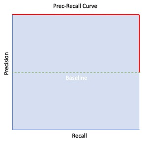

De manera similar a la curva ROC, podemos usar el área debajo de la curva o AUC para ayudarnos a comparar el rendimiento del modelo con otros modelos.

**Nota:** Cuanto más cerca esté la curva Prec-Recall (Recordatorio de precisión) de la esquina superior derecha (cuanto mayor sea el porcentaje de AUC), mejor será el modelo para predecir correctamente los verdaderos positivos.

Esta curva Prec-Recall en rojo a continuación tiene un AUC de aproximadamente 0.7 (en azul) con una línea de base relativa de 0.5:


Finalmente, esta curva Prec-Recall representa el peor de los casos en el que el modelo genera 100% de falsos positivos y falsos negativos. Esta curva de recuperación previa tiene un AUC de 0.0 o 0%:


Del gráfico Prec-Recall se derivan algunas métricas que pueden ser útiles para evaluar el rendimiento del modelo, como la precisión y los puntajes Fᵦ. Estas métricas se explicarán con mayor profundidad en la siguiente sección de los conceptos. Solo tenga en cuenta que la precisión o ACC es el número de relación de predicciones correctas dividido por el número total de predicciones y Fᵦ es la media armónica de recuperación y precisión.

Al mirar ACC en Prec-Recall, la precisión es imperativa en las observaciones positivas para tener en cuenta que ACC no realiza conjuntos de datos bien desequilibrados. Esta es la razón por la cual los **F-score** pueden usarse para dar cuenta del conjunto de datos sesgado en Recordatorio de Precisión.

Al considerar la precisión de un modelo para los casos positivos, tiene que saber un par de cosas:

- ¿Con qué frecuencia es correcto?
- Cuando esta mal? ¿Por qué?
- ¿Es porque tienes demasiados falsos positivos? (Precisión)
- ¿O es porque tienes demasiados falsos negativos? (Recordar(Recall))

También hay varios puntajes Fᵦ que se pueden considerar, F1, F2 y F0.5. El 1, 2 y 0.5 son los pesos dados para recordar y precisión. F1, por ejemplo, significa que tanto la precisión como la recuperación tienen el mismo peso, mientras que F2 le da mayor peso a la recuperación que la precisión y F0.5 le da a la precisión un peso mayor que la recuperación.

Recordatorio de precisión es una buena herramienta a considerar para los clasificadores porque es una gran alternativa para grandes sesgos en la distribución de la clase. Utilice la precisión y la memoria para centrarse en la clase positiva pequeña: cuando la clase positiva es más pequeña y la capacidad de detectar muestras positivas correctamente es nuestro enfoque principal (la detección correcta de ejemplos negativos es menos importante para el problema), debemos usar la precisión y recordatorio.

Si está utilizando una métrica modelo de precisión y ve problemas con Recordatorio de Precisión, entonces podría considerar usar una métrica modelo de logloss.

### GINI, ACC (Exactitud), F1 F0.5, F2, MCC y Log Loss 

Las curvas ROC y Recordatorio de Precisión son extremadamente útiles para probar un clasificador binario porque proporcionan visualización para cada umbral de clasificación posible. De esos gráficos podemos derivar métricas de modelo único como ACC, F1, F0.5, F2 y MCC. También hay otras métricas individuales que se pueden usar simultáneamente para evaluar modelos como GINI y Log Loss. Lo siguiente será una discusión sobre los puntajes del modelo ACC, F1, F0.5, F2, MCC, GINI y Log Loss. Los puntajes del modelo son para lo que se optimiza el modelo ML.

#### GINI

El índice de Gini es un método bien establecido para cuantificar la desigualdad entre los valores de distribución de frecuencia y puede usarse para medir la calidad de un clasificador binario. Un índice de Gini de cero expresa igualdad perfecta (o un clasificador totalmente inútil), mientras que un índice de Gini de uno expresa desigualdad máxima (o un clasificador perfecto).

El índice de Gini se basa en la curva de Lorenz. La curva de Lorenz traza la tasa positiva verdadera (eje y) en función de los percentiles de la población (eje x).

La curva de Lorenz representa un colectivo de modelos representados por el clasificador. La ubicación en la curva viene dada por el umbral de probabilidad de un modelo particular. (es decir, los umbrals de probabilidad más bajos para la clasificación generalmente conducen a más positivos verdaderos, pero también a más falsos positivos). [12]

El índice de Gini en sí es independiente del modelo y solo depende de la curva de Lorenz determinada por la distribución de los puntajes (o probabilidades) obtenidos del clasificador.

#### Precisión (ACC)

La precisión o ACC (que no debe confundirse con AUC o área bajo la curva) es una métrica única en problemas de clasificación binaria. ACC es el número de relación de predicciones correctas dividido por el número total de predicciones. En otras palabras, qué tan bien puede identificar correctamente el modelo tanto los verdaderos positivos como los verdaderos negativos. La precisión se mide en el rango de 0 a 1, donde 1 es precisión perfecta o clasificación perfecta, y 0 es precisión pobre o clasificación pobre [8].

Usando la tabla de matriz de confusión, ACC puede calcularse de la siguiente manera:

**Precisión** = (VP + VN) / (VP + VN + FP + FN)

#### Puntaje F: F1, F0.5 y F2

La puntuación F1 es otra medida de precisión de clasificación. Representa el promedio armónico de la precisión y el recuerdo. F1 se mide en el rango de 0 a 1, donde 0 significa que no hay verdaderos positivos y 1 cuando no hay falsos negativos ni falsos positivos o precisión y recuerdo perfectos [9].

Usando la tabla de matriz de confusión, el puntaje F1 se puede calcular de la siguiente manera:

**F1** = 2VP /( 2VP + FN + FP)

**F05** ecuación:
F0.5 = 1.25((precisión)(Recordatorio)/ 0.25precisión + Recordatorio)

Dónde:
La precisión son las observaciones positivas (verdaderos positivos) que el modelo identificó correctamente de todas las observaciones que etiquetó como positivas (los verdaderos positivos + los falsos positivos). Recordemos las observaciones positivas (verdaderos positivos) que el modelo identificó correctamente de todos los casos positivos reales (los verdaderos positivos + los falsos negativos) [15].

El **puntaje F2** es la media armónica ponderada de la precisión y la recuperación (dado un valor umbral). A diferencia del puntaje F1, que le da el mismo peso a la Precisión y al Recordatorio, el puntaje F2 le da más peso al Recordatorio que a la Precisión. Se debe dar más peso al retiro para los casos en que los falsos negativos se consideran peores que los falsos positivos. Por ejemplo, si su caso de uso es predecir qué clientes abandonarán, puede considerar que los falsos negativos son peores que los falsos positivos. En este caso, desea que sus predicciones capturen a todos los clientes que abandonarán. Es posible que algunos de estos clientes no corran el riesgo de agitarse, pero la atención adicional que reciben no es perjudicial. Más importante aún, no se ha perdido ningún cliente que corra el riesgo de ser agitado [15].


#### MCC

MCC o la correlation coefficient de Matthews que se utiliza como una medida de la calidad de las clasificaciones binarias [1]. El MCC es el coeficiente de correlación entre las clasificaciones binarias observadas y predichas. El MCC se mide en el rango entre -1 y +1 donde +1 es la predicción perfecta, 0 no es mejor que una predicción aleatoria y -1 todas las predicciones incorrectas [9].

Usando la tabla de matriz de confusión MCC se puede calcular de la siguiente manera:

**MCC** =  (VP * VN- FP* FN) / [(VP + FP) * (FN + VN) * (FP + VN) * (VP + FN)] ^ ½

#### Log Loss (Logloss)
 
La métrica de pérdida logarítmica se puede usar para evaluar el rendimiento de un clasificador binomial o multinomial. A diferencia de AUC, que analiza qué tan bien un modelo puede clasificar un objetivo binario, logloss evalúa qué tan cerca están los valores pronosticados de un modelo (estimaciones de probabilidad no calibradas) del valor objetivo real. Por ejemplo, ¿un modelo tiende a asignar un valor predicho alto como .80 para la clase positiva, o muestra una capacidad pobre para reconocer la clase positiva y asignar un valor predicho más bajo como .50? Un modelo con un log loss de 0 sería el clasificador perfecto. Cuando el modelo no puede hacer predicciones correctas, la pérdida de registro aumenta y hace que el modelo sea un modelo deficiente [11].

**Ecuación de clasificación binaria:**


**Ecuación de clasificación multiclase:**


Dónde:

- N es el número total de filas (observaciones) de su marco de datos correspondiente.
- w es el peso definido por el usuario por fila (el valor predeterminado es 1).
- C es el número total de clases (C = 2 para la clasificación binaria).
- p es el valor predicho (probabilidad no calibrada) asignado a una fila dada (observación).
- y es el valor objetivo real.

Diagnósticos Driverless AI calcula los valores ACC, F1, MCC y traza esos valores en cada curva ROC y Recordatorio de Precisión, lo que facilita la identificación del mejor umbral para el modelo generado. Además, también calcula el puntaje de pérdida de registro (log loss score) para su modelo, lo que le permite evaluar rápidamente si el modelo que generó es un buen modelo o no.

Volvamos a evaluar los resultados de las métricas para los modelos.


### Gráficos de ganancia y elevación

Los gráficos de ganancia y elevación miden la efectividad de un modelo de clasificación al observar la relación entre los resultados obtenidos con un modelo entrenado versus un modelo aleatorio (o ningún modelo) [7]. Los gráficos de ganancia y elevación nos ayudan a evaluar el rendimiento del clasificador y a responder preguntas como qué porcentaje del conjunto de datos capturado tiene una respuesta positiva en función del porcentaje seleccionado de una muestra. Además, podemos explorar cuánto mejor podemos esperar hacer con un modelo en comparación con un modelo aleatorio (o sin modelo) [7].

Una forma en que podemos pensar en la ganancia es "por cada paso que se da para predecir un resultado, el nivel de incertidumbre disminuye. Una gota de incertidumbre es la pérdida de entropía que conduce a la obtención de conocimiento ”[15]. El gráfico de ganancia traza la tasa positiva verdadera (sensibilidad) versus la tasa positiva predictiva (**soporte**) donde:

**Nota:** VP = Verdadero Positivo (VP = TP) | FP = Falso Positivo (FP = FP) |  FN = Falso Negativo (FN = FN) | VN = Verdadero Negativo (VN = TN)

**Sensibilidad** = **Recuperación** = Tasa positiva verdadera = VP / (VP + FN)

**Soporte** = **Tasa positiva predictiva**  = VP + FP / (VP + FP + FN+VN) 

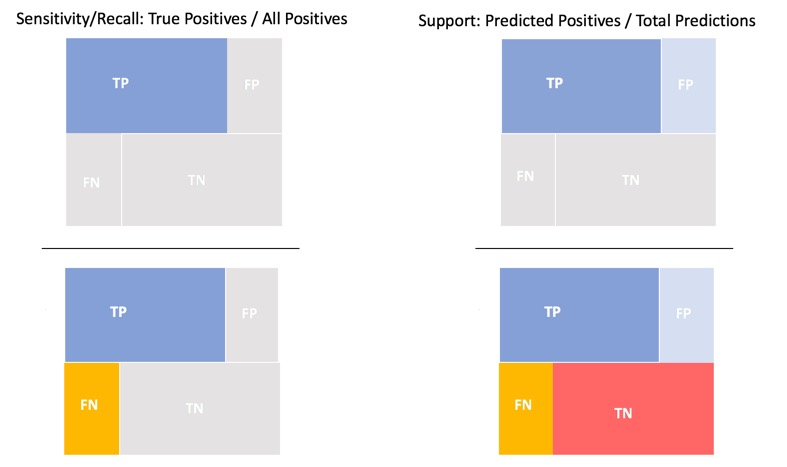

Para visualizar mejor el porcentaje de respuestas positivas en comparación con una muestra de porcentaje seleccionada, utilizamos **Ganancias acumulativas** y **Quantile (Cuantil)**. Las ganancias acumuladas se obtienen tomando el modelo predictivo y aplicándolo al conjunto de datos de prueba que es un subconjunto del conjunto de datos original. El modelo predictivo puntuará cada caso con una probabilidad. Las puntuaciones se ordenan en orden ascendente por la puntuación predictiva. El cuantil toma el número total de casos (un número finito) y divide el conjunto finito en subconjuntos de tamaños casi iguales. El percentil se traza desde el percentil 0 y el percentil 100. Luego graficamos el número acumulado de casos hasta cada cuantil comenzando con los casos positivos al 0% con las probabilidades más altas hasta llegar al 100% con los casos positivos que obtuvieron las probabilidades más bajas.

En el gráfico de ganancias acumuladas, el eje x muestra el porcentaje de casos del número total de casos en el conjunto de datos de prueba, mientras que el eje y muestra el porcentaje de respuestas positivas en términos de cuantiles. Como se mencionó, dado que las probabilidades se han ordenado en orden ascendente, podemos ver el porcentaje de casos predictivos positivos encontrados en el 10% o 20% como una forma de reducir el número de casos positivos que nos interesan. Visualmente el rendimiento del modelo predictivo se puede comparar con el de un modelo aleatorio (o sin modelo). El modelo aleatorio se representa a continuación en rojo como el peor de los casos de muestreo aleatorio.

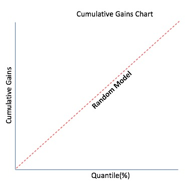

¿Cómo podemos identificar el mejor escenario en relación con el modelo aleatorio? Para hacer esto, primero debemos identificar una tasa base. La tasa base establece los límites de la curva óptima. Las mejores ganancias siempre están controladas por la tasa base. Se puede ver un ejemplo de una tasa base en el cuadro a continuación (verde discontinuo). 

- **Base Rate (Tasa básica)** se define como:

- **Tasa básica** = (VP+FN) / Tamaño de la muestra


El gráfico anterior representa el mejor de los casos de un gráfico de ganancias acumulativas suponiendo una tasa base del 20%. En este escenario, se identificaron todos los casos positivos antes de alcanzar la tasa base.

El cuadro a continuación representa un ejemplo de un modelo predictivo (curva verde continua). Podemos ver qué tan bien funcionó el modelo predictivo en comparación con el modelo aleatorio (línea roja punteada). Ahora, podemos elegir un cuantil y determinar el porcentaje de casos positivos en ese cuartil en relación con todo el conjunto de datos de prueba.

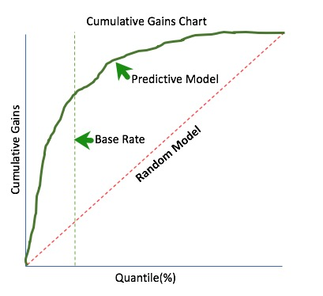

Lift (Levantar) puede ayudarnos a responder la pregunta de cuánto mejor se puede esperar hacer con el modelo predictivo en comparación con un modelo aleatorio (o ningún modelo). La elevación es una medida de la efectividad de un modelo predictivo calculado como la relación entre los resultados obtenidos con un modelo y con un modelo aleatorio (o sin modelo). En otras palabras, la relación del% de ganancia al% de expectativa aleatoria en un cuantil dado. La expectativa aleatoria del x cuantil cuantil es x% [16].

**Lift** = Tasa Predictiva / Tasa Real

Al graficar la elevación (Lift), también la graficamos con los cuantiles para ayudarnos a visualizar qué tan probable es que ocurra un caso positivo, ya que la tabla de elevación se deriva de la tabla de ganancias acumuladas. Los puntos de la curva de elevación se calculan determinando la relación entre el resultado predicho por nuestro modelo y el resultado utilizando un modelo aleatorio (o ningún modelo). Por ejemplo, suponiendo una tasa base (o umbral hipotético) del 20% de un modelo aleatorio, tomaríamos el porcentaje de ganancia acumulada en el cuantil del 20%, X y lo dividiríamos por 20. Lo hacemos para todos los cuantiles hasta que obtengamos la curva de elevación completa.

Podemos comenzar el gráfico de elevación con la tasa base como se ve a continuación, recuerde que la tasa base es el umbral objetivo.


Cuando observamos el aumento acumulativo de los mejores cuantiles, X, lo que significa es que cuando seleccionamos digamos 20% del cuantil del total de casos de prueba según el modo, podemos esperar X / 20 veces el total del número de casos positivos encontrados seleccionando al azar el 20% del modelo aleatorio.


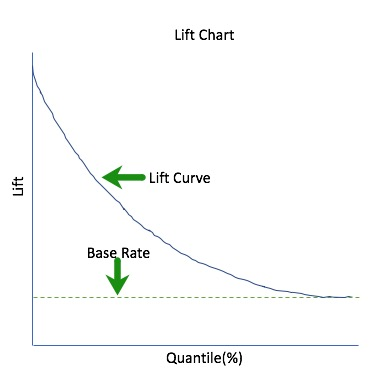

### Gráfico K-S

Kolmogorov-Smirnov o K-S mide el rendimiento de los modelos de clasificación midiendo el grado de separación entre positivos y negativos para los datos de validación o prueba [13]. “El K-S es 100 si las puntuaciones dividen a la población en dos grupos separados en los que un grupo contiene todos los positivos y el otro todos los negativos. Por otro lado, si el modelo no puede diferenciar entre positivos y negativos, entonces es como si el modelo seleccionara casos al azar de la población. El K-S sería 0. En la mayoría de los modelos de clasificación, el K-S caerá entre 0 y 100, y cuanto mayor sea el valor, mejor será el modelo para separar los casos positivos de los negativos ”[14].

El estadístico KS es la diferencia máxima entre el porcentaje acumulado de respondedores o 1 (tasa acumulativa de verdadero positivo) y el porcentaje acumulativo de no respondedores o 0 (tasa acumulativa de falso positivo). La importancia de la estadística KS es, ayuda a entender, qué porción de la población debe ser objetivo para obtener la tasa de respuesta más alta (1) [17].


### Referencias

[1] [Definición de la matriz de confusión "Un diccionario de psicología“](http://www.oxfordreference.com/view/10.1093/acref/9780199534067.001.0001/acref-9780199534067-e-1778)

[2] [Hacia la ciencia de datos: comprensión de la curva AUC-ROC](https://towardsdatascience.com/understanding-auc-curve-68b2303cc9c5)

[3] [Introducción a ROC](https://classeval.wordpress.com/introduction/introduction-to-the-roc-receiver-operating-characteristics-plot/)

[4] [Curvas ROC y bajo la curva (AUC) explicadas](https://www.youtube.com/watch?v=OAl6eAyP-yo)

[5] [Introducción a la recuperación de precisión](https://classeval.wordpress.com/introduction/introduction-to-the-precision-recall-plot/)

[6] [Tharwat, Informática Aplicada e Informática (2018)](https://doi.org/10.1016/j.aci.2018.08.003)

[7] [Clasificación de evaluación del modelo](https://www.saedsayad.com/model_evaluation_c.htm)

[8] [Exactitud Wiki](https://en.wikipedia.org/wiki/Accuracy_and_precision)

[9] [Puntuación Wiki F1](https://en.wikipedia.org/wiki/F1_score)

[10] [Wiki Coeficiente de correlación de Matthew](https://en.wikipedia.org/wiki/Matthews_correlation_coefficient)

[11] [Wiki Log Loss](http://wiki.fast.ai/index.php/Log_Loss)

[12] [Índice GINI de H2O](http://docs.h2o.ai/driverless-ai/latest-stable/docs/userguide/scorers/scorers_gini.html?highlight=gini) 

[13] [H2O’s Kolmogorov-Smirnov](http://docs.h2o.ai/driverless-ai/latest-stable/docs/userguide/experiment-graphs.html?highlight=mcc)

[14] [Evaluación del modelo: clasificación](https://www.saedsayad.com/model_evaluation_c.htm)

[15] [¿Qué es la ganancia de información en el aprendizaje automático?](https://www.quora.com/What-is-Information-gain-in-Machine-Learning)

[16] [Lift el arma secreta del científico de datos de análisis](https://www.kdnuggets.com/2016/03/lift-analysis-data-scientist-secret-weapon.html)

[17] [Modelos de clasificación de métricas de evaluación de aprendizaje automático](https://www.machinelearningplus.com/machine-learning/evaluation-metrics-classification-models-r/) 

### Exploración más Profunda y Recursos

- [Cómo y cuándo usar las curvas ROC y las curvas de recuperación de precisión para la clasificación en Python](https://machinelearningmastery.com/roc-curves-and-precision-recall-curves-for-classification-in-python/)

- [Curvas ROC y AUC explicadas](https://www.youtube.com/watch?time_continue=1&v=OAl6eAyP-yo)

- [Hacia la ciencia de datos Precisión vs Recordatorio ](https://towardsdatascience.com/precision-vs-recall-386cf9f89488)

- [Clasificación ML: curva de Recordatorio de Precisión](https://www.coursera.org/lecture/ml-classification/precision-recall-curve-rENu8)

- [Hacia la ciencia de datos: comprender e interpretar gráficos de ganancia y elevación](https://www.datasciencecentral.com/profiles/blogs/understanding-and-interpreting-gain-and-lift-charts)

- [ROC y AUC, video claramente explicado](https://www.youtube.com/watch?v=xugjARegisk)

- [¿Qué es la ganancia de información en el aprendizaje automático?](https://www.quora.com/What-is-Information-gain-in-Machine-Learning)


## Tarea 4: Resumen de resultados del experimento

Al final del experimento, aparecerá un resumen del proyecto en la esquina inferior derecha. Además, tenga en cuenta que el nombre del experimento está en la esquina superior izquierda.


El resumen incluye lo siguiente:

- **Experiment (Experimentar)**: nombre del experimento,
  - Version (Versión): versión de Driverless AI y la fecha de lanzamiento 
 - Settings (Configuración): configuración de experimento seleccionada, semilla y cantidad de GPU habilitada 
 - Train data (Datos del tren): nombre del conjunto de entrenamiento, número de filas y columnas.  
- Validation data (Datos de validación): nombre del conjunto de validación, número de filas y columnas. 
 - Test data (Datos de prueba): nombre del conjunto de prueba, número de filas y columnas.  
- Target column (Columna objetivo): nombre de la columna objetivo (tipo de datos y% clase objetivo)

- **System Specs (Especificaciones del sistema)**: especificaciones de la máquina que incluyen RAM, número de núcleos de CPU y GPU
  - Max memory usage (Max uso de memoria)  

- **Recipe (Receta)**: 
 - Validation scheme (Esquema de validación): tipo de muestreo, número de reservas internas  
- Feature Engineering (Ingeniería de características): número de características anotadas y la selección final

- **Timing (Sincronización)**
 - Data preparation (Preparación de datos)
- Shift/Leakage detection (Cambio / detección de fugas)  
- Model and feature tuning (Ajuste de modelos y características): tiempo total para el entrenamiento de modelos y características y número de modelos entrenados  
- Feature evolution (Evolución de características): tiempo total para la evolución de características y número de modelos entrenados 
 - Final pipeline training (Entrenamiento final de la tubería): tiempo total para el entrenamiento final de la tubería y el total de modelos entrenados  
- Python / MOJO scorer building (Edificio de puntuación Python / MOJO)
- Validation Score (Puntuación de validación): Log Loss Score (Constant preds of N), where N is a decimal value 
- Puntuación de validación: puntuación de pérdida de registro +/- máquina épsilon para la línea de base
- Puntaje de validación: puntaje de pérdida de registro +/- máquina épsilon para la tubería final
- Test Score (Puntaje de prueba): puntaje de pérdida de registro +/- puntaje de máquina épsilon para la tubería final

La mayor parte de la información en la pestaña Resumen del experimento (Experiment Summary), junto con detalles adicionales, se puede encontrar en el Informe del resumen del experimento (Experiment Summary Report) (botón amarillo "Descargar resumen del experimento (Download Experiment Summary)").
A continuación se presentan tres preguntas para evaluar su comprensión del resumen del experimento y enmarcar la motivación para la siguiente sección.

1\. Encuentre el número de características que se puntuaron para su modelo y el total de características que se seleccionaron.

2\.  Eche un vistazo al puntaje de validación (validation Score) para la tubería final y compare ese valor con el puntaje de la prueba. Con base en esos puntajes, ¿consideraría este modelo un modelo bueno o malo?
	
**Nota:** Si no está seguro de qué es la pérdida de registro, no dude en revisar la sección de conceptos de este tutorial.


3\. Entonces, ¿qué nos dicen los valores de pérdida de registro? El valor esencial de pérdida de registro es el valor de puntaje de la prueba. Este valor nos dice qué tan bien el modelo generado funcionó contra el conjunto freddie_mac_500_test basado en la tasa de error. En caso de experimento **Freddie Mac Classification Tutorial**, el puntaje de la prueba LogLoss = .1180, que es el registro de la tasa de clasificación errónea. Cuanto mayor sea el valor de pérdida de registro, más significativa será la clasificación errónea. Para este experimento, la pérdida de registro fue relativamente pequeña, lo que significa que la tasa de error para la clasificación errónea no fue tan sustancial. Pero, ¿qué significaría una puntuación como esta para una institución como Freddie Mac?

En las próximas tareas exploraremos las implicaciones financieras de la clasificación errónea explorando la matriz de confusión y las gráficas derivadas de ella.


### Exploración más Profunda y Recursos

- [Resumen del experimento de H2O](http://docs.h2o.ai/driverless-ai/latest-stable/docs/userguide/experiment-summary.html?highlight=experiment%20overview)

- [Validación interna de H2O](http://docs.h2o.ai/driverless-ai/latest-stable/docs/userguide/internal-validation.html) 


## Tarea 5: Puntuación de diagnóstico y matriz de confusión

Ahora vamos a ejecutar un diagnóstico de modelo en el conjunto freddie_mac_500_test. El modelo de diagnóstico le permite ver el rendimiento del modelo para múltiples anotadores en función de un modelo y conjunto de datos existente a través de la API de Python.

1\. Seleccione **Diagnostics (Diagnósticos)** 


2\. Una vez en la página **Diagnostics**, seleccione **+ Diagnose Model (+Diagnosticar modelo)**


3\. En el **Create new model diagnostics (Crear diagnóstico de modelo nuevo)**:
1. Haga clic en Experimento diagnosticado y luego seleccione el experimento que completó en la Tarea 4: **Freddie Mac Classification Tutorial (Tutorial de clasificación de Freddie Mac)**
2. Haga clic en Conjunto de datos y luego seleccione el conjunto de datos freddie_mac_500_test
3. Inicie el modelo de diagnóstico haciendo clic en **Launch Diagnostics (Iniciar diagnóstico)**


4\.Una vez que el diagnóstico del modelo haya terminado de ejecutarse, aparecerá un modelo similar al siguiente:

 

*Cosas a tener en cuenta:*

1. Nombre del nuevo modelo de diagnóstico.
2. **Model (Modelo)**: nombre del modelo ML utilizado para el diagnóstico.
3. **Dataset (Conjunto de datos)**: nombre del conjunto de datos utilizado para el diagnóstico
4. **Message (Mensaje)**: mensaje sobre el nuevo modelo de diagnóstico.
5. **Status  (Estado)**: estado del nuevo modelo de diagnóstico
6. **Time (Tiempo)**: tiempo que tardó en ejecutarse el nuevo modelo de diagnóstico
7. Opciones para este modelo

5\. Haga clic en el nuevo modelo de diagnóstico y aparecerá una página similar a la siguiente:


*Cosas a tener en cuenta:*

1. **Info (Información)**: información sobre el modelo de diagnóstico, incluido el nombre del conjunto de datos de prueba, el nombre del experimento utilizado y la columna objetivo utilizada para el experimento
2. **Scores (Puntuaciones)**: Resumen de los valores para GINI, MCC, F05, F1, F2, Precisión, Log loss, AUC y AUCPR en relación con qué tan bien el modelo de experimento obtuvo una puntuación frente a un "nuevo" conjunto de datos

    - **Note (Nota)**: El nuevo conjunto de datos debe tener el mismo formato y el mismo número de columnas que el conjunto de datos de entrenamiento.

3. **Metric Plots (Gráficos métricos)**: los parámetros utilizados para calificar el modelo de experimento incluyen la curva ROC, la curva de Recordatorio de Precisión, las ganancias acumuladas, el gráfico de elevación, el gráfico de Kolmogorov-Smirnov y la matriz de confusión

4. **Download Predictions (Descargar predicciones)**: descargue las predicciones de diagnóstico
 
**Note (Nota)**: Los puntajes serán diferentes para el conjunto de datos del tren y el conjunto de datos de validación utilizados durante el entrenamiento del modelo.

#### Confusion Matrix (Matriz de Confusión)

Como se mencionó en la sección de conceptos, la matriz de confusión es la raíz desde donde se originan la mayoría de las métricas para probar el rendimiento de un modelo. La matriz de confusión proporciona una visión general del rendimiento de la capacidad de clasificación de un modelo supervisado.

Haga clic en la matriz de confusión ubicada en la sección **Metrics Plot (Gráfico de Métricas)** de la página de Diagnostics (Diagnóstico), en la esquina inferior derecha. Aparecerá una imagen similar a la siguiente:


La matriz de confusión le permite elegir un umbral deseado para sus predicciones. En este caso, veremos más de cerca la matriz de confusión generada por el modelo Driverless AI con el umbral predeterminado, que es 0.5.

La primera parte de la matriz de confusión que vamos a ver es las **Etiquetas predichas (Predicted labels)** y **Etiquetas reales (Actual labels)**. Como se muestra en la imagen a continuación, los valores de **Etiqueta pronosticada (Predicted label)** para **Condición predicha negativa (Predicted Condition Negative)** o **0** y **Condición pronosticada positiva (Actual Condition Positive)** o **1** corren verticalmente mientras que la **Etiqueta real (Actual label)** los valores para **Condición real negativa (Actual Condition Negative)** o **0** y **Condición real positiva (Actual Condition Positive)** o **1** se ejecutan horizontalmente en la matriz.

Usando este diseño, podremos determinar qué tan bien el modelo predijo las personas que incumplieron y aquellas que no lo hicieron de nuestro conjunto de datos de prueba Freddie Mac. Además, podremos compararlo con las etiquetas reales del conjunto de datos de prueba.

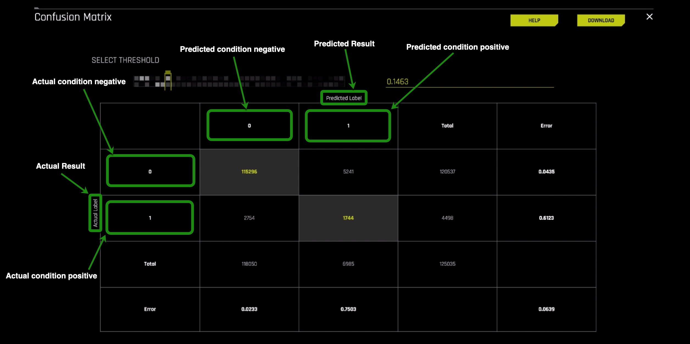

Pasando a la parte interna de la matriz, encontramos el número de casos para Verdaderos negativos, falsos positivos, falsos negativos y verdadero positivo. La matriz de confusión para este modelo generado nos dice que:

**Nota** TP = VP(Verdadero Positivo) | TN = VN(Verdadero Negativo)| FP = Falso Positivo | FN = Falso Negativo

- VP = 1 = 213 casos se predijeron como **incumplimiento (defaulted)** y **incumplimiento (defaulting)** en realidad
- VN = 0 = 120,382 casos se predijeron como **sin incumplimiento (did not default)** y **no incumplieron (not defaulting)**
- FP = 1 = 155 casos se predijeron como **incumplimiento (defaulting)** cuando en realidad **no incumplieron (did not default)**
- FN = 0 = 4,285 casos se predijeron como **sin incumplimiento (not defaulting)** cuando en realidad **incumplieron (defaulted)**


La siguiente capa que veremos son las secciones **Total (Total)** para **Etiqueta pronosticada (Predicted label)** y **Etiqueta real (Actual label)**.

En el lado derecho de la matriz de confusión están los totales para la **Etiqueta real (Actual label)** y en la base de la matriz de confusión, los totales para la **Etiqueta pronosticada (Predicted label)**.

**Etiqueta Real (Actual Label)**
- 120,537: el número de casos reales que no se omitieron en el conjunto de datos de prueba
- 4,498: el número de casos reales que no se presentaron en la prueba

**Etiqueta pronosticada (Predicted label)**
- 124,667: el número de casos que se pronosticaron como no predeterminados en el conjunto de datos de prueba
- 368: el número de casos que se pronosticaron como predeterminados en el conjunto de datos de prueba

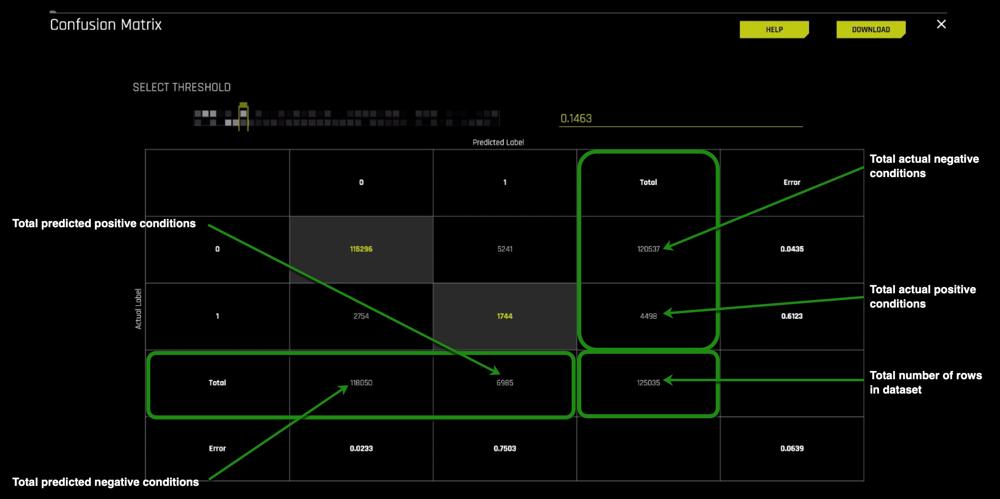

La capa final de la matriz de confusión que exploraremos son los errores. La sección de errores es uno de los primeros lugares donde podemos verificar qué tan bien se desempeñó el modelo. Cuanto mejor sea el modelo al clasificar las etiquetas en el conjunto de datos de prueba, menor será la tasa de error. La **tasa de error (error rate)** también se conoce como la **tasa de clasificación errónea (misclassification rate)** que responde a la pregunta ¿con qué frecuencia se equivoca el modelo?

Para este modelo en particular, estos son los errores:
- 155/120537 = 0.0012 o 0.12% veces que el modelo clasificó los casos reales que no se omitieron como incumplimiento del grupo real sin incumplimiento
- 4285/4498 = 0.952 o 95.2% veces que el modelo clasificó los casos reales que incumplieron como no incumplidos del grupo de incumplimiento real
- 4285/124667 = 0.0343 o 3.43% veces el modelo clasificó los casos pronosticados que fallaron como no incumplidores del total del grupo pronosticado no incumplidor
- 210/368 = 0.5706 o 57.1% veces el modelo clasificó los casos pronosticados que incumplieron como incumplimiento del grupo total de incumplimiento pronosticado
- (4285 + 155) / 125035 = ** 0.0355 ** Esto significa que este modelo clasifica incorrectamente .0355 o 3.55% del tiempo.
 
¿Qué significa el error de clasificación errónea de .0355?
Una de las mejores formas de comprender el impacto de este error de clasificación errónea es observar las implicaciones financieras de los falsos positivos y los falsos negativos. Como se mencionó anteriormente, los falsos positivos representan los préstamos que se pronostica que no morirán y en realidad lo hicieron.

Además, podemos ver las hipotecas que Freddie Mac perdió al no otorgar préstamos porque el modelo predijo que incumplirían cuando en realidad no lo hicieron.

Una forma de ver las implicaciones financieras para Freddie Mac es observar la tasa de interés total pagada por préstamo. Las hipotecas de este conjunto de datos son préstamos tradicionales con garantía hipotecaria, lo que significa que los préstamos son:
- Un monto fijo prestado
- Tasa de interés fija
- El plazo del préstamo y los pagos mensuales son fijos

Para este tutorial, asumiremos una tasa de porcentaje anual (APR) del 6% durante 30 años. APR es la cantidad que se paga para pedir prestados los fondos. Además, vamos a asumir un préstamo hipotecario promedio de $ 167,473 (este promedio se calculó tomando la suma de todos los préstamos en el conjunto de datos freddie_mac_500.csv y dividiéndolo por 30,001, que es el número total de hipotecas en este conjunto de datos). Para una hipoteca de $ 167,473, el interés total pagado después de 30 años sería de $ 143,739.01 [1].

Al observar los falsos positivos, podemos pensar en 155 casos de personas que, según el modelo, no se les debería otorgar un préstamo hipotecario porque se pronostica que incumplirán con su hipoteca. Estos 155 préstamos se traducen en más de 18 millones de dólares en pérdida de ingresos potenciales (155 * $ 143,739.01) en intereses.

Ahora, observando los Positivos verdaderos, hacemos lo mismo y tomamos los 4,285 casos a los que se les otorgó un préstamo porque el modelo predijo que no incumplirían su préstamo hipotecario. Estos 4,285 casos se traducen en más de 618 millones de dólares en pérdidas de intereses desde el incumplimiento de los 4,285 casos.

La tasa de clasificación errónea proporciona un resumen de la suma de los falsos positivos y los falsos negativos dividido por el total de casos en el conjunto de datos de prueba. La tasa de clasificación errónea para este modelo fue de 0.0355. Si este modelo se usara para determinar las aprobaciones de préstamos hipotecarios, las instituciones hipotecarias tendrían que considerar aproximadamente 618 millones de dólares en pérdidas por préstamos mal clasificados que se aprobaron y no deberían tener, y 18 millones de dólares en préstamos que no fueron aprobados ya que se clasificaron como incumplimiento.

Una forma de ver estos resultados es hacer la pregunta: ¿está perdiendo aproximadamente 18 millones de dólares de préstamos que no fueron aprobados mejor que perder unos 618 millones de dólares de préstamos aprobados y luego incumplidos? No hay una respuesta definitiva a esta pregunta, y la respuesta depende de la institución hipotecaria.

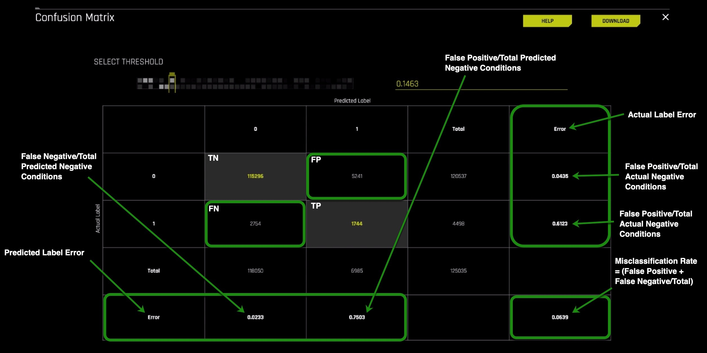

#### Scores (Puntuaciones)

Driverless AI proporciona convenientemente un resumen de las puntuaciones para el rendimiento del modelo dado el conjunto de datos de prueba.

La sección de puntajes proporciona un resumen de los mejores puntajes encontrados en los gráficos de métricas:
- **GINI**
- **MCC**
- **F1**
- **F2**
- **Exactitud (Accuracy)**
- **Log loss**
- **AUC**
- **AUCPR**

La imagen a continuación representa los puntajes para el modelo **Freddie Mac Classification Tutorial** utilizando el conjunto de datos freddie_mac_500_test:


Cuando se realizó el experimento para este modelo de clasificación, Driverless AI determinó que el mejor anotador era la pérdida logarítmica(Logarithmic Loss) o ** LOGLOSS ** debido a la naturaleza desequilibrada del conjunto de datos. ** LOGLOSS ** se enfoca en acertar las probabilidades (penaliza fuertemente las probabilidades incorrectas). La selección de Pérdida logarítmica tiene sentido ya que queremos un modelo que pueda clasificar correctamente a aquellos que tienen más probabilidades de incumplimiento al tiempo que garantiza que aquellos que califican para un préstamo puedan obtener uno.

Recuerde que la pérdida de registro es la métrica de pérdida logarítmica( Log loss) que se puede utilizar para evaluar el rendimiento de un clasificador binomial o multinomial, donde un modelo con una pérdida de registro de 0 sería el clasificador perfecto. Nuestro modelo obtuvo un valor LOGLOSS = .1193 +/- .0017 después de probarlo con el conjunto de datos de prueba. Desde la matriz de confusión, vimos que el modelo tenía problemas para clasificar perfectamente; sin embargo, fue capaz de clasificar con una PRECISIÓN(ACCURACY)de .9647 +/- .0006. Las implicaciones financieras de las clasificaciones erróneas se han cubierto en la sección de matriz de confusión anterior.

Driverless AI tiene la opción de cambiar el tipo de anotador utilizado para el experimento. Recuerde que para este conjunto de datos, el anotador se seleccionó para ser ** logloss **. Un experimento se puede volver a ejecutar con otro anotador. Para problemas de clasificación desequilibrados generales, los anotadores AUCPR y MCC son buenas opciones, mientras que F05, F1 y F2 están diseñados para equilibrar el recuerdo con la precisión.

El AUC está diseñado para problemas de clasificación. Gini es similar al AUC pero mide la calidad de la clasificación (desigualdad) para los problemas de regresión.

En las próximas tareas exploraremos el anotador más a fondo y los valores de **Puntajes (Scores)** en relación con los gráficos residuales.

### Referencias

[1] [Calculadora de horario de amortización](https://investinganswers.com/calculators/loan/amortization-schedule-calculator-what-repayment-schedule-my-mortgage-2859) 

### Exploración más Profunda y Recursos

- [Wiki Confusion Matrix](https://en.wikipedia.org/wiki/Confusion_matrix)

- [Guía simple para la matriz de confusión](https://www.dataschool.io/simple-guide-to-confusion-matrix-terminology/)

- [Diagnosticar un modelo con IA sin conductor](http://docs.h2o.ai/driverless-ai/latest-stable/docs/userguide/diagnosing.html)

## Tarea 6: ER: ROC

Desde la página de Diagnóstico, haga clic en la **ROC Curve**. Una imagen similar a la debajo aparecerá.


En repaso, una curva ROC demuestra lo siguiente:

- Demuestra la interacción entre sensitividad (Porcentaje de Predicciones Positivas Correctas o TPR) y especificidad (1-FPR o 1-Porcentaje de Predicciones Positivas Incorrectas). Cualquier incremento en sensibilidad se acompaña con un decremento en especificidad.   
- Cuanto más cercano la curva ROC siga el borde del lado superior izquierdo, el modelo tendrá mejor precisión(accuracy).
-  Cuanto más cercano la curva ROC este a la diagonal de 45-grados, el modelo tendrá menos precisión.
- La pendiente de la línea tangente en cualquier punto cortante da la probabilidad (LR) para ese valor de prueba. Este se puede ver en al gráfico anterior  
- El área debajo de la curva es una medida de la precisión del modelo.

Regresando al conjunto de datos de Freddie Mac, aunque el modelo haya sido evaluado usando la pérdida logarítmica para penalizar el error, aun podemos ver los resultados de la curva ROC. Podremos ver si la curva ROC soporta nuestras conclusiones del análisis de la matriz de confusión y la puntuación en la página de diagnósticos.

1\. Basado en la curva ROC generada por el modelo de Driverless AI para tu experimento, identifica el área debajo de la curva (AUC). Recuerda que un modelo con clasificaciones perfectas tendrá un AUC de 1.

2\. Para cada uno de los siguientes puntos en la curva, determina el porcentaje de predicciones positivas correctas, el porcentaje de predicciones positivas incorrectas, y el límite por medio de flotar el cursor sobre cada punto como se ve en el gráfico debajo: 
- Mejor Accuracy (precisión)
- Mejor F1
- Mejor MCC


Recuerda que para un problema de clasificación binaria, precisión es el número de predicciones correctas dividido por el número total de predicciones. Probabilidades son convertidas en clases de predicciones para definir un límite. Para este modelo, fue determinado que la mejor precisión se encuentra en el límite .5375. 
 
En este limite, el modelo predijo:
- Predicciones Positivas Correctas = 1 = 175 casos fueron predichos que terminarían en mora y terminaron en mora
- Predicciones Negativas Correctas = 0 = 120,441 casos fueron predichos que no terminarían en mora y no terminaron en mora
- Predicciones Positivas Incorrectas = 1 = 96 casos fueron predichos que terminarían en mora y no terminaron en mora
- Predicciones Negativas Incorrectas = 0 = 4,323 casos fueron predichos que no terminarían en mora y si terminaron en mora

3\. Observando los valores de área debajo de la curva (AUC), el mejor MCC, F1, y precisión, cómo calificarías el modelo? ¿Es un buen modelo? Usa los puntos debajo para ayudarte a tomar una decisión sobre la curva ROC.

Recuerda que para la curva **ROC**:
- Un modelo de clasificación perfecto tiene un AUC de 1
- MCC es medido entre -1 y 1, donde 1 es predicciones perfectas y 0 significa que el modelo no es mejor que un modelo de predicciones al azar y -1 es todas las predicciones incorrectas
- F1 es medido entre 0 y 1, donde 0 significa que no hay predicciones positivas correctas y 1 cuando no hay ni negativos falsos ni falsos positivos, o precisión perfecta y recall. 
- Precision es medida entre 0 y 1, donde 1 es una medida de accuracy perfecta o clasificación perfecta, y 0 es clasificacion pobre con precision baja.

**Nota:** Si no estas seguro(a) que es o cómo se calculan los valores de AUC, MCC, F1 y Precision, puedes revisar la sección de conceptos de este tutorial. 


### Nuevo Modelo con Mismos Parámetros

En caso de curiosidad y si quieres saber si se puede mejorar la precisión del modelo, esto se puede hacer por medio de cambiar el modo de evaluación de Logloss a precisión.

1\. Para hacer esto, haz clic en la página de **Experiments** (Experimentos)

2\. Haz clic en el experimento que hiciste para la tarea #1 y selecciona **New Model with Same Parameters** (Nuevo Modelo con Mismos Parámetros)

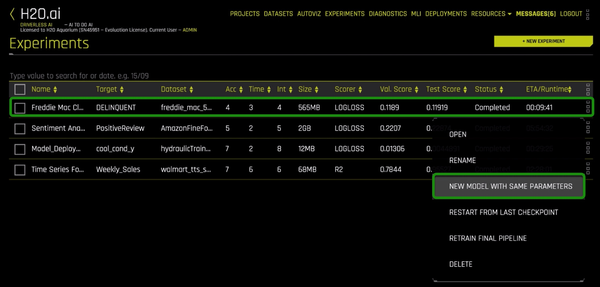

Una imagen similar a la debajo aparecerá. Nota que esta página tiene los mismos ajustes que los de tarea #1. La unica diferencia es en la sección de **Scorer** (Evaluador), se cambio de **Logloss** a **Accuracy** (precision) . Lo demás se debería de quedar igual.

3\. Si no lo has hecho aun, selecciona **Accuracy** en la sección de scorer (evaluador) y selecciona **Launch Experiment** (Lanzar Experimento)


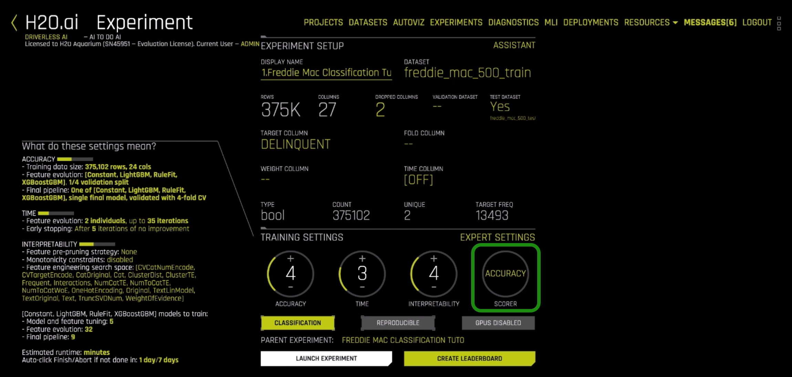

Al igual que en el experimento en la Tarea #1, espera a que el experimento termine de correr. Después que el experimento termine de correr, una página similar aparecerá. Nota que en el resumen localizado en la parte baja del lado derecho, los valores de validación y prueba ya no están siendo evaluados por **Logloss**, si no por **Accuracy** (precisión).


Vamos a usar este nuevo experimento para correr un diagnóstico nuevo. Vas a necesitar el nombre del experimento nuevo. En este caso, el experimento se llama **1. Freddie Mac Classification Tutorial** (Tutorial de Clasificación Freddie Mac).

4\. Ve a la pagina de **Diagnostics** (Diagnosticos)

5\. Cuando estés en la página de diagnósticos, selecciona **+Diagnose Model** (Diagnostica Modelo)

6\. En la página de **Create new model diagnostics** (crear nuevo diagnóstico de modelo)
1. Haz clic en **Diagnosed Experiment** (Experimento Diagnosticado), y selecciona el experimento que completaste en la Tarea #1. En este caso, el experimento se llama **1. Freddie Mac Classification Tutorial** (Tutorial de Clasificación Freddie Mac).
2. Haz clic en **Dataset** (conjunto de datos), y selecciona freddie_mac_500_test
3. Inicia los diagnósticos del modelo con hacer clic en **Launch Diagnostics** (Lanzar Diagnosticos)


7\. Después de que terminen los diagnósticos, un diagnóstico nuevo aparecera

8\. Haz clic en el nuevo diagnóstico. En la sección de **Scores** (puntuaciones), observa el valor de accuracy (precision). Compara este valor con el de la Tarea #6.


9\. Ubica la nueva curva ROC y haz clic. Flota sobre el valor de **Best ACC** en la curva. Una imagen similar a la debajo aparecerá.


¿Cuánto mejoró el modelo al optimizar accuracy (precisión) por medio del evaluador? 

El nuevo modelo predijo: 
- Limite = .5532
- Predicciones Positivas Correctas = 1 = 152 casos fueron predichos que terminarían en mora y terminaron en mora
- Predicciones Negativas Correctas = 0 = 120,463 casos fueron predichos que no terminarían en mora y no terminaron en mora
- Predicciones Positivas Incorrectas = 1 = 74 casos fueron predichos que terminarían en mora y no terminaron en mora
- Predicciones Negativas Incorrectas = 0 = 4,346 casos fueron predichos que no terminarían en mora y si terminaron en mora

El primer modelo predijo:
- Limite = .5375
- Predicciones Positivas Correctas = 1 = 175 casos fueron predichos que terminarían en mora y terminaron en mora
- Predicciones Negativas Correctas = 0 = 120,441 casos fueron predichos que no terminarían en mora y no terminaron en mora
- Predicciones Positivas Incorrectas = 1 = 96 casos fueron predichos que terminarían en mora y no terminaron en mora
- Predicciones Negativas Incorrectas = 0 = 4,323 casos fueron predichos que no terminarían en mora y si terminaron en mora

El límite para mejor accuracy (precisión) cambio de .5375 del primer modelo a .5532 para el modelo nuevo. Este incremento en límite mejoró la precisión, en otras palabras mejoró la proporción de predicciones correctas en base al número total de predicciones. Nota, de hecho, que mientras el número de predicciones positivas incorrectas se redujo, el número de predicciones negativas incorrectas incremento. Pudimos reducir el número de casos predichos incorrectamente que terminarían en mora, pero incrementó el número de predicciones incorrectas que no terminarían en mora. 

En resumen, no hay manera de incrementar uno sin sacrificar los resultados del otro. En el caso precisión, incrementamos el número de préstamos hipotecarios, especialmente para personas que fueron negadas préstamos porque la predicción era que terminarían en mora cuando en realidad no sería el caso. Pero, también incrementó el número de casos para personas que no deberían de haber recibido un préstamo porque terminarían en mora. Como prestamista hipotecario, cuál de los dos es preferible? ¿Positivos falsos o negativos falsos?

10\. Sal de la página de la curva ROC con hacer clic en la **x** en la parte superior del lado derecho del gráfico, al lado de la opción de **Download** (descargar)

### Inmersión Más Profunda

- [Cómo y cuándo usar las curvas ROC y las curvas de recuperación de precisión para la clasificación en Python](https://machinelearningmastery.com/roc-curves-and-precision-recall-curves-for-classification-in-python/)

- [Curvas ROC y AUC explicadas](https://www.youtube.com/watch?time_continue=1&v=OAl6eAyP-yo)
- [Hacia la ciencia de datos: comprensión de la curva AUC-ROC](https://towardsdatascience.com/understanding-auc-roc-curve-68b2303cc9c5)

- [Curvas ROC y bajo la curva (AUC) explicadas](https://www.youtube.com/watch?v=OAl6eAyP-yo)

- [Introducción a ROC](https://classeval.wordpress.com/introduction/introduction-to-the-roc-receiver-operating-characteristics-plot/)

## Tarea 7: ER: Prec-Recall

Continuando en la página de diagnósticos, selecciona la curve **P-R** (Curva P-R). La curva P-R se debe de ver como la imagen debajo: 


Recuerda que para la curva **Prec-Recall:**

- La curva de precisión-recall tiene recall en el eje x y precisión en el eje y
- Recall es lo mismo que sensitividad y precisión es lo mismo que el valor de predecir la clase positiva
- Curvas ROC deberían de ser utilizadas en casos donde el número de observaciones de cada clase son aproximadamente iguales
- Curvas de Precisión-Recall se deben de usar cuando no hay un desequilibrio entre el número de observaciones en cada clase  
- Similar a la curva ROC, el área debajo de la curva de precisión-recall es una medida de precision y lo más alto mejor 
- En ambas curvas, Driverless AI indicara puntos en los cuales se dan los limitest para mejorar Precisison (Accuracy (ACC)), F1, o MCC (coeficiente de correlación Matthews)

En ver los resultados de la curva P-R, es este un buen modelo para determinar si en cliente terminará con un préstamo en mora? Vamos a ver los resultados en la curva P-R.

1\. Basado en la curva P-R generada por el modelo de Driverless AI, identifica el valor de la área debajo de la curva (AUC)

2\. Para cada uno de los puntos en la curva, determina el valor de Predicciones Positivas Correctas, Predicciones Positivas Incorrectas, y el límite para cada punto debajo al flotar el cursor como en la imagen: 
- Mejor Accuracy 
- Mejor F1
- Mejor MCC


3\. Basado en el AUC, mejor MCC, F1, Precision de la curva P-R, como calificarías el modelo? ¿Es un buen modelo o no? Usa los puntos claves para ayudarte a evaluar la curva P-R.

Recuerda que para la curva **P-R**:

- Un modelo de clasificación perfecto tiene un AUC de 1 
- MCC is medido entre -1 y 1, donde 1 es un modelo de predicción perfecto, 0 significa que el modelo no da mejor resultados que un modelo al azar, y -1 es que todas las predicciones fueron incorrectas.
- F1 es medido entre 0 y 1 , donde 0 significa que no hay predicciones positivas correctas, y 1 que no hay ni negativos falsos ni positivos falsos o precision y recall perfecta
- Precisión es medido entre 0 y 1, donde 1 es precisión perfecta o clasificación perfecta, y 0 es precisión pobre o clasificación pobre


**Nota:** Si no estas seguro(a) que es o cómo se calculan los valores de AUC, MCC, F1 y pPrecisión, puedes revisar la sección de conceptos de este tutorial. 

### Nuevo Modelo con Mismos Parámetros

Al igual como la tarea 6, podemos mejorar el área debajo de la curva de precisión-recall al crear un modelo con los mismos parámetros. Nota que necesitarás cambiar el evaluador de **Logloss** a **AUCPR**. Lo puedes intentar tu mismo. 

Para repasar cómo lanzar un experimento nuevo con los mismos parámetros y un evaluador diferente, sigue los pasos en la tarea 6, sección **Nuevo Modelo con Nuevos Parametros**

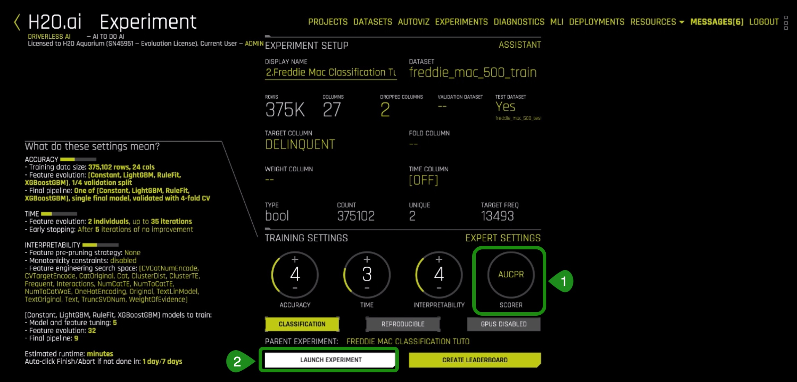

**Nota:** Si corriste un nuevo experimento, regresa a la página de diagnósticos para el experimento en que estábamos trabajando.

### Inmersión Más Profunda y Recursos

- [Hacia la ciencia de datos Precisión vs Recuperación](https://towardsdatascience.com/precision-vs-recall-386cf9f89488)

- [Clasificación ML: curva de recuperación de precisión](https://www.coursera.org/lecture/ml-classification/precision-recall-curve-rENu8)

- [Introducción a la recuperación de precisión](https://classeval.wordpress.com/introduction/introduction-to-the-precision-recall-plot/)

## Tarea 8: ER: Gains (Ganancia)

Continuando en la página de diagnósticos, selecciona la curva de **CUMULATIVE GAIN** (Ganancia Cumulativa). La curva de ganancia cumulativa se debe de ver similar al gráfico debajo:  

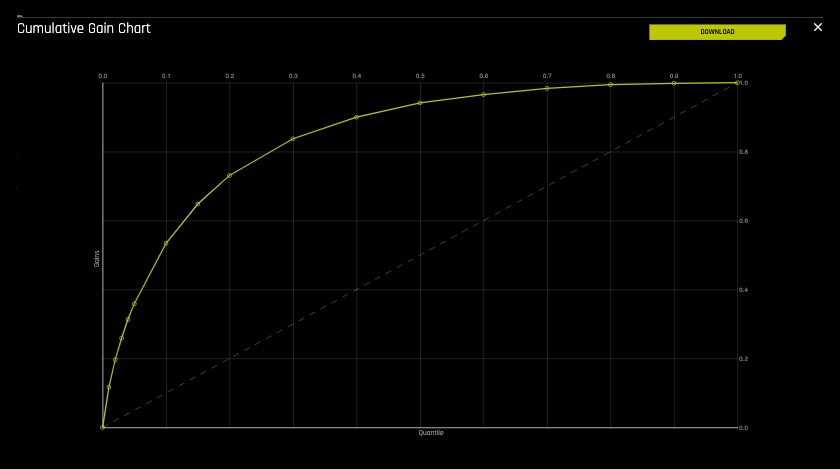

Recuerda que para la curva de **Gains** (Curva de Ganancia):
- Un gráfico de ganancias acumuladas es una ayuda visual para medir el rendimiento del modelo.
- El eje y demuestra el porcentaje de respuestas positivas. Este es un porcentaje del número total de respuestas positivas posibles.  
- El eje x demuestra el porcentaje de todos los clientes del conjunto de datos de Freddie Mac que no terminaron en mora, siendo una fracción del número total de casos
- La línea rayada es la línea de base, o tasa de respuesta general
- Ayuda a contestar la pregunta de “¿qué porcentaje de todas las observaciones de la clase positiva están en el primer 1%, 2%, 10%, etc (cumulativamente)?” Por definicion, la ganancia en 100% es 1.0.

**Nota:** El eje y en el gráfico ha sido ajustado para representar cuantiles. Esto permite enfocarse en los cuantiles que tienen la mayoría de los puntos y por ello el mayor impacto.

1\. Flota el cursor sobre los varios puntos en los cuantiles de la curva de ganancia para ver el porcentaje del cuantil y los valores de ganancia cumulativa

2\. ¿Que es el valor de ganancia cumulativa en 1%, 2%, 10%?

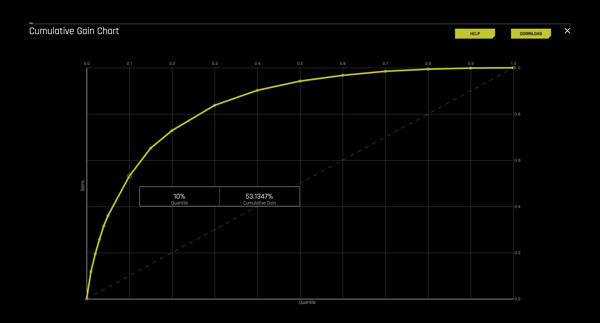

Para este gráfico de ganancia, si nos enfocamos en el primer 1% de los datos, el modelo creado al azar (la línea rayada) nos dice que podríamos haber identificado correctamente el 1% de los préstamos hipotecarios que terminarían en mora. El modelo generado (la curva amarilla) demuestra que fue capaz de identificar el 12% de los préstamos que terminaron en mora.
Si flotamos el cursor sobre el 10% de los datos, el modelo creado al azar (la línea rayada) nos dice que podríamos haber identificado correctamente el 10% de los préstamos hipotecarios que terminarían en mora. El modelo generado (la curva amarilla) demuestra que fue capaz de identificar el 53% de los préstamos que terminaron en mora.

3\. Basado en la forma de la curva de ganancia y la línea de base (la línea diagonal rayado en blanco), considerarías este un buen modelo?

Recuerda que el modelo de predicción perfecto tiene un comienzo muy escarpado, y como regla en general, entre más escarpada la curva, mas ganancia. El área entre la línea de base (la línea diagonal rayado en blanco) y la curva de ganancia (curva amarilla), mejor conocida como el área debajo de la curva, demuestra cuanto mejor nuestro modelo es a comparación de un modelo al azar. Pero es bueno recordar que siempre hay oportunidad para mejorar, la curva de ganancia podría ser más escarpada.

**Nota:** Si nos estás seguro(a) de que es AUC o que es el gráfico de ganancia, haz favor de repasar la sección de conceptos de este tutorial.

4\. Sal del gráfico de ganancia con hacer clic en la **x** en la parte superior, derecha del grafico, junto a la opción de **Download** (descarga)

### Inmersión Más Profunda y Recursos
 
- [Hacia la ciencia de datos: comprender e interpretar gráficos de ganancia y elevación](https://www.datasciencecentral.com/profiles/blogs/understanding-and-interpreting-gain-and-lift-charts)


## Tarea: ER: LIFT

Siguiendo en la pagina de diagnosticos, selecione **LIFT** de curva. EL levantamiento de curva deveria mirarse igual al de abajo:


Recuerde que para la curva de **LIFT**:

Una tabla de lift es una ayuda visual para medir el redimiento del modelo.

- El lift es una medida de la eficacia del modelo predictivo calculado como el radio entre el resultado obtenido con y sin el modelo predictivo.
- Es calculado y determinado entre el radio del resultado predicto por nuestro modelo y entre el resultado utilizando no modelo.
- Entre mas grande el area entre la curva del levantamiento y la linea base, mas mejor es el modelo.
- Ayuda contestar la pregunta "Cuantas veces mas de las observaciones de la clase del objetivo positivo estan en las predicciones altas del 1%, 2%, 10%, etc. (cumutativo) comparado con la seleccion de observaciones al azar?" Por definicion, el levantamiento al 100% es 1.0.  

**Nota** La eje y a sido ajustado para representar qualidades, esto permite enfoque en las qualidades que tenga mas data y el mas impacto.


1\. Ve sobre los varios puntos cuantiles en la tabla de lift para ver el porcentage cuantil y los valores cumulativos. 

2\. Cual es el lift cumulativo quantil en 1%, 2%, 10%?


Para esta tabla de levantamiento, todas las predicciones fueron organisadas a conforme disminuñe la puntuacion generado por el modelo. En otras palabras, la incertidumbre incrementa como el cuantil se mueve asi la derecha. El el 10% del cuantil, nuestro modelo predijo un levantamiento cumulativo de 5.3%, significando que entre el 10% de los casos, habian cinco veses mas defectos.  

3\. Basado en el area entre el lift de la curva y la base linea (las lineas blancas punteadas horizontales) es este un buen modelo?

El area entre la linea base (las lineas blancas punteadas horizontales) y el levantamiento de la curva (la curva amarilla) mejor conocido como el area debajo de la curva visualmente nos enseña que tan mejor nuestro modelo es a comparacion del modelo al azar.

4\. Sal de la tabla del levantamiento con tan solo precionar **x** localizado en la parte alta de la esquina derecha de la tabla, a lado de opcion de **Download**/Descargar. 

### Exploración más Profunda y Recursos

- [Towards Data Science - Understanding and Interpreting Gain and Lift Charts](https://www.datasciencecentral.com/profiles/blogs/understanding-and-interpreting-gain-and-lift-charts)


## Tarea 10: Tabla Kolmogorov-Smirnov

Siguiendo en la pagina de diagnosticos, seleciona la tabla **KS**. La tabla K-S deberia mirarse igual a la siguiente:


Recuerda que la tabla K-S:

- K-S mide el rendimiento de los modelos de clasificacion tomando en cuenta el grado de separacion entre positivo y negativo para la validacion o los datos de prueba.
- El K-S es 100 si la puntuacion tablica la poblacion en dos grupos de separados en el cual un grupo contiene todos los positivos y en el otro todos los negativos
- Si el modelo no puede diferenciar entre positivos y negativos, entonces es como si el modelo seleciona casos al azar de la poblacion y el K-S seria 0
- El alcance de K-S es estre 0 y 1
- Entre mas alto el valor de K-S, el modelo es mas mejor en separar los casos positivos entre los casos negativos  

**Nota:** La cordenada y de la tabla a sido ajustada para representar qualidades, esto permite el enfoque en qualidades que tengan los mas datos y asi el mas impacto. 

1\. Observa sobre los varios puntos quantiles en la tabla de levantamiento para ver el porcentaje cuantil y los valores cumulativos.

2\. Cual es el lift quantil cumulativo en el 1%, 2%, 10%?


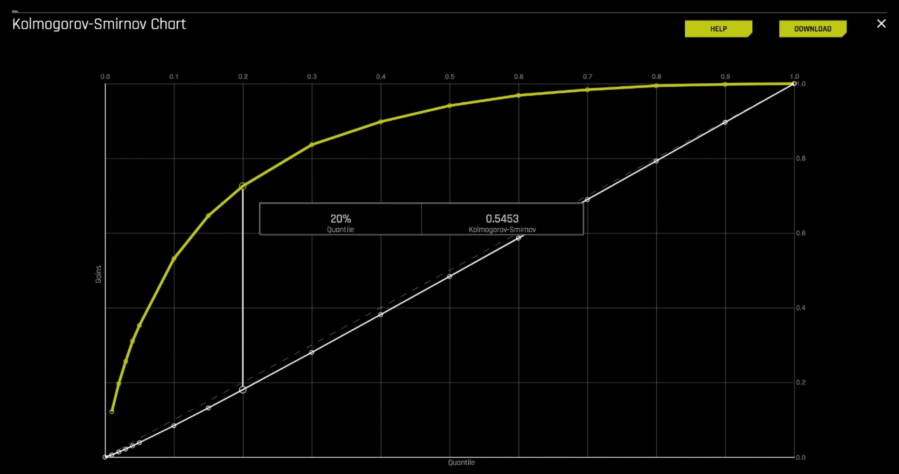

Para las tablas K-S, si miramos al alto porcentage de 20% de los datos, el modelo at-chance (las lineas punteadas diagonales) nos dice que el 20% de los datos fueron separados exitosamente entre positivos y negativos (determinadamente y no determinadamente). Sin embargo, con el modelo fue capaz de hacer .5508 o aproximadamente 55% de los casos fueros exitosos separados entre positivos y negativos.  

3\. Basado en la curva(amarilla) K-S y la base linea (con una linea blanca diagonal) sera este un buen modelo? 

4\. Salga de la tabla K-S y haga click sobre la **x** localizado en la parte alta de la esquina derecha de la tabla, a lado de opcion de **Descargar**

### Exploración más Profunda y Recursos

- [Kolmogorov-Smirnov Test](https://towardsdatascience.com/kolmogorov-smirnov-test-84c92fb4158d)
- [Kolmogorov-Smirnov Goodness of Fit Test](https://www.statisticshowto.datasciencecentral.com/kolmogorov-smirnov-test/)


## Tarea 11: Experimentar con AutoDocs

Driverless AI es muy facil de descargar los resultados de tus experimentos, con tan solo un click. 

1\. Exploremos la generacion automatica de documentos para este experimento. En la pagina de **Experimentos** selecione **Descargar Resumen del Experimento**. 


El **Experiment Summary** (Resumen del Experimento) contiene lo siguiente:

- Resumen del Experimento
- Caracteristicas del Experimento conjunto con la relevante importancia
- Informacion conjunta
- El preestreno del experimento
- Un reporte auto-generado para el experimento en formato .docx
- Un resumen del entrenamiento en formato csv
- Transformaciones del objetivo en la tabla de clasificación
- Tabla de clasificación

Un documento de **report** (reporte) esta incluido en resumen del **experiment** (experiment). Este Resumen provee la percepcion para enterder los datos entrenados y detectar movimientos en la distribucion, la validacion del esquema, ajustamiento de los parametros del modelo, la evolucion de caracteristicas y el conjunto final de caracteristicas que fueron escojidos durante el experimento.

2\. Abre el documento con el archivo .docx, este es el reporte auto-generado que contiene la  siguiente informacion:

- El Resumen del Experimento
- Resumen de los Datos
- Metodologia
- Muestra de Datos
- Estrategia de Validacion
- Ajustamiento del Modelo
- Evolucion de las Caracteristicas
- Transformacion de Caracteristicas
- Modelo Final
- Modelos Alternativos
- Despliegue
- Apendice

3\. Toma unos minutos para explorar el reporte

4\. Explora la Evolucion y Transformacion de caracteristicas, como este resumen se diferiencia del resumen que fue proveido en la **Experiments Page** (Pagina de Experimentos)?

5\. Encuentra la selecion titulada **Final Model** (Modelo Final) en el reporte.docx y eplora los siguientes puntos:explore the following items:

- Mesa titulada **Performance of Final Model** (Performacion del Modelo Final) y determina el **logloss** del puntaje final del examen
- Validacion del Matrix de Confucion
- Validacion y examen ROC, Prec-Recall, lift, y gains plots  

### Exploración más Profunda y Recursos

- [H2O’s Summary Report](http://docs.h2o.ai/driverless-ai/latest-stable/docs/userguide/experiment-summary.html?highlight=experiment%20overview)


## Los Siguientes Pasos

Explora el siguiente tutorial: [Interpretabilidad de Machine Learning](https://h2oai.github.io/tutorials/machine-learning-experiment-scoring-and-analysis-tutorial-financial-focus/#0) donde aprenderas como:

- Desplegar un experimento
- Crear un reporte interpretario de ML
- Explorar conceptos de explainabilidad como:
    - Global Shapley
    - Partial Dependence plot
    - Decision tree surrogate
    - K-Lime
    - Local Shapley
    - LOCO
    - Individual conditional Expectation


