# Machine Learning Experiment Scoring and Analysis Tutorial - Financial Focus

## Outline

- [Objective](#objective)
- [Prerequisites](#prerequisites)
- [Task 1:  Launch Experiment](#task-1-launch-experiment)
- [Task 2: Explore Experiment Settings and Expert Settings](#task-2-explore-experiment-settings-and-expert-settings)
- [Task 3: Experiment Scoring and Analysis Concepts](#task-3-experiment-scoring-and-analysis-concepts)
- [Task 4: Experiment Results Summary and Diagnostics](#task-4-experiment-results-summary)
- [Task 5: Diagnostics Scores and Confusion Matrix](#task-5-diagnostics-scores-and-confusion-matrix)
- [Task 6: ER: ROC](#task-6-er-roc)
- [Task 7: ER: Prec-Recall](#task-7-er-prec-recall)
- [Task 8: ER: Gains](#task-8-er-gains)
- [Task 9: ER: LIFT](#task-9-er-lift)
- [Task 10: Kolmogorov-Smirnov Chart](#task-10-kolmogorov-smirnov-chart)
- [Task 11: Experiment AutoDocs](#task-11-experiment-autodocs)
- [Next Steps](#next-steps)


## Objective

Many tools, such as ROC and Precision-Recall Curves, are available to evaluate how good or bad a classification model is predicting outcomes. In this tutorial, we will use a subset of the Freddie Mac Single-Family Loan-Level dataset to build a classification model and use it to predict if a loan will become delinquent. Through H2O’s Driverless AI Diagnostic tool, we will explore the financial impacts the false positive and false negative predictions have while exploring tools like ROC Curve, Prec-Recall, Gain and Lift Charts, K-S Chart. Finally, we will explore a few metrics such as AUC, F-Scores, GINI, MCC, and Log Loss to assist us in evaluating the performance of the generated model.

**Note:** We recommend that you go over the entire tutorial first to review all the concepts, that way, once you start the experiment, you will be more familiar with the content.
  
## Prerequisites

You will need the following to be able to do this tutorial:

- Basic knowledge of Machine Learning and Statistics
- A Driverless AI environment
- Basic knowledge of Driverless AI or doing the [Automatic Machine Learning Introduction with Drivereless AI Test Drive](https://training.h2o.ai/products/tutorial-1a-automatic-machine-learning-introduction-with-driverless-ai) 

- A **Two-Hour Test Drive session**: Test Drive is H2O.ai's Driverless AI on the AWS Cloud. No need to download software. Explore all the features and benefits of the H2O Automatic Learning Platform.

  - Need a **Two-Hour Test Drive** session? Follow the instructions on [this quick tutorial](https://training.h2o.ai/products/tutorial-0-getting-started-with-driverless-ai-test-drive) to get a Test Drive session started. 

**Note:  Aquarium’s Driverless AI Test Drive lab has a license key built-in, so you don’t need to request one to use it. Each Driverless AI Test Drive instance will be available to you for two hours, after which it will terminate. No work will be saved. If you need more time to further explore Driverless AI, you can always launch another Test Drive instance or reach out to our sales team via the [contact us form](https://www.h2o.ai/company/contact/).**
## Task 1: Launch Experiment

### About the Dataset 

This dataset contains information about “loan-level credit performance data on a portion of fully amortizing fixed-rate mortgages that Freddie Mac bought between 1999 to 2017. Features include demographic factors, monthly loan performance, credit performance including property disposition, voluntary prepayments, MI Recoveries, non-MI recoveries, expenses, current deferred UPB and due date of last paid installment.”[1]

[1] Our dataset is a subset of the [Freddie Mac Single-Family Loan-Level Dataset. ](http://www.freddiemac.com/research/datasets/sf_loanlevel_dataset.html) It contains 500,000 rows and is about 80 MB.

The subset of the dataset this tutorial uses has a total of 27 features (columns) and 500,137 loans (rows).

### Download the Dataset

Download H2O’s subset of the Freddie Mac Single-Family Loan-Level dataset to your local drive and save it at as csv file.  

- [loan_level_500k.csv](https://s3.amazonaws.com/data.h2o.ai/DAI-Tutorials/loan_level_500k.csv)

### Launch Experiment 

Load the **loan_level_500K.csv** to Driverless AI.

1\. Click **Add Dataset (or Drag and Drop)** on the **Datasets overview** page. 

2\. Click on **Upload File**, then select **loan_level_500K.csv** file. 

3\. Once the file is uploaded, select **Details**.


4\. Let’s take a quick look at the columns:

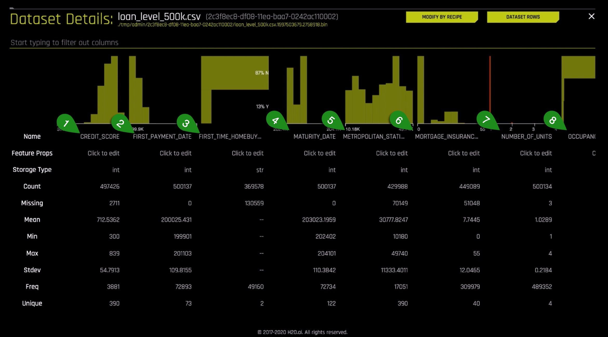
*Things to Note:*
- C1 - CREDIT_SCORE
- C2 - FIRST_PAYMENT_DATE
- C3 - FIRST_TIME_HOMEBUYER_FLAG
- C4 - MATURITY_DATE
- C5 - METROPOLITAN_STATISTICAL_AREA
- C6 - MORTGAGE_INSURANCE_PERCENTAGE
- C7 - NUMBER_OF_UNITS

5\. Continue scrolling through the current page to see more columns (image is not included)
- C8 - OCCUPANCY_STATUS
- C9 - ORIGINAL_COMBINED_LOAN_TO_VALUE
- C10 - ORIGINAL_DEBT_TO_INCOME_RATIO
- C11 - ORIGINAL_UPB
- C12 - ORIGINAL_LOAN_TO_VALUE
- C13 - ORIGINAL_INTEREST_RATE
- C14 - CHANNEL
- C15 - PREPAYMENT_PENALTY_MORTGAGE_FLAG 
- C16 -PRODUCT_TYPE
- C17- PROPERTY_STATE
- C18 - PROPERTY_TYPE
- C19 - POSTAL_CODE
- C20 - LOAN_SEQUENCE_NUMBER
- C21 - LOAN_PURPOSE**
- C22 - ORIGINAL_LOAN_TERM
- C23 - NUMBER_OF_BORROWERS
- C24 - SELLER_NAME
- C25 - SERVICER_NAME
- C26 - PREPAID Drop 
- C27 - DELINQUENT- This column is the label we are interested in predicting where False -> not defaulted and True->defaulted


6\. Return to the **Datasets** overview page

7\. Click on the **loan_level_500k.csv** file then split 


8\.  Split the data into two sets: **freddie_mac_500_train** and **freddie_mac_500_test**. Use the image below as a guide:


*Things to Note:*

1. Type ```freddie_mac_500_train``` for OUTPUT NAME 1, this will serve as the training set
2. Type ```freddie_mac_500_test``` for OUTPUT NAME 2, this will serve as the test set
3. For Target Column select **Delinquent**
4. You can set the Random Seed to any number you'd like, we chose 42, by choosing a random seed we will obtain a consistent split
5. Change the split value to .75 by adjusting the slider to 75% or entering .75 in the section that says Train/Valid Split Ratio
6. Save


The training set contains 375k rows, each row representing a loan, and 27 columns representing the attributes of each loan including the column that has the label we are trying to predict. 

 **Note:** the actual data in training and test split vary by user, as the data is split randomly. The Test set contains 125k rows, each row representing a loan, and 27 attribute columns representing attributes of each loan.

9\. Verify that there are three datasets, **freddie_mac_500_test**, **freddie_mac_500_train** and **loan_level_500k.csv**:


10\. Click on the **freddie_mac_500_train** file then select **Predict**.

11\. Select **Not Now** on the **First time Driverless AI, Click Yes to get a tour!**. A similar image should appear:

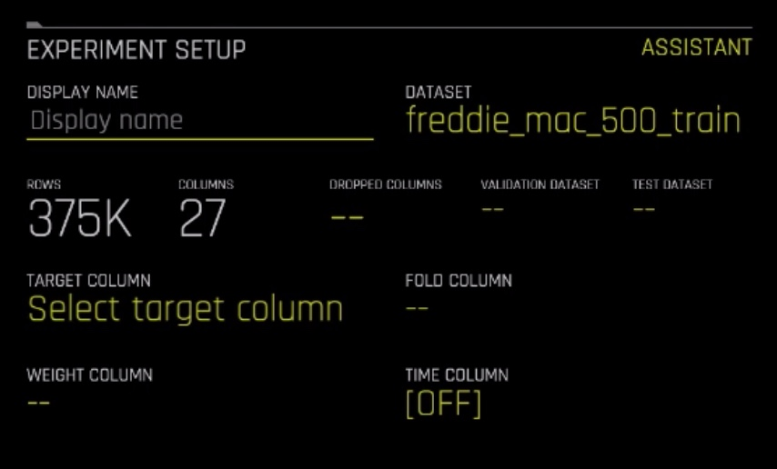

Name your experiment `Freddie Mac Classification Tutorial`

12\. Select **Dropped Columns**, drop the following 2 columns: 

- **Prepayment_Penalty_Mortgage_Flag**
- **PREPAID**
- Select **Done**

These two columns are dropped because they are both clear indicators that the loans will become delinquent and will cause data leakage. 


13\. Select **Target Column**, then select **Delinquent**


14\. Select **Test Dataset**, then **freddie_mac_500_test**


15\. A similar Experiment page should appear:   

    

On task 2, we will explore and update the **Experiment Settings**.

## Task 2: Explore Experiment Settings and Expert Settings (Explore la configuración del experimento y la configuración experta)


1\.  Desplácese hasta **Configuración del experimento** y observe los tres botones, **Precisión**, **Tiempo** e **Interpretabilidad**.

La **configuración del experimento** describe la precisión, el tiempo y la interpretabilidad de su experimento específico. Las perillas de la configuración del experimento son ajustables, ya que los valores cambian el significado de la configuración en la página inferior izquierda.

Aquí hay una descripción general de la configuración de Experimentos: 

- **Accuracy** - Precisión relativa: los valores más altos deberían conducir a una mayor confianza en el rendimiento del modelo (precisión).
- **Time** - Tiempo relativo para completar el experimento. Los valores más altos tardarán más en completarse el experimento.
- **Interpretability**-  La capacidad de explicar o presentar en términos comprensibles a un humano. Cuanto mayor sea la interpretabilidad, más simples serán las características que se extraerán.  


### Accuracy

Al aumentar la configuración de precisión, Driverless AI ajusta gradualmente el método para realizar la evolución y el conjunto. Un conjunto de aprendizaje automático consta de varios algoritmos de aprendizaje para obtener un mejor rendimiento predictivo que podría obtenerse de cualquier algoritmo de aprendizaje único [1]. Con una configuración de baja precisión, Driverless AI varía las características (desde la ingeniería de características) y los modelos, pero todos compiten de manera uniforme entre sí. Con mayor precisión, cada modelo principal independiente evolucionará de forma independiente y será parte del conjunto final como un conjunto sobre diferentes modelos principales. Con mayor precisión, la IA sin conductor evolucionará + tipos de funciones de conjunto, como la codificación de destino, que se activa y desactiva de forma independiente. Finalmente, con las precisiones más altas, Driverless AI realiza tanto el seguimiento de modelos como de características y ensambla todas esas variaciones.

### Time

Time specifies the relative time for completing the experiment (i.e., higher settings take longer). Early stopping will take place if the experiment doesn’t improve the score for the specified amount of iterations. The higher the time value, the more time will be allotted for further iterations, which means that the recipe will have more time to investigate new transformations in feature engineering and model’s hyperparameter tuning.

### Interpretability 

El tiempo especifica el tiempo relativo para completar el experimento (es decir, los ajustes más altos toman más tiempo). La detención anticipada tendrá lugar si el experimento no mejora la puntuación para la cantidad especificada de iteraciones. Cuanto mayor sea el valor de tiempo, más tiempo se asignará para más iteraciones, lo que significa que la receta tendrá más tiempo para investigar nuevas transformaciones en la ingeniería de características y el ajuste de hiperparámetros del modelo..

2\.  Para este tutorial, actualice la siguiente configuración del experimento para que coincida con la imagen a continuación: 
- **Accuracy (Exactitud) : 4**
- **Time (Tiempo): 3**
- **Interpretability (Interpretabilidad): 4**
- **Scorer (Puntuación): Logloss** 

Esta configuración se seleccionó para generar un modelo rápidamente con un nivel suficiente de precisión en el entorno de prueba de conducción sin conductor H2O.

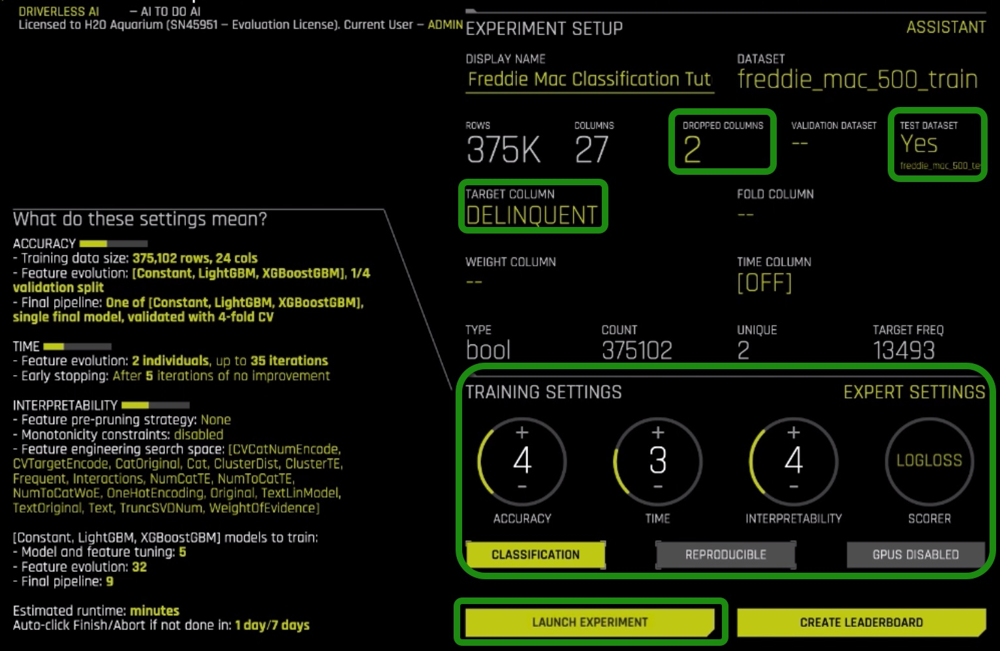    

### Expert Settings (Configuración experta)

3\. Coloca el cursor sobre **Configuración experta** y haz clic en él. Aparecerá una imagen similar a la de abajo:

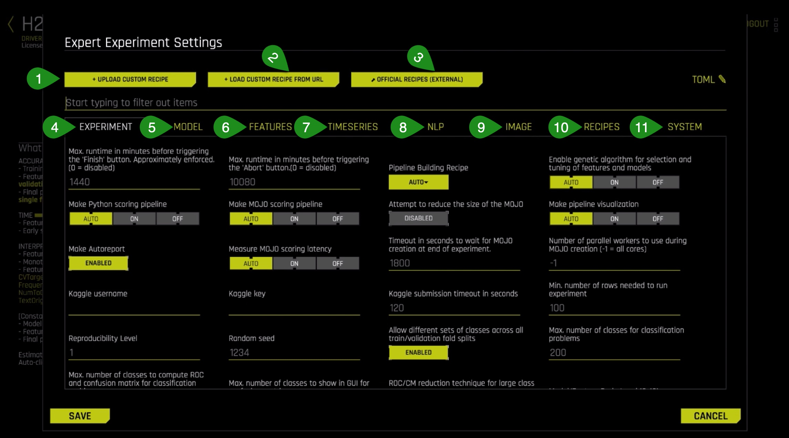
* Cosas a tener en cuenta: *
1. **+ Upload Custom Recipe (+ Subir receta personalizada)**
2. **+ Load Custom Recipe From URL (+ Cargar receta personalizada desde URL)** 
3. **Official Recipes (External)  Recetas Oficiales (Externas)**
4. **Experiment (Experimentar)**
5. **Model (Modelo)**
6. **Features (Caracteristicas)**
7. **Timeseries (Timeseries)**
8. **NLP**
9. **Image (Imagen)**
9. **Recipes Recetas**
10. **System Sistema**

**Expert Settings** son opciones que están disponibles para aquellos que deseen establecer su configuración manualmente. Explore la configuración experta disponible haciendo clic en las pestañas en la parte superior de la página.

**Expert settings include**:

**Experiment Settings (Configuración del experimento)**
- Tiempo de ejecución máximo en minutos antes de activar el botón Finalizar
- Tiempo de ejecución máximo en minutos antes de activar el botón 'Abortar'
- Receta de construcción de oleoductos
- Habilite el algoritmo genético para la selección y ajuste de características y modelos
- Hacer canalización de puntuación de Python
- Hacer canalización de puntuación MOJO
- Intentar reducir el tamaño del Mojo
- Hacer visualización de canalizaciones
- Hacer autoinforme
- Medir la latencia de puntuación de MOJO
- Tiempo de espera en segundos para esperar la creación de MOJO al final del experimento
- Número de trabajadores paralelos que se utilizarán durante la creación de MOJO
- Nombre de usuario de Kaggle
- Llave Kaggle
- Tiempo de espera de envío de Kaggle en segundos
- Número mínimo de filas necesarias para ejecutar un experimento
- Nivel de reproducibilidad
- Semilla aleatoria
- Permitir diferentes conjuntos de clases en todas las divisiones de plegado de validación / tren
- Número máximo de clases para problemas de clasificación
- Número máximo de clases para computadora ROC y matriz de confusión para problemas de clasificación
- Número máximo de clases para mostrar en la GUI para la matriz de confusión
- Técnica de reducción ROC / CM para grandes recuentos de clases
- Modelo / Característica Nivel de cerebro (0..10)
- Función Brain Save cada iteración (0 = deshabilitar)
- Característica Reinicio cerebral desde qué iteración (-1 = automático)
- Característica El reajuste del cerebro utiliza el mismo mejor individuo
Feature Brain agrega funciones con nuevas columnas incluso durante el reentrenamiento del modelo final
- Reiniciar-reajustar la configuración predeterminada del modelo si el modelo cambia
- Mínimo, iteraciones de DAI
- Seleccionar la transformación de destino del destino para problemas de regresión
- Modelo de torneo para algoritmo genérico
- Número de pliegues de validación cruzada para la evolución de características (-1 = automático)
- Número de pliegues de validación cruzada para el modelo final (-1 = automático)
- Forzar solo el primer pliegue para modelos
- Max, num, de filas x num, de columnas para las divisiones de datos de evolución de características (no para la canalización final)
- Max, num, de filas x num, de columnas para reducir el conjunto de datos de entrenamiento (para la canalización final)
- Tamaño máximo de los datos de validación en relación con los datos de entrenamiento (para la canalización final); de lo contrario, se muestreará
- Realizar un muestreo estratificado para la clasificación binaria si el objetivo está más desequilibrado que éste,
- Agregar a config.toml a través de la cadena toml

**Model Settings (Configuración del modelo)**

- Modelos constantes
- Modelos de árboles de decisión
- Modelos GLM
- Modelos XGBoost GBM
- Modelos de dardos XGBoost
- Modelos LightGBM
- Modelos de TensorFlow
- Modelos de PyTorch
- Modelos FTRL
- Modelos RuleFit
- Modelos de inflado cero
- Tipos de impulso LightGBM
- Soporte categórico LightGBM
- Ya sea para mostrar modelos constantes en el panel de iteración
- Parámetros para TensorFlow
- Número máximo de árboles / iteraciones
- Lista de N_estimators para muestrear modelos que no utilizan la parada anticipada
- Tasa de aprendizaje mínima para modelos de GBM de conjunto final
- Tasa de aprendizaje máxima para modelos GBM de conjunto final
- Factor de reducción para máx. Número de árboles / iteraciones durante la evolución de características
- Factor de reducción para el número de árboles / iteraciones durante la evolución de características
- Tasa de aprendizaje mínima para modelos GBM de ingeniería de funciones
- Tasa de aprendizaje máxima para modelos de árboles
- Número máximo de épocas para TensorFlow / FTRL
- Max. Profundidad del árbol
- Max. max_bin para las características del árbol
- Número máximo de reglas para RuleFit
- Nivel de conjunto para la tubería de modelado final
- Validación cruzada del modelo final único
- Número de modelos durante la fase de ajuste
- Método de muestreo para problemas de clasificación binaria desequilibrada
- Umbral para el número mínimo de filas en los datos de entrenamiento originales para permitir técnicas de muestreo desequilibradas. Para datos más pequeños, deshabilitará el muestreo desequilibrado, sin importar en qué método esté configurado el método de muestreo_muestra.
- Relación de la clase mayoritaria a la minoritaria para la clasificación binaria desequilibrada para activar técnicas de muestreo especiales (si están habilitadas)
- Relación de la clase mayoritaria a la minoritaria para la clasificación binaria muy desequilibrada para habilitar solo técnicas de muestreo especiales si están habilitadas
- Número de bolsas para métodos de muestreo para clasificación binaria desequilibrada (si está habilitada)
- Límite estricto en el número de bolsas para métodos de muestreo para clasificación binaria desequilibrada
- Límite estricto en el número de bolsas para métodos de muestreo para clasificación binaria desequilibrada durante la fase de evolución de características
- Tamaño máximo de los datos muestreados durante el muestreo desequilibrado
- Fracción objetivo de la clase minoritaria después de aplicar técnicas de submuestreo / sobremuestreo
- Número máximo de términos de interacciones FTRL automáticas para términos de interacciones de segundo, tercer y cuarto orden (cada uno)
- Habilitar información detallada del modelo puntuado
- Ya sea para habilitar el muestreo Bootstrap para validación y puntajes de prueba
- Para problemas de clasificación con tantas clases, predeterminado en TensorFlow
- Calcular intervalos de predicción
- Nivel de confianza para los intervalos de predicción

**Features Settings (Configuración de funciones)**
- Esfuerzo de ingeniería de funciones
- Detección de cambios de distribución de datos
- Detección de cambios en la distribución de datos, caída de funciones
- Cambio de función máximo permitido (AUC) antes de abandonar la función
- Detección de fugas
- Detección de fugas que reduce el umbral AUC / R2
- (Filas máx.) * (Columnas para fugas)
- Informar sobre la importancia de la permutación en las características originales
- Número máximo de filas para realizar la selección de funciones basada en permutación
- Número máximo de funciones originales utilizadas
- Número máximo de funciones originales no numéricas
- Número máximo de funciones originales utilizadas para FS Individual
- Número de características numéricas originales para activar la selección de características Tipo de modelo
- Número de funciones no numéricas originales para activar el tipo de modelo de selección de función
- Fracción máxima permitida de únicos para columnas enteras y categóricas
- Permitir tratar numérico como categórico
- Número máximo de valores únicos para que Int / Float sean categóricos
- Número máximo de funciones de ingeniería
- Max. Número de genes
- Limitar características por interpretabilidad
- Umbral de interpretabilidad por encima del cual habilitar restricciones automáticas de monotonicidad para modelos de árboles
- Correlación más allá de qué desencadena las restricciones de monotonicidad (si está habilitado)
- Anulación manual para restricciones de monotonicidad
- Profundidad máxima de interacción de funciones
- Profundidad de interacción de funciones fijas
- Habilitar la codificación de destino (se desactiva automáticamente para series de tiempo)
- Habilitar CV externo para la codificación de destino
- Habilitar la codificación de etiquetas lexicográficas
- Habilitar la codificación de puntuación de anomalía del bosque de aislamiento
- Habilite One HotEncoding (habilita automáticamente solo para GLM)
- Número de estimadores para la codificación de bosques de aislamiento
- Soltar columnas constantes
- Columnas de ID de gota
- No suelte ninguna columna
- Funciones para soltar, p. Ej. "V1", "V2", "V3",
- Funciones para agrupar, p. Ej. "G1", "G2", "G3",
- Muestra de características para agrupar por
- Funciones de agregación (no series de tiempo) para operaciones de grupo por
- Número de pliegues para obtener agregación al agrupar
- Tipo de estrategia de mutación
- Habilitar la información detallada de las funciones puntuadas
- Habilitar registros detallados para el tiempo y los tipos de funciones producidas
- Calcular matriz de correlación
- Mejora relativa de GINI requerida para interacciones
- Número de interacciones transformadas a realizar

**Time Series Settings (Configuración de serie temporal)**
- Receta basada en lag de series temporales
- Divisiones de validación personalizadas para experimentos de series de tiempo
- Tiempo de espera en segundos para la detección de propiedades de series temporales en la interfaz de usuario
- Generar funciones de vacaciones
- Lista de países para los que buscar el calendario de vacaciones y generar funciones is-Holiday para
- Anulación de retrasos de serie temporal (-1 = automático)
- Tamaño de retraso considerado más pequeño
- Habilitar la ingeniería de funciones desde la columna de tiempo
- Permitir columna de tiempo entero como característica numérica
- Transformaciones de fecha y hora permitidas
- Considere las columnas de grupos de tiempo como funciones independientes
- Qué tipos de funciones de TGC considerar como funciones independientes
- Habilitar transformadores inconscientes del tiempo
- Agrupar siempre por columnas de todos los grupos de tiempo para crear funciones de retraso
- Generar predicciones de retención de series temporales
- Número de divisiones basadas en el tiempo para la validación del modelo interno
- Superposición máxima entre dos divisiones basadas en el tiempo
- Número máximo de divisiones utilizadas para crear predicciones de exclusión del modelo de serie temporal final
- Ya sea para acelerar el cálculo de predicciones de retención de series temporales
- Ya sea para acelerar el cálculo de los valores de Shapley para las predicciones de retención de series temporales
- Genere valores de Shapley para predicciones de retención de series temporales en el momento del experimento
- Límite inferior en la configuración de interpretabilidad para experimentos de series de tiempo, impuesta implícitamente
- Modo de abandono para funciones de retraso
- Probabilidad de crear funciones de retraso no objetivo
- Método para crear predicciones de conjuntos de pruebas rodantes
- Método de laminación utilizado para la validación de GA
- Probabilidad de que los nuevos transformadores de series temporales utilicen retrasos predeterminados
- Probabilidad de explorar transformadores de retraso basados ​​en interacción
- Probabilidad de explorar transformadores de retraso basados ​​en agregación
- Transformación de centrado o de tendencia de series de tiempo
- Límites personalizados para los parámetros del modelo de epidemia SEIRD
- A qué componente del modelo SEIRD corresponde la columna de destino: I: infectado, R: recuperado, D: fallecido.
- Transformación de destino basada en registros de series de tiempo
- Tamaño de registro utilizado para la transformación de objetivos de series de tiempo

**NLP Settings (Configuraciones)**

- Habilitar modelos de CNN TensorFlow basados ​​en palabras para PNL
- Habilitar modelos de BiGRU TensorFlow basados ​​en palabras para NLP
- Habilitar modelos de CNN TensorFlow basados ​​en caracteres para PNL
- Habilitar modelos de PyTorch para PNL (experimental)
- Seleccione qué modelo (s) de PyTorch NLP previamente entrenados usar
- Max TensorFlow Epochs para PNL
- Precisión superior Habilita TensorFlow NLP de forma predeterminada para todos los modelos
- Ruta de inserción preentrenada para modelos de PNL de TensorFlow. Si está vacío, entrenará desde cero.
- Para TensorFlow NLP, permita el entrenamiento de incrustaciones preentrenadas no congeladas (además del ajuste fino del resto del gráfico)
- Número de épocas para el ajuste fino de los modelos PyTorch NLP
- Tamaño de lote para modelos PyTorch NLP
- Longitud máxima de secuencia (longitud de relleno) para modelos PyTorch NLP
- Ruta a modelos PyTorch NLP previamente entrenados, si está vacío, obtendrá modelos de S3
- Una fracción de las columnas de texto de todas las funciones debe considerarse un problema dominado por el texto
- Fracción de texto por todos los transformadores para activar ese texto dominado
- Umbral para que las columnas de cadena se traten como texto (0.0 - texto, 1.0 - cadena)


**Image Settings (Configuración de imagen)**

- Habilite los modelos de TensorFlow para el procesamiento de datos de imágenes
- Modelos de reconocimiento de imágenes previamente entrenados compatibles
- La dimensionalidad del espacio de funciones creado por modelos de imagen de TensorFlow previamente entrenados (y afinados)
- Habilite el ajuste fino de los modelos de imagen previamente entrenados utilizados para los transformadores Image Vectorizer
- Número de épocas para el ajuste fino de los modelos de imagen de TensorFlow
- Tamaño de lote para modelos de imágenes de TensorFlow. Automático: -1
- Tiempo de espera de descarga de imágenes en segundos
- Fracción máxima permitida de valores perdidos para la columna de imagen
- Min. fracción de imágenes que deben ser de tipos válidos para que se utilice la columna de imágenes
- Habilite las GPU para obtener predicciones más rápidas con modelos de TensorFlow previamente entrenados.

**Recipes Settings (Configuración de recetas)**

- Incluir transformadores específicos
- Incluir modelos específicos
- Incluir goleadores específicos
- Incluir transformadores de preprocesamiento específicos
- Número de capas de tubería
- Incluya recetas de datos específicas durante el experimento
- Anotador para optimizar el umbral para ser demandado en otros anotadores basados en matriz de confusión (para clasificación binaria)
- Probabilidad de agregar transformadores
- Probabilidad de agregar los mejores transformadores compartidos
- Probabilidad de podar transformadores
- Probabilidad de mutar los parámetros del modelo
- Probabilidad de podar características débiles
- Tiempo de espera en minutos para probar la aceptación de cada receta
- Ya sea para omitir las fallas de los transformadores
- Ya sea para omitir fallas de modelos
- Nivel para registrar (0 = mensaje simple, 1 = línea de código más mensaje, 2 = seguimientos de pila detallados) para fallas omitidas

**System Settings (Ajustes del sistema)**

- Número de núcleos a utilizar (0 = todos)
- Número máximo de núcleos a utilizar para el ajuste del modelo
- Número máximo de núcleos a utilizar para la predicción del modelo
- Número máximo de núcleos a utilizar para la transformación del modelo y la predicción al realizar MLI y autoinforme
- Trabajadores de ajuste por lote para CPU
- Num. Funciona para entrenamiento de CPU
- #GPU / Experimento (-1 = todos)
- Num. Núcleos / GPU
- #GPU / modelo (-1 = todos)
- Num. De GPU para predicción / transformación aislada
- Número máximo de subprocesos para usar para la tabla de datos y OpenBLAS para Munging y Model Training (0 = todos, -1 = automático)
- Max. Num. De subprocesos que se utilizarán para la lectura y escritura de archivos de tablas de datos (0 = todos, -1 = automático)
- Max. Num. De subprocesos para usar para estadísticas de tabla de datos y Openblas (0 = todo, -1 = automático)
- ID de inicio de GPU (0..visible #GPUs - 1)
- Habilitar seguimientos detallados
- Habilitar nivel de registro de depuración
- Habilite el registro de información del sistema para cada experimento

4\. Para este experimento, active **modelos RuleFit**, en la pestaña **Modelo**, seleccione **Guardar**. 

El algoritmo RuleFit [2] crea un conjunto óptimo de reglas de decisión ajustando primero un modelo de árbol y luego ajustando un modelo GLM Lasso (regularizado en L1) para crear un modelo lineal que consta de las hojas de árbol más importantes (reglas). El modelo RuleFit ayuda a superar la precisión de los bosques aleatorios al tiempo que conserva la explicabilidad de los árboles de decisión.


La activación del modelo RuleFit se agregará a la lista de algoritmos que Driverless AI considerará para el experimento. La selección del algoritmo depende de los datos y la configuración seleccionada.

5\. Antes de seleccionar **Iniciar (Launch)**, asegúrese de que su página de **Experimento** sea similar a la anterior; una vez que esté lista, haga clic en **Iniciar (Launch)**. 

LObtenga más información sobre lo que significa cada configuración y cómo se puede actualizar desde sus valores predeterminados visitando la Documentación de H2O- [Expert Settings](http://docs.h2o.ai/driverless-ai/latest-stable/docs/userguide/expert-settings.html?highlight=expert%20settings)

### Resources

[1] [Ensemble Learning](https://en.wikipedia.org/wiki/Ensemble_learning)

[2] [J. Friedman, B. Popescu. “Predictive Learning via Rule Ensembles”. 2005](http://statweb.stanford.edu/~jhf/ftp/RuleFit.pdf)


### Deeper Dive 
- [To better understand the impact of setting the Accuracy, Time and Interpretability Knobs between 1 and 10 in H2O Driverless AI](http://docs.h2o.ai/driverless-ai/latest-stable/docs/userguide/experiment-settings.html?highlight=interpretability#accuracy-time-and-interpretability-knobs)

- For more information about additional setting in [Expert Settings for H2O Driverless AI](http://docs.h2o.ai/driverless-ai/latest-stable/docs/userguide/expert-settings.html?highlight=expert%20settings)

## Task 3: Experiment Scoring and Analysis Concepts (Conceptos de análisis y puntuación de experimentos)


Como aprendimos en el [Automatic Machine Learning Introduction with Driverless AI](https://training.h2o.ai/products/tutorial-1a-automatic-machine-learning-introduction-with-driverless-ai) Es fundamental que una vez generado un modelo se evalúe su desempeño. Estas métricas se utilizan para evaluar la calidad del modelo que se creó y qué umbral de puntuación del modelo debe utilizarse para hacer predicciones. Hay varias métricas para evaluar modelos de aprendizaje automático de clasificación binaria, como las características operativas del receptor o la curva ROC, la precisión y la recuperación o las gráficas Prec-Recall, Lift, Gain y K-S, por nombrar algunas. Cada métrica evalúa diferentes aspectos del modelo de aprendizaje automático. Los conceptos a continuación son para métricas utilizadas en la IA sin conductor de H2O para evaluar el rendimiento de los modelos de clasificación que generó. Los conceptos están cubiertos a un nivel muy alto, para conocer más en profundidad sobre cada métrica cubierta aquí, hemos incluido recursos adicionales al final de esta tarea.


### Binary Classifier Clasificador binario

Echemos un vistazo al modelo de clasificación binaria. Un modelo de clasificación binaria predice a qué dos categorías (clases) pertenecen los elementos de un conjunto dado. En el caso de nuestro ejemplo, las dos categorías (clases) **incumplen** su préstamo hipotecario y **no incumplen**. El modelo generado debe poder predecir a qué categoría pertenece cada cliente.

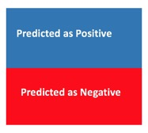

Sin embargo, es necesario considerar otros dos resultados posibles, los falsos negativos y los falsos positivos. Estos son los casos en los que el modelo predijo que alguien no incumplió con su préstamo bancario y lo hizo. El otro caso es cuando el modelo predijo que alguien incumplió con su hipoteca, pero en realidad no fue así. Los resultados totales se visualizan a través de una matriz de confusión, que es la tabla de dos por dos que se muestra a continuación:

Las clasificaciones binarias producen cuatro resultados: 

**Predicticted as Positive (Predicho como positivo)**:

True Positive (Verdadero positivo) = TP

False Positive (Falso positivo)= FP

**Predicted as Negative (Predicho como negativo)**:

True Negative (Verdadero negativo)= TN 

False Negative (Falso negativo)= FN 

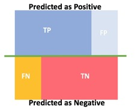

**Confusion Matrix (Matriz de confusión)**:


A partir de esta tabla de confusión, podemos medir la tasa de error, la exactitud, la especificidad, la sensibilidad y la precisión, todas métricas útiles para probar qué tan bueno es nuestro modelo para clasificar o predecir. Estas métricas se definirán y explicarán en las siguientes secciones..

En una nota al margen divertida, es posible que se pregunte por qué el nombre "Matriz de confusión". Algunos dirán que se debe a que una matriz de confusión puede resultar muy confusa. Dejando de lado las bromas, la matriz de confusión también se conoce como **matriz de error**, ya que facilita la visualización de la tasa de clasificación del modelo, incluida la tasa de error. El término "matriz de confusión" también se utiliza en psicología y el diccionario de Oxford lo define como "Una matriz que representa las frecuencias relativas con las que **cada uno de un número de estímulos se confunde con cada uno de los demás** por una persona en una tarea que requieren reconocimiento o identificación de estímulos. El análisis de estos datos permite al investigador extraer factores (2) que indican las dimensiones subyacentes de similitud en la percepción del encuestado. Por ejemplo, en tareas de identificación de colores, **confusión** relativamente frecuente de los rojos con verdes tenderían a sugerir daltonismo ". [1] En otras palabras, ¿con qué frecuencia una persona que realiza una tarea de clasificación confunde un elemento con otro? En el caso de ML, un modelo de aprendizaje automático está implementando la clasificación y evaluando la frecuencia en la que el modelo confunde una etiqueta de otra en lugar de una humana. 

### ROC

Una herramienta esencial para los problemas de clasificación es la curva ROC o la curva de características operativas del receptor. La curva ROC muestra visualmente el desempeño de un clasificador binario; en otras palabras, “dice cuánto es capaz un modelo de distinguir entre clases” [2] y el umbral correspondiente. Continuando con el ejemplo de Freddie Mac, la variable de salida o la etiqueta es si el cliente incumplirá o no con su préstamo y en qué umbral.

Una vez que el modelo se ha construido y entrenado usando el conjunto de datos de entrenamiento, se pasa a través de un método de clasificación (Regresión logística, Clasificador Bayes ingenuo, máquinas de vectores de soporte, árboles de decisión, bosque aleatorio, etc.), esto dará la probabilidad de cada cliente. incumpliendo. 

La curva ROC traza la sensibilidad o tasa de verdaderos positivos (eje y) versus 1-especificidad o tasa de falsos positivos (eje x) para cada posible umbral de clasificación. Un umbral de clasificación o umbral de decisión es el valor de probabilidad que utilizará el modelo para determinar a dónde pertenece una clase. El umbral actúa como un límite entre clases para determinar una clase de otra. Dado que estamos tratando con probabilidades de valores entre 0 y 1, un ejemplo de umbral puede ser 0.5. Esto le dice al modelo que cualquier cosa por debajo de 0.5 es parte de una clase y cualquier cosa por encima de 0.5 pertenece a una clase diferente. El umbral se puede seleccionar para maximizar los verdaderos positivos y minimizar los falsos positivos. Un umbral depende del escenario al que se aplica la curva ROC y del tipo de producción que buscamos maximizar. Obtenga más información sobre la aplicación del umbral y sus implicaciones en [Task 6: ER: ROC](#task-6-er-roc).


Dado nuestro ejemplo de caso de uso de predicción de préstamos, a continuación se proporciona una descripción de los valores en la matriz de confusión:

 - TP = 1 = Las coincidencias de predicción dan como resultado que alguien incumplió con un préstamo
 - TN = 0 = Las coincidencias de predicción dan como resultado que alguien no incumplió con un préstamo
 - FP = 1 = Predecir que alguien incurrirá en incumplimiento pero en realidad no lo hizo
 - FN = 0 = Predecir que alguien no incumplió con su préstamo bancario, pero sí lo hizo.


¿Qué son la sensibilidad y la especificidad? La tasa de verdaderos positivos es la relación entre el número de predicciones positivas verdaderas dividido por todos los valores reales positivos. Esta relación también se conoce como **recuerdo** o **sensibilidad**, y se mide de 0.0 a 1.0, donde 0 es la peor y 1.0 es la mejor sensibilidad. Sensible es una medida de qué tan bien está prediciendo el modelo para el caso positivo.

La tasa de verdaderos negativos es la razón del número de verdaderas predicciones negativas dividida por la suma de verdaderos negativos y falsos positivos. Esta relación también se conoce como ** especificidad ** y se mide de 0,0 a 1,0, donde 0 es la peor y 1,0 es la mejor especificidad. La especificidad es una medida de qué tan bien el modelo predice correctamente el caso negativo. ¿Con qué frecuencia predice correctamente un caso negativo?.

La tasa de falsos negativos es * 1 - Sensibilidad *, o la proporción de falsos negativos dividida por la suma de los verdaderos positivos y falsos negativos [3]. 

La siguiente imagen proporciona una ilustración de las proporciones de sensibilidad, especificidad y tasa de falsos negativos. 

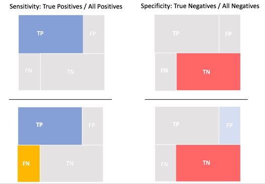

**Recall (Recordar)** = **Sensitivity (Sensibilidad)** = True Positive Rate (True Positive Rate) = TP / (TP + FN)

**Specificity (Especificidad)** = True Negative Rate (Tasa negativa verdadera) = TN / (FP + TN)


**1 - Specificity Especificidad** =  False Positive Rate (Tasa de falsos positivos)= 1 - True Negative Rate (Tasa negativa)= FP / (FP + TN )

Una curva ROC también puede decirle qué tan bien le fue a su modelo cuantificando su rendimiento. La puntuación se determina por el porcentaje del área que está debajo de la curva ROC, también conocida como Área debajo de la curva o AUC. 

A continuación se muestran cuatro tipos de curvas ROC con su AUC:

**Note:** Cuanto más cerca esté la curva ROC a la izquierda (cuanto mayor sea el porcentaje de AUC), mejor será el modelo para separar las clases. 

La curva ROC perfecta (en rojo) a continuación puede separar clases con un 100% de precisión y tiene un AUC de 1.0 (en azul):

  			

La curva ROC a continuación está muy cerca de la esquina izquierda y, por lo tanto, hace un buen trabajo al separar clases con un AUC de 0,7 o 70%:


En el caso por encima del 70% de los casos, el modelo predijo correctamente el resultado positivo y negativo y el 30% de los casos hizo alguna combinación de FP o FN.

Esta curva ROC se encuentra en la línea diagonal que divide el gráfico por la mitad. Dado que está más alejado de la esquina izquierda, hace un trabajo muy pobre en la distinción entre clases, este es el peor de los casos y tiene un AUC de .05 o 50%:

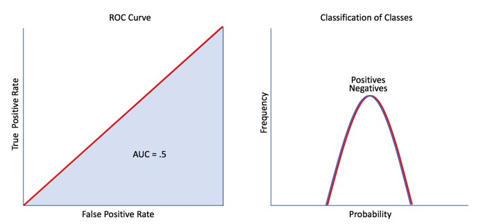

Un AUC de 0.5 nos dice que nuestro modelo es tan bueno como un modelo aleatorio que tiene un 50% de probabilidad de predecir el resultado. Nuestro modelo no es mejor que lanzar una moneda, el 50% de las veces el modelo puede predecir correctamente el resultado. 

Finalmente, la curva ROC a continuación representa otro escenario perfecto. Cuando la curva ROC se encuentra por debajo del modelo del 50% o del modelo de probabilidad aleatoria, el modelo debe revisarse cuidadosamente. La razón de esto es que podría haber habido un etiquetado incorrecto de los negativos y positivos, lo que provocó que los valores se invirtieran y, por lo tanto, la curva ROC esté por debajo del modelo de probabilidad aleatoria. Aunque esta curva ROC parece que tiene un AUC de 0.0 o 0% cuando la volteamos, obtenemos un AUC de 1 o 100%.


Una curva ROC es una herramienta útil porque solo se enfoca en qué tan bien el modelo pudo distinguir entre clases. “Las AUC pueden ayudar a representar la probabilidad de que el clasificador clasifique una observación positiva seleccionada al azar más alta que una observación negativa seleccionada al azar” [4]. Sin embargo, para los modelos en los que la predicción ocurre raramente, un AUC alto podría proporcionar una sensación falsa de que el modelo está prediciendo correctamente los resultados. Aquí es donde la noción de precisión y recuerdo se vuelve importante.

### Aplicabilidad de las curvas ROC en el mundo real

Las curvas ROC y AUC son métricas de evaluación importantes para calcular el rendimiento de cualquier modelo de clasificación. Con la esperanza de comprender la aplicabilidad de las curvas ROC, considere las siguientes curvas ROC con su AUC y suavice los histogramas de un modelo de clasificador binario tratando de establecer el siguiente punto: 

**Task**: Identificar la curva ROC más efectiva que distinguirá entre manzanas verdes y rojas. 

A continuación se muestran tres tipos de curvas ROC en correlación con la búsqueda de la ROC perfecta que distinguirá entre manzanas rojas y verdes.

Como se señaló anteriormente, cuanto más cerca esté la curva ROC a la izquierda (cuanto más significativo sea el porcentaje de AUC), mejor será el modelo para separar clases.

*Nota*: Antes de seguir adelante, es esencial aclarar que los histogramas suaves trazados son el resultado de datos anteriores. Estos datos han determinado que las manzanas con más del 50% (umbral) de su cuerpo rojo se considerarán manzanas rojas. Por lo tanto, cualquier cosa por debajo del 50% será una manzana verde.


#### ROC One (ROC Uno): 


En este caso, el histograma suave anterior (1A) nos dice que la distribución será la siguiente:

La curva de campana verde representa las manzanas verdes, mientras que la curva de campana roja representa las manzanas rojas y el umbral será del 50%. El eje x representa las probabilidades predichas, mientras que el eje y representa el recuento de observaciones.

 A partir de observaciones generales, podemos ver que el histograma suave muestra que el clasificador actual puede distinguir entre manzanas rojas y verdes solo el 50% del tiempo, y esa distinción se encuentra en el umbral de 0,5. 

Cuando dibujamos la curva ROC (1B) para el histograma suave anterior, obtendremos los siguientes resultados:

La curva ROC nos dice qué tan bueno es el modelo para distinguir entre dos clases: en este caso, nos referimos a las manzanas rojas y verdes como las dos clases. Al mirar la curva ROC, tendrá un AUC de 1 (en azul). Por lo tanto, como se discutió anteriormente, un AUC de uno nos dirá que el modelo está funcionando al 100% (rendimiento perfecto). Aunque no siempre es así. Podemos tener una Curva ROC de cero, y si volteamos la curva, puede darnos una ROC de uno; es por eso que siempre debemos revisar el modelo detenidamente.

En consecuencia, esta Curva ROC nos dice que el modelo de clasificador puede distinguir entre manzanas rojas y verdes el 100% de todos los casos en los que tiene que identificar. En consecuencia, el modelo aleatorio se vuelve absoluto. Como referencia, el modelo aleatorio (línea de trazos) esencialmente representa un clasificador que no funciona mejor que adivinar al azar.

Por lo tanto, la curva ROC para este histograma suave será perfecta porque puede separar manzanas rojas y verdes. 

#### ROC Two (ROC DOS): 


Cuando dibujamos la curva ROC (2B) para el histograma suave (2A) anterior, obtendremos los siguientes resultados:

Al mirar la curva ROC, tendrá un AUC de 0,7 (en azul).

En consecuencia, esta curva ROC nos dice que el modelo de clasificador no puede distinguir adecuadamente entre manzanas rojas y verdes el 100% de todos los casos. Y de alguna manera, este clasificador se acerca al modelo aleatorio que no funciona mejor que adivinar al azar.

Por lo tanto, esta curva ROC no es perfecta para clasificar manzanas rojas y verdes. Eso no quiere decir que la curva ROC sea completamente incorrecta; solo tiene un margen de error del 30%. 

#### ROC Three (ROC TRES): 


Cuando dibujamos la curva ROC (3B) para el histograma suave (3A) anterior, obtendremos los siguientes resultados:

Al mirar la curva ROC, tendrá un AUC de .5 (en azul).

En consecuencia, esta curva ROC nos dice que el modelo de clasificador no puede distinguir adecuadamente entre manzanas rojas y verdes el 100% de todos los casos. En cierto modo, este clasificador se vuelve similar al modelo aleatorio que no funciona mejor que adivinar al azar.

Por lo tanto, esta curva ROC no es perfecta para clasificar manzanas rojas y verdes. Eso no quiere decir que la curva ROC sea completamente incorrecta; tiene un margen de error del 50%.

#### Conclusion

En este caso, elegiremos la primera curva ROC (con un gran clasificador) porque conduce a un AUC de 1.0 (puede separar la clase manzana verde y la clase manzana roja (las dos clases) con 100% de precisión). 

### Prec-Recall

La curva Precision-Recall o Prec-Recall o **P-R** es otra herramienta para evaluar modelos de clasificación que se deriva de la matriz de confusión. Prec-Recall es una herramienta complementaria a las curvas ROC, especialmente cuando el conjunto de datos tiene un sesgo significativo. La curva Prec-Recall traza la precisión o el valor predictivo positivo (eje y) frente a la sensibilidad o la tasa de verdadero positivo (eje x) para cada posible umbral de clasificación. En un nivel alto, podemos pensar en la precisión como una medida de exactitud o calidad de los resultados mientras recordamos como una medida de integridad o cantidad de los resultados obtenidos por el modelo. Prec-Recall mide la relevancia de los resultados obtenidos por el modelo.

**Precisión** es la proporción de predicciones positivas correctas dividida por el número total de predicciones positivas. Esta relación también se conoce como ** valor predictivo positivo ** y se mide de 0.0 a 1.0, donde 0.0 es la peor y 1.0 es la mejor precisión. La precisión se centra más en la clase positiva que en la clase negativa, en realidad mide la probabilidad de detección correcta de valores positivos (TP y FP). 
 
**Precision** = Predicciones positivas verdaderas / Número total de predicciones positivas = TP  / (TP + FP)

Como se mencionó en la sección ROC, **Recordar** es la tasa de verdaderos positivos, que es la razón del número de predicciones positivas verdaderas dividido por todos los valores reales positivos. El recuerdo es una métrica de las predicciones positivas reales. Nos dice cuántos resultados positivos correctos se produjeron de todas las muestras positivas disponibles durante la prueba del modelo..

**Recall** = **Sensibilidad** = Tasa de verdaderos positivos = TP / (TP + FN)

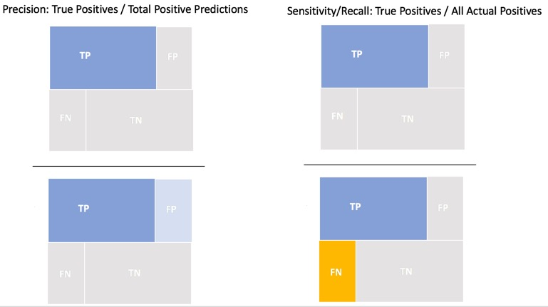

A continuación se muestra otra forma de visualizar Precision y Recall, esta imagen fue tomada de [https://commons.wikimedia.org/wiki/File:Precisionrecall.svg](https://commons.wikimedia.org/wiki/File:Precisionrecall.svg).


Una curva de recuperación de precisión se crea conectando todos los puntos de recuperación de precisión mediante interpolación no lineal [5]. El gráfico de pre-recuperación se divide en dos secciones, rendimiento "bueno" y "pobre". Se puede encontrar un rendimiento "bueno" en la esquina superior derecha del gráfico y un rendimiento "deficiente" en la esquina inferior izquierda. Consulte la imagen de abajo para ver el gráfico pre-recuperación perfecto. Esta división es generada por la línea de base. La línea de base para Prec-Recall está determinada por la relación de Positivos (P) y Negativos (N), donde y = P / (P + N), esta función representa un clasificador con un nivel de desempeño aleatorio [6]. Cuando el conjunto de datos está equilibrado, el valor de la línea de base es y = 0,5. Si el conjunto de datos está desequilibrado donde el número de P es mayor que N, la línea de base se ajustará en consecuencia y viceversa.

La curva Perfect Prec-Recall es una combinación de dos líneas rectas (en rojo). ¡La gráfica nos dice que el modelo no cometió errores de predicción! En otras palabras, sin falsos positivos (precisión perfecta) ni falsos negativos (recuerdo perfecto) asumiendo una línea de base de 0.5. 


De manera similar a la curva ROC, podemos usar el área bajo la curva o AUC para ayudarnos a comparar el desempeño del modelo con otros modelos.

**Nota:** Cuanto más cerca esté la curva de recuperación previa de la esquina superior derecha (cuanto mayor sea el porcentaje de AUC), mejor será el modelo para predecir correctamente los verdaderos positivos.

Esta curva de recuperación previa en rojo a continuación tiene un AUC de aproximadamente 0,7 (en azul) con una línea de base relativa de 0,5:


Finalmente, esta curva de recuperación previa representa el peor escenario en el que el modelo genera un 100% de falsos positivos y falsos negativos. Esta curva de recuperación previa tiene un AUC de 0.0 o 0%:

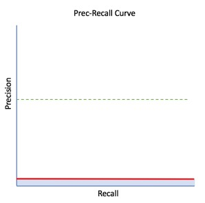

De la gráfica Prec-Recall se derivan algunas métricas que pueden ser útiles para evaluar el desempeño del modelo, como la precisión y las puntuaciones Fᵦ. Estas métricas se explicarán con más profundidad en la siguiente sección de los conceptos. Solo tenga en cuenta que la precisión o ACC es el número de razón de predicciones correctas dividido por el número total de predicciones y Fᵦ es la media armónica de recuperación y precisión.

Al mirar ACC en Prec-Recall, la precisión de las observaciones positivas es imperativo para tener en cuenta que ACC no realiza conjuntos de datos bien desequilibrados. Esta es la razón por la que las **puntuaciones F** se pueden usar para tener en cuenta el conjunto de datos sesgado en Prec-Recall.. 

AAl considerar la precisión de un modelo para los casos positivos, desea saber un par de cosas:

- ¿Con qué frecuencia es correcto?
- ¿Cuándo está mal? ¿Por qué?
- ¿Es porque tienes demasiados falsos positivos? (Precisión)
- ¿O es porque tienes demasiados falsos negativos? (Recordar)

También hay varias puntuaciones Fᵦ que se pueden considerar, F1, F2 y F0.5. El 1, 2 y 0.5 son los pesos dados para recordar y precisar. F1, por ejemplo, significa que tanto la precisión como la recuperación tienen el mismo peso, mientras que F2 otorga a la recuperación un peso mayor que la precisión y F0.5 otorga a la precisión un peso mayor que la recuperación.

Prec-Recall es una buena herramienta a tener en cuenta para los clasificadores porque es una gran alternativa para grandes sesgos en la distribución de clases. Utilice la precisión y la recuperación para centrarse en la clase positiva pequeña: cuando la clase positiva es más pequeña y la capacidad de detectar muestras positivas correctamente es nuestro enfoque principal (la detección correcta de ejemplos negativos es menos importante para el problema), debemos utilizar la precisión y la recuperación.

Si está utilizando una métrica de modelo de precisión y ve problemas con Prec-Recall, entonces podría considerar usar una métrica de modelo de logloss

#### Aplicabilidad de las curvas de recuperación de precisión en el mundo real

Con la esperanza de comprender la aplicabilidad de las curvas de recuperación de precisión en el mundo real, veamos cómo podemos hacer uso de las curvas de recuperación de precisión como métrica para verificar el rendimiento del modelo de clasificación binaria utilizado anteriormente para distinguir entre manzanas verdes y rojas. .

Como se mencionó anteriormente, el valor predictivo positivo se refiere a la precisión. Reinventemos de nuevo que estamos en una fábrica de manzanas intentando construir un modelo que sea capaz de distinguir entre manzanas rojas y verdes. Por tanto, el objetivo de este modelo será que las cajas de manzanas rojas no contengan manzanas verdes y viceversa. En consecuencia, este será un problema de clasificación binaria en el que la variable dependiente es 0 o 1, ya sea una manzana verde, 0 o 1, una manzana roja. En esta circunstancia, Precision será la proporción de nuestro modelo predictivo señalada como manzanas rojas. 

Con eso en mente, seguiremos para calcular la precisión de la siguiente manera: 

Precisión = Verdadero Positivo / (Verdadero Positivo + Falso Positivo) 

* Verdadero Positivo = Número de manzanas rojas que predijimos correctamente como rojas. 
* Falso positivo = Número de manzanas verdes que predijimos incorrectamente como rojas. 

Recall (sensibilidad) especificará la proporción de manzanas rojas que predijimos como manzanas rojas.

El retiro se calculará de la siguiente manera:

Recordar = Verdadero Positivo / (Verdadero Positivo + Falso Negativo)

* Verdadero Positivo: Número de manzanas rojas que predijimos correctamente como rojas.

* Falso Negativo: Número de manzanas rojas que predijimos incorrectamente como manzanas verdes.

Por lo tanto, la principal diferencia entre Precision y Recall es el denominador en la fracción Precision and Recall. En Re-call, se incluyen los falsos negativos, mientras que, en Precision, se consideran los falsos positivos.

#### Diferencia entre precisión y recuperación

Supongamos que hay un total de 1000 manzanas. De 1000, 500 manzanas son realmente rojas. De 500, predijimos correctamente 400 de ellos como rojos.

* La recuperación sería del 80%
* 400/500 = 0,8

Para Precision, lo siguiente será cierto: de 1000 manzanas, predijimos 800 como manzanas rojas. De 800, predijimos correctamente 400 de ellas como manzanas rojas.

* La precisión sería del 50%.
* 400/800 = 0,5

Para comprender mejor estas dos ideas de memoria y precisión, imagina por un momento a uno de tus profesores de secundaria preguntándote sobre las fechas de los cuatro días festivos principales: Halloween, Navidad, Año Nuevo y Día de los Caídos. Te las arreglas para recordar todas estas cuatro fechas, pero con veinte intentos en total. Su puntuación de recuperación será del 100%, pero su puntuación de precisión será del 20%, que es cuatro dividido por veinte.

Es importante tener en cuenta que después de calcular los valores de recuperación y precisión de varias matrices de confusión para diferentes umbrales, y trazar los resultados en una curva de recuperación de precisión, tenga en cuenta lo siguiente:

- Como se mencionó anteriormente, cuanto más cerca esté la curva Precision-Recall de la esquina superior derecha (cuanto mayor sea el porcentaje de AUC), mejor será el modelo para predecir correctamente los verdaderos positivos.
- El eje x mostrará Recuperar mientras que el eje y representará la Precisión.
- Por lo tanto, las curvas Precision_Recall pueden mostrar claramente la relación y la compensación de tener un umbral más alto o más bajo.


En conclusión, las curvas Precision-Recall permiten un análisis más profundo de los modelos de clasificación binaria. Y al intentar distinguir entre manzanas rojas y verdes.


### GINI, ACC, F1 F0.5, F2, MCC y Log Loss (Pérdida de registro)

Las curvas ROC y Prec-Recall son extremadamente útiles para probar un clasificador binario porque proporcionan visualización para cada posible umbral de clasificación. De esos gráficos podemos derivar métricas de un solo modelo (por ejemplo, ACC, F1, F0.5, F2 y MCC). También hay otras métricas únicas que se pueden usar simultáneamente para evaluar modelos como GINI y Log Loss. La siguiente será una discusión sobre las puntuaciones del modelo, ACC, F1, F0.5, F2, MCC, GINI y Log Loss (Pérdida de registro). Las puntuaciones del modelo son lo que optimiza el modelo ML.

#### GINI

El índice de Gini es un método bien establecido para cuantificar la desigualdad entre los valores de la distribución de frecuencias y se puede utilizar para medir la calidad de un clasificador binario. Un índice de Gini de cero expresa una igualdad perfecta (o un clasificador totalmente inútil), mientras que un índice de Gini de uno expresa una desigualdad máxima (o un clasificador perfecto).

**GINI index formula**


donde p<sub>j</sub> es la probabilidad de la clase j [18]. 

El índice de Gini se basa en la curva de Lorenz. La curva de Lorenz traza la tasa positiva verdadera (eje y) en función de los percentiles de la población (eje x).

La curva de Lorenz representa un colectivo de modelos representados por el clasificador. La ubicación en la curva viene dada por el umbral de probabilidad de un modelo en particular. (es decir, los umbrales de probabilidad más bajos para la clasificación suelen generar más positivos verdaderos, pero también más falsos positivos). [12]

El índice de Gini en sí es independiente del modelo y solo depende de la curva de Lorenz determinada por la distribución de las puntuaciones (o probabilidades) obtenidas del clasificador.. 

#### Exactitud

La precisión o ACC (que no debe confundirse con el AUC o el área bajo la curva) es una métrica única en los problemas de clasificación binaria. ACC es el número de razón de predicciones correctas dividido por el número total de predicciones. En otras palabras, ¿qué tan bien puede el modelo identificar correctamente tanto los verdaderos positivos como los verdaderos negativos? La precisión se mide en el rango de 0 a 1, donde 1 es precisión perfecta o clasificación perfecta y 0 es precisión deficiente o clasificación deficiente [8].

Usando la tabla de matriz de confusión, ACC se puede calcular de la siguiente manera:

Ecuación de **precisión** = (TP + TN) / (TP + TN + FP + FN)


#### Puntuación F: F1, F0.5 y F2

La puntuación F1 es otra medida de la precisión de la clasificación. Representa el promedio armónico de la precisión y la recuperación. F1 se mide en el rango de 0 a 1, donde 0 significa que no hay verdaderos positivos y 1 cuando no hay falsos negativos ni falsos positivos o precisión y recuerdo perfectos [9].

Usando la tabla de matriz de confusión, la puntuación F1 se puede calcular de la siguiente manera:

**F1** = 2TP / (2TP + FN + FP)

**F1** ecuación:


**F0.5** ecuación:


Dónde:
La precisión son las observaciones positivas (verdaderos positivos) que el modelo identificó correctamente a partir de todas las observaciones que etiquetó como positivas (los verdaderos positivos + los falsos positivos). El recuerdo son las observaciones positivas (verdaderos positivos) que el modelo identificó correctamente de todos los casos positivos reales (verdaderos positivos + falsos negativos) [15].

**DISPLAY F2 puntuación ecuación**

La **puntuación F2** es la media armónica ponderada de la precisión y la recuperación (dado un valor umbral). A diferencia de la puntuación F1, que otorga el mismo peso a la precisión y la memoria, la puntuación F2 le da más importancia a la memoria que a la precisión. Se debe dar más peso al retiro de casos en los que se considera que los falsos negativos tienen un impacto comercial negativo más fuerte que los falsos positivos. Por ejemplo, si su caso de uso es predecir qué clientes abandonarán, puede considerar que los falsos negativos son peores que los falsos positivos. En este caso, desea que sus predicciones capturen a todos los clientes que se agotarán. Es posible que algunos de estos clientes no corran el riesgo de que se agiten, pero la atención adicional que reciben no es perjudicial. Y lo que es más importante, no se ha perdido ningún cliente con riesgo real de abandono [15].


Donde: Precisión son las observaciones positivas (verdaderos positivos) que el modelo identificó correctamente a partir de todas las observaciones que etiquetó como positivas (los verdaderos positivos + los falsos positivos). Recordar son las observaciones positivas (verdaderos positivos) que el modelo identificó correctamente de todos los casos positivos reales (los verdaderos positivos + los falsos negativos).

#### MCC

MCC o coeficiente de correlación de Matthews que se utiliza como medida de la calidad de las clasificaciones binarias [1]. El MCC es el coeficiente de correlación entre las clasificaciones binarias observadas y predichas. MCC se mide en el rango entre -1 y +1 donde +1 es la predicción perfecta, 0 no es mejor que una predicción aleatoria y -1 todas las predicciones incorrectas [9].

Usando la tabla de matriz de confusión, MCC se puede calcular de la siguiente manera:

**MCC** ecuación:


#### Pérdida de registro (pérdida de registro)
 
La métrica de pérdida logarítmica se puede utilizar para evaluar el rendimiento de un clasificador binomial o multinomial. A diferencia de AUC, que analiza qué tan bien un modelo puede clasificar un objetivo binario, logloss evalúa qué tan cerca están los valores predichos de un modelo (estimaciones de probabilidad no calibradas) del valor objetivo real. Por ejemplo, ¿un modelo tiende a asignar un valor predicho alto como 0,80 para la clase positiva, o muestra poca capacidad para reconocer la clase positiva y asignar un valor predicho más bajo como 0,50? Un modelo con una pérdida logarítmica de 0 sería el clasificador perfecto. Cuando el modelo no puede hacer predicciones correctas, la pérdida logarítmica aumenta, lo que hace que el modelo sea un modelo deficiente [11].

**Ecuación de clasificación binaria:**


**Ecuación de clasificación multiclase:**


Dónde:

- N es el número total de filas (observaciones) de su marco de datos correspondiente.
- w es el peso definido por el usuario por fila (el valor predeterminado es 1).
- C es el número total de clases (C = 2 para clasificación binaria).
- p es el valor predicho (probabilidad no calibrada) asignado a una fila determinada (observación).
- y es el valor objetivo real.

La sección de Diagnóstico en Driverless AI calcula los valores de ACC, F1, MCC y traza esos valores en cada curva ROC y Pre-Recall, lo que facilita la identificación del mejor umbral para el modelo generado. Además, también calcula la puntuación de pérdida de registro para su modelo, lo que le permite evaluar rápidamente si el modelo que generó es un buen modelo o no.

Volvamos a evaluar los resultados de las métricas de los modelos.


### Gráficos de ganancia y elevación

Los gráficos de ganancia y elevación miden la efectividad de un modelo de clasificación al observar la relación entre los resultados obtenidos con un modelo entrenado y un modelo aleatorio (o sin modelo) [7]. Los gráficos de ganancia y aumento nos ayudan a evaluar el rendimiento del clasificador, así como a responder preguntas como qué porcentaje del conjunto de datos capturado tiene una respuesta positiva en función del porcentaje seleccionado de una muestra. Además, podemos explorar cuánto mejor podemos esperar hacer con un modelo en comparación con un modelo aleatorio (o sin modelo) [7].

Una forma en que podemos pensar en la ganancia es “por cada paso que se da para predecir un resultado, el nivel de incertidumbre disminuye. Una gota de incertidumbre es la pérdida de entropía que conduce a la ganancia de conocimiento ”[15]. El gráfico de ganancia traza la tasa positiva verdadera (sensibilidad) frente a la tasa positiva predictiva (**soporte**) donde:

**Sensibilidad** = **Recordar** = Tasa de verdaderos positivos = TP / (TP + FN)

**Soporte** = **Tasa positiva predictiva** = TP + FP / (TP + FP + FN + TN) 


Para visualizar mejor el porcentaje de respuestas positivas en comparación con una muestra de porcentaje seleccionada, utilizamos **Ganancias acumuladas** y **Cuantil**. Las ganancias acumuladas se obtienen tomando el modelo predictivo y aplicándolo al conjunto de datos de prueba, que es un subconjunto del conjunto de datos original. El modelo predictivo puntuará cada caso con una probabilidad. A continuación, las puntuaciones se clasifican en orden ascendente según la puntuación predictiva. El cuantil toma el número total de casos (un número finito) y divide el conjunto finito en subconjuntos de tamaños casi iguales. El percentil se traza a partir de los percentiles 0 y 100. Luego trazamos el número acumulado de casos hasta cada cuantil comenzando con los casos positivos al 0% con las probabilidades más altas hasta llegar al 100% con los casos positivos que obtuvieron las probabilidades más bajas.

En el gráfico de ganancias acumuladas, el eje x muestra el porcentaje de casos del número total de casos en el conjunto de datos de prueba, mientras que el eje y muestra el porcentaje de respuestas positivas en términos de cuantiles. Como se mencionó, dado que las probabilidades se han ordenado en orden ascendente, podemos ver el porcentaje de casos positivos predictivos encontrados en el 10% o 20% como una forma de reducir el número de casos positivos que nos interesan. Visualmente, el rendimiento del modelo predictivo se puede comparar con el de un modelo aleatorio (o sin modelo). El modelo aleatorio se representa a continuación en rojo como el peor escenario de muestreo aleatorio.


¿Cómo podemos identificar el mejor escenario en relación con el modelo aleatorio? Para hacer esto, primero debemos identificar una tarifa base. La tasa base establece los límites de la curva óptima. Las mejores ganancias siempre están controladas por la tasa base. Se puede ver un ejemplo de una Tasa Base en el gráfico a continuación (punteado en verde).

- **Tarifa base** se define como:

- **Tasa base** = (TP + FN) / Tamaño de muestra


El gráfico anterior representa el mejor escenario de un gráfico de ganancias acumuladas asumiendo una tasa base del 20%. En este escenario se identificaron todos los casos positivos antes de alcanzar la tasa base.

El siguiente cuadro representa un ejemplo de un modelo predictivo (curva verde continua). Podemos ver qué tan bien funcionó el modelo predictivo en comparación con el modelo aleatorio (línea roja punteada). Ahora, podemos elegir un cuantil y determinar el porcentaje de casos positivos en ese cuartil en relación con todo el conjunto de datos de prueba.


Lift puede ayudarnos a responder la pregunta de cuánto mejor se puede esperar hacer con el modelo predictivo en comparación con un modelo aleatorio (o sin modelo). Lift es una medida de la efectividad de un modelo predictivo calculada como la relación entre los resultados obtenidos con un modelo y con un modelo aleatorio (o sin modelo). En otras palabras, la relación entre el% de ganancia y el% de expectativa aleatoria en un cuantil dado. La expectativa aleatoria del x-ésimo cuantil es x% [16].

**Incremento** = Tasa predictiva / Tasa real

Al graficar la elevación, también la graficamos contra cuantiles para ayudarnos a visualizar la probabilidad de que ocurra un caso positivo, ya que el gráfico de elevación se deriva del gráfico de ganancias acumuladas. Los puntos de la curva de elevación se calculan determinando la relación entre el resultado predicho por nuestro modelo y el resultado utilizando un modelo aleatorio (o ningún modelo). Por ejemplo, asumiendo una tasa base (o umbral hipotético) del 20% de un modelo aleatorio, tomaríamos el porcentaje de ganancia acumulada en el cuantil del 20%, X y lo dividiríamos por 20. Hacemos esto para todos los cuantiles hasta que obtener la curva de elevación completa.

Podemos comenzar el gráfico de elevación con la tasa base como se ve a continuación, recuerde que la tasa base es el umbral objetivo.


Al observar la elevación acumulada de los cuantiles superiores, X, lo que significa es que cuando seleccionamos digamos 20% del cuantil del total de casos de prueba basados en el modo, podemos esperar X / 20 veces el total del número de casos positivos encontrados mediante la selección aleatoria del 20% del modelo aleatorio.


### Kolmogorov-Smirnov Chart 

Kolmogorov-Smirnov o K-S mide el rendimiento de los modelos de clasificación midiendo el grado de separación entre positivos y negativos para la validación o los datos de prueba [13].

La estadística KS es la diferencia máxima entre el porcentaje acumulado de respondedores o 1 (tasa acumulada de verdaderos positivos) y el porcentaje acumulativo de no respondedores o 0 (tasa acumulada de falsos positivos). La importancia de la estadística KS es que ayuda a comprender qué parte de la población debe ser el objetivo para obtener la tasa de respuesta más alta (1) [17].

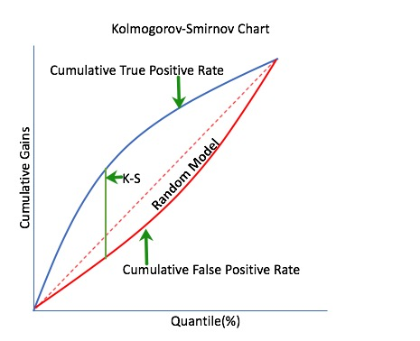

### References

[1] [Confusion Matrix definition“ A Dictionary of Psychology“](http://www.oxfordreference.com/view/10.1093/acref/9780199534067.001.0001/acref-9780199534067-e-1778)

[2] [Towards Data Science - Understanding AUC- ROC Curve](https://towardsdatascience.com/understanding-auc-curve-68b2303cc9c5)

[3] [Introduction to ROC](https://classeval.wordpress.com/introduction/introduction-to-the-roc-receiver-operating-characteristics-plot/)

[4] [ROC Curves and Under the Curve (AUC) Explained](https://www.youtube.com/watch?v=OAl6eAyP-yo)

[5] [Introduction to Precision-Recall](https://classeval.wordpress.com/introduction/introduction-to-the-precision-recall-plot/)

[6] [Tharwat, Applied Computing and Informatics (2018)](https://doi.org/10.1016/j.aci.2018.08.003)

[7] [Model Evaluation Classification](https://www.saedsayad.com/model_evaluation_c.htm)

[8] [Wiki Accuracy](https://en.wikipedia.org/wiki/Accuracy_and_precision)

[9] [Wiki F1 Score](https://en.wikipedia.org/wiki/F1_score)

[10] [Wiki Matthew’s Correlation Coefficient](https://en.wikipedia.org/wiki/Matthews_correlation_coefficient)

[11] [Wiki Log Loss](http://wiki.fast.ai/index.php/Log_Loss)

[12] [H2O’s GINI Index](http://docs.h2o.ai/driverless-ai/latest-stable/docs/userguide/scorers/scorers_gini.html?highlight=gini) 

[13] [H2O’s Kolmogorov-Smirnov](http://docs.h2o.ai/driverless-ai/latest-stable/docs/userguide/experiment-graphs.html?highlight=mcc)

[14] [Model Evaluation- Classification](https://www.saedsayad.com/model_evaluation_c.htm)

[15] [What is Information Gain in Machine Learning](https://www.quora.com/What-is-Information-gain-in-Machine-Learning)

[16] [Lift Analysis Data Scientist Secret Weapon](https://www.kdnuggets.com/2016/03/lift-analysis-data-scientist-secret-weapon.html)

[17] [Machine Learning Evaluation Metrics Classification Models](https://www.machinelearningplus.com/machine-learning/evaluation-metrics-classification-models-r/) 

[18] [Scikit-Learn: Decision Tree Learning I - Entropy, GINI, and Information Gain](https://www.bogotobogo.com/python/scikit-learn/scikt_machine_learning_Decision_Tree_Learning_Informatioin_Gain_IG_Impurity_Entropy_Gini_Classification_Error.php)

### Inmersión más profunda y recursos

- [How and when to use ROC Curves and Precision-Recall Curves for Classification in Python](https://machinelearningmastery.com/roc-curves-and-precision-recall-curves-for-classification-in-python/)

- [ROC Curves and AUC Explained](https://www.youtube.com/watch?time_continue=1&v=OAl6eAyP-yo)

- [Towards Data Science Precision vs Recall](https://towardsdatascience.com/precision-vs-recall-386cf9f89488)

- [ML Classification - Precision-Recall Curve](https://www.coursera.org/lecture/ml-classification/precision-recall-curve-rENu8)

- [Towards Data Science - Understanding and Interpreting Gain and Lift Charts](https://www.datasciencecentral.com/profiles/blogs/understanding-and-interpreting-gain-and-lift-charts)

- [ROC and AUC, Clearly Explained Video](https://www.youtube.com/watch?v=xugjARegisk)

- [What is Information gain in Machine Learning](https://www.quora.com/What-is-Information-gain-in-Machine-Learning)


## Task 4: Experiment Results Summary

At the end of the experiment, a summary of the project will appear on the right-lower corner.  Also, note that the name of the experiment is at the top-left corner.  

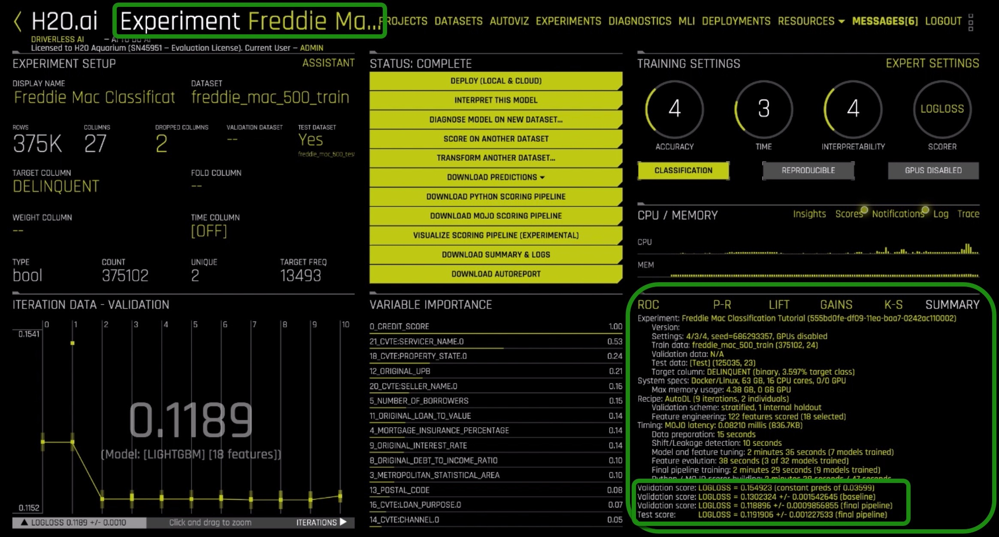

The summary includes the following:

- **Experiment**: experiment name,
  - Version: version of Driverless AI and the date it was launched
  - Settings: selected experiment settings, seed, and amount of GPU’s enabled
  - Train data: name of the training set, number of rows and columns
  - Validation data: name of  the validation set, number of rows and columns
  - Test data: name of the test set, number of rows and columns
  - Target column: name of the target column (type of data and % target class)

- **System Specs**: machine specs including RAM, number of CPU cores and GPU’s
  - Max memory usage  

- **Recipe**: 
  - Validation scheme: type of sampling, number of internal holdouts
  - Feature Engineering: number of features scored and the final selection

- **Timing**
  - Data preparation 
  - Shift/Leakage detection
  - Model and feature tuning: total time for model and feature training and  number of models trained 
  - Feature evolution: total time for feature evolution and number of models trained 
  - Final pipeline training: total time for final pipeline training and the total models trained 
  - Python / MOJO scorer building 
- Validation Score: Log loss score +/- machine epsilon for the baseline
- Validation Score: Log loss score +/- machine epsilon for the final pipeline
- Test Score: Log loss score +/- machine epsilon score for the final pipeline 

Most of the information in the Experiment Summary tab, along with additional detail, can be found in the Experiment Summary Report (Yellow Button “Download Experiment Summary”).

Below are three questions to test your understanding of the experiment summary and frame the motivation for the following section.

1\. Find the number of features that were scored for your model and the total features that were selected. 

2\.  Take a look at the validation Score for the final pipeline and compare that value to the test score. Based on those scores would you consider this model a good or bad model?
	
**Note:** If you are not sure what Log loss is, feel free to review the concepts section of this tutorial.


3\. So what do the Log Loss values tell us?  The essential Log Loss value is the test score value. This value tells us how well the model generated did against the freddie_mac_500_test set based on the error rate. In case of experiment **Freddie Mac Classification Tutorial**, the **test score LogLoss = 0.1191906 +/- 0.00122753** which is the log of the misclassification rate. The greater the Log loss value the more significant the misclassification. For this experiment, the Log Loss was relatively small meaning the error rate for misclassification was not as substantial. But what would a score like this mean for an institution like Freddie Mac?

In the next few tasks we will explore the financial implications of misclassification by exploring the confusion matrix and plots derived from it. 


### Deeper Dive and Resources

- [H2O’s Experiment Summary](http://docs.h2o.ai/driverless-ai/latest-stable/docs/userguide/experiment-summary.html?highlight=experiment%20overview)

- [H2O’s Internal Validation](http://docs.h2o.ai/driverless-ai/latest-stable/docs/userguide/internal-validation.html) 


## Task 5: Diagnostics Scores and Confusion Matrix

Now we are going to run a model diagnostics on the freddie_mac_500_test set. The diagnostics model allows you to view model performance for multiple scorers based on an existing model and dataset through the Python API.

1\. Select **Diagnostics** 


2\. Once in the **Diagnostics** page, select **+ Diagnose Model**


3\. In the **Create new model diagnostics** : 
1. Click on Diagnosed Experiment then select the experiment that you completed in Task 4: **Freddie Mac Classification Tutorial**
2. Click on Dataset then select the freddie_mac_500_test dataset
3.  Initiate the diagnostics model by clicking on **Launch Diagnostics** 


4\.After the model diagnostics is done running, a model similar to the one below will appear:

 

*Things to Note:*

1. Name of new diagnostics model
2. **Model**: Name of ML model used for diagnostics
3. **Dataset**: name of the dataset used for diagnostic
4. **Message** : Message regarding new diagnostics model 
5. **Status** : Status of new diagnostics model
6. **Time** : Time it took for the  new diagnostics model to run
7. Options for this model

5\. Click on the new diagnostics model and a page similar to the one below will appear:


*Things to Note:*

1. **Info**: Information about the diagnostics model including the name of the test dataset, name of the experiment used and the target column used for the experiment
2. **Scores**: Summary for the values for GINI, MCC, F05, F1, F2, Accuracy, Log loss, AUC and AUCPR in relation to how well the experiment model scored against a “new” dataset

    -  **Note:** The new dataset must be the same format and with the same number of columns as the training dataset 

3. **Metric Plots**: Metrics used to score the experiment model including ROC Curve, Pre-Recall Curve, Cumulative Gains, Lift Chart, Kolmogorov-Smirnov Chart, and Confusion Matrix

4. **Download Predictions**: Download the diagnostics predictions
 
**Note:** The scores will be different for the train dataset and the validation dataset used during  the training of the model.

#### Confusion Matrix 

As mentioned in the concepts section, the confusion matrix is the root from where most metrics used to test the performance of a model originate. The confusion matrix provides an overview performance of a supervised model’s ability to classify.

Click on the confusion matrix located on the **Metrics Plot** section of the Diagnostics page, bottom-right corner. An image similar to the one below will come up:


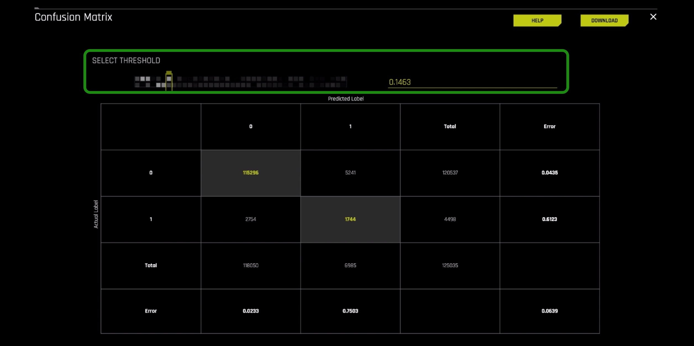

The confusion matrix lets you choose a desired threshold for your predictions. In this case, we will take a closer look at the confusion matrix generated by the Driverless AI model with the default threshold, which is **0.1463**.

The first part of the confusion matrix we are going to look at is the **Predicted labels** and **Actual labels**.  As shown on the image below the **Predicted label** values for **Predicted Condition Negative** or  **0** and **Predicted Condition Positive** or **1**  run vertically while the **Actual label** values for **Actual Condition Negative** or **0** and **Actual Condition Positive** or **1** run horizontally on the matrix.

Using this layout, we will be able to determine how well the model predicted the people that defaulted and those that did not from our Freddie Mac test dataset. Additionally, we will be able to compare it to the actual labels from the test dataset.


Moving into the inner part of the matrix, we find the number of cases for True Negatives, False Positives, False Negatives and True Positive. The confusion matrix for this model generated tells us that:

- TP = 1,744 cases were predicted as **defaulting** and **defaulted** in actuality 
- TN = 115,296 cases were predicted as **not defaulting** and **did not default** 
- FP = 5,241 cases were predicted as **defaulting** when in actuality they **did not default**
- FN = 2,754 cases were predicted as **not defaulting** when in actuality they **defaulted**


The next layer we will look at is the **Total** sections for **Predicted label** and **Actual label**. 

On the right side of the confusion matrix are the totals for the **Actual label**  and at the base of the confusion matrix, the totals for the **Predicted label**.

**Actual label**
- 120,537 : the number of actual cases that did not default on the test dataset
- 4,498 : the number of actual cases that defaulted on the test

**Predicted label**
- 118,050 : the number of cases that were predicted to not default on the test dataset
- 6,985 :  the number of cases that were predicted to default on the test dataset 


The final layer of the confusion matrix we will explore are the errors. The errors section is one of the first places where we can check how well the model performed. The better the model does at classifying labels on the test dataset the lower the error rate will be. The **error rate** is also known as the **misclassification rate** which answers the question of how often is the model wrong?

For this particular model these are the errors:
- 5241/120537 = **0.0434** or 4.3%  times the model classified actual cases that did not default as defaulting out of the actual non-defaulting group
- 2754/4498 = **0.6123** or 61.2% times the model classified actual cases that did default as not defaulting out of the actual defaulting group
- 2754/118050 = **0.0233**  or 2.33% times the model classified predicted cases that did default as not defaulting out of the total predicted not defaulting group
- 1744/6985 = **0.2496** or 24.96% times the model classified predicted cases that defaulted as defaulting out of the total predicted defaulting group
- (2754 + 5241) / 125035 = **0.0639**  This means that this model incorrectly classifies  0.0639 or 6.39% of the time.
 
What does the misclassification error of **0.0639** mean?

One of the best ways to understand the impact of this misclassification error is to look at the financial implications of the False Positives and False Negatives. As mentioned previously, the False Positives represent the loans predicted not to default and in reality did default. 
Additionally, we can look at the mortgages that Freddie Mac missed out on by not granting loans because the model predicted that they would default when in reality they did not default. 

One way to look at the financial implications for Freddie Mac is to look at the total paid interest rate per loan. The mortgages on this dataset are traditional home equity loans which means that the loans are:

- A fixed borrowed amount
- Fixed interest rate
- Loan term and monthly payments are both fixed

For this tutorial, we will assume a 6% Annual Percent Rate (APR) over 30 years. APR is the amount one pays to borrow the funds. Additionally, we are going to assume an average home loan of $167,473 (this average was calculated by taking the sum of all the loans on the freddie_mac_500.csv dataset and dividing it by 30,001 which is the total number of mortgages on this dataset). For a mortgage of $167,473 the total interest paid after 30 years would be $143,739.01 [1]. 

When looking at the **False Positives**, we can think about **5241** cases of people which the model predicted should be not be granted a home loan because they were predicted to default on their mortgage. These **5241** loans translate to over **753 million dollars** in loss of potential income (**5241** * $143,739.01) in interest.

Now, looking at the **False Negatives**, we do the same and take the **2754** cases that were granted a loan because the model predicted that they would not default on their home loan. These **2754** cases translate to about over **395 million dollars** in interest losses since **2754** in actuality cases defaulted.

The **misclassification rate** provides a summary of the **sum of** the **False Positives** and **False Negatives** **divided by** the **total cases in the test dataset**. The misclassification rate for this model was **0.0639**.  If this model were used to determine home loan approvals, the mortgage institutions would need to consider approximately **395 million dollars** in losses for misclassified loans that got approved and shouldn’t have and **753 million dollars** on loans that were not approved since they were classified as defaulting.

One way to look at these results is to ask the question: is missing out on approximately **753 million dollars** from loans that were not approved better than losing about **395 million dollars** from loans that were approved and then defaulted? There is no definite answer to this question, and the answer depends on the mortgage institution. 


#### Scores 
Driverless AI conveniently provides a summary of the scores for the performance of the model given the test dataset.

The scores section provides a summary of the Best Scores found in the metrics plots:
- **ACCURACY**
- **AUC**
- **AUCPR**
- **F05**
- **F1**
- **F2**
- **FDR**
- **FNR**
- **FOR**
- **FPR**
- **GINI**
- **LOGLOSS**
- **MACROAUC**
- **MCC**
- **NPV**
- **PRECISION**
- **RECALL**
- **TNR**

The image below represents the scores for the **Freddie Mac Classification Tutorial** model using the freddie_mac_500_test dataset:


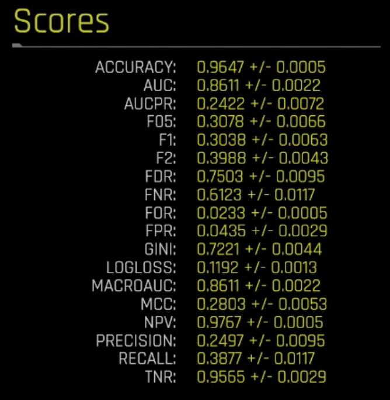

When the experiment was run for this classification model, Driverless AI determined that the best scorer for it was the Logarithmic Loss or **LOGLOSS** due to the imbalanced nature of the dataset. **LOGLOSS** focuses on getting the probabilities right (strongly penalizes wrong probabilities). The selection of Logarithmic Loss makes sense since we want a model that can correctly classify those who are most likely to default while ensuring that those that qualify for a loan get can get one.

Recall that Log loss is the logarithmic loss metric that can be used to evaluate the performance of a binomial or multinomial classifier, where a model with a Log loss of 0 would be the perfect classifier. Our model  scored  a **LOGLOSS value = 0.1192+/- .0013** after testing it with test dataset. From the confusion matrix, we saw that the model had issues classifying perfectly; however, it was able to classify with an **ACCURACY of 0.9647 +/- .0005**. The financial implications of the misclassifications have been covered in the confusion matrix section above.

Driverless AI has the option to change the type of scorer used for the experiment. Recall that for this dataset the scorer was selected to be **LOGLOSS**. An experiment can be re-run with another scorer. For general imbalanced classification problems, AUCPR and MCC scorers are good choices, while F05, F1, and F2 are designed to balance between recall and precision.
The AUC is designed for ranking problems. Gini is similar to the AUC but measures the quality of ranking (inequality) for regression problems. 

In the next few tasks we will explore the scorer further and the **Scores** values in relation to the residual plots.

### References

[1] [Amortization Schedule Calculator](https://investinganswers.com/calculators/loan/amortization-schedule-calculator-what-repayment-schedule-my-mortgage-2859) 

### Deeper Dive and Resources

- [Wiki Confusion Matrix](https://en.wikipedia.org/wiki/Confusion_matrix)

- [Simple guide to confusion matrix](https://www.dataschool.io/simple-guide-to-confusion-matrix-terminology/)

- [Diagnosing a model with Driverless AI](http://docs.h2o.ai/driverless-ai/latest-stable/docs/userguide/diagnosing.html)

## Task 6: ER: ROC

From the Diagnostics page click on the **ROC Curve**. An image similar to the one below will appear:


To review, an ROC curve demonstrates the following:

- It shows the tradeoff between sensitivity (True Positive Rate or TPR) and specificity (1-FPR or False Positive Rate). Any increase in sensitivity will be accompanied by a decrease in specificity.
- The closer the curve follows the upper-left-hand border of the ROC space, the more accurate the model.
- The closer the curve comes to the 45-degree diagonal of the ROC space, the less accurate the model.
- The slope of the tangent line at a cutpoint gives the likelihood ratio (LR) for that value of the test. You can check this out on the graph above.
- The area under the curve is a measure of model accuracy. 

Going back to the Freddie Mac dataset, even though the model was scored with the Logarithmic Loss to penalize for error we can still take a look at the ROC curve results and see if it supports our conclusions from the analysis of the confusion matrix and scores section of the diagnostics page.

1\. Based on the ROC curve that Driverless AI model generated for your experiment, identify the AUC. Recall that a perfect classification model has an AUC of 1.

2\. For each of the following points on the curve, determine the True Positive Rate, False Positive rate, and threshold by hovering over each point below as seen on the image below:
- Best Accuracy 
- Best F1
- Best MCC

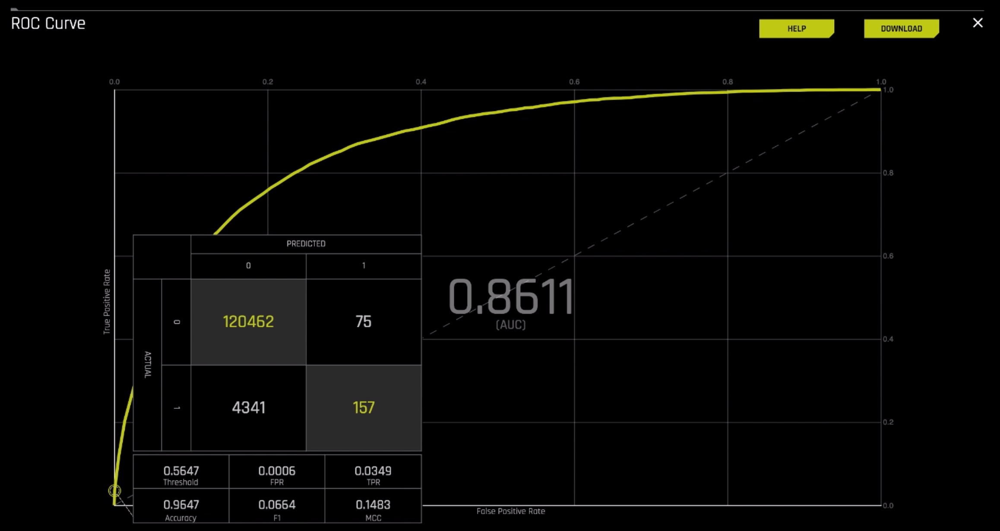

Recall that for a binary classification problem, accuracy is the number of correct predictions made as a ratio of all predictions made.  Probabilities are converted to predicted classes in order to define a threshold. For this model, it was determined that the **best accuracy** is found at **threshold 0.5647**.

At this threshold, the model predicted:
- TP = 157 cases predicted as defaulting and defaulted
- TN = 120,462 cases predicted as not defaulting and did not default
- FP = 75 cases predicted as defaulting and did not default
- FN = 4,341 cases predicted to not default and defaulted


3\.  From the AUC, Best MCC, F1, and Accuracy values from the ROC curve, how would you qualify your model, is it a good or bad model? Use the key points below to help you asses the ROC Curve.


Remember that for the **ROC** curve: 
- The perfect classification model has an AUC of 1
- MCC is measured in the range between -1 and +1 where +1 is the perfect prediction, 0 no better than a random prediction and -1 all incorrect predictions.
- F1 is measured in the range of 0 to 1, where 0 means that there are no true positives, and 1 when there is neither false negatives nor false positives or perfect precision and recall.
- Accuracy is measured in the range of 0 to 1, where 1 is perfect accuracy or perfect classification, and 0 is poor accuracy or poor classification.

**Note:** If you are not sure what AUC, MCC, F1, and Accuracy are or how they are calculated review the concepts section of this tutorial.

### New Model with Same Parameters

In case you were curious and wanted to know if you could improve the accuracy of the model, you could try changing the scorer from Logloss to Accuracy. A question to keep in mind after making this change, **Does changing the scorer from Logloss to Accuracy improve the model's accuracy?**  

1\. To do this, click on the **Experiments**  page.

2\. Click on the experiment you did for task 1 and select **New Model With Same Params**


An image similar to the one below will appear. Note that this page has the same settings as the setting in Task 1. The only difference is that on the **Scorer** section **Logloss** was updated to **Accuracy**. Everything else should remain the same.

3\. If you haven’t done so, select **Accuracy** on the scorer section then select **Launch Experiment**


Similarly to the experiment in Task 1, wait for the experiment to run. After the experiment is done running, a similar page will appear. Note that on the summary located on the bottom right-side both the validation and test scores are no longer being scored by **Logloss** instead by **Accuracy**. 

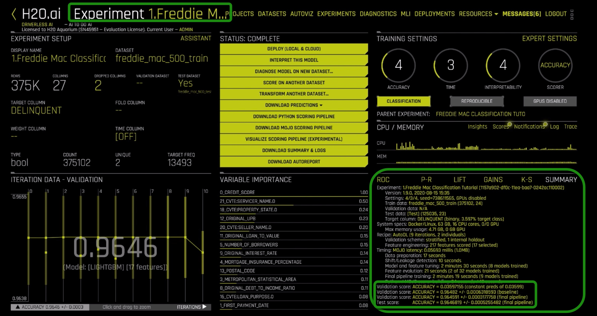

We are going to use this new experiment to run a new diagnostics test. You will need the name of the new experiment. In this case, the experiment name is **1.Freddie Mac Classification Tutorial**. 

4\. Go to the **Diagnostics** tab.

5\. Once in the **Diagnostics** page, select **+Diagnose Model**

6\. In the **Create new model diagnostics** : 

  1. Click on **Diagnosed Experiment**, then select the experiment that you completed in this Task. In this case, the experiment name is **1.Freddie Mac Classification Tutorial** 
  2. Click on **Test Dataset** then select the **freddie_mac_500_test** dataset
  3. Initiate the diagnostics model by clicking on **Launch Diagnostics** 


7\. After the model diagnostics is done running a new diagnostic will appear

8\. Click on the new diagnostics model. On the **Scores** section observe the accuracy value. Compare this Accuracy value to the Accuracy value from task 6. 


9\. Next, locate the new ROC curve and click on it. Hover over the **Best ACC** point on the curve. An image similar to the one below will appear:


How much improvement did we get from optimizing the accuracy via the scorer? 

The new model predicted:
- Threshold = 0.5220
- TP =  173 cases predicted as defaulting and defaulted
- TN = 120,446 cases predicted as not defaulting and did not default
- FP = 91 cases predicted as defaulting and did not default
- FN = 4,325 cases predicted not to default and defaulted

The first model predicted:
- Threshold = 0.5647
- TP = 157 cases predicted as defaulting and defaulted
- TN = 120,462 cases predicted as not defaulting and did not default
- FP = 75 cases predicted as defaulting and did not default
- FN = 4,341 cases predicted to not default and defaulted

The **threshold for best accuracy** changed from **0.5647 for the first diagnostics model** to **0.5220 for the new model**. This decrease in threshold impaired accuracy or the number of correct predictions made as a ratio of all predictions made. Note, however, that while the number of FP's increased, the number of FN's decreased.  We were not able to reduce the number of cases that were predicted to falsy default, but in doing so, we increased the number of FN or cases that were predicted not to default and did.

The takeaway is that there is no win-win; sacrifices need to be made. In the case of accuracy, we increased the number of mortgage loans, especially for those who were denied a mortgage because they were predicted to default when, in reality, they did not. However, we also increased the number of cases that should not have been granted a loan and did.  As a mortgage lender, would you prefer to reduce the number of False Positives or False Negatives?

10\. Exit out of the ROC curve by clicking on the **x** located at the top-right corner of the plot, next to the **Download** option

### Deeper Dive and Resources

- [How and when to use ROC Curves and Precision-Recall Curves for Classification in Python](https://machinelearningmastery.com/roc-curves-and-precision-recall-curves-for-classification-in-python/)

- [ROC Curves and AUC Explained](https://www.youtube.com/watch?time_continue=1&v=OAl6eAyP-yo)
- [Towards Data Science - Understanding AUC- ROC Curve](https://towardsdatascience.com/understanding-auc-roc-curve-68b2303cc9c5)

- [ROC Curves and Under the Curve (AUC) Explained](https://www.youtube.com/watch?v=OAl6eAyP-yo)

- [Introduction to ROC](https://classeval.wordpress.com/introduction/introduction-to-the-roc-receiver-operating-characteristics-plot/)


## Task 7: ER: Prec-Recall

Continuing on the diagnostics page, select the **P-R** curve. The P-R curve should look similar to the one below:

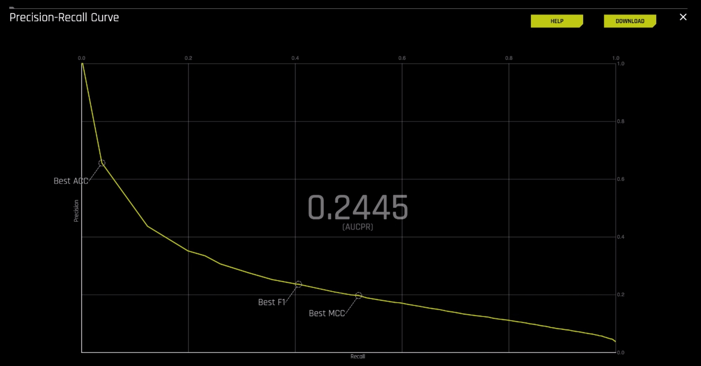

Remember that for the **Prec-Recall**:

- The precision-recall plot uses recall on the x-axis and precision on the y-axis. 
- Recall is identical to sensitivity, and precision is identical to the positive predictive value.
- ROC curves should be used when there are roughly equal numbers of observations for each class.
- Precision-Recall curves should be used when there is a moderate to large class imbalance.
- Similar to ROC, the AUCPR (Area under the curve of Precision-recall curve) is a measure of model accuracy and higher the better. 
- In both the ROC and Prec-recall curve, Driverless AI will indicate points that are the best thresholds for Accuracy (ACC), F1 or MCC (Matthews correlation coefficient).

Looking at the  P-R curve results, is this a good model to determine if a customer will default on their home loan? Let’s take a look at the values found on the P-R curve.

1\. Based on the P-R curve that Driverless AI model generated for you experiment identify the AUC.

2\. For each of the following points on the curve, determine the True Positive Rate, False Positive rate, and threshold by hovering over each point below as seen on the image below:
- Best Accuracy 
- Best F1
- Best MCC


3\.  From the observed AUC, Best MCC, F1 and Accuracy values for P-R, how would you qualify your model, is it a good or bad model? Use the key points below to help you asses the P-R curve.

Remember that for the **P-R** curve :

- The perfect classification model has an AUC of 1
- MCC is measured in the range between -1 and +1 where +1 is the perfect prediction, 0 no better than a random prediction and -1 all incorrect predictions.
- F1 is measured in the range of 0 to 1, where 0 means that there are no true positives, and 1 when there is neither false negatives nor false positives or perfect precision and recall.
- Accuracy is measured in the range of 0 to 1, where 1 is perfect accuracy or perfect classification, and 0 is poor accuracy or poor classification.


**Note:** If you are not sure what AUC, MCC, F1, and Accuracy are or how they are calculated review the concepts section of this tutorial.

### New Model with Same Parameters

Similarly to task 6, we can improve the area under the curve for precision-recall by creating a new model with the same parameters. Note that you need to change the Scorer from **Logloss** to **AUCPR**. You can try this on your own. 

To review how to run a new experiment with the same parameters and a different scorer, follow the step on task 6, section **New Model with Same Parameters**.


**Note:** If you ran the new experiment, go back to the diagnostic for the experiment we were working on.

### Deeper Dive and Resources

- [Towards Data Science Precision vs Recall](https://towardsdatascience.com/precision-vs-recall-386cf9f89488)

- [ML Classification - Precision-Recall Curve](https://www.coursera.org/lecture/ml-classification/precision-recall-curve-rENu8)

- [Introduction to Precision-Recall](https://classeval.wordpress.com/introduction/introduction-to-the-precision-recall-plot/)

## Task 8: ER: Gains

 Continuing on the diagnostics page, select the **CUMULATIVE GAIN** curve. The Gains curve should look similar to the one below:


Remember that for the **Gains** curve:

- A cumulative gains chart is a visual aid for measuring model performance. 
- The y-axis shows the percentage of positive responses. This is a percentage of the total possible positive responses 
- The x-axis shows the percentage of all customers from the Freddie Mac dataset who did not default, which is a fraction of the total cases
- The dashed line is the baseline (overall response rate)
- It helps answer the question of  “What fraction of all observations of the positive target class are in the top predicted 1%, 2%, 10%, etc. (cumulative)?” By definition, the Gains at 100% are 1.0.

**Note:** The y-axis of the plot has been adjusted to represent quantiles, this allows for focus on the quantiles that have the most data and therefore the most impact.

1\. Hover over the various quantile points on the Gains chart to view the quantile percentage and cumulative gain values

2\. What is the cumulative gain at  1%, 2%, 10% quantiles?


For this Gain Chart, if we look at the top 1% of the data, the at-chance model (the dotted diagonal line) tells us that we would have correctly identified 1% of the defaulted mortgage cases. The model generated (yellow curve) shows that it was able to identify about 12% of the defaulted mortgage cases. 

If we hover over to the top 10% of the data, the at-chance model (the dotted diagonal line) tells us that we would have correctly identified 10% of the defaulted mortgage cases. The model generated (yellow curve) says that it was able to identify about 53% of the defaulted mortgage cases. 

3\. Based on the shape of the gain curve and the baseline (white diagonal dashed line) would you consider this a good model? 

Remember that the perfect prediction model starts out pretty steep, and as a rule of thumb the steeper the curve, the higher the gain. The area between the baseline (white diagonal dashed line) and the gain curve (yellow curve) better known as the area under the curve visually shows us how much better our model is than that of the random model. There is always room for improvement. The gain curve can be steeper.

**Note:** If you are not sure what AUC or what the gain chart is, feel free to review the concepts section of this tutorial.

4\. Exit out of the Gains chart by clicking on the **x** located at the top-right corner of the plot, next to the **Download** option

### Deeper Dive and Resources
 
- [Towards Data Science - Understanding and Interpreting Gain and Lift Charts](https://www.datasciencecentral.com/profiles/blogs/understanding-and-interpreting-gain-and-lift-charts)

## Task 9: ER: LIFT

Continuing on the diagnostics page, select the **LIFT** curve. The Lift curve should look similar to the one below:

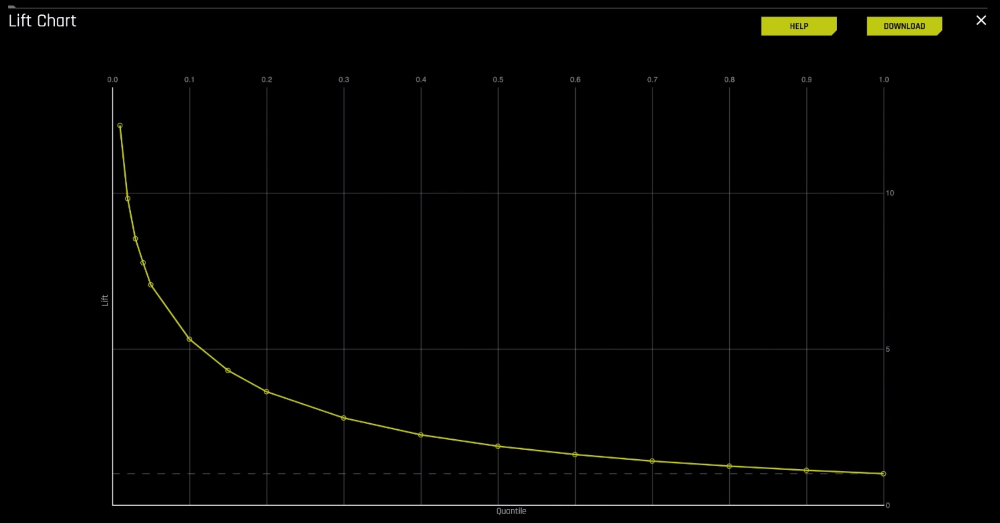

Remember that for the **Lift** curve:

A Lift chart is a visual aid for measuring model performance.

- Lift is a measure of the effectiveness of a predictive model calculated as the ratio between the results obtained with and without the predictive model.
- It is calculated by determining the ratio between the result predicted by our model and the result using no model.
- The greater the area between the lift curve and the baseline, the better the model.
- It helps answer the question of “How many times more observations of the positive target class are in the top predicted 1%, 2%, 10%, etc. (cumulative) compared to selecting observations randomly?” By definition, the Lift at 100% is 1.0.

**Note:**  The y-axis of the plot has been adjusted to represent quantiles, this allows for focus on the quantiles that have the most data and therefore the most impact.


1\. Hover over the various quantile points on the Lift chart to view the quantile percentage and cumulative lift values

2\. What is the cumulative lift at 1%, 2%, 10% quantiles?
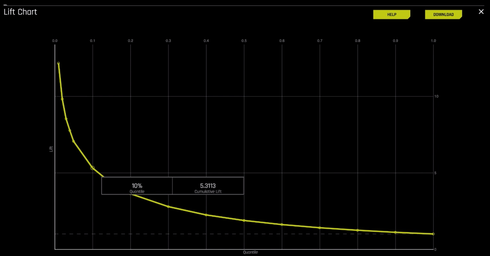
For this Lift Chart, all the predictions were sorted according to decreasing scores generated by the model. In other words, uncertainty increases as the quantile moves to the right. At the 10% quantile, our model predicted a cumulative lift of about 5.3%, meaning that among the top 10% of the cases, there were five times more defaults.

3\. Based on the area between the lift curve and the baseline (white horizontal dashed line) is this a good model?

The area between the baseline (white horizontal dashed line) and the lift curve (yellow curve) better known as the area under the curve visually shows us how much better our model is than that of the random model. 

4\. Exit out of the Lift chart by clicking on the **x** located at the top-right corner of the plot, next to the **Download** option

### Deeper Dive and Resources

- [Towards Data Science - Understanding and Interpreting Gain and Lift Charts](https://www.datasciencecentral.com/profiles/blogs/understanding-and-interpreting-gain-and-lift-charts)


## Task 10: Kolmogorov-Smirnov Chart

Continuing on the diagnostics page, select the **KS** chart. The K-S chart should look similar to the one below:


Remember that for the K-S chart:

- K-S measures the performance of classification models by measuring the degree of separation between positives and negatives for validation or test data.
- The K-S is 100 degrees of separation if the scores partition the population into two separate groups in which one group contains all the positives and the other all the negatives
- If the model cannot differentiate between positives and negatives, then it is as if the model selects cases randomly from the population and the K-S would be 0 degrees of separation.
- The K-S range is between 0 and 1
- The higher the K-S value, the better the model is at separating the positive from negative cases

**Note:** The y-axis of the plot has been adjusted to represent quantiles, this allows for focus on the quantiles that have the most data and therefore the most impact.

1\. Hover over the various quantile points on the Lift chart to view the quantile percentage and cumulative lift values

2\. What is the cumulative lift at 1%, 2%, 10% quantiles?


For this K-S chart, if we look at the top  20% of the data, the at-chance model (the dotted diagonal line) tells us that only 20% of the data was successfully separate between positives and negatives (defaulted and not defaulted). However, with the model it was able to do 0.545 or about 54.5% of the cases were successfully separated between positives and negatives.

3\. Based on the K-S curve(yellow) and the baseline (white diagonal dashed line) is this a good model?


4\. Exit out of the K-S chart by clicking on the **x** located at the top-right corner of the plot, next to the **Download** option

### Deeper Dive and Resources

- [Kolmogorov-Smirnov Test](https://towardsdatascience.com/kolmogorov-smirnov-test-84c92fb4158d)
- [Kolmogorov-Smirnov Goodness of Fit Test](https://www.statisticshowto.datasciencecentral.com/kolmogorov-smirnov-test/)


## Task 11: Experiment AutoDocs

Driverless AI makes it easy to download the results of your experiments, all at the click of a button.  

1\. Let’s explore the auto generated documents for this experiment. On the **Experiment** page select **Download Autoreport**.


This report provides insight into the training data and any detected shifts in distribution, the validation schema selected, model parameter tuning, feature evolution and the final set of features chosen during the experiment.

2\. Open the report .docx file, this auto-generated report contains the following information:
- Experiment Overview
- Data Overview
- Methodology
- Data Sampling
- Validation Strategy
- Model Tuning
- Feature Evolution
- Feature Transformation
- Final Model
- Alternative Models
- Deployment
- Partial Dependence Plots
- Appendix

3\. Take a few minutes to explore the report

4\. Explore Feature Evolution and Feature Transformation, how is this summary different from the summary provided in the **Experiments Page**?
  
    Answer:In the experiment page, you can set the name of your experiment, set up the dataset being used to create an experiment, view the total number of rows and columns of your dataset, drop columns, select a dataset to validate, etc. 

    Different, the experiment summary report contains insight into the training data and any detected shifts in distribution, the validation schema, etc. In particular, when exploring the feature evolution and feature transformation in the summary report, we will encounter the following information: 

    Feature evolution: This summary will detail the algorithms used to create the experiment. 

    Feature transformation: The summary will provide information about automatically engineer new features with high-value features for a given dataset. 


5\. Find the section titled **Final Model** on the report.docx and explore the following items:
- Table titled **Performance of Final Model** and determine the **logloss** final test score
- Validation Confusion Matrix
- Test Confusion Matrix
- Validation and Test ROC, Prec-Recall, lift, and gains plots

### Deeper Dive and Resources

- [H2O’s Summary Report](http://docs.h2o.ai/driverless-ai/latest-stable/docs/userguide/experiment-summary.html?highlight=experiment%20overview)


## Next Steps

Check out the next tutorial : [Machine Learning Interpretability](https://training.h2o.ai/products/tutorial-1c-machine-learning-interpretability-tutorial) where you will learn how to:
- Launch an experiment
- Create ML interpretability report
- Explore explainability concepts such as:
    - Global Shapley
    - Partial Dependence plot
    - Decision tree surrogate
    - K-Lime
    - Local Shapley
    - LOCO
    - Individual conditional Expectation


