# Disparate Impact Analysis  

## Outline
- [Objective](#objective)
- [Prerequisites](#prerequisites)
- [Task 1: Launch Machine Learning Interpretability Experiment](#task-1-launch-machine-learning-interpretability-experiment) 
- [Task 2: Concepts](#task-2-concepts)
- [Task 3: Disparate Impact Analysis](#task-3-disparate-impact-analysis)
- [Task 4: Disparate Impact Analysis](#task-4-disparate-impact-analysis)
- [Task 5: Sensitivity Analysis Part 1: Checking for Bias](#task-5-sensitivity-analysis-part-1-checking-for-bias)
- [Task 6: Sensitivity Analysis Part 2: Checking for Bias](#task-6-sensitivity-analysis-part-2-checking-for-bias)
- [Next Steps](#next-steps)

## Objective

As firms use Machine Learning(ML) to help them around credit/loan-decisions, cross-sell promotions, and determine the next best action, they must know how certain customer features are being weighed into the ML models in production. Further, they are also required to understand whether the ML models are not negatively impacting protected classes of customers or unfairly weighting for these types of classes. A lack of understanding of an ML Model's ins of production can lead to legal and financial risks when discovering that the ML model in production discriminates (bias) against certain ethnicities, genders, etc.

Additionally, as firms have looked to leverage AI to make more and more decisions for the company, the discussion of Human-Centered Machine learning has become increasingly important. Data science practitioners and firms deploying AI in production want to 'get under the hood' of their models to see what impacts decisions. Hence, in this tutorial, we will build an AI model predicting whether someone will be defaulting on their next credit card payment. Right after, we will use the following two Driverless AI tools to analyze and check for fairness. 

- Disparate Impact Analysis (DIA)
- Sensitivity Analysis(SA)

As a matter of speaking, the above two features provide a solution to a common problem in ML: the multiplicity of good models.  It is well understood that for the same set of input features and prediction targets, complex machine learning algorithms can produce multiple accurate models with very similar, but not the same, internal architectures: the multiplicity of good models [1]. This alone is an obstacle to interpretation, but when using these types of tools as interpretation tools or with interpretation tools, it is important to remember that details of explanations can change across multiple accurate models. This instability of explanations is a driving factor behind the presentation of multiple explanatory results in Driverless AI, enabling users to find explanatory information that is consistent across multiple modeling and interpretation techniques. And such explanatory results can be accessed by the **Disparate Impact Analysis** and **Sensitivity Analysis(SA)** features/tools. 

With the above in mind, let us discover how we can better understand our models. 

### References 

- [1] [Jerome Friedman, Trevor Hastie, and Robert Tibshirani. The Elements of Statistical Learning. Springer, New York, 2001.](https://web.stanford.edu/~hastie/ElemStatLearn/printings/ESLII_print12.pdf)


## Prerequisites

You will need the following to be able to do this tutorial:

- Basic knowledge of Machine Learning and Statistics
- Basic knowledge of Driverless AI or doing the [Automatic Machine Learning Introduction with Driverless AI](https://training.h2o.ai/products/tutorial-1a-automatic-machine-learning-introduction-with-driverless-ai) 
- Completion of the following tutorial: [Machine Learning Interpretability](https://training.h2o.ai/products/tutorial-1c-machine-learning-interpretability-tutorial)
- A **Two-Hour Test Drive session**: Test Drive is H2O.ai's Driverless AI on the AWS Cloud. No need to download software. Explore all the features and benefits of the H2O Automatic Learning Platform.
  - Need a **Two-Hour Test Drive** session?Follow the instructions on [this quick tutorial](https://training.h2o.ai/products/tutorial-0-getting-started-with-driverless-ai-test-drive) to get a Test Drive session started. 

**Note:  Aquarium’s Driverless AI Test Drive lab has a license key built-in, so you don’t need to request one to use it. Each Driverless AI Test Drive instance will be available to you for two hours, after which it will terminate. No work will be saved. If you need more time to further explore Driverless AI, you can always launch another Test Drive instance or reach out to our sales team via the [contact us form](https://www.h2o.ai/company/contact/).**

## Task 1: Launch Machine Learning Interpretability Experiment

### About the Dataset

For this exercise, we will use the same credit card default prediction dataset that we used in the first MLI tutorial. This dataset contains information about credit card clients in Taiwan from April 2005 to September 2005. Features include demographic factors, repayment statuses, history of payment, bill statements, and default payments. The data set comes from the [UCI Machine Learning Repository: UCI_Credit_Card.csv](https://archive.ics.uci.edu/ml/datasets/default+of+credit+card+clients#) And this dataset has a total of 25 Features(columns) and 30,000 clients(rows).

### Download Dataset

When looking at the **UCI_Credit_Card.csv**, we can observe that column **PAY_0** was suppose to be named **PAY_1**. Accordingly, we will solve this problem using a data recipe that will change the column's name to **PAY_1**. The data recipe has already been written and can be found [here](https://s3.amazonaws.com/data.h2o.ai/DAI-Tutorials/MLI+Tutorials/uci_credit_card_recipe.py). Download the data recipe and name it ```uci_credit_card_recipe.py```. Make sure it's saved as a **.py** file. 
 
Now upload the data recipe to the Driverless AI dataset's page. In the **DATASETS** page click **+ ADD DATASET(OR DRAG & DROP)** and select **UPLOAD DATA RECIPE**: 

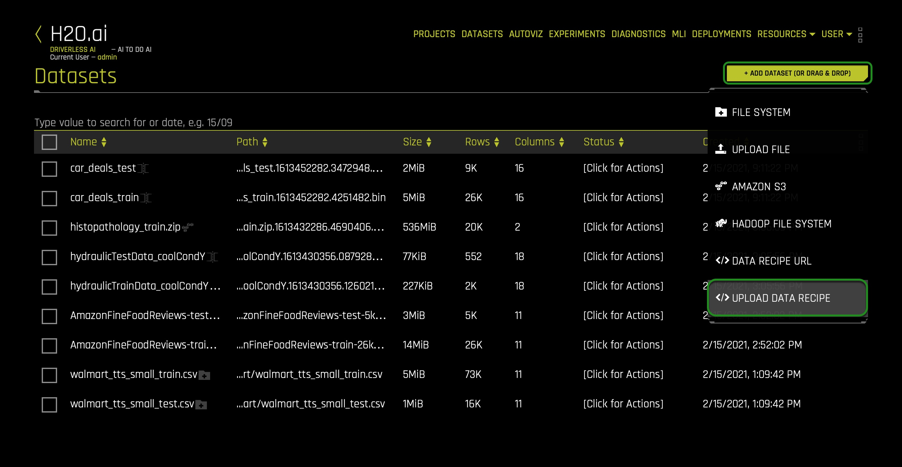

After it imports successfully, you will see the following CSV on the **DATASETS** page: **UCI_Credit_Card.csv**. Click on the ``UCI_Credit_Card.csv`` file then select **Details**:

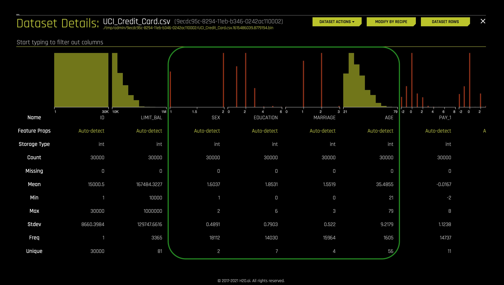

Review the columns in the dataset and pay attention to the specific attributes we will want to keep an eye on, such as **SEX**, **EDUCATION**, **MARRIAGE**, and **AGE**. These demographic factors shouldn't be used when predicting default credit payments. 

- When we think about disparate impact, we want to analyze whether specific classes are being treated unfairly. For example, single/non-college educated clients.


Recall the dataset metrics: 

- **ID** - Row identifier (which will not be used for this experiment)
-  **LIMIT_BAL** - Amount of the given credit: it includes the individual consumer credit and family (supplementary) credit
- **Sex** - Gender (1 =  male; 2 = female)
- **EDUCATION**- Education (1 = graduate school; 2 = university; 3 = high school; 4 = others)
- **MARRIAGE** - Marital status (1 = married; 2 = single; 3 = others)
- **Age**
- **PAY_1 - PAY_6**: History of past payment:
  - -2: No consumption
  - -1: Paid in full 
  - 0: The use of revolving credit
  - 1 = payment delay for one month
  - 2 = payment delay for two months; . . .; 
  - 6 = payment delay for six months
-  **BILL_AMT1 - BILL_AMT6** - Amount of bill statement 
-  **PAY_AMT1 -PAY_AMT6** - Amount of previous payment 
-  **default.payment.next.month** - Default (1: Yes, 0: No)

Return to the Datasets page.

Click on the ``UCI_Credit_Card.csv`` file then select **Predict**. Select **Not Now** on the "First time Driverless AI" dialog box.
- Name your experiment: ```UCI_CC MLI```
- Select the following feature as a Target Column: **default.payment.next.month**


At this point, your experiment preview page should look as follows:


Usually, when predicting default, we will drop attributes such as **SEX**, **EDUCATION**, **MARRIAGE**, **AGE**, and **LIMIT_BALL**. Such features are drop because they shouldn't be considered because of conscious and unconscious bias. Not using such features will prevent decisions from being based on uncontrollable features such as sex. But what if we had no idea a given feature had or could lead to bias and unfairness. How can we find out that using a given feature leads to bias? The answer can be found when analyzing predictions using the Disparate Impact Analysis and Sensitivity Analysis tools. Therefore, we will not drop any columns for now, and let's discover how Driverless AI can perhaps highlight bias features. Not dropping any columns will allow us to understand how we can conclude that a feature is biased when it's not clear that a feature will generate bias when used on an ML model. The idea here is that when we, later on, analyze a feature's level of impact on single or overall predictions, we can decide whether that given feature in question is generating unfair predictions. As a result, we can drop the features found to be biased and, at last, rebuilt a model that is bias-free. 

Again, we will assume that we have no idea that features such as **SEX** can lead to possible unfair predictions when used on particular ML models.  

In the **TRAINING SETTINGS** as shown below: it is essential to make sure the **Interpretability** setting is at **7**. On the left-hand side, verify that **Monotonicity Constraints** is enabled. Enabling **Monotonicity Constraints** is important to Disparate Impact Analysis. If we use an unconstrained model and group fairness metrics, we risk creating group fairness metrics that appear to be reasonable. The consequence of creating group fairness metrics that appear to be reasonable is the illusion that individuals within that group may NOT be treated differently or unfairly. The local (individual) discrimination would likely not appear or be visible in that group metric.

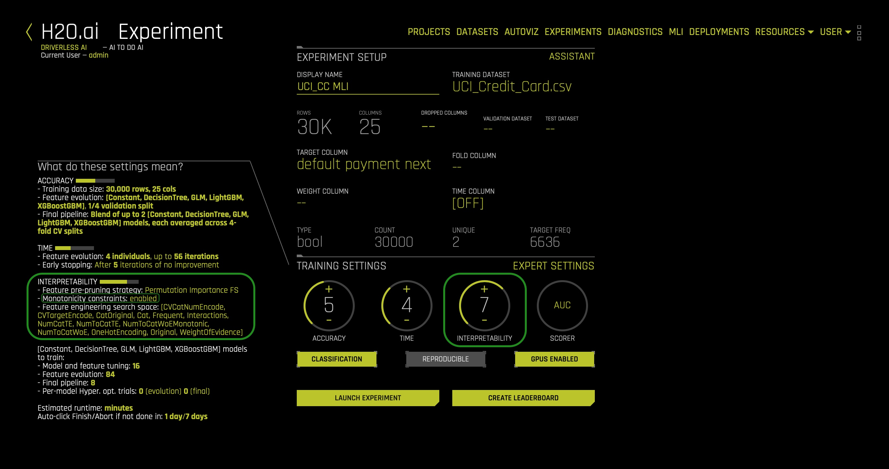

Now we will adjust some settings to our experiment. We will make use of the **Expert Settings** feature to make these adjustments. As discussed in previous tutorials, Driverless AI provides various options in the Expert Settings that let you customize your experiment. Now, click on the **Expert Settings** option, located on the top right corner of the **TRAINING SETTINGS**: 

- In the **EXPERT SETTINGS**, select the model tab, and adjust the settings to create a single *XGBoost GBM Model*: 
  - Turn off all the models besides the **XGBoost GBM Models** setting.
    > XGBoost is a type of gradient boosting method that has been widely successful in recent years due to its good regularization techniques and high accuracy. This is set to Auto by default. If enabled, XGBoost models will become part of the experiment (for both the feature engineering part and the final model).
  
    
  - Then scroll down and adjust the **Ensemble level for final modeling pipeline** setting to 0 for this exercise's interpretability purposes. 

    
  - Click **Save** and return to the experiment preview page.


The last step here is to click **REPRODUCIBLE**, then run the experiment:

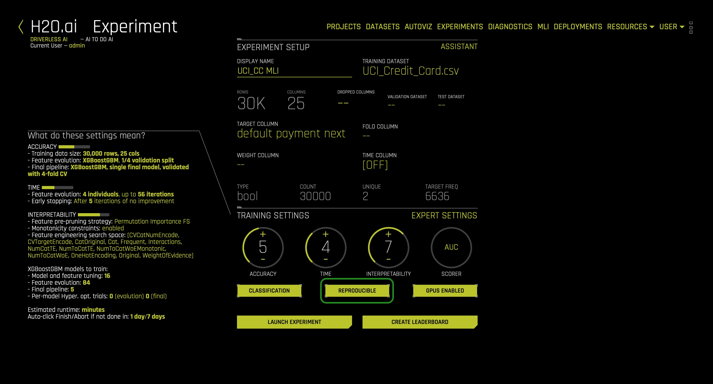

While the experiment runs, let's go over a few concepts that will be crucial when conducting a **Disparate Impact** and **Sensitivity** analysis. 

## Task 2: Concepts

### Fairness & Bias

Fairness in Machine Learning & AI has been a critical focus for many practitioners and industries. The goal at its core is quite simple: ensure your models are not treating one population or group worse than another. However, upon further review, this task becomes more complicated to verify because fairness is not a term with an agreed-upon legal definition. 

In colloquial terms, bias tends to imply that a person has a slightly incorrect or exaggerated opinion on a subject matter based on their personal experience, whether or not that represents the truth. Frequently the term will be used this way in Machine Learning as well. However, it is important to understand bias in a statistical term with a different meaning as well. 

‘In statistics, the **bias** (or **bias function**) of an estimator is the difference between this estimator's expected value and the true value of the parameter being estimated. An estimator or decision rule with zero bias is called **unbiased**. In statistics, "bias" is an **objective** property of an estimator.’[1]

More specifically, to Machine Learning, there is a concept called bias-variance tradeoff that appears often:


<p align="center"> 
    </img>    
</p>

<p align="center"> 
    </img>    
</p>

- Bias is the simplifying assumptions made by the model to make the target function easier to approximate.[2]
- Variance is the amount that the estimate of the target function will change given different training data.[2]
- The goal of any supervised machine learning algorithm is to achieve low bias and low variance. In turn the algorithm should achieve good prediction performance.[2]
  - Linear machine learning algorithms often have a high bias but a low variance.[2]
  - Nonlinear machine learning algorithms often have a low bias but a high variance.[2]
- The parameterization of machine learning algorithms is often a battle to balance out bias and variance.The goal of any supervised machine learning algorithm is to achieve low bias and low variance. In turn the algorithm should achieve good prediction performance.[2]
  - Therefore, trade-off is tension between the error introduced by the bias and the variance.[2]

**Note**: If the theory of fairness and ethics in AI interests you, we have listed some of our favorite resources below on the topic that dives much deeper.

### Disparate Impact Analysis

In most law jurisdictions,  **Disparate Impact** refers to the conscious and unconscious practices adversely impacting one group of people of a protected characteristic more than another. Such characteristics constitute someone's race, color, religion, national origin, sex, and disability status.

When the discussion of ‘fairness’ or ‘ethical AI’ comes up, one of the best possible methodologies for vetting fairness is Disparate Impact Analysis. Disparate Impact Analysis or DIA, which is sometimes called Adverse Impact Analysis, is a way to measure quantitatively the adverse treatment of protected classes, which leads to discrimination in hiring, housing, etc., or in general, any public policy decisions. The regulatory agencies will generally regard a selection rate for any group with less than four-fifths (4/5) or eighty percent of the rate for the group with the highest selection rate as constituting evidence of adverse impact.

### Sensitivity Analysis/What-If Analysis

Sensitivity analysis, sometimes called what-if analysis is a mainstay of model debugging. It’s a very simple and powerful idea: simulate data that you find interesting and see what a model predicts for that data. Because ML models can react in very surprising ways to data they’ve never seen before, it’s safest to test all of your ML models with sensitivity analysis.

**Sensitivity analysis** is the study of how the [uncertainty](https://en.wikipedia.org/wiki/Uncertainty) in the output of a [mathematical model](https://en.wikipedia.org/wiki/Mathematical_model) or system (numerical or otherwise) can be divided and allocated to different sources of uncertainty in its inputs.[3] [4] 

A related practice is [uncertainty analysis](https://en.wikipedia.org/wiki/Uncertainty_analysis), which has a greater focus on [uncertainty quantification](https://en.wikipedia.org/wiki/Uncertainty_quantification) and [propagation of uncertainty](https://en.wikipedia.org/wiki/Propagation_of_uncertainty); ideally, uncertainty and sensitivity analysis should be run in tandem.

One of the simplest and most common approaches is that of changing one-factor-at-a-time (OAT), to see what effect this produces on the output.[5] [6] [7] OAT customarily involves:

- Moving one input variable, keeping others at their baseline (nominal) values, then,
- Returning the variable to its nominal value, then repeating for each of the other inputs in the same way.

Sensitivity may then be measured by monitoring changes in the output, e.g. by [partial derivatives](https://en.wikipedia.org/wiki/Partial_derivatives) or [linear regression](https://en.wikipedia.org/wiki/Linear_regression). 


### Confusion Matrices

It is effortless to assume that the goal is accuracy when using machine learning: the percentage of your predictions being correct. While accuracy can be a useful metric of success, it is often dubious. Let’s build on a very relevant industry example: 

Fraud (Anomaly Detection): Let’s assume we are dealing with a 100,000-row dataset where we know there is some small amount of fraud; let’s say 10. If accuracy is our benchmark, then your model will predict “Not-Fraud” every time, and the accuracy will be 99.99%, but you have failed to identify any instances of fraud. These cases focus on what in a confusion matrix is defined as True Positives (TP):


<p align="center"> 
    </img>    
</p>

In the case of identifying fraud, you would almost always prefer a prediction table like this, to make sure you can correctly identify fraud instances as they occur:

<p align="center"> 
    </img>    
</p>


Now every case is different, and often in business environments, there exist certain cost functions associated with false negatives and false positives, so it is essential to be aware that every case has many considerations. We want to provide a few of the key metrics associated with confusion matrices that come up in the industry, depending on the problem you are trying to solve.

- **Sensitivity, Recall, Hit Rate, True Positive Rate**:
  - True Positive Rate = True Positive / (True Positive + False Negative)
- **Specificity, Selectivity, True Negative Rate**:
  - True Negative Rate = True Negative / (True Negative + False Positive)
- **Precision, Positive Predictive Value**:
  - Precision = True Positives / (True Positive + False Positive)

With this context in mind, let’s move forward and dive into the experiment!


### References

- [1] [Bias of an estimator](https://en.wikipedia.org/wiki/Bias_of_an_estimator)
- [2] Jason Brownlee PhD . ["Gentle Introduction to the Bias-Variance Trade-Off in Machine Learning"](https://machinelearningmastery.com/gentle-introduction-to-the-bias-variance-trade-off-in-machine-learning/). Machine Learning Mastery. October 25, 2019. 
- [3]  Saltelli, A. (2002). ["Sensitivity Analysis for Importance Assessment"](https://en.wikipedia.org/wiki/Sensitivity_analysis#cite_note-Risk_Analysis-1). Risk Analysis. 22 (3): 1–12. CiteSeerX 10.1.1.194.7359. doi:10.1111/0272-4332.00040. PMID 12088235.
- [4]  Saltelli, A.; Ratto, M.; Andres, T.; Campolongo, F.; Cariboni, J.; Gatelli, D.; Saisana, M.; Tarantola, S. (2008). [Global Sensitivity Analysis: The Primer. John Wiley & Sons](https://en.wikipedia.org/wiki/Sensitivity_analysis#cite_note-Primer-2).
- [5] [Sensitivity analysis](https://en.wikipedia.org/wiki/Sensitivity_analysis#cite_note-15)
- [6]  Leamer, Edward E. (1983). ["Let's Take the Con Out of Econometrics"](https://en.wikipedia.org/wiki/Sensitivity_analysis#cite_note-16). American Economic Review. 73 (1): 31–43. JSTOR 1803924.
- [7]  Leamer, Edward E. (1985). ["Sensitivity Analyses Would Help". American Economic Review](https://en.wikipedia.org/wiki/Sensitivity_analysis#cite_note-17). 75 (3): 308–313. JSTOR 1814801.


### Deeper Dive and Resources

- [Mitigating Bias in AI/ML Models with Disparate Impact Analysis …](https://medium.com/@kguruswamy_37814/mitigating-bias-in-ai-ml-models-with-disparate-impact-analysis-9920212ee01c)
- [In Fair Housing Act Case, Supreme Court Backs 'Disparate Impact' Claims](https://www.npr.org/sections/thetwo-way/2015/06/25/417433460/in-fair-housing-act-case-supreme-court-backs-disparate-impact-claims)
- [Fairness and machine learning](https://fairmlbook.org/)
- [50 Years of Test (Un)fairness: Lessons for Machine Learning](https://arxiv.org/pdf/1811.10104.pdf)
- [Biased Algorithms Are Easier to Fix Than Biased People](https://www.nytimes.com/2019/12/06/business/algorithm-bias-fix.html)
- [Discrimination in the Age of Algorithms](https://arxiv.org/abs/1902.03731)
- [Understanding and Reducing Bias in Machine Learning](https://towardsdatascience.com/understanding-and-reducing-bias-in-machine-learning-6565e23900ac)


## Task 3: Disparate Impact Analysis


By now your experiment should be done. Since we are already familiar with the experiment dashboard let’s move forward by selecting the **INTERPRET THIS MODEL** option. If you need to review the Driverless AI UI please refer back to this tutorial: [Automatic Machine Learning Introduction with Driverless AI.](https://training.h2o.ai/products/tutorial-1a-automatic-machine-learning-introduction-with-driverless-ai) 

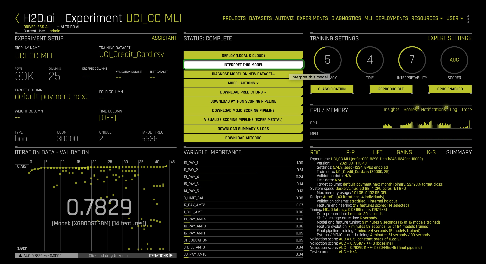


After the model is interpreted, you will be taken to the "MLI: Regression and Classification Explanations" page. The *DAI Model* tab (not to be confused with **DIA**: Disparate Impact Analysis) should already be selected for you thereafter, click on *Disparate Impact Analysis (the DIA tile)*. The following will appear: 


**Note**: This plot is available for binary classification and regression models.

DIA is a technique that is used to evaluate fairness. Bias can be introduced to models during the process of collecting, processing, and labeling data—as a result, it is important to determine whether a model is harming certain users by making a significant number of biased decisions.

DIA typically works by comparing aggregate measurements of unprivileged groups to a privileged group. For instance, the proportion of the unprivileged group that receives the potentially harmful outcome is divided by the proportion of the privileged group that receives the same outcome—the resulting proportion is then used to determine whether the model is biased. Refer to the Summary section to determine if a categorical level  is fair in comparison to the specified reference level and user-defined thresholds(located in the image above). Fairness All is a true or false value that is only true if every category is fair in comparison to the reference level(located in the image above).

Disparate impact testing is best suited for use with constrained models in Driverless AI, such as linear models, monotonic GBMs, or RuleFit. The average group metrics reported in most cases by DIA may miss cases of local discrimination, especially with complex, unconstrained models that can treat individuals very differently based on small changes in their data attributes.

- **Note**: We only enabled a XGBoost GBM Model and we constrained the model by setting the interpretability nob to >= 7. 

DIA allows you to specify a disparate impact variable (the group variable that is analyzed), a reference level (the group level that other groups are compared to), and user-defined thresholds for disparity. Several tables are provided as part of the analysis:

- **Group metrics**: The aggregated metrics calculated per group. For example, true positive rates per group.
- **Group disparity**: This is calculated by dividing the ```metric_for_group``` by the ``reference_group_metric``. Disparity is observed if this value falls outside of the user-defined thresholds.
- **Group parity**: This builds on Group disparity by converting the above calculation to a true or false value by applying the user-defined thresholds to the disparity values.

In accordance with the established four-fifths rule, user-defined thresholds are set to 0.8 and 1.25 by default. These thresholds will generally detect if the model is (on average) treating the non-reference group 20% more or less favorably than the reference group. Users are encouraged to set the user-defined thresholds to align with their organization’s guidance on fairness thresholds.

### Metrics - Binary Classification

The following are formulas for error metrics and parity checks utilized by binary Disparate Impact Analysis. Note that in the tables below:

<p align="center"> 
    </img>    
</p>
<p align="center"> 
    </img>    
</p>


Recall that our current experiment is a classification model, and therefore, the above metrics will be generated by the Disparate Impact Analysis(DIA) tool. In contrast, if it were a regression problem, we will see different metrics. To learn about metrics DIA will generate for a regression experiment, click [here](http://docs.h2o.ai/driverless-ai/latest-stable/docs/userguide/interpret-understanding.html#metrics-regression).

**Note**:

- Although the process of DIA is the same for both classification and regression experiments, the returned information is dependent on the type of experiment being interpreted. An analysis of a regression experiment returns an actual vs. predicted plot, while an analysis of a binary classification experiment returns confusion matrices.
- Users are encouraged to consider the explanation dashboard to understand and augment results from disparate impact analysis. In addition to its established use as a fairness tool, users may want to consider disparate impact for broader model debugging purposes. For example, users can analyze the supplied confusion matrices and group metrics for important, non-demographic features in the Driverless AI model.

With the above in mind, let's continue with our experiment analysis - observe the Global Confusion Matrix for our experiment:

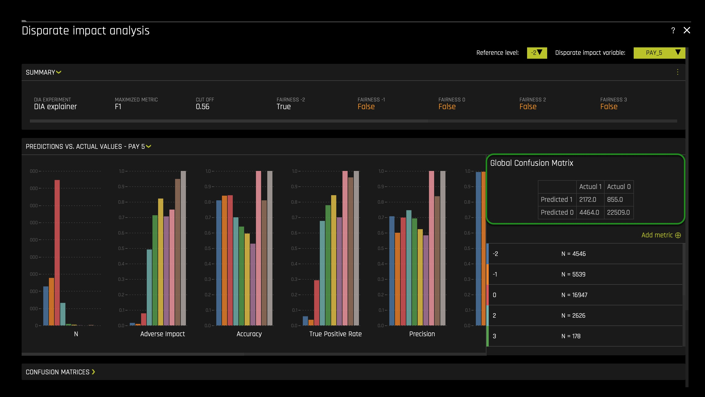


The confusion matrix above is structure as follows: 

  

- Let's put this matrix into perspective by calculating the following values: 
  - **True Positive Rate** = 3091/(3091 + 3545) = **0.4657(46.57%)**
    - probability that an actual positive will test positive
  - **True Negative Rate** = 21301/(21301 + 2063) = **0.911(91.1%)**
    - the probability that an actual negative will test negative
  - **False Negatives** = **3545.0**
  - **False Positive** = **2063.0**

- From the above calculations, we can see that the probability of the prediction being an actual negative is 91.1%. In contrast, the probability of a prediction to be an actual positive is 46.57%, way smaller when compared to the negative probability. The difference between rates is 44.53%. In other words, this, to an extend, tells us that most predictions will be label negative: no default. We also see that the false positive value (wrong default predictions) is a bit high. We also see that the False Negative value(wrong default prediction) is also fairly high. While having False Negatives and False Positives is common, it will not be acceptable to have the False Positives be composed largely by a protective group/class. In particular, it will be wrong if our model is redirecting all False Positives to a given protected class base on a demographic feature. Below we will analyze whether members of a protective class are not being mislabeled because of their unique background.


**Note**: The confusion matrix is base on the **MAXIMIZED METRIC** and **CUT OFF** value found on the summary section: 
- Predictive models often produce probabilities, not decisions. So to make a decision with a model-generated predicted probability for any one client, we need a numeric cutoff which we say a client will default and below which we say they will not default. Cutoffs play a crucial role in DIA as they impact the underlying measurements used to calculate diparity. In fact, tuning cutoffs carefully is a potential remdiation tactic for any discovered disparity. There are many accepted ways to select a cutoff (besides simply using 0.5) and in this experiment Driverless AI has selected a balance between the model's recall (true positive rate) and it's precision using the **F1** statistic. Using precision and recall to select a cutoff is sometimes seen as more robust to imbalanced data than the standard ROC approach. Maximizing **F1** typically results in a good balance between sensitivity and precision. In this experiment, Driverless AI has decided that the best **CUT OFF** value is **0.56**, leading to a maximization of precision and recall. 
- In other words, a Driverless AI model will return probabilities, not predicted classes. To convert probabilities to predicted classes, a cutoff needs to be defined. Driverless AI iterates over possible cutoffs to calculate a confusion matrix for each cutoff. It does this to find the maximum F metric value. Driverless AI’s goal is to continue increasing this maximum F metric.
- The F1 score provides a measure for how well a binary classifier can classify positive cases (using a threshold value). The F1 score is calculated from the harmonic mean of the precision and recall. An F1 score of 1 means both precision and recall are perfect and the model correctly identified all the positive cases and didn’t mark a negative case as a positive case. If either precision or recall are very low it will be reflected with a F1 score closer to 0.
  - F1 equation: F1 = 2((Precision)(Recall)/Precision + Recall)
  - Where:
    - **precision** is the positive observations (true positives) the model correctly identified from all the observations it labeled as positive (the true positives + the false positives).
    - **recall** is the positive observations (true positives) the model correctly identified from all the actual positive cases (the true positives + the false negatives).

In the following task, let's put the above confusion Matrix into perspective in terms, of whether unfairness is present. 

## Task 4: Group Disparity and Parity

To begin our analysis on each feature (column) and determine whether it holds a disparate impact, let's consider the above steps on how it could be determined using DIA. 

### Feature: SEX

First, let us observe the **SEX** feature: 

On the top right corner, click on the **Disparate Impact Variable** button. Select the **SEX** variable: 


On the **Reference Level** button change the value from **2(Female)** to **1(Male)**: 


The following will appear: 


*Things to Note*: 

1. Make sure the **Reference level** is toggled to 1(Male). With DIA the reference level is somewhat ambiguous, but generally, we want to set it to the category or population we believe may be receiving better treatment compared to other classes. In this case, the assumption is that **Males** received better treatment within the financial sector. 

2. From a general observation we can see that base on the **Summary** section: 
  - It looks like the model didn't do well with respect to eliminating bias around **Gender!** The **FAIRNESS 1 (Male)** is **True**, **FAIRNESS 2 (Female)** is **False**, and the **FAIRNESS ALL** is **False** that tells us the model accuracy is only fair to males  — definitely breaking the four-fifth rule.
    - **When conducting a DIA analysis, always refer to the Summary section to determine if a categorical level is fair in comparison to the specified reference level and user-defined thresholds. Fairness All is a true or false value that is only true if every category is fair in comparison to the reference level.**
3. If we had to break this down, the Disparate Impact Analysis basically took model prediction results which was from 11K males, 18k females and looked at various measures such as Accuracy, Adverse Impact, True Positive Rate, Precision, Recall, etc., across both binary classes and then found the ratios are not comparable across the two groups over the cutoff value. The results for the Female was not more than four-fifths of the reference class Male — which means adverse impact by its basic definition.
  - A reminder *Adverse Impact* refers to the following definition: 
    - Adverse impact is the negative effect an unfair and biased selection procedure has on a protected class. It occurs when a protected group is discriminated against during a selection process, like a hiring or promotion decision.[8]  
      - In the US, protected classes include race, sex, age (40 and over), religion, disability status, and veteran status.
- Further, *True Positive Rate* refers to the following definition: 
  - In machine learning, the true positive rate, also referred to sensitivity or recall, is used to measure the percentage of actual positives which are correctly identified.[9]
4. Further we also see a slight population imbalance but not at a worrisome level yet. It will be a problem when the imbalance is huge because it will mean that the model will be learning (through examples) from a particular population or group. Though it could be the case, this slight population imbalance is causing unfairness, but further analysis is required to support such conclusion.  

Scroll down, and let's take a look at **Group Disparity**:


Every time you view the **Group Disparity** table, you will notice that a given row will have all its values equal to **1.00000**: this will be the reference level. In other words, the benchmark (1/Male) should be one as it provides the level to compare. As mentioned on task 3, following the established four-fifths rule, user-defined thresholds are set to 0.8 and 1.25 by default(1). These thresholds will generally detect if the model is (on average) treating the non-reference group 20% more or less favorably than the reference group. Users are encouraged to set the user-defined thresholds to align with their organization's guidance on fair thresholds.


As we observe, across the multiple metrics, we can see that the **False Positive Rate Disparity** is out of range of the **0.8** and **1.25** thresholds(2).  In particular, the **Female** class will be wrongly labeled as default  **0.75619**(~75%) as often as **Male's**. This value of ~75% is out of the acceptable range and will impact the **Male** class, given that it will give the **Male** class a higher **False Positive Rate** while leading to more **Males** being wrongly categorized in terms of default. 


Keep in mind that the default thresholds (the fourth fifths rule) are not widely accepted but are acceptable as default thresholds. Few will argue that there should be 0% disparity rather than 20% and others claim it should be 10% (within 90%). Let's see what will happen if we set the thresholds to generally detect if the model is (on average) treating the non-reference group **10%** more or less favorably than the reference group

Now let’s adjust the **low threshold** to **0.9** and see what happens: 


We can see that if we adjust the low threshold(1), the **Adverse Impact Disparity**(2) and **False Positive Rate Disparity**(2) will become highlighted, saying that if **0.9** is the cutoff, this class (2/Female) will be treated unfairly by the model. The **Adverse Impact Disparity** column says that the model will label **Females** as defaulting **0.82966**(~82%)  as often as **Males** will. In this case, the disparity caluclations between both genders will not be within 10% of each other. Therefore, it seems that such difference has been driven by the **SEX** feature, remember we want the rate of default predictions to be identical for both groups, if not at least be between 10% or 20% from each other's default prediction rates.  

 In other words, **Females** in this model will have a lower probability of being label as default. This can benefit the **Female** class and create a disparity in terms of **Males** receiving a higher default prediction. It can also be a problem because the model will not be able to identify all true cases of default among the **Female** class. And as discussed earlier, the  **False Positive Rate Disparity** will be out of range when the low threshold is **0.8** and will also be out of range when the low threshold is **0.9**(3). 


Now let's look at the **Group Parity** table, but before we do that, change the low threshold to **0.8** in the **Group Disparity** table. 

Let’s scroll down and investigate the **Group Parity** table and check if all classes are being treated fairly by the model under the benchmark thresholds(Four-Fifths rule):


- **Remember the following: The **Group Parity** table is populated by the Group disparity values that are converted to a true or false value by applying the user-defined thresholds(in this case, the thresholds reflect the fourth fifths rule).**

Here we can see what we discover on the **Group Disparity** table. For example, when looking at the **False Positive Rate Disparity**, we see that it has been marked as **False**: no fairness. In particular, note the new row named **All**; this row is **True** or **False**. **True** if its column values are all **True** and **False** when one of the column's values is **False**. 

With the above in mind, we can see that we will have different instances of disparity among the **Female** and **Male** classes when the thresholds reflect the fourth fifths rule or any other higher threshold approximating fairness(0% disparity). Therefore, next time the model is rebuilt with the above new insight, such instances of disparity observe above will not be present on the new model only if the identify warmful feature is removed(Though sometimes, it can be introduced in other forms, for example, through a different feature). 

And what we have done with the **SEX** feature above can be done for every single attribute used on the model. Such a single analysis on each feature can make the process of rebuilding models easier. Easier, in terms 
of approximating a model to fairness every time, we rebuilt the model while keeping in mind what has been learned in the previous iteration. And in this iteration, we have learned that Driverless AI should not use the **SEX** feature in the iteration. 


To analyze the other features, you will only need to scroll back up and change the **Disparate Impact Variable** and **Reference Level**. For example, when changing the **Disparate Impact Variable** to **MARRIGE** or **EDUCATION**, the following will appear: 

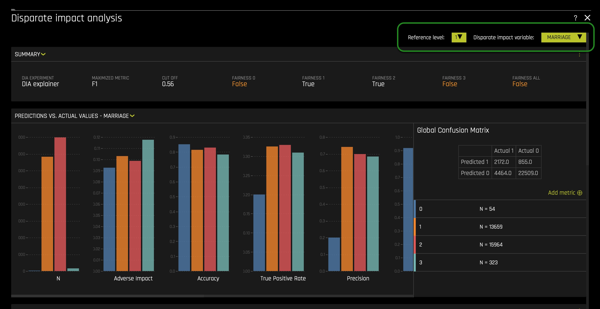
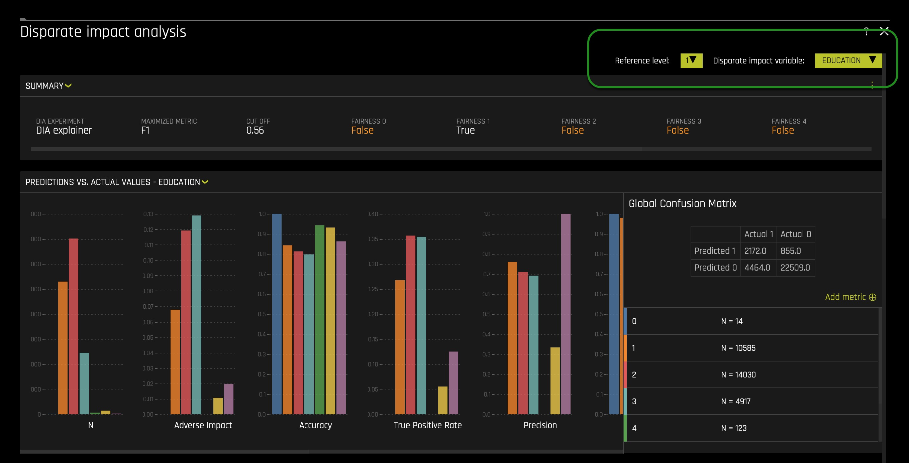


If all demographic factors are dropped and a model is generated, we still need to check that a presumed fair model is not discriminating. Driverless AI allows you to pick the features not used on the Driverless AI experiment(drop columns). For example, you can still choose the **SEX** feature as the **Disparate Impact Variable** in a DIA report, even if it's the case that the **SEX** feature was dropped before the experiment was launch. Such ability to pick features dropped allows you to see if a model is eventually not generating disparity with and without a sensitive feature such as **SEX**. 

To emphasize, let us imaged we ran an experiment, and we dropped all demographic features. Right after, we will be able to generate a DIA Analysis, but the predictions will be based only on the features used. In this scenario, we will like to assume that the model is fair given that it doesn't make use of sensitive features such as demographic factors. Though that might be the case, we can never assume; instead, we need to verify such an assumption. In that case, DIA allows us to select available demographic factors such as **SEX**. In that case, we can see whether the model is creating disparity for certain protective groups.  Therefore, DIA will allow us to see the general or overall impact the model has on protective groups, whether that impact is good or bad. 


Going back to our first discovery, let us see at a local level how the **SEX** feature is playing a crucial role in individual predictions. The local analysis allows us to verify the impact of a given feature but can tell us how much certain feature values impact single predictions. Knowing this can be crucial when proceeding on the next iteration of the model, especially if the goal is to achieve low disparity values. 


After several iterations, a Driverless AI experiment was run similar to the one running in task one. The only difference between the experiment in task one and the final experiment was that it dropped all democratic/sensitive features(columns). Despite dropping demographic features, disparity and bias somehow were introduced to the model(e.g., as shown in the **EDUCATION** and **MARRIAGE** summaries). 
The interesting part is that the columns used in the final model are not known to be biased. For example, **PAY_1** at an empirical observation will not make someone say that **PAY_1** has a bias or can lead to bias. A good way to identify what features lead to bias is by using the **Sensitivity Analysis** tool in conjunction with several surrogate models. 


Note: In the final model iteration, we also dropped **Limit_Bal** because it has some adverse action considerations, this variable is usually dictated internally(by staff members), and therefore, we will also dropped it.

Now let's focus our attention on the **Sensitivity Analysis** tool, and let's discover how it can help us better understand our model on the grounds of fairness and local/single predictions/observations. 


### References

- [8] [WHAT IS ADVERSE IMPACT? AND WHY MEASURING IT MATTERS](https://www.hirevue.com/blog/what-is-adverse-impact-and-why-measuring-it-matters)
- [9] [Encyclopedia of Systems Biology](https://link.springer.com/referenceworkentry/10.1007%2F978-1-4419-9863-7_255)

## Task 5: Sensitivity Analysis Part 1: Checking for Bias

As of now, you should still be on the **Disparate Impact Analysis** page. Click the **X** icon located at the top right corner of the page.  That will take you to the **DAI Model** tab; in there, click the **SA (Sensitivity Analysis)** tile. The following will appear: 

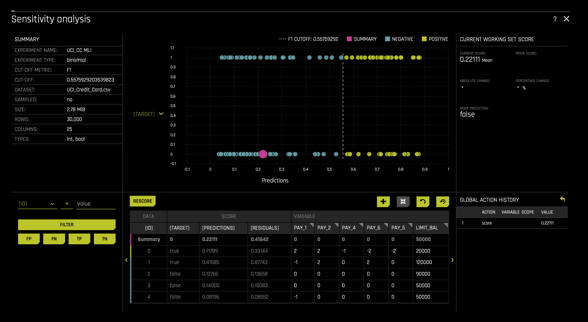

***Note*: The Sensitivity Analysis tool will base its results on our original experiment ran in task one, not from the final model mentioned at the end of the previous task.**

**Note**: Sensitivity Analysis (SA) is not available for multiclass experiments.

Sensitivity Analysis (or “What if?”) is a simple and powerful model debugging, explanation, fairness, and security tool. The idea behind SA is both direct and simple: Score your trained model on a single row, on multiple rows, or on an entire dataset of potentially interesting simulated values and compare the model’s new outcome to the predicted outcome on the original data.

Beyond traditional assessment practices, sensitivity analysis of machine learning model predictions is perhaps the most important validation technique for machine learning models. Sensitivity analysis investigates whether model behavior and outputs remain stable when data is intentionally perturbed or other changes are simulated in the data. Machine learning models can make drastically differing predictions for only minor changes in input variable values. For example, when looking at predictions that determine financial decisions, SA can be used to help you understand the impact of changing the most important input variables and the impact of changing socially sensitive variables (such as Sex, Age, Race, etc.) in the model. If the model changes in reasonable and expected ways when important variable values are changed, this can enhance trust in the model. Similarly, if the model changes to sensitive variables have minimal impact on the model, then this is an indication of fairness in the model predictions.

This page utilizes the [What If Tool](https://pair-code.github.io/what-if-tool/) for displaying the SA information.


The top portion of this page includes:

- A summary of the experiment
- Predictions for a specified column. Change the column on the Y axis to view predictions for that column.
- The current working score set. This updates each time you rescore.

The bottom portion of this page includes:

- A filter tool for filtering the analysis. Choose a different column, predictions, or residuals. Set the filter type (```<```, ```>```, etc.). Choose to filter by False Positive, False Negative, True Positive, or True Negative.
- Scoring chart. Click the Rescore button after applying a filter to update the scoring chart. This chart also allows you to add or remove variables, toggle the main chart aggregation, reset the data, and delete the global history while resetting the data.
- The current history of actions taken on this page. You can delete individual actions by selecting the action and then clicking the Delete button that appears.

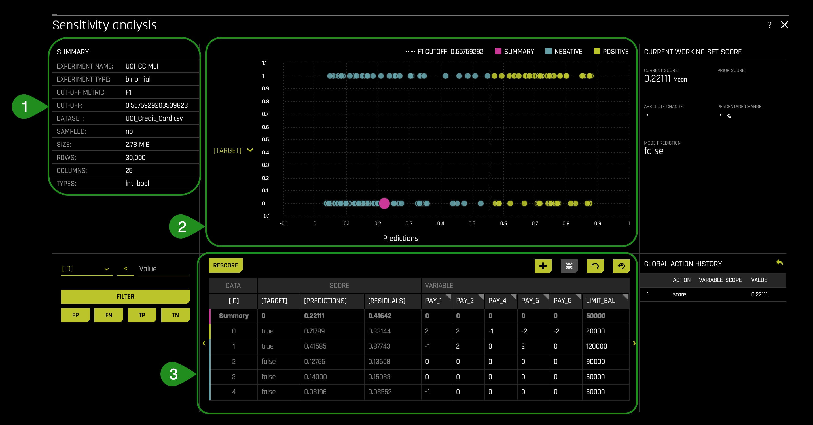

*Things to Note:*

1. In the **Summary** section we can see the cut-off value. Our **CUT-OFF** is **0.557592920...** Anything below the **CUT-OFF** will mean the model predicts a client will not default, while anyone greater than or equal to the **CUT-OFF** will default:

<p align="center"> 
    </img>    
</p>

2. The pink circle indicates that the most common prediction is **False(Negative)**(the pink circle being on the negative side indicates such a conclusion).   

    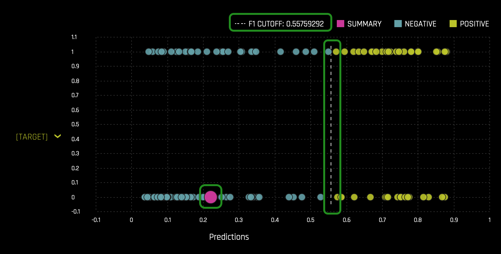

    - The **F1 CUTOFF** indicates that the mean score prediction is **0.55759292**. 

3. The values changed in this chart will lead to the graph above to change (when the chart is rescored):

    

Now that we have familiarized ourselves with the UI let’s experiment! Reminder *Sensitivity Analysis* enables us to tinker with various settings in the data to see if certain features affect the outcome when we know that they should not. Let’s start by adjusting an entire feature.

If you remember from the first MLI tutorial, feature **PAY_1** was extremely important; if not, you can jump back to **RF Feature Importance** and double-check. You can find the **RF Feature Importance**  in the **Surrogate Models** tab. 

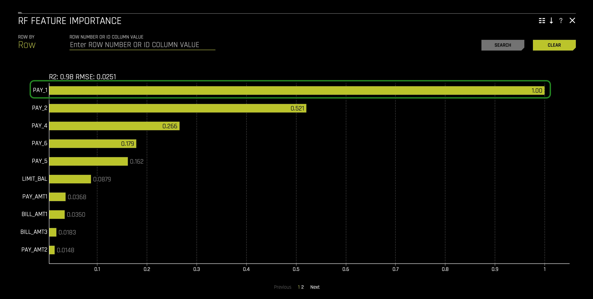

You can also check the **RF Partial Dependence Plot** and see the probability of defaulting increases when PAY_1 is two months late: 

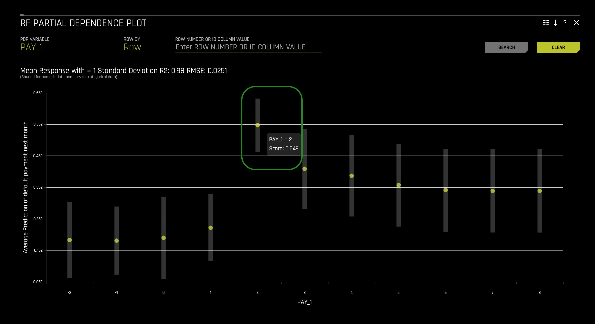

Now that we know that being two months late on PAY_1 is terrible and knowing that the average mean score prediction is **0.55759292**, what will occur if we were to set all clients to have **PAY_1 = 2**? Will the average mean score prediction increase or decrease? 

To set all clients **PAY_1** equal to **2**(months late), please consider the following steps: 

 - Click on top of column name **PAY_1**: 

    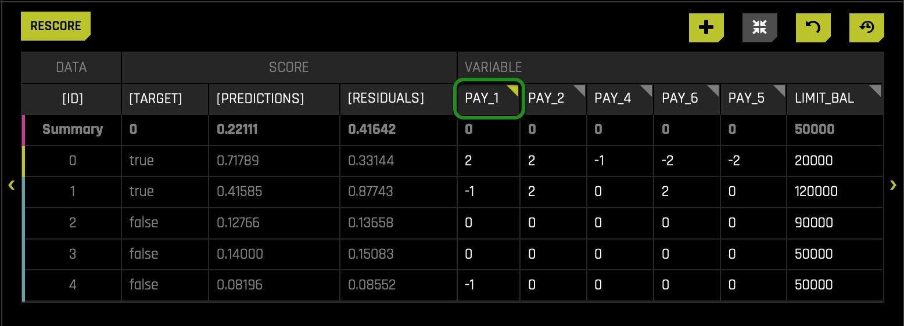

 - A pop-up box will appear, displaying three different radio buttons. Make sure the **absolute** radio button is selected.  In the text box, enter the value **2** (this will represent two months late for all **PAY_1**). Right after, click **SET**:
    - As a reference, the other two options let you change a given value through a relative or percentage value. For example, if the relative option is selected, you can change the value for a given row or all rows by a minus or a plus value. It can be the case that with the relative option, you can increase or decrease all the values for **PAY_1**(e.g., 1 (this will increase every single **PAY_1** by one)).  We will explore the percentage option in a moment. 

    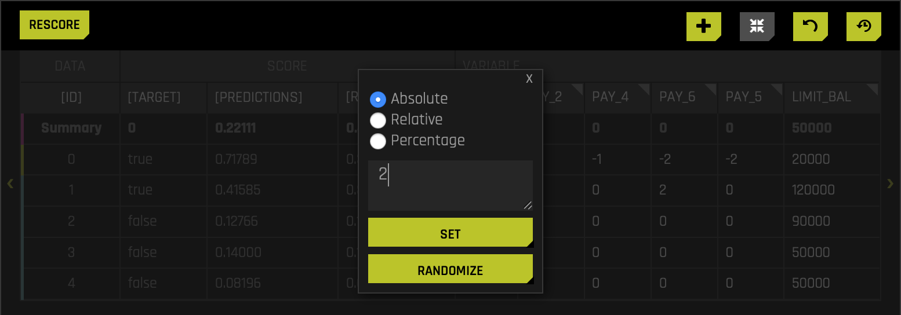

 - Click the **RESCORE** button: 

    

We can check the **Current Working Set Score** section on the right to see a summation of what occurred. In this run, we see that switching all the values for **PAY_1** to **2** led to the doubling of the average mean. As a result, **SA** is now implying that our model would predict more defaults because the perceived probability of default was much higher. Our current score is now *0.53650* from a prior score of **0.22111**. Consequently, the absolute change is **0.31538**, an increase of **142.63%** change. Note that the pink circle moved more to the right and now is closer to the cutoff line. 

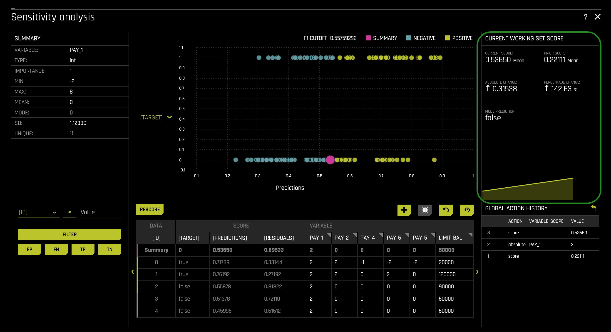


Let's take this one step further and try another adjustment. Let's adjust **PAY_AMT2** to **80%** of what it originally was i.e., let's see what happens to the model when we make our entire population only pay 80% of what they did. Based on the **RF Feature Importance**, **PAY_2** is the second most important feature for predicting if a particular client will default on their next credit card payment. Therefore, the hypothesis is what will happen if we make the payment for **PAY_AMT2** be only 80% (not fully paid). This will affect **PAY_2** given that if a client paid only 80%, the value for **PAY_2** would be marked as not paid fully. As you may notice, the variable **PAY_AMT2** is not on the table, but don't worry, we can add it by following these quick steps: 

- Click on the **Plus** icon, and a box will appear: 

    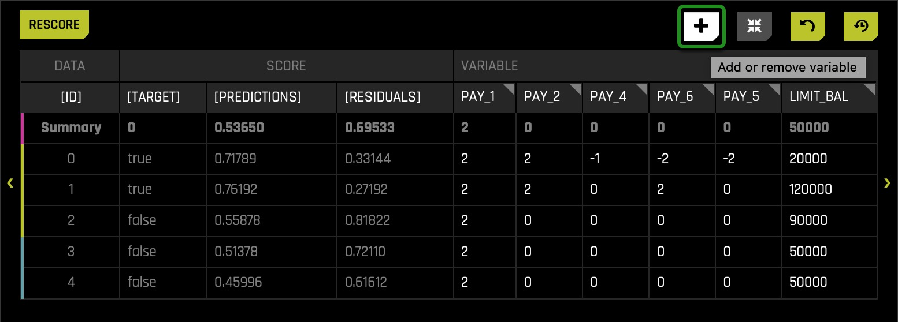

- Select the **PAY_AMT2** variable and click **SET**:

    

- Right after, similar to how we change the value of **PAY_1**, we will click on the **PAY_AMT2** variable. 

 - Select the **Percentage** radio button and set the **Percentage** to **80**(remember that **PAY_AMT1-6** refers to the amount paid for a given payment #). Right after, click **SET**:

    
 
- Click the **RESCORE** button: interestingly enough, when we finish rescoring and review results, we discover that this adjustment had virtually no effect whatsoever. In this case, the absolute change when modifying **PAY_AMT2** is **0.00176**, a **0.33%** increase. It is a crucial consideration in Machine Learning to be aware that there will be many situations where you might think a variable would be important where it is not and vice versa.

  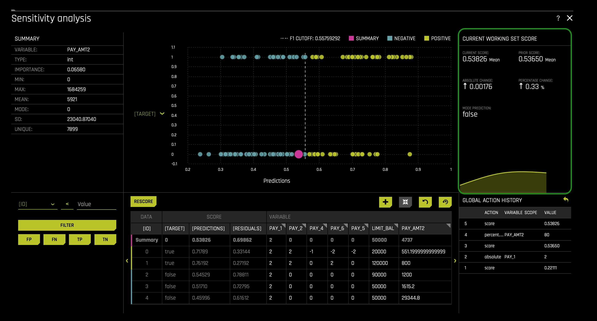

Let's inspect this graph from a different angle, but before, let's restore the original **Sensitivity Analysis** results. Click the reset button located on the bottom right corner of the **Sensitivity Analysis** graph. The reset button removes all edits done to the graph and resets the graph to its original results when it was open for the first time. 


So far, we have verified that **PAY_1**, as suggested by few surrogate models, is the top feature determining predictions.  From a general empirical observation, we would say that it's acceptable to have a feature such as  **PAY_1** be among the top three drivers of predictions. Now let's see what exactly then is generating the bias in our model that made use of all columns under the assumption that we have no clue that certain features can lead to unfairness. Once again, we are doing this to see the process one can take to identify a feature as unfair when it is not obvious that a feature might lead to unfairness.  

## Task 6: Sensitivity Analysis Part 2: Checking for Bias

 For this subsequent analysis, we will tinker with an individual user and see what feature changes might push them over or under the default/approval threshold. There are a few ways to do this, but since we know the cutoff is **0.55759292**, we will try to find a particular customer (blue or yellow circle) very close to the cutoff. Note, there are several ways we can filter to get close to a person close to the cutoff. In this case, I was able to find someone close to the cutoff line by filtering as follows: 

- On the left side of the table (at the bottom of the page), you will be able to locate the filter options. In my case, I selected the **ID** variable and filtered it by **ID < 4**. You can click on top of the three text input lines and change a given variable, operator, and value. 

<p align="center"> 
    </img>    
</p>

 Once you get a narrow range, you should see up close which customers are the closest predictions to the cutoff line, as shown above. In this case, we will experiment with a customer holding the **ID** number **3**: 

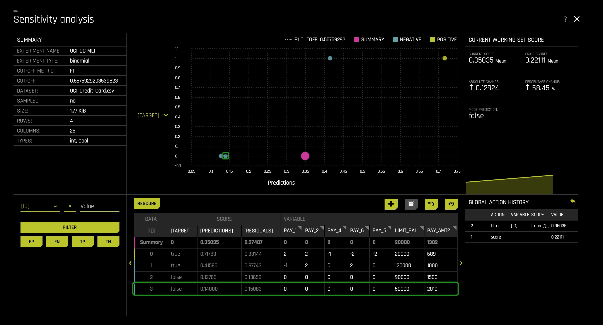

Now let’s see if we can independently adjust some of the demographic features and push customer three over the threshold from negative(not predicted as defaulting) to positive(predicted to default). Since we are discussing fairness and regulatory considerations, let’s adjust the demographic variables to learn more. To choose the demographic variables such as **AGE**, **SEX**, **EDUCATION**, and **MARRIAGE** please consider the following steps: 

- Click the plus icon 
- Select and make sure **EDUCATION**, **AGE**, and **MARRIAGE** are selected 
- Click **SET**

After following the above steps, scroll to the right to see the newly added columns: **SEX**, **EDUCATION**, and **MARRIAGE**: 


Based on what our data dictionary tells us: this is a married college-educated female who was predicted to not default (on next credit card payment). Let’s try adjusting her **education** down and changing marital status to **single**. The assumption here is that in default predictions, single people without a college degree should not be denied credit or be predicted to default just because of this idea of being single and not having a college education. 

**Note:** 

- **Gender** (1 = male, 2 = female)
- **Education** (1 = graduate school, 2 = university, 3 = high school, 4 = others)
- **Marital status** (1 = married, 2 = single, 3 = others) 

To change the **Education** and **Marital Status** values, we will follow the same steps used when we changed **PAY_1** and **PAY_AMT2**.

After lowering the **Education** and setting the **Marital Status** to **Single(2)**, the table displays the following:


Overall the **Sensitivity Analysis** page changes as follows: 

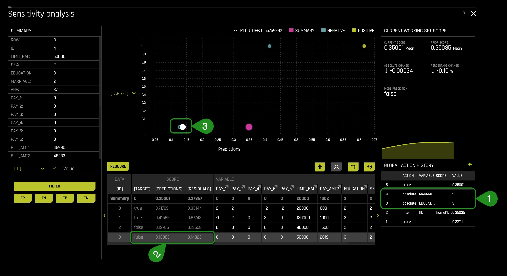

After changing the values(1), we discover the following: as you will see, the prediction is not flipped(2/3), and this is good because a model in production should not have its prediction change because certain sensitive demographic variables have been modified. If it were the case that a prediction would change as a result of manipulating a specific demographic variable, this would tell us that bias has been introduced in our AI model and that will result in legal consequences and penalties for your company or entity. As a result, if bias is present, developers of the AI model should use their technologies or common sense intuition to understand the ins of their model and fix the bias and as questions around; "does this seem ethical? Does this seem logical? These two questions are fundamental questions to ask yourself to provide fairness and avoid legal, ethical, and moral consequences. As well, these questions will guide you to decide on the definition of what is fair in your respective use case of the AI model.  

You might be asking yourself now why then the prediction was not flipped; well, recall that **PAY_1** was the variable that most determine whether someone will default or not. In particular, we also discuss that someone increases its probability of defaulting when **PAY_1 = 2**(months late of payment 1). In other words, in this particular observation(local analysis), we don't see the demographic features creating the disparity observed on task four.

After several iterations, while modifying several demographic values for multiple rows, it was determined that all predictions were not flipped when only modifying demographic values. Therefore, this experiment's demographic features are not why disparity was introduced to the model. Note again: this AI model that we built in task 1 made use of all columns and, therefore, took into consideration the demographic variables. So now the question again is why we kept the demographic columns? Isn't it illegal to make use of such demographic columns in production? And the answer to the second question is "yes," it's illegal. We kept them because we wanted to use sensitive columns and demonstrate how we would use DAI to check for sensitivity around certain variables if we were to use such demographic variables in our AI model in production. Note one should never make use of such columns in production.

From the above, it seems that  **PAY_1** is the ultimate predictor of default and not demographic features; we can assume and perhaps conclude that the following is true: it seems that using **PAY_1** as a predictor leads to a certain level of unacceptable disparity. Let us see what will happen if we change **PAY_1** to be two months late for a client with ID 3: 

You will change the value of **PAY_1** as demonstrated above; make sure it goes from **0** to **2**(instead of clicking on the **PAY_1** column name, you will click on the current value of **PAY_1** for row 3):  

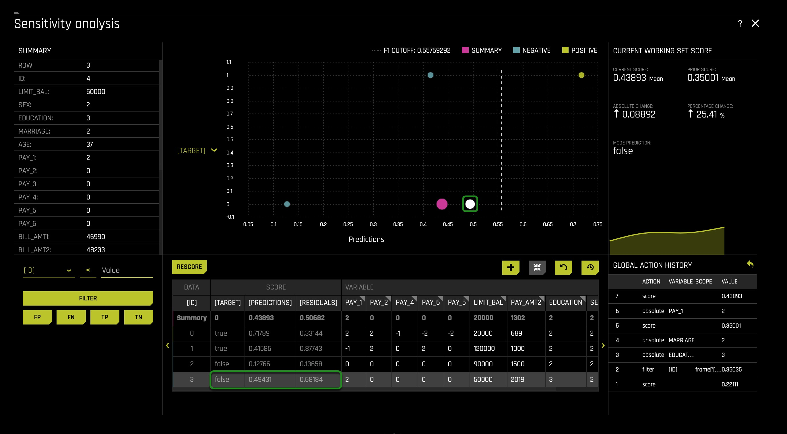

We see that adjusting **PAY_1 = 2** sends the customer very close to the cutoff line and super close to the default zone, showing pretty clear how this one feature can dramatically impact the model for a single client. 

For this particular dataset, the one variable that, for the most part, determines whether someone will default or not is **PAY_1**. In these cases, developing an AI Model is not necessary given that by just looking at **PAY_1**, one can predict in a manner of speaking whether someone will default or not. The question at that point will be whether it will be acceptable to predict default only using  **PAY_1** while generating a certain level of unacceptable disparity. And for the most part, this discussion will be base on what will count as an acceptable level of disparity. Hence, if we were to judge this model based on the fourth fifths rule, we will not use this model with and without demographic features being used. 

Once again, we can use **SA** as a way to analyze several features at first, which might not seem like generators of disparity. In contrast, **DIA** can help us see whether disparity occurs at a general level in reference to confusion matrixes. And such a combination of **DIA** and **SA** can identify and generated better conversations when deciding whether a feature/column should be drop.  

### Conclusion

As mentioned at the beginning of this tutorial, the disparate impact analysis, and sensitivity analysis tool can help you understand your model's inner workings. Due to regulatory pressures and the aggressive adoption of AI in the enterprise, you are now more often required to be able to review and explain the ins of your model. It is worth noting that being able to explain a model after being built is just one component of responsible AI practices. 

## Next Steps

Check out the next tutorial: [Risk Assessment Tools in the World of AI, the Social Sciences, and Humanities](https://training.h2o.ai/products/tutorial-5b-risk-assessment-tools-in-the-world-of-ai-the-social-sciences-and-humanities), where you will learn more about:

 - Disparate Impact Analysis 
 - Sensitivity Analysis 
 - Confusion Matrix
 - Residual Analysis 
 - False Positive Rate
 - True Positive Rate


