# Image Processing in Driverless AI 

## Outline

- [Objective](#objective)
- [Prerequisites](#prerequisites)
- [Task 1: Launch Experiment One: Predict a Car's Price](#task-1-launch-experiment-one-predict-a-car's-price)
- [Task 2: Concepts: Transfer learning from pre-trained models](#task-2-concepts-transfer-learning-from-pre-trained-models)
- [Task 3: First Approach: Embeddings Transformer (Image Vectorizer)](#task-3-first-approach-embeddings-transformer-image-vectorizer)
- [Task 4: Embeddings Transformer (Image Vectorizer) with Fine-tuning](#task-4-embeddings-transformer-image-vectorizer-with-fine-tuning)
- [Task 5: Second Approach: Automatic Image Model](#task-5-second-approach-automatic-image-model)
- [Task 6: Final Analysis ](#task-6-final-analysis)
- [Next Steps](#next-steps)
- [Special Thanks](#special-thanks)

## Objective 

Image processing techniques have become crucial for a diverse range of companies despite their operations in the course of time. In other words, to compete in this global economy, image processing is becoming a requirement for any company hoping to become a credible competitor. Everyone can now see image processing in Agricultural Landscape, Disaster Management, and Biomedical and Other Healthcare Applications. 

With this in mind, and with the hopes to democratize AI, H2O.ai has automated the processes of obtaining high-quality models capable of image processing. 

This tutorial will explore the two different approaches to modeling images in Driverless AI: **Embeddings Transformer(Image Vectorizer)** and **Automatic Image Model**. To lay down the foundations for this tutorial, we will review transfer learning from pre-trained models. Right after, we will illustrate the first image modeling approach by analyzing a pre-built **image model** capable of predicting car prices. Directly after, we will better understand the second approach by analyzing a pre-built **image model** capable of predicting a true case of metastatic cancer. In the final analysis, we will compare and contrast each image modeling approach, and we will discuss several scenarios when a given approach will be better. In particular, and as a point of distinction,  we will discuss how the **Embeddings Transformer** approach only supports a MOJO Scoring Pipeline. Correspondingly, we will discuss how a user can only obtain details about the current best individual model through the **Automatic Image Model** approach. 

All things consider, let us start. 

## Prerequisites 

You will need the following to be able to do this tutorial:

- Basic knowledge of Driverless AI 
- Completion of the following two tutorials: 
    - [Tutorial 1A: Automatic Machine Learning Introduction with Driverless AI](https://training.h2o.ai/products/tutorial-1a-automatic-machine-learning-introduction-with-driverless-ai#tab-product_tab_overview)
    - [Tutorial 1B: Machine Learning Experiment Scoring and Analysis Tutorial - Financial Focus](https://training.h2o.ai/products/tutorial-1b-machine-learning-experiment-scoring-and-analysis-tutorial-financial-focus#tab-product_tab_overview)
- Understanding of Convolutional Neural Networks (CNNs)
- Basic understanding of confusion matrices 

- A **Two-Hour Test Drive session**: Test Drive is [H2O.ai's](https://www.h2o.ai) Driverless AI on the AWS Cloud. No need to download software. Explore all the features and benefits of the H2O Automatic Learning Platform.
  - Need a **Two-Hour Test Drive** session? Follow the instructions on [this](https://training.h2o.ai/products/tutorial-0-getting-started-with-driverless-ai-test-drive#tab-product_tab_overview) quick tutorial to get a Test Drive session started.

**Note: Aquarium’s Driverless AI Test Drive lab has a license key built-in, so you don’t need to request one to use it. Each Driverless AI Test Drive instance will be available to you for two hours, after which it will terminate. No work will be saved. If you need more time to explore Driverless AI further, you can always launch another Test Drive instance or reach out to our sales team via the [contact us form](https://www.h2o.ai/company/contact/).**

## Task 1: Launch Experiment One: Predict a Car's Price 

As mentioned in the **objective** section, we will use three image models, but running each experiment takes time to run. For this reason, all experiments have been built for you and can be found in Driverless AI's **Experiments** section. 

To help us understand the first approach to image processing in Driverless AI, let's look at the following experiment: `Embeddings-Transformer-Without-Fine-Tuning`.We will analyze this experiment in a moment. 

For understanding purposes, let's see how the first experiment was run. Right after, we will follow to understand the dataset and settings used in the first image model; doing so will allow us to understand **Embeddigns Transformer** (the first approach to image processing in Driverless AI).

Our first image model predicts a car's price (again, we will explore the dataset and all settings for this model in a moment). 

If you were to run the experiment, you would take the following steps: 

On the *Datasets page*, import the *Kaggle-MyAutoData-dataset*:

1. Click **+ ADD DATASET (OR DRAG & DROP)**

2. Click **AMAZON S3**

3. In the search bar, paste the following s3 URL: *s3://h2o-public-test-data/bigdata/server/ImageData/car_deals.zip*

    - Before pasting clear anything that might be in the search bar

4. Select the following option: **car_deals.zip [776.5MB]**

5. **CLICK TO IMPORT SELECTION**

    - After the dataset is imported successfully, the new dataset will be under the following name: *car_deals.zip*

On the *Datasets page*: 

6. Click the following dataset:  **car_deals.zip** 

7. Click **SPLIT**

Split the dataset into two sets:

8. Name *OUTPUT NAME 1* as follows:  **car_deals_train**

9. Name *OUTPUT NAME 2* as follows:  **car_deals_test**

10. Change the split value to `.75` by adjusting the slider to 
    `75%` or entering `.75` in the section that says *SELECT SPLIT RATIO(BY ROWS)*

11. **SAVE**

Now, you should see the following two new datasets in the *Datasets Page*: 
    
- *car_deals_train*

- *car_deals_test*

On the *Datasets page*: 

12. Click the following dataset: **car_deals_train**

13. Click **PREDICT**

14. First time using Driverless AI? Click **Yes** to get a tour! Otherwise, click **No**

15. Name you experiment `Embeddings-Transformer-Without-Fine-Tuning`

16. For the *TEST DATASET* select the following dataset: **car_deals_tes**

18. As a target column, select **Price**

20. **LAUNCH EXPERIMENT**

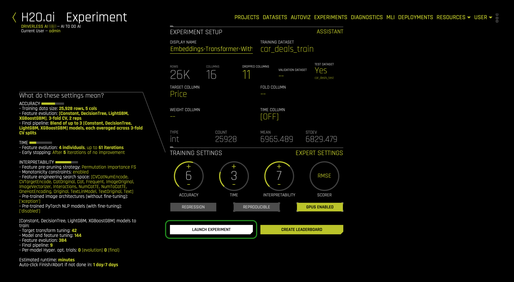

Before we further explore the dataset and settings used in the first image model, let's discuss **transfer learning** concepts from pre-trained models. Concepts that will help us understand **Embeddings Transformer(Image Vectorizer)**. 

## Task 2: Concepts: Transfer learning from pre-trained models

In image classification, the goal is to classify an image based on a set of possible categories. In general, classifying images is a bit hard, but such a difficulty can find ease in **transfer learning**. 

**Transfer learning** allows anyone to build accurate models that make building image models less painful. Transfer Learning allows you to avoid relearning certain patterns again because you can use patterns others learned when solving a similar and different problem. Transfer Learning prevents many from starting from scratch. 

> ''In computer vision, transfer learning is usually expressed through the use of pre-trained models. A pre-trained model is a model that was trained on a large benchmark dataset to solve a problem similar to the one that we want to solve. Accordingly, due to the computational cost of training such models, it is common practice to import and use models from published literature (e.g. VGG, Inception, MobileNet)" (Pedro Marcelino).

For the most part, pre-trained models used in transfer learning are based on large Convolutional Neural Networks (CNNs). Why? Because CNN's have express high performance and easiness in training. In neural networks, CNNs have become essential to the process of face recognition and object detection. In layman's terms, a CNN can take an input image, process it, and classify it under certain categories (Eg., Snake, Cat, Dog, Monkey).

     

    CNN Overview

A typical CNN has two parts:

1. A **Convolutional Base** is structured by a stack of convolutional and pooling layers, and the goal of this stack is to generate features from the image (input). 

2. A **Classifier** is formed by fully connected layers which classify the input image based on the convolutional base's features. The Classifier's goal is to classify the image based on the detected features. 

The following image shows the architecture of a model based on CNNs. It is important to note that this illustration is a simplified version that fits this tutorial's purposes (the illustration doesn't capture the complexity of the model's architecture).  

    Architecture of a model based on CNN.
      </img>    

When you are remodeling a pre-trained model for your tasks, you begin by removing the original Classifier, then you add a new classifier that fits your purposes, and lastly, you fine-tune your model according to one of three strategies: 

     

1. **Stradegy 1**: "Train the entire model. In this case, you use the architecture of the pre-trained model and train it according to your dataset. You're learning the model from scratch, so you'll need a large dataset (and a lot of computational power)."(Pedro Marcelino)

2. **Stradegy 2**:  "Train some layers and leave the others frozen. As you remember, lower layers refer to general features (problem independent), while higher layers refer to specific features (problem dependent). Here, we play with that dichotomy by choosing how much we want to adjust the weights of the network (a frozen layer does not change during training). Usually, if you've a small dataset and a large number of parameters, you'll leave more layers frozen to avoid overfitting. By contrast, if the dataset is large and the number of parameters is small, you can improve your model by training more layers to the new task since overfitting is not an issue."(Pedro Marcelino)

3. **Stradegy 3**: "Freeze the convolutional base. This case corresponds to an extreme situation of the train/freeze trade-off. The main idea is to keep the convolutional base in its original form and then use its outputs to feed the classifier. You're using the pre-trained model as a fixed feature extraction mechanism, which can be useful if you're short on computational power, your dataset is small, and/or pre-trained model solves a problem very similar to the one you want to solve."(Pedro Marcelino)

Accordingly and from a practical perspective, the process of **transfer learning** can be summed up as follows: 

1. ***Select a pre-trained model*** 

When it comes to selecting a pre-trained model - you pick one that looks suitable for your problem. Note, in Driverless AI; you have access to the following set of pre-trained ImageNet models: 

- densenet121
- efficientnetb0
- efficientnetb2
- inception_v3
- mobilenetv2
- resnet34
- resnet50
- seresnet50
- seresnext50
- xception (Selected by default)

The above pre-trained ImagNet Models (CNN architectures), also know as Convolutional Neural Networks, have been pre-trained on the ImageNet dataset. 

ImageNet is a project that aims to label and categorize images into almost 22,000 separate object categories. Through the categorization and labeling of images, ImageNet hopes to make the ImageNet dataset a useful resource for educators, students, and the mission of computer vision research. In the world of deep learning and Convolutional Neural Networks, people often refer to the **ImageNet Large Scale Visual Recognition Challenge** when the term "ImageNet" is mentioned. "The goal of this image classification challenge is to train a model that can correctly classify an input image into 1,000 separate object categories. Models are trained on ~1.2 million training images with another 50,000 images for validation and 100,000 images for testing. These 1,000 image categories represent object classes that we encounter in our day-to-day lives, such as species of dogs, cats, various household objects, vehicle types, and much more."

The ImageNet challenge is now leading in the realm of image classification. This challenge has been dominated by **Convolutional Neural Networks** and **deep learning techniques**. Right now, several networks exist that represent some of the highest performing  **Convolutional Neural Networks** on the **ImageNet challenge**. These networks also demonstrate a strong ability to generalize images outside the ImageNet dataset via transfer learning, such as feature extraction and fine-tuning. That is why Driverless AI can use the mentioned **network architectures** above because of their fine-tuning and feature extraction ability. 

2. ***Classify your problem according to the Size-Similarity Matrix*** 

In the following image, you have 'The Matrix' that controls your choices regarding classifying your problem according to the Size-Similarity Matrix. 

This matrix classifies your computer vision problem considering [your dataset's size] and its similarity to the dataset in which your pre-trained model was trained. [Note that] as a rule of thumb, [a dataset is small if it has less than 1000 images per class]. Regarding dataset similarity, common sense should prevail. For example, if your task is to identify cats and dogs, ImageNet (an image database) would be a similar dataset because it has images of cats and dogs. However, if your task is to identify cancer cells, ImageNet can't be considered a similar dataset.

     

3. **Fine-tune your model**

Here you can use the Size-Similarity Matrix to oversee your selection and then refer to the three alternatives we mentioned before about remodeling a pre-trained model. The following image provides a visual summary of the text that follows.

> **Quadrant 1**. "Large dataset, but different from the pre-trained model’s dataset. This situation will lead you to Strategy 1. Since you have a large dataset, you’re able to train a model from scratch and do whatever you want. Despite the dataset dissimilarity, in practice, it can still be useful to initialise your model from a pre-trained model, using its architecture and weights"(Pedro Marcelino).

> **Quadrant 2**. "Large dataset and similar to the pre-trained model’s dataset. Here you’re in la-la land. Any option works. Probably, the most efficient option is Strategy 2. Since we have a large dataset, overfitting shouldn’t be an issue, so we can learn as much as we want. However, since the datasets are similar, we can save ourselves from a huge training effort by leveraging previous knowledge. Therefore, it should be enough to train the classifier and the top layers of the convolutional base"(Pedro Marcelino).

> **Quadrant 3**. "Small dataset and different from the pre-trained model’s dataset. This is the 2–7 off-suit hand of computer vision problems. Everything is against you. If complaining is not an option, the only hope you have is Strategy 2. It will be hard to find a balance between the number of layers to train and freeze. If you go to deep your model can overfit, if you stay in the shallow end of your model you won’t learn anything useful. Probably, you’ll need to go deeper than in Quadrant 2 and you’ll need to consider data augmentation techniques (a nice summary on data augmentation techniques is provided here)"(Pedro Marcelino).

> **Quadrant 4**. "Small dataset, but similar to the pre-trained model’s dataset. [For this situation, Strategy 3 will work best.] You just need to remove the last fully-connected layer (output layer), run the pre-trained model as a fixed feature extractor, and then use the resulting features to train a new classifier"(Pedro Marcelino).

     

As noted above, models for image classification that result from a transfer learning approach based on **pre-trained convolutional neural networks** are usually composed of two parts. When it comes to the Classifier one can follow several approaches when building the Classifier. For example:

> **Global Average Pooling**: In this approach, instead of adding fully connected layers on top of the convolutional base, we add a global average pooling layer and feed its output directly into the softmax activated layer. 

Other approaches include **Fully-connected layers** and **Linear support vector machines**. 

When it comes to image classification, you don't have to use the transfer learning technique. Therefore, what are the advantages of using transfer learning? 

1. Transfer Learning brings already a certain amount of **performance** before any **training** occurs 

     

2. Transfer learning leads to generalization where the model is prepared to perform well with data it was not trained on

With this task in mind, let us now understand the dataset and settings used in the first experiment; doing so will allow us to understand Embeddigns Transformer (the first approach to image processing in Driverless AI).

## Task 3: First Approach: Embeddings Transformer (Image Vectorizer)

### Embeddings Transformer (Image Vectorizer) without Fine-tuning 

**Embeddings Transformer (Image Vectorizer)** is the first approach to modeling images in Driverless AI. The **Image Vectorizer transformer** utilizes pre-trained **ImageNet** models to convert a column with an image path or URI ((Uniform Resource Identifier)) to an **embeddings** (vector) representation that is derived from the last global average pooling layer of the model. The resulting vector is then used for modeling in Driverless AI. This approach can be use with and without fine-tuning. In a moment, we will further explore the difference between with and without fine-tuning. 

**Notes**:

- "Transformer" refers to a particular type of neural network, in this case, CNN's. 
- This modeling approach supports classification and regression experiments.

In Driverless AI, there are several options in the **Expert Settings** panel that allow you to configure the Image Vectorizer **transformer**. While building the first experiment, note that we never configure the **Image Vectorizer transformer**. The reason being, when Driverless AI detected an image column in our dataset, certain default settings were used for our experiment. To bring the above into a clearer perspective, let us review how we ran our first experiment in task one while, understaing a bit more about **Embeddings Transformer** . 

**Note**: we will only discuss the settings relevant to this tutorial. 

First, let's briefly discuss the multiple methods **Driverless AI** supports for uploading image datasets:

- Archive with images in directories for each class. Labels for each class are created based on the directory hierarchy 
- Archive with images and a CSV file that contains at least one column with relative image paths and a target column(best method for regression)
- CSV file with local paths to the images on the disk 
- CSV file with remote URLs to the images 

Now let's focus on the dataset used for the first experiment: 

1. In the **Datasets** page click the **car_deals_train** dataset

2. Click the **DETAILS** options 

3. In the dataset details page, click the following button located at the top right corner of the page: **DATASET ROWS**

The following should appear: 

When looking at the dataset rows, we will notice that our dataset has columns with different data types (such as images, strings, ints, etc.). That is because this modeling approach (Embeddings Transformer) supports the use of mixed data types (any number of image columns, text columns, numeric or categorical columns).

In the first column (image_id), you will see images. When we **predicted** on the **car_deals_train** dataset, Driverless AI detected the images, and in the **EXPERIMENT SETUP** page, it decided to enable the **Image Transformer setting** (as observed in the image below). In other words, Driverless AI enabled the Image Transformer for the processing of image data. Accordingly, Driverless AI makes use of the first image processing approach when an image column is detected. In a moment, we will discuss how we can tell Driverless AI to use the second approach to image processing. 

To rephrase it, you can specify whether to use pre-trained deep learning models to process image data as part of the feature engineering pipeline. When this is enabled, a column of **Uniform Resources Identifiers (URIs)** to images is converted to a numeric representation using ImageNet pre-trained deep learning models. Again, the Image Transformer is enabled by default. 

When the Image Transformer is enabled, Driverless AI defaults the **xception ImageNet Pretrained Architecture** for the Image Transformer. As mentioned in task 2, Driverless AI offers an array of supported **ImageNet pre-trained architectures** for **image transformer**.(One can find it in the **Expert Settings** under the **Image Tab** under the **Supported ImageNet pre-trained Architecture for Image Transformer** setting(as observed in the image below )) 

The **CNN Xception ImageNet Architecture** is an extension of the Inception Architecture, where the Inception modules have been replaced with depthwise separable convolutions. As an overview, Xception takes the Inception hypothesis to an eXtreme where 1×1 convolutions capture cross-channel (or cross-feature map) correlations. Right after,  spatial correlations within each channel are captured via the regular 3×3 or 5×5 convolutions. Thus, this approach is identical to replacing the Inception module with depthwise separable convolutions. To note, Xception slightly outperforms Inception v3 on the ImageNet dataset and outperforms it on a larger image classification dataset with 17,000 classes. With the above in mind, that is why we say that Xception is an extension of the Inception architecture, which replaces the standard Inception modules with depthwise separable convolutions. To learn more about other architecures please refer to the following article: [Illustrated: 10 CNN Architectures](https://towardsdatascience.com/illustrated-10-cnn-architectures-95d78ace614d#d27e).

**Note**:

- Multiple transformes can be activated at the same time to allow the selection of multiple options. In this case, embeddigns from the different architectures are concatenated together (in a single embedding). 

In terms of which architecture to use, the answer is more complicated than one might think. There are a lot of CNN architectures out there, but how do we choose the best one for our problem? But exactly what is defined as the **best architecture**? Best can mean the simplest or perhaps the most efficient at producing accuracy while reducing computational complexity. Choosing a CNN architecture for your problem also depends on the problem you want to solve, and as of now is known that certain architectures are good and bad for certain problems.  As well, to find the best architecture for your problem, you have to run your problem with several architectures and see which one provides the best efficiency or perhaps the best accuracy while reducing computational complexity. Though I will say that if your dataset is similar to the dataset used to train the architecture, you will discover better results when the datasets are different. 

Besides being able to select the **ImageNet Pretrained architecture** for the **Image transformer**, you can also **Fine-Tune** the ImageNet Pretrained Models used for the Image Transformer. This is disabled by default, and therefore, the fine-tuning technique was not used in our first experiment in task one. In a bit, we will explore a pre-built rerun of the first experiment with fine-tuning enable, and we will see how it impacts our results. But before, let us quickly review what fine-tuning does. 

As mentioned above, we can define a neural network architecture by choosing an existing ImageNet architecture, but how can we avoid the need to train our neural network from scratch? Usually, neural networks are initialized with random weights that reach a level of value that allows the network to classify the image input after a series of epochs are executed. With the just mentioned, the question that must be asked now is what if we could initialize those weights to certain values that we know beforehand are already good to classify a certain dataset. In our case, the car deals dataset. If the weights are predefined to correct values, we will not need to wait for a good number of epochs, and therefore, the weights will have it much more manageable. And the just mentioned above is achieved through transfer learning. Besides transfer learning, this can also be achieved with fine-tuning. 

In the case that our dataset is not similar to the ImageNet dataset or we want to improve the results of our model using ImageNet architectures, we can use fine-tuning. 

When enabling fine-tuning, we are not limited to retrain only the classifier section of the CNN, but we are also able to retrain the feature extraction stage: the convolutional and pooling layers. 

**Note**: In practice, networks are fine-tuned when trained on a large dataset like the ImageNet. In other words, with fine-tuning, we continue the training of the architecture with the smaller dataset we have imported(running back-propagation). Fine-tuning will only work well if the smaller dataset is not so different from the original dataset (ImageNet) our architecture was trained. Once again, the pre-trained model will contain learned features relevant to our classification problem. 

Before we explore a rerun of the first experiment from task one, let us end this task by mentioning one more default setting that was enabled by default during the first experiment. 

Every time we define a classification learning problem with a feature-vector, we are creating a feature space. Consequently, Driverless AI allows you to enable the dimensionality of the feature (embeddings) space by Image Transformer. The following are options that you can choose from: 

- 10
- 25 
- 100 (default)
- 200
- 300

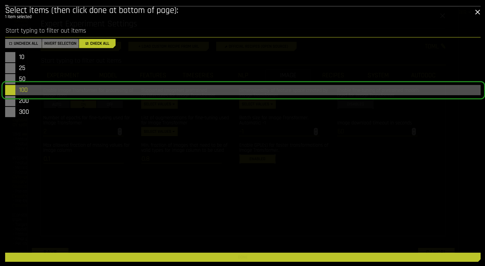

**Note**: You can activate multiple transformers simultaneously to allow the selection of multiple options. 

Other settings exist to configure the **Image Vectorizer transformer,** but we will not cover all of them for this tutorial. Though, we will discuss the other settings in future tutorials. For now, please refer to the Driverless AI documentation [here](https://docs.h2o.ai/driverless-ai/latest-stable/docs/userguide/expert_settings/image_settings.html#image-settings) for more details on the pre-define settings used in our first experiment.

On the point of how our model performed with the auto default settings for **Embeddings Transformer without Fine-tuning**, one can observe the following:

The validation score for the final pipeline is RMSE = 4058.833 +/- 154.7854

- Note: "Root Mean Square Error (RMSE) is the standard deviation of the residuals (prediction errors). 

    - Residuals are a measure of how far from the regression line data points are; RMSE is a measure of how spread out these residuals are. In other words, it tells you how concentrated the data is around the line of best fit."
    - Recall that RMSE is a popular formula to measure a regression model's error rate. However, one can only compare it between models whose errors are measured in the same units.
    - Also, recall that RMSE has the same unit as the dependent variable in our case; our dependent variable(DV) is dollars. Consequently, what will be considered a good RMSE value depends on our DV, and, therefore, there is no absolute good or bad RMSE threshold when DV is not known. 
    - Because the range of our DV is from 1,000 (min) - 97,000(max) our RMSE(4058.833) will be consider small. The smaller the RMSE, in this case, the better. 

In the next section, let's explore the pre-rebuilt experiment from task one, and let's see the impact fine-tuning has on the model's performance.

## Task 4: Embeddings Transformer (Image Vectorizer) with Fine-tuning

The experiment from task one has been rerun already (with fine-tuning) because it takes longer than two hours (once again, the Aquarium test drive only runs for two hours). The experiment has been named `Embeddings-Transformer-With-Fine-Tuning`.

To showcase how fine-tuning was enabled for the first approach to image processing in DAI, observe the steps you can take to rerun the experiment with fine-tuning: 

In the **Experiments** section:

1. Click the **three vertical dots** (located on the right side of the experiment) of the following experiment: `Embeddings-Transformer-Without-Fine-Tuning`

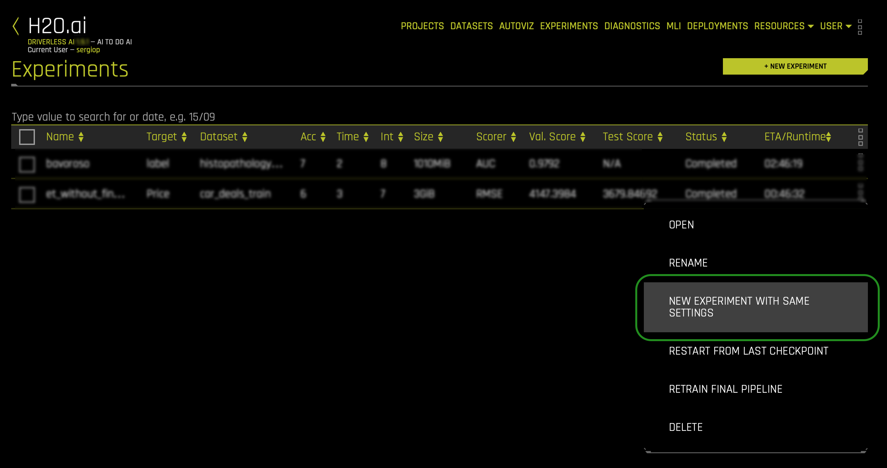

2. Click the following option: **NEW EXPERIMENT WITH SAME SETTINGS**

3. Rename the experiment to `Embeddings-Transformer-With-Fine-Tuning`

4. Under the **IMAGE** tab located in the **EXPERT SETTINGS** click the **DISABLED** button under the following setting: **Enable Fine-tuning of pre-trained models used for image Transformer** 

    - This setting will change from **DISABLED** to **ENABLED** 

5. **LAUNCH EXPERIMENT**

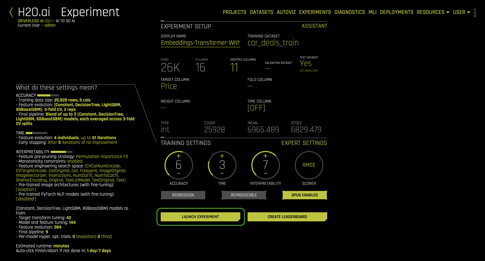 

When fine-tuning is enable, Driverless AI provides a list of possible image augmentations to apply while fine-tuning the **ImageNet pre-trained models** used for the **Image Transformer**. By default, **HorizontalFlip** is enabled, and for purposes of this tutorial, it was not changed.. This default setting can be found and change in the **IMAGE** tab inside the **EXPERT SETTINGS**. Please refer to the Driverless AI documentation right [here](https://docs.h2o.ai/driverless-ai/latest-stable/docs/userguide/expert_settings/image_settings.html#list-of-augmentations-for-fine-tuning-used-for-the-image-transformer) for a full list of all other augmentations. 

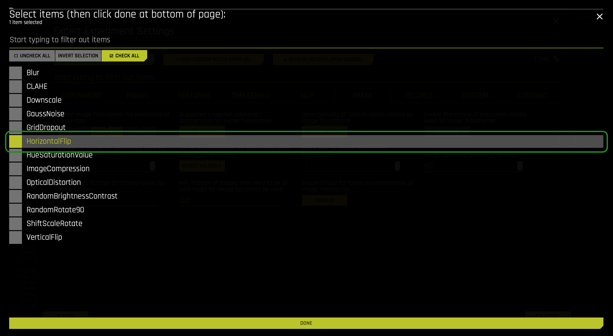

**NOTE**: Augmentations for fine-tuning used for the Image Transformer is only available when Fine-tuning is **enabled**.  

As well, when fine-tuning is enabled, you can specify the number of epochs for fine-tuning **ImageNet pre-trained** models used for the **Image Transformer**. This value defaults to **2**. This default setting can be found and change in the **IMAGE** tab inside the **EXPERT SETTINGS**.

Now that you know how to rerun the experiment with fine-tuning let's explore the new experiment (Embeddings-Transformer-With-Fine-Tuning). 

For our second experiment, we see that the validation score for the final pipeline is RMSE = 4114.0424 +/- 231.9882. Recall that the RMSE for the first experiment was 4058.833 +/- 154.7854. Enabling fine-tuning didn't improve the RMSE; instead, it did the opposite. The RMSE increase by ~55.209.

For the most part, fine-tuning will lead to better results, though there are times when that will not be the case. Performance (an improvement on a scorer) depends on the type of problem you have: If: 

- Our dataset(car_deals_train) is smaller and similar to the original one(ImageNet) - you need to be careful with fine-tuning because it could be the case that other learning models can achieve better results(e.g., SVM). In this case, fine-tuning is not necessary for our car deals dataset. 

- When the new dataset is larger and similar to the original, having more data will not over-fit the model. Therefore, we can say with confidence that fine-tuning can achieve better results. 

In our case, the Xception model has been trained on ~1.2 million training images with another 50,000 images for validation and 100,000 images for testing. Our car_deals_train dataset with 26k images will be considered small. That is why fine-tuning did not improve the RMSE because it could be the case that an SVM or a linear classifier can improve the scorer. 

So how else can we improve the RMSE for the first experiment? Well, if you recall task 2, the following is stated: 

 > "Small dataset, but similar to the pre-trained model's dataset. [For this situation, Strategy 3 will work best.] You just need to remove the last fully-connected layer (output layer), run the pre-trained model as a fixed feature extractor, and then use the resulting features to train a new classifier" (Pedro Marcelino).

 In other words, we don't need to fine-tune in this case. In this case, the score can be improved if we do not edit the convolutional base in its original form and we use its outputs to feed the classifier. Therefore, the Xception model will suffice while only training the model's classification part. 

Now in the next task, let's explore **automatic image model** as the second approach to image processing in Driverless AI. 

## Task 5: Second Approach: Automatic Image Model

**Automatic Image Model** is the second approach to modeling images in Driverless AI. Automatic Image Model is an **AutoML model** that accepts only an image and a label as input features. This Model automatically selects hyperparameters such as learning rate, optimizer, batch size, and image input size. It also automates the training process by selecting the number of epochs, cropping strategy, augmentations, and learning rate scheduler.

Automatic Image Model uses pre-trained ImageNet models and starts the training process from them. The possible architectures list includes all the well-known models: (SE)-ResNe(X)ts; DenseNets; EfficientNets; Inceptions; etc.

Unique **insights** that provide information and sample **images** for the current best individual model are available for the **Automatic Image Model**. These insights are available while an experiment is running or after an experiment is complete. In a moment, we will see how we can use these insights to analyze an experiment predicting true cases of metastatic cancer. 

**Notes**:

- This modeling approach only supports a **single** image column as an input.
- This modeling approach does not support any transformers.
- This modeling approach supports classification and regression experiments.
- This modeling approach does not support the use of mixed data types because of its limitation on input features.
- This modeling approach does not use Genetic Algorithm (GA).
- The use of one or more GPUs is strongly recommended for this modeling approach.

To illustrate how we will use the second approach, let's explore the pre-built experiment predicting true cases of metastatic cancer. Before that, let's see how you can run the experiment while learning how to active **AutoML** when modeling images in Driverless AI. 

In the **Datasets** page: 

1. Import the dataset by selecting the **AMAZON S3** option 

2. Paste the following in the search bar: `s3://h2o-public-test-data/bigdata/server/ImageData/histopathology_train.zip`

3. Selet the followign option: **histopathology_train.zip [488.5MB]**
4. **CLICK TO IMPORT SELECTION**

5. The following dataset should appear on the **Datasets** page: **histopathology_train.zip**

6. Click on the **histopathology_train.zip** and click the **PREDICT** option

7. Name your experiment as follows: `Metastatic Cancer - Automatic Image Model`

8. Select **label** as the **Target Column**  

9. To enable the Automatic **Image** Model, navigate to the *Pipeline Building Recipe* expert setting and select the **image_model** option

    - You can find the *Pipeline Building Recipe* inside the **EXPERIMENT** tab inside the **EXPERT SETTINGS**

    

    

    Right after, a *warning* dialog box will appear stating the following about selecting **image_model**:    

    

    > Based on last changes some settings were automatically updated: 
    > - **Include specific transformers**: ImageOriginalTransfomer 
    > - **Whether to skip failures of transformers**: disabled
    > - **Include specific models**: ImageAutoModel
    > - **last_recipe**: image_model
    > - **Whether to skip failures of models**: disabled 

    
10. In terms of the **training settings**, don't change them; we will use the recommended settings. 

11. **LAUNCH EXPERIMENT**

Now that you know how to run the experiment using the **AutoML** model, let's explore the results and use **insights** to see images and information about the current best individual model for the **Automatic Image Model**. As mentioned, this experiment has been pre-built and can be found in the **Experiment** section.

1. In the **Experiment** section, select the **Metastatic Cancer - Automatic Image Model** experiment the following should appear: 

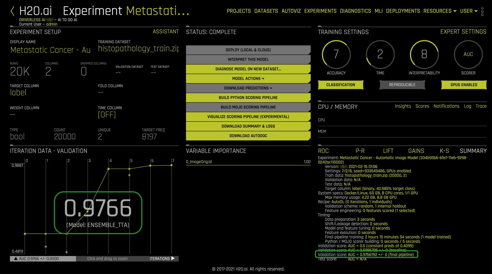

As mentioned above, this second modeling approach only supports a **single** image column as an input. Therefore, let's see the dataset used for the Metastatic cancer experiment. 

1. In the *Datasets* page, click the following dataset: histopathology_train.zip

2. Select the **DETAILS** option 

3. On the top right corner of the page, click **DATASET ROWS**

4. The following will appear: 

As we can see, the images(id) have labels of bool storage type. In this case, True refers to a true case of metastatic cancer, and False refers to a false case of metastatic cancer. 

To further see the difference between the first and second approach to Image processing, let's see how the automated selected settings generated a model to classify metastatic cancer cases (True or False). 

On the bottom right corner of the **complete experiment screen** select the **ROC** graph; the following should appear: 

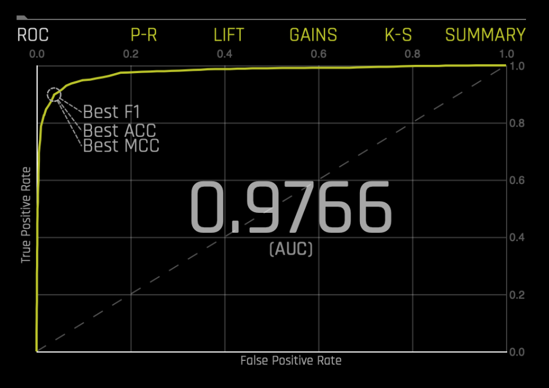

Before we determine whether the AUC (Area under the ROC Curve) is good or bad, consider the following: 

- An AUC value of **0.9 - 1.0** will be considered **Excellent**
- An AUC value of **0.8 - 0.9** will be considered **Very Good**
- An AUC value of **0.7 - 0.8** will be considered **Good**
- An AUC value of **0.6 - 0.7** will be considered **Satisfactory**
- An AUC value of **0.5 - 0.6** will be considered **Unsatisfactory**

With the above in mind, our AUC of **0.9476** will mean that our model is **Excellent**. Note that this model was not tested with a training dataset, and therefore, it could be the case that our AUC can decrease, but for now, it's safe to say that our model is doing a great job at classifying metastatic cancer cases *(True or False)*. Also note, that the difference between the metastatic dataset and the ImageNet dataset didn't prevent good results for this model. 

For this model, the confusion matrix looks as follows:

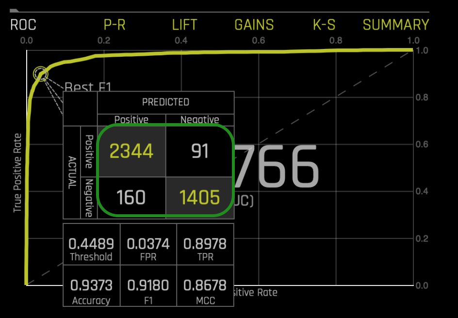

For the most part, having low **False Negatives** and **False Positives** will be considered reasonable. With that in mind, this model will be acceptable. For example, when calculating **accuracy** we see **0.8870((Acc = (TN + TP) / (TN + FP + FN + TP)))**, a high value.

Now let's look at the **Insights** of the current best individual model for the **Automatic Image Model**. On the top right corner of the **complete experiment screen** click **Insights** (training settings area).

The Insights page contains the following about the current best individual model: 

- Best individual hyperparameters - for our model we observe the following: 

    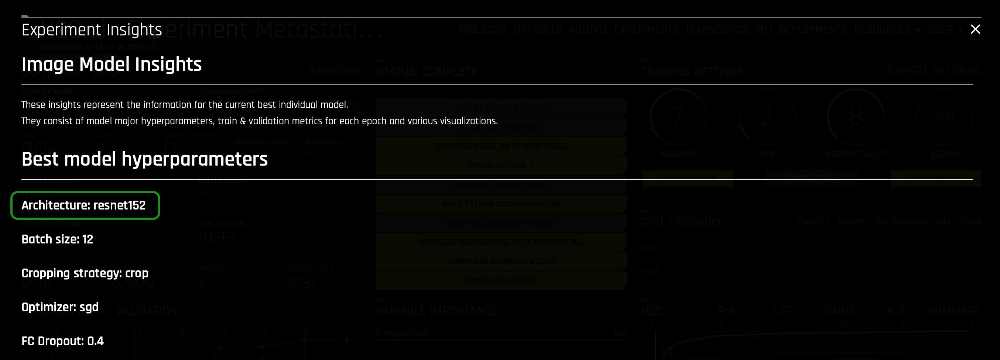

    - **Note**: The **resnet101** architecture (a residual CNN for Image Classification Tasks) is 101 layers deep. This pretrained model has been trained on more than a million images from the ImageNet database. 

- Train and validation loss graph(by epoch) - for our model we observe the following: 

    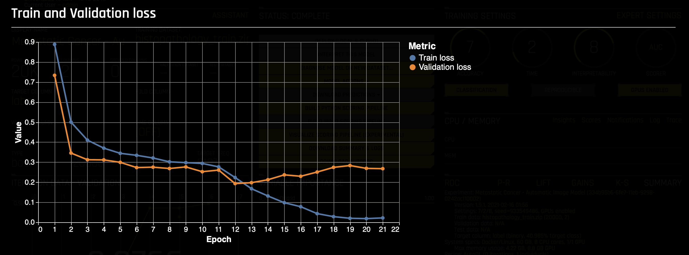

- Validation Scorer graph (by epoch) - for our model we observe the following: 

    

- Sample train and augmented train images - for our model we observe the following: 

    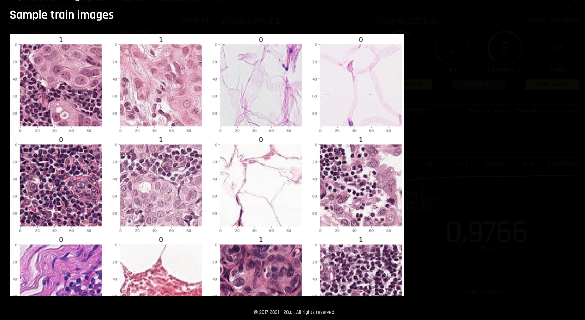

    - **Note**: Zero (0) refers to False and One (1) refers to True  

    

    - **Note**: Image augmentation is a technique that can artificially expand the size of a training dataset by creating modified versions of images in the dataset. To make new images, you can change original images. For example, you can make a new image a little darker; you could cut a piece from the original image, etc. Therefore, you could create an infinite amount of new training samples. For example: 

        

- Sample validation error images - for our model we observe the following: 

    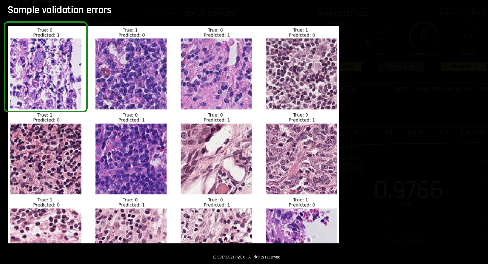

     - The above **sample validation errors** display instances when the model predicted wrongly. For example, the top left corner sample shows the model predicting a False (0) case of metastatic cancer when the **True** is (1). 

- Sample Grad-CAM visualization - For our model we observe the following: 

    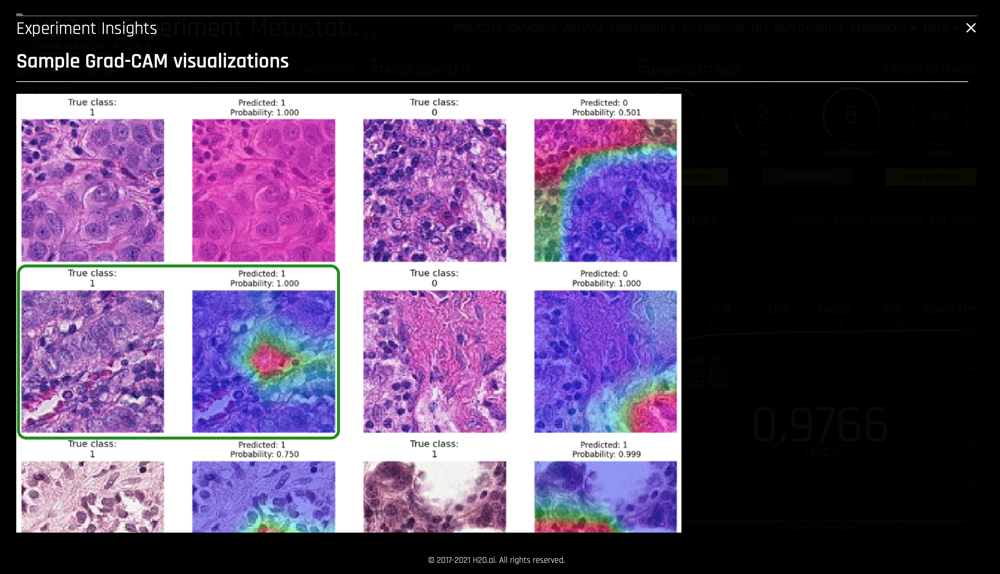

    - The **Grad-CAM** visualization samples allow us to see where the model looked when generating a prediction and probability. In the two pair images on the top left corner, we see the images being label as part of the *True* class (1). In this sample, we see that the model observed the middle left part of the image when deciding that this model belongs to the *True* class and that its probability is 0.852. 

**Note**: For time series and Automatic Image Model experiments, you can view detailed insights while an experiment is running or after an experiment is complete by clicking on the **Insights** option.  

Now in the next task, let's compare and contrast each image modeling approach, and let's discuss several scenarios when a given approach will be better. In particular, and as a point of distinction, let's discuss how, between the two approaches, only the **Embeddings Transformer** approach supports a MOJO Scoring Pipeline. 

## Task 6: Final Analysis 

Under what circumstances a particular approach will be better? When answering this question, consider the following:

- When your classification or regression problem is making use of a mixed data type - you can only use the Embeddings Transformer (Image Vectorizer) approach: 

    - When deciding whether to use it with or without fine-tuning, you can consider what was discussed in tasks 2 and 3. In general, if your dataset is not similar to the ImageNet dataset or we want to improve the results of our model using ImageNet architectures, we can use fine-tuning. 

        - **Without fine-tuning**: the experiment will usually finish faster but has the lowest performance 
        - **With fine-tuning**: the experiment will be a bit slower, but should produce better results  
        - **Automatic Image Model**: the slowest by far, but produces the best results 

- When your dataset image column is crucial to your regression or classification problem, it is best to use the second approach: Automatic Image Model. Hence, if images are not playing a crucial role in your experiment, you can use the Embeddings Transformer.

- **Python scoring** and **C++ MOJO Scoring** are supported for the image transformer.

- Presently, only **Python scoring** is supported for **Automatic Image Model**

With the above in mind, you are ready to generate your Image Models. Note: as of now, Driverless AI supports the following problem types: 

- Embeddings Transformer 
- Classification 
- Regression 

Though in the roadmap, Driverless AI will be able to support the following problem types: 

- Semantic segmentation 
- Object detection 
- Instance segmentation  

## Next Steps: 

To understand more about the **C++ MOJO Scoring**, we recommend checking the following three tutorials in order: 

- [Tutorial 1A: Intro to ML Model Deployment and Management](https://training.h2o.ai/products/tutorial-4a-scoring-pipeline-deployment-introduction#tab-product_tab_overview)
- [Tutorial 4B: Scoring Pipeline Deployment Templates](https://training.h2o.ai/products/tutorial-4b-scoring-pipeline-deployment-templates#tab-product_tab_overview)
- [Tutorial 4D: Scoring Pipeline Deployment in C++ Runtime](https://training.h2o.ai/products/tutorial-4d-scoring-pipeline-deployment-in-c-runtime#tab-product_tab_overview)

To continue with the Driverless AI learning path, consider the next tutorial in the learning path: 

- [Tutorial 3A: Get Started with Open Source Custom Recipes Tutorial](https://training.h2o.ai/products/tutorial-3a-get-started-with-open-source-custom-recipes-tutorial#tab-product_tab_overview)

## Special Thanks: 

