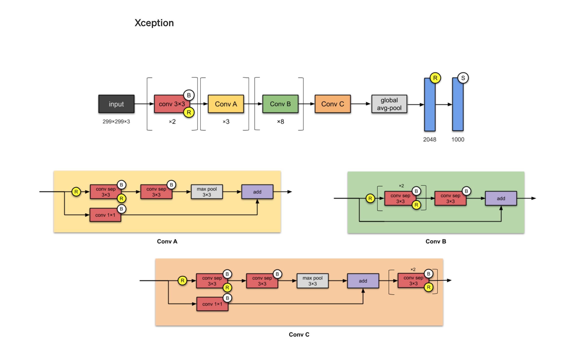
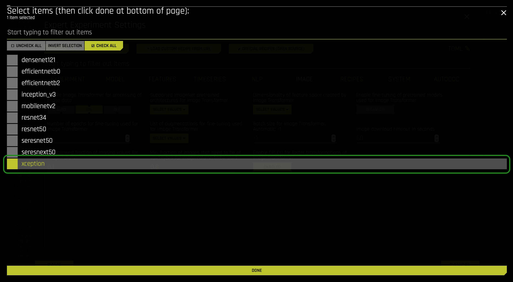
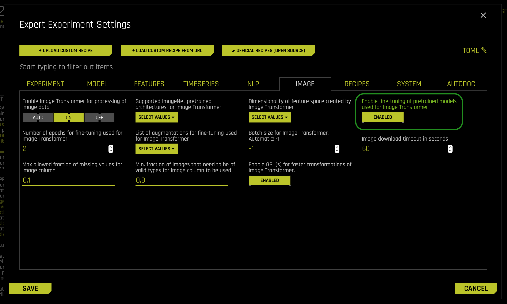
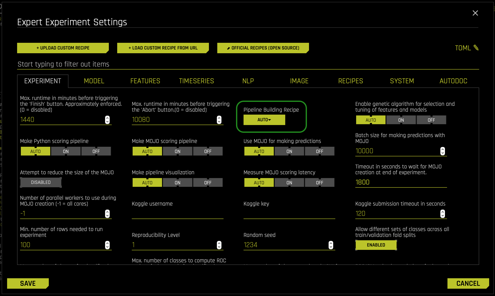
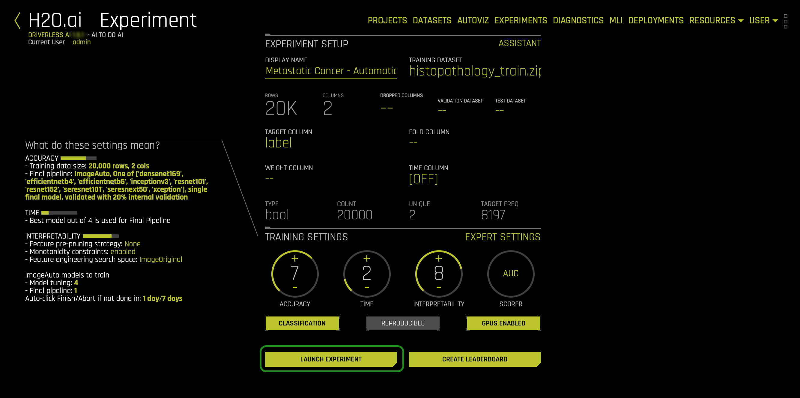

# Image Processing in Driverless AI 

## Outline

- [Objective](#objective)
- [Prerequisites](#prerequisites)
- [Task 1: Launch Experiment One: Predict a Car's Price](#task-1-launch-experiment-one-predict-a-car's-price)
- [Task 2: Concepts: Transfer learning from pre-trained models](#task-2-concepts-transfer-learning-from-pre-trained-models)
- [Task 3: First Approach: Embeddings Transformer (Image Vectorizer)](#task-3-first-approach-embeddings-transformer-image-vectorizer)
- [Task 4: Second Approach: Automatic Image Model](#task-4-second-approach-automatic-image-model)
- [Task 5: ](#task-5-)
- [Task 6: ](#task-6-)
- [Task 7: ](#task-7-)
- [Task 8: ](#Task-8-)
- [Next Steps](#next-steps)
- [Special Thanks](#special-thanks)

## Objective 

Image processing techniques have become crucial for a diverse range of companies despite their operations in the course of time. In other words, to compete in this global economy, image processing is becoming a requirement for any company hoping to become a credible competitor. Everyone can now see image processing in Agricultural Landscape, Disaster Management, and Biomedical and Other Healthcare Applications. 

With this in mind, and with the hopes to democratize AI, H2O.ai has automated the processes of obtaining high-quality models capable of image processing. 

This tutorial will explore the two different approaches to modeling images in Driverless AI: Embeddings Transformer(Image Vectorizer) and Automatic Image Model. To lay down the foundations for this tutorial, we will review transfer learning from pre-trained models. Right after, we will illustrate the first image modeling approach by building an image model capable of predicting car prices. Directly after, we will better understand the second approach by building an image model capable of predicting a true case of metastatic cancer. In the final analysis, we will compare and contrast each image modeling approach, and we will discuss several scenarios when a given approach will be better. In particular, and as a point of distinction,  we will discuss how the Embeddings Transformer approach only supports a MOJO Scoring Pipeline. Correspondingly, we will discuss how a user can only obtain details about the current best individual model through the Automatic Image Model approach. 

All things consider, let us start. 

## Prerequisites 

You will need the following to be able to do this tutorial:

- Basic knowledge of Driverless AI 
- Completion of the 
- Understanding of Convolutional Neural Networks (CNNs)

- A **Two-Hour Test Drive session**: Test Drive is [H2O.ai's](https://www.h2o.ai) Driverless AI on the AWS Cloud. No need to download software. Explore all the features and benefits of the H2O Automatic Learning Platform.
  - Need a **Two-Hour Test Drive** session? Follow the instructions on this quick tutorial to get a Test Drive session started.

**Note: Aquarium’s Driverless AI Test Drive lab has a license key built-in, so you don’t need to request one to use it. Each Driverless AI Test Drive instance will be available to you for two hours, after which it will terminate. No work will be saved. If you need more time to explore Driverless AI further, you can always launch another Test Drive instance or reach out to our sales team via the contact us form.**

## Task 1: Launch Experiment One: Predict a Car's Price 

As mentioned in the **objective** section, we will use three image models, but running each experiment takes time to run. For this reason, 
the experiment that takes the longest to complete has already been built for you and can be found in Driverless AI's **Experiments** section. We will use that pre-built model when exploring the second approach to image processing in Driverless AI. For now, we will follow to build the other two image models that will help us better understand the first approach.

We will start the first experiment so that it can run in the background while we understnad **Transfer Learning**. Right after, we will follow to understand the dataset and settings used in the first image model; doing so will allow us to understand **Embeddigns Transformer** (the first approach to image processing in Driverless AI).

Our first image model will predict a car's price (again, we will explore the dataset and all settings for this model in a moment).  

On the *Datasets page*, import the *Kaggle-MyAutoData-dataset*:

1. Click **+ ADD DATASET (OR DRAG & DROP)**

2. Click **AMAZON S3**

3. In the search bar, paste the following s3 URL: *s3://h2o-public-test-data/bigdata/server/ImageData/car_deals.zip*

    - Before pasting clear anything that might be in the search bar

4. Select the following option: **car_deals.zip [776.5MB]**

5. **CLICK TO IMPORT SELECTION**

    - After the dataset is imported successfully, the new dataset will be under the following name: *car_deals.zip*

On the *Datasets page*: 

6. Click the following dataset:  **car_deals.zip** 

7. Click **SPLIT**

Split the dataset into two sets:

8. Name *OUTPUT NAME 1* as follows:  **car_deals_train**

9. Name *OUTPUT NAME 2* as follows:  **car_deals_test**

10. Change the split value to `.75` by adjusting the slider to 
    `75%` or entering `.75` in the section that says *SELECT SPLIT RATIO(BY ROWS)*

11. **SAVE**

Now, you should see the following two new datasets in the *Datasets Page*: 
    
- *car_deals_train*

- *car_deals_test*

On the *Datasets page*: 

12. Click the following dataset: **car_deals_train**

13. Click **PREDICT**

14. First time using Driverless AI? Click **Yes** to get a tour! Otherwise, click **No**

15. Name you experiment `Embeddings-Transformer-Without-Fine-Tuning`

16. For the *TEST DATASET* select the following dataset: **car_deals_tes**

18. As a target column, select **Price**

20. **LAUNCH EXPERIMENT**

While our experiment runs in the background, let's discuss transfer learning from pre-trained models. 

## Task 2: Concepts: Transfer learning from pre-trained models

In image classification, the goal is to classify an image based on a set of possible categories. In general, classifying images is a bit hard, but such a difficulty can find ease in **transfer learning**. 

**Transfer learning** allows anyone to build accurate models that make building image models less painful. Transfer Learning allows you to avoid relearning certain patterns again because you can use patterns others learned when solving a similar and different problem. Transfer Learning prevents many from starting from scratch. 

> ''In computer vision, transfer learning is usually expressed through the use of pre-trained models. A pre-trained model is a model that was trained on a large benchmark dataset to solve a problem similar to the one that we want to solve. Accordingly, due to the computational cost of training such models, it is common practice to import and use models from published literature (e.g. VGG, Inception, MobileNet)" (Pedro Marcelino).

For the most part, pre-trained models used in transfer learning are based on large Convolutional Neural Networks (CNNs). Why? Because CNN's have express high performance and easiness in training. In neural networks, CNNs have become essential to the process of face recognition and object detection. In layman's terms, a CNN can take an input image, process it, and classify it under certain categories (Eg., Snake, Cat, Dog, Monkey).

     

    CNN Overview

A typical CNN has two parts:

1. A **Convolutional Base** is structured by a stack of convolutional and pooling layers, and the goal of this stack is to generate features from the image (input). 

2. A **Classifier** is formed by fully connected layers which classify the input image based on the convolutional base's features. The Classifier's goal is to classify the image based on the detected features. 

The following image shows the architecture of a model based on CNNs. It is important to note that this illustration is a simplified version that fits this text's purposes (the illustration doesn't capture the complexity of the model's architecture).  

    Architecture of a model based on CNN.
      </img>    

When you are remodeling a pre-trained model for your tasks, you begin by removing the original Classifier, then you add a new classifier that fits your purposes, and lastly, you fine-tune your model according to one of three strategies: 

     

Accordingly and from a practical perspective, the process of **transfer learning** can be summed up as follows: 

1. ***Select a pre-trained model*** 

When it comes to selecting a pre-trained model - you pick one that looks suitable for your problem. Note, in Driverless AI; you have access to the following set of pre-trained ImageNet models: 

- densenet121
- efficientnetb0
- efficientnetb2
- inception_v3
- mobilenetv2
- resnet34
- resnet50
- seresnet50
- seresnext50
- xception (Selected by default)

The above pre-trained ImagNet Models (CNN architectures), also know as Convolutional Neural Networks, have been pre-trained on the ImageNet dataset. 

ImageNet is a project that aims to label and categorize images into almost 22,000 separate object categories. Through the categorization and labeling of images, ImageNet hopes to make the ImageNet dataset a useful resource for educators, students, and the mission of computer vision research. In the world of deep learning and Convolutional Neural Networks, people often refer to the **ImageNet Large Scale Visual Recognition Challenge** when the term "ImageNet" is mentioned. 
"The goal of this image classification challenge is to train a model that can correctly classify an input image into 1,000 separate object categories. Models are trained on ~1.2 million training images with another 50,000 images for validation and 100,000 images for testing.
These 1,000 image categories represent object classes that we encounter in our day-to-day lives, such as species of dogs, cats, various household objects, vehicle types, and much more."

The ImageNet challenge is now leading in the realm of image classification. This challenge has been dominated by **Convolutional Neural Networks** and **deep learning techniques**. Right now, several networks exist that represent some of the highest performing  **Convolutional Neural Networks** on the **ImageNet challenge**. These networks also demonstrate a strong ability to generalize to images outside the ImageNet dataset via transfer learning, such as feature extraction and fine-tuning. That is why Driverless AI can use the mentioned **network architectures** above because of their fine-tuning and feature extraction ability. 

2. ***Classify your problem according to the Size-Similarity Matrix*** 

In the following image, you have 'The Matrix' that controls your choices regarding classifying your problem according to the Size-Similarity Matrix. 

> This matrix classifies your computer vision problem considering [your dataset's size] and its similarity to the dataset in which your pre-trained model was trained. [Note that] as a rule of thumb, [a dataset is small if it has less than 1000 images per class]. Regarding dataset similarity, common sense should prevail. For example, if your task is to identify cats and dogs, ImageNet (an image database) would be a similar dataset because it has images of cats and dogs. However, if your task is to identify cancer cells, ImageNet can't be considered a similar dataset.

     

3. **Fine-tune your model**

Here you can use the Size-Similarity Matrix to oversee your selection and then refer to the three alternatives we mentioned before about remodeling a pre-trained model. The following image provides a visual summary of the text that follows.

> **Quadrant 1**. "Large dataset, but different from the pre-trained model’s dataset. This situation will lead you to Strategy 1. Since you have a large dataset, you’re able to train a model from scratch and do whatever you want. Despite the dataset dissimilarity, in practice, it can still be useful to initialise your model from a pre-trained model, using its architecture and weights"(Pedro Marcelino).

> **Quadrant 2**. "Large dataset and similar to the pre-trained model’s dataset. Here you’re in la-la land. Any option works. Probably, the most efficient option is Strategy 2. Since we have a large dataset, overfitting shouldn’t be an issue, so we can learn as much as we want. However, since the datasets are similar, we can save ourselves from a huge training effort by leveraging previous knowledge. Therefore, it should be enough to train the classifier and the top layers of the convolutional base"(Pedro Marcelino).

> **Quadrant 3**. "Small dataset and different from the pre-trained model’s dataset. This is the 2–7 off-suit hand of computer vision problems. Everything is against you. If complaining is not an option, the only hope you have is Strategy 2. It will be hard to find a balance between the number of layers to train and freeze. If you go to deep your model can overfit, if you stay in the shallow end of your model you won’t learn anything useful. Probably, you’ll need to go deeper than in Quadrant 2 and you’ll need to consider data augmentation techniques (a nice summary on data augmentation techniques is provided here)"(Pedro Marcelino).

> **Quadrant 4**. "Small dataset, but similar to the pre-trained model’s dataset. [For this situation, Strategy 3 will work best.] You just need to remove the last fully-connected layer (output layer), run the pre-trained model as a fixed feature extractor, and then use the resulting features to train a new classifier"(Pedro Marcelino).

     

As noted above, models for image classification that result from a transfer learning approach based on **pre-trained convolutional neural networks** are usually composed of two parts. When it comes to the Classifier one can follow several approaches when building the Classifier. For example:

> **Global Average Pooling**: In this approach, instead of adding fully connected layers on top of the convolutional base, we add a global average pooling layer and feed its output directly into the softmax activated layer. 

Other approaches include **Fully-connected layers** and **Linear support vector machines**. 

When it comes to image classification, you don't have to use the transfer learning technique. Therefore, what are the advantages of using transfer learning? 

1. Transfer Learning brings already a certain amount of **performance** before any **training** occurs 

     

2. Transfer learning leads to generalization where the model is prepared to perform well with data it was not trained on

With this task in mind, let us now understand the dataset and settings used in the first experiment; doing so will allow us to understand Embeddigns Transformer (the first approach to image processing in Driverless AI).

## Task 3: First Approach: Embeddings Transformer (Image Vectorizer)

### Embeddings Transformer (Image Vectorizer) without Fine-tuning 

The **Image Vectorizer transformer** utilizes pre-trained **ImageNet** models to convert a column with an image path or URI ((Uniform Resource Identifier)) to an **embeddings** (vector) representation that is derived from the last global average pooling layer of the model. The resulting vector is then used for modeling in Driverless AI. This approach can be use with and without fine-tuning. In a moment, we will further explore the difference between with and without fine-tuning. 

**Note**:

- "Transformer" refers to a particular type of neural network, in this case, CNN's. 
- This modeling approach supports classification and regression experiments.

In Driverless AI, there are several options in the **Expert Settings** panel that allow you to configure the Image Vectorizer **transformer**. While building the first experiment, note that we never configure the **Image Vectorizer transformer**. The reason being, when Driverless AI detected an image column in our dataset, certain default settings were used for our experiment. To bring the above into a clearer perspective, let us review how we ran our first experiment in task one while, understaing a bit more about **Embeddings Transformer** . 

**Note**: we will only discuss the settings relevant to this tutorial. 

First, let's briefly discuss the multiple methods **Driverless AI** supports for uploading image datasets:

- Archive with images in directories for each class. Labels for each class are created based on the directory hierarchy 
- Archive with images and a CSV file that contains at least one column with relative image paths and a target column(best method for regression)
- CSV file with local paths to the images on the disk 
- CSV file with remote URLs to the images 

Now let's focus on the dataset used for the first experiment: 

1. In the **Datasets** page click the **car_deals_train** dataset
2. Click the **DETAILS** options 
3. In the dataset details page, click the following button located at the top right corner of the page: **DATASET ROWS**

The following should appear: 

When looking at the dataset rows, we will notice that our dataset has columns with different data types (such as images, strings, ints, etc.). That is because this modeling approach (Embeddings Transformer) supports the use of mixed data types (any number of image columns, text columns, numeric or categorical columns).

In the first column (image_id), you will see images. When we **predicted** on the **car_deals_train** dataset, Driverless AI detected the images, and in the **EXPERIMENT SETUP** page, it decided to enable the **Image Transformer setting**. In other words, Driverless AI enabled the Image Transformer for the processing of image data. Accordingly, Driverless AI makes use of the first image processing approach when an image column is detected. In a moment, we will discuss how we can tell Driverless AI how to use another approach to image processing. 

To rephrase it, you can specify whether to use pre-trained deep learning models to process image data as part of the feature engineering pipeline. When this is enabled, a column of Uniform Resources Identifiers (URIs) to images is converted to a numeric representation using ImageNet-pre-trained deep learning models. Again, the Image Transformer is enabled by default. 

When the Image Transformer is enabled, Driverless AI defaults the **xception ImageNet Pretrained Architecture** for the Image Transformer. As mentioned in task 2, Driverless AI offers an array of supported **ImageNet pre-trained architectures** for **image transformer**.

The **CNN Xception ImageNet Architecture** is an extension of the Inception Architecture, where the Inception modules have been replaced with depthwise separable convolutions. As an overview, Xception takes the Inception hypothesis to an eXtreme where 1×1 convolutions capture cross-channel (or cross-feature map) correlations. Right after,  spatial correlations within each channel are captured via the regular 3×3 or 5×5 convolutions. Thus, this approach is identical to replacing the Inception module with depthwise separable convolutions. To note, Xception slightly outperforms Inception v3 on the ImageNet dataset and outperforms it on a larger image classification dataset with 17,000 classes. With the above in mind, that is why we say that Xception is an extension of the Inception architecture, which replaces the standard Inception modules with depthwise separable convolutions. To learn more about other architecures please refer to the following article: [Illustrated: 10 CNN Architectures](https://towardsdatascience.com/illustrated-10-cnn-architectures-95d78ace614d#d27e).

**Note**:

- Multiple transformes can be activated at the same time to allow the selection of multiple options. In this case, embeddigns from the different architectures are concatenated together (in a single embedding). 

In terms of which architecture to use, the answer is more complicated than one might think. There are a lot of CNN architectures out there, but how do we choose the best one for our problem? But exactly what is defined as the **best architecture**? Best can mean the simplest or perhaps the most efficient at producing accuracy while reducing computational complexity. Choosing a CNN architecture for your problem also depends on the problem you want to solve, and as of now is know that certain architectures are good and bad for certain problems.  As well, to find the best architecture for your problem, you have to run your problem with several architectures and see which one provides the best efficiency or perhaps the best accuracy while reducing computational complexity. 

Besides being able to select the **ImageNet Pretrained architecture** for the **Image transformer**, you can also **Fine-Tune** the ImageNet Pretrained Models used for the Image Transformer. This is disabled by default. And therefore, the fine-tuning technique was not used in our first experiment in task one. In a bit, we will rerun the experiment in task one, but this time we will enable fine-tuning, and we will see how it impacts our results. But before, let us quickly review what fine-tuning does. 

As mentioned above, we can define a neural network architecture by choosing an existing ImageNet architecture, but how can we avoid the need to train our neural network from scratch? Usually, neural networks are initialized with random weights that reach a level of value that allows the network to classify the image input after a series of epochs are executed. With the just mentioned, the question that must be asked now is what if we could initialize those weights to certain values that we know beforehand that are already good to classify a certain dataset. In our case, the car deals dataset. Considering that, we would not need a big dataset to train a network, nor would we need to wait for a good number of epochs for the weights to take good values for the classification. The weights will have it much easier. Besides transfer learning, this can also be achieved with fine-tuning. In the case that our dataset is not similar to the ImageNet dataset or we want to improve the results of our model using ImageNet architectures, we can use fine-tuning. 

When enabling fine-tuning, we are not limited to retrain only the classifier section of the CNN, but we are also able to retrain the feature extraction stage: the convolutional and pooling layers. 

**Note**: In practice, networks are fine-tuned when trained on a large dataset like the ImageNet. In other words, with fine-tuning, we continue the training of the architecture with the smaller dataset we have imported(running back-propagation). Fine-tuning will only work well if the smaller dataset is not so different from the original dataset (ImageNet) our architecture was trained. Once again, the pre-trained model will contain learned features relevant to our classification problem. 

Before we rerun the experiment from task one with **Embeddings Transformer (Image Vectorizer) without Fine-tuning,** let us end this task by mentioning other default settings enabled by default during the first experiment. 

When fine-tuning is enable, Driverless AI provides a list of possible image augmentations to apply while fine-tuning the ImageNet pre-trained models used for the Image Transformer. By default, **HorizontalFlip** is enabled, but please refer to the Driverless AI documentation right here for a full list of all other augmentations. 

Augmentations for Fine-tuning used for the Image Transformer. Only when fine-tuning is enable. 

Every time we define a classification learning problem with a feature-vector, we are creating a feature space. Consequently, Driverless AI allows you to enable the dimensionality of the feature (embeddings) space by Image Transformer. The following are options that you can choose from: 

- 10
- 25 
- 100 (default)
- 200
- 300

**Note**: You can activate multiple transformers simultaneously to allow the selection of multiple options. 

On the point of Epochs, Driverless AI allows you to specify the number of epochs for fine-tuning ImageNet pre-trained models used for the Image Transformer. This value defaults to 2. 

Other settings exist to configure the **Image Vectorizer transformer,** but we will not cover all of them for this tutorial. Though, we will discuss the other settings in future tutorials.  For now, please refer to the Driverless AI documentation here for more details on the different settings. 

Now, in the next section, let's rebuild the first experiment, but this time let's enable fine-tuning. 

 

### Understand Experiment One

## Task 4: Second Approach: Automatic Image Model

Automatic Image Model is an AutoML model that accepts only an image and a label as input features. This model automatically selects hyperparameters such as learning rate, optimizer, batch size, and image input size. It also automates the training process by selecting the number of epochs, cropping strategy, augmentations, and learning rate scheduler.

Automatic Image Model uses pre-trained ImageNet models and starts the training process from them. The possible architectures list includes all the well-known models: (SE)-ResNe(X)ts; DenseNets; EfficientNets; Inceptions; etc.

Notes:

This modeling approach only supports a single image column as an input.

This modeling approach does not support any transformers.

This modeling approach supports classification and regression experiments.

This modeling approach does not support the use of mixed data types because of its limitation on input features.

This modeling approach does not use Genetic Algorithm (GA).

The use of one or more GPUs is strongly recommended for this modeling approach.

If an internet connection is available, ImageNet pretrained weights are downloaded automatically. If an internet connection is not available, weights must be downloaded from http://s3.amazonaws.com/artifacts.h2o.ai/releases/ai/h2o/pretrained/autoimage_weights.zip and extracted into ./tmp or tensorflow_image_pretrained_models_dir (specified in the config.toml file).

## Task 5: 

## Task 6:

 

## Task 7: 

## Task 8: 

## Next Steps: 

## Special Thanks: 

