# Tutorial 1E: Risk Assessment Tools in the World of AI, the Social Sciences, and Humanities

## Outline

- [Objective](#objective)
- [Prerequisites](#prerequisites)
- [Task 1: Create a New Criminal Risk Scorer in DAI](#task-1-create-a-new-criminal-risk-scorer-in-dai)
- [Task 2: Explore Criminal Risk Scorers in America and The Compass Dataset](#task-2-explore-criminal-risk-scorers-in-america-and-the-compass-dataset)
- [Task 3: Understanding Task 1](#task-3-understanding-task-1)
- [Task 4: A Global Versus Local Behavior Analysis Concept](#task-4-a-global-versus-local-behavior-analysis-concept)
- [Task 5: Global Behavior Analysis](#task-5-global-behavior-analysis)
- [Task 6: What Biases Exist in My Model? What Levels of Disparity Exist Between Population Groups?](#task-6-what-biases-exist-in-my-model-what-levels-of-disparity-exist-between-population-groups)
- [Task 7: Local Behavior Analysis](#task-7-local-behavior-analysis)
- [Task 8: The Reciprocal Impact that Should Exist Between AI, the Social Sciences, and Humanities](#Task-8-the-reciprocal-impact-that-should-exist-between-ai-the-social-sciences-and-humanities)
- [Next Steps](#next-steps)

## Objective

As of now, artificial intelligence is being integrated into our daily lives and at different levels of our society. For many, artificial intelligence is the key to a more prosperous future, and for others, artificial intelligence is a source of wrongness if not understood completely. In recent years, many reputable news sources have pointed out that artificial intelligence has become the reason for many discriminatory actions. In particular, ProPublica, a nonprofit newsroom, concluded in 2016 that automated criminal risk assessment algorithms hold racial inequality. Throughout the United States, an array of distinct automated criminal risk assessment algorithms have been built. Sadly, as often happens with risk assessment tools, many are adopted without rigorous testing on whether it works. In particular, most don't evaluate existing racial disparities and parity in the AI model. That is why, after constructing a criminal risk assessment model, we need to check that the model is fair and that it does not hold any discrimination. Such a post-analysis can prevent the AI model from committing unwanted discriminatory actions.

With the above in mind, in this tutorial, and with the help of DAI, we will build a criminal risk assessment model, but in this case, rather than predicting someone's risk level, we will predict whether someone will be arrested within two years since a given arrest. Right after, we will analyze the AI model, and we will check for fairness, disparity, and parity. To debug and diagnose unwanted bias in our prediction system model, we will conduct a global versus local analysis in which global and local model behavior are compared. We will also conduct a disparate impact analysis to answer the following two questions: what biases exist in my model? And what levels of disparity exist between population groups? Immediately later, we will have an interdisciplinary conversation around risk assessment tools in the world of AI, the social sciences, and humanities.Singularly, we will discuss several societal issues that can arise if we implement our AI recidivism prediction system or someone else's risk assessment tool. In hopes of finding a solution to the issues that can arise, we will explore how the social sciences and humanities can solve these societal issues. Simultaneously, we will discuss the reciprocal impact that should exist between AI, the social sciences, and humanities (such as in philosophy) and how that reciprocal impact can lead to a more acceptable and fair integration of AI into our daily lives and the judicial system. 

All things considered, it is the authors' hope that this tutorial inspires the standard to consult the social sciences and humanities when creating AI models that can have a tremendous impact on multiple areas of our diverse society. It is also the hope to alert social scientists and members of the humanities to extend their social activism to AI model creation, which will have a considerable impact on their fields of study. In essence, this joint work between AI, the humanities, and the social sciences can lead us to a more equitable and fair integration of AI into our daily lives and society. 

## Prerequisites

You will need the following to be able to do this tutorial:

- Basic knowledge of Confusion Matrices 
- Basic knowledge of Driverless AI or doing the [Automatic Machine Learning Introduction with Driverless AI Test Drive](https://training.h2o.ai/products/tutorial-1a-automatic-machine-learning-introduction-with-driverless-ai) 
- Completion of the [Machine Learning Interpretability Tutorial](https://training.h2o.ai/products/tutorial-1c-machine-learning-interpretability-tutorial)
- Completion of the [Disparate Impact Analysis Tutorial](https://training.h2o.ai/products/tutorial-5a-disparate-impact-analysis-tutorial) 
- Review the following two articles on ProPublica's investigations: 
  - [Machine Bias: There’s software used across the country to predict future criminals. And it’s biased against blacks.](https://www.propublica.org/article/machine-bias-risk-assessments-in-criminal-sentencing)
  - [How We Analyzed the COMPAS Recidivism Algorithm](https://www.propublica.org/article/how-we-analyzed-the-compas-recidivism-algorithm)
- A **Two-Hour Test Drive session**: Test Drive is [H2O.ai's](https://www.h2o.ai) Driverless AI on the AWS Cloud. No need to download software. Explore all the features and benefits of the H2O Automatic Learning Platform.
  - Need a **Two-Hour Test Drive** session?Follow the instructions on this quick tutorial to get a Test Drive session started.

**Note: Aquarium’s Driverless AI Test Drive lab has a license key built-in, so you don’t need to request one to use it. Each Driverless AI Test Drive instance will be available to you for two hours, after which it will terminate. No work will be saved. If you need more time to further explore Driverless AI, you can always launch another Test Drive instance or reach out to our sales team via the contact us form.**

## Task 1: Create a New Criminal Risk Scorer in DAI

In hopes of having the experiment run in the background while we explore the history of criminal risk scores in the United States and COMPAS, we will start the experiment first. In task 3, when the experiment is complete, we will discuss the dataset and different settings used in this task. 

Download the data recipe for this experiment here: [COMPAS_DATA_RECIPE.py](https://s3.amazonaws.com/data.h2o.ai/DAI-Tutorials/MLI+Tutorials/COMPAS_DATA_RECIPE.py)

**Launch Experiment**

1. On the top right corner, click on the button that says "+ ADD DATASET (OR DRAG & DROP)" 
2. Click on the "</> UPLOAD DATA RECIPE" option
3. Upload the data recipe you downloaded 

4. After uploading the data recipe, click on the "CORRECTED_compas_two_year.csv."
5. Click "Predict"

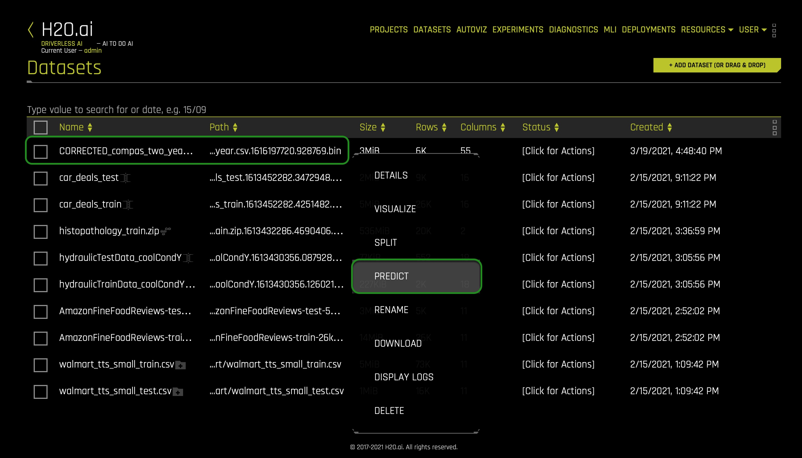

6. Name the experiment: "Two_Year_Predict" 
7. Select as a Target Column: "two_year_recid"

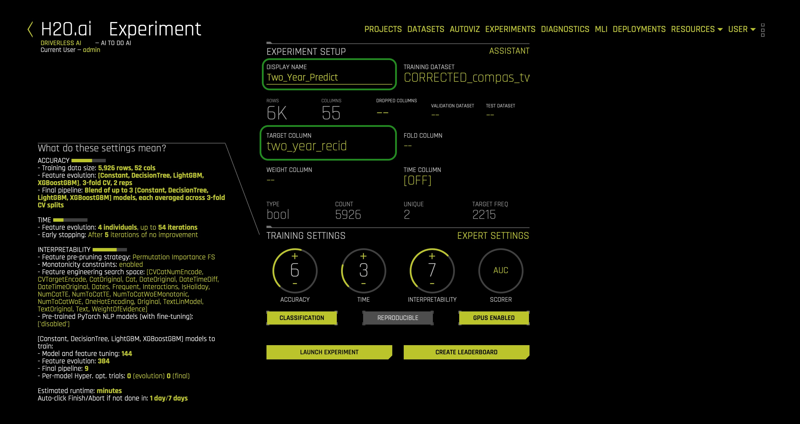

8. Click on the dropped columns option and click the "check all" option. 
9. Unselect the following columns because it will be the columns we will use: 
   - id
   - sex
   - age_cat
   - juv_fel_count
   - juv_misd_count
   - juv_other_count
   - prior_count
   - r_charge_degree
   - r_charge_desc

10. After selecting the specified columns above, click “Done”.

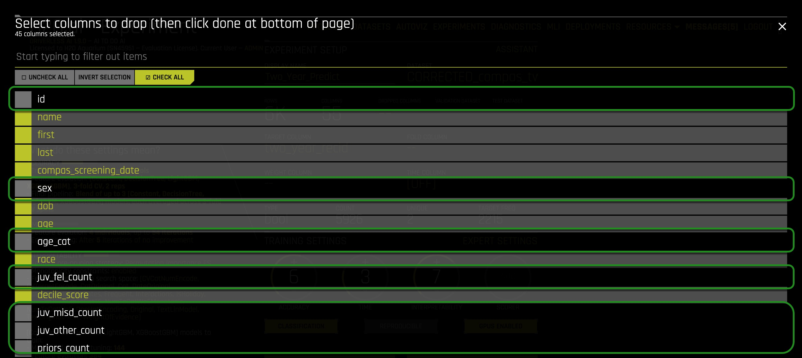

11. Jump to the expert settings and click on the "Model" tab
12. Turn off all models except for the "XGBoost GBM models," make sure it's on.
13. Scroll down in the model tab and set the "Ensemble level for final modeling pipeline" to 0. 
14. Click "Save"

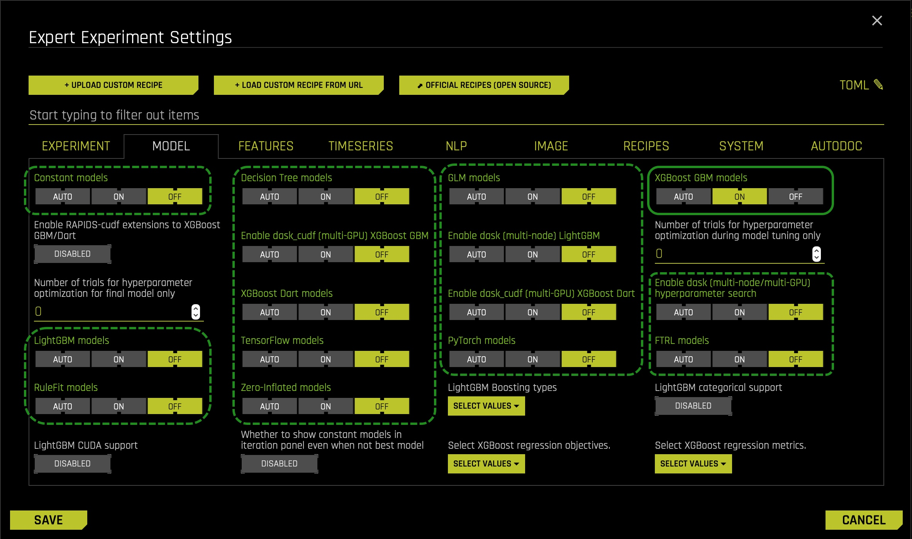

15. On the training settings, set the following:

    - **Accuracy**: 5
    - **Time**: 4
    - **Interpretability**: 7
    - **Scorer**: AUC 

16. Click "REPRODUCIBLE," make sure it's turn on(yellow) 
17. Click "LAUNCH EXPERIMENT"

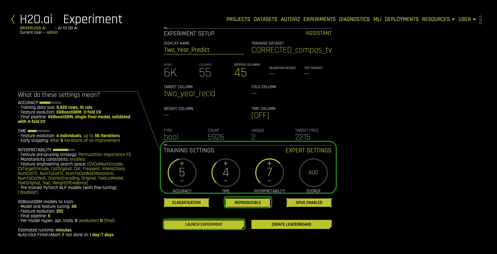

Let's have the experiment run in the background. Simultaneously, in task 2, let's discuss risk assessment tools in the United States, and to understand these tools better, let's explore a particular controversial risk tool name COMPAS. We will continue with the experiment when we debug and diagnose unwanted bias in our prediction system model. 

## Task 2: Explore Criminal Risk Scorers in America and The Compass Dataset

The United States has 5% of the world's population, and therefore, one cannot explain why it holds 25% of the world's prisoners. In other words, one out of four human beings with their hands-on bards is here in the land of the free. As a result, the United States now has the highest rate of incarceration in the world. Such striking statistics are, in part, the product of widespread use of AI models that quote-unquote predict the likelihood of someone to reoffend. Across the United States, "judges, probation, and parole officers are increasingly using algorithms to assess a criminal defendant's likelihood of becoming a recidivist - a term used to describe criminals who reoffend."[1] There are dozens of these risk assessment algorithms in use. Sadly and consequently, many of these risk assessment tools have not been checked for racial bias. As a result, in 2016, ProPublica, a nonprofit newsroom, investigated COMPAS (Correctional Offender Management Profiling for Alternative Sanctions), a commercial risk assessment tool made by Northpointe. ProPublica's investigation concluded that the commercial tool was biased towards African-Americans. In other words, ProPublica "found that Black defendants were far more likely than white defendants to be incorrectly judged to be at a higher risk of recidivism."[2] In contrast, white defendants were more likely than black defendants to be mistakenly flagged as low risk. Northpointe's COMPAS is one of the most widely utilized risk assessment tools/algorithms within the criminal justice system for guiding decisions such as setting bail. 

COMPAS produces a risk score that predicts the probability of someone committing a crime in the next two years. The model's output is a score within 1 and 10 that maps too low, medium, or high. The scores are derived from 137 questions that are either answered by defendants themselves or by criminal records. NorthPointe has argued that race is not one of the questions or features they consider when deriving a score. 

ProPublica concluded that COMPAS was biased after obtaining the risk scores assigned to more than 7,000 people arrested in Broward County, Florida, in 2013 and 2014 and checked to see how many were charged with new crimes over the next two years. As stated above, the data collected for ProPublica's investigation revealed the racial bias in the COMPAS model. At the same time, this sparked a national conversation around AI models' effectiveness and fairness when trying to predict if someone will reoffend after a given arrest. 

As often occurs, many risk assessment tools are adopted without any rigorous testing on whether it works. In particular, most don't evaluate racial disparities and parity that these models can generate when used at multiple levels of our judicial system. 
With the above in mind, we can agree that we need to create fair AI models that can predict someone's likelihood of reoffending. In particular, the above argues that after creating an AI model, we need to check that the model is not biased. Why? Because such a model can have a profound impact on people's lives, and such an impact can be damaging when we discover that the model is unfair and wrong. As a result, when making decisions that have a large impact on people's lives, no level of unwanted bias is acceptable. 

That is why we are in this tutorial, taking our new AI model and checking whether the model holds any racial bias.

### References

[1] [How We Analyzed the COMPAS Recidivism Algorithm](https://www.courts.wa.gov/subsite/mjc/docs/2019/how-we-analyzed-the-compas-r.pdf)

[2] [How We Analyzed the COMPAS Recidivism Algorithm](https://www.courts.wa.gov/subsite/mjc/docs/2019/how-we-analyzed-the-compas-r.pdf)

## Task 3: Understanding Task 1

In contrast to other risk assessment tools, we are creating a model that can predict whether someone will reoffend within two years since a given arrest. The type of information we need our Driverless AI model to learn from is the defendant's past criminal history, age, the charge degree, and description for which the defendant was arrested for, and the piece of information that specifies whether the defendant reoffend within two years since the arrest. 

Luckily for us, we weren't required to look far because we used part of the information ProPublica collected for their investigation. The dataset we used can be found [here](https://github.com/propublica/compas-analysis) in ProPublica's GitHub repo. The repo has several datasets; the one we used is under the following name: compas-scores-two-years.csv. 

The original COMPAS dataset (compas-scores-two-years.csv) contains the following data columns: 

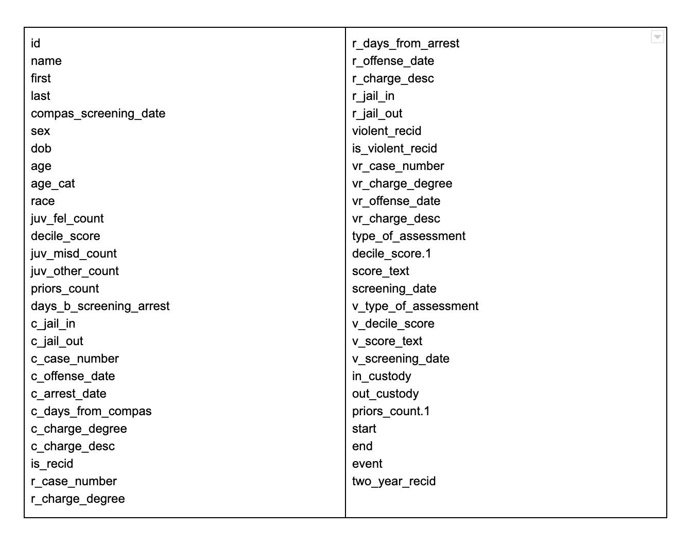

As you notice in task one, we used a data recipe to upload the dataset for our model. The data recipe addresses two significant problems in the original COMPAS dataset that have brought ProPublica's investigation into question. That is why, before making use of specific columns for our model, we used a data recipe to address the two major problems others have pointed to. The two significant issues found in ProPublica's COMPAS dataset are as follows: 

1. As Matias Borenstein notes in GroundAI, a web platform, "ProPublica made a mistake implementing the two-year sample cutoff rule for recidivists in the two-year recidivism datasets (whereas it implemented an appropriate two-year sample cutoff rule for non-recidivists). As a result, ProPublica incorrectly kept a disproportionate share of recidivists in such datasets. This data processing mistake leads to biased two-year recidivism datasets, with artificially high recidivism rates. This also affects the positive and negative values."[3] In other words, to correct for this mistake, we dropped all defendants whose COMPAS screening date occurs after April 1, 2014, with it, we implemented a more appropriate sample cutoff for all defendants for the two-year recidivism analysis. 

In the data recipe (COMPAS_DATA_RECIPE.py) used in task one, the code that addresses the problem above is as follows: 

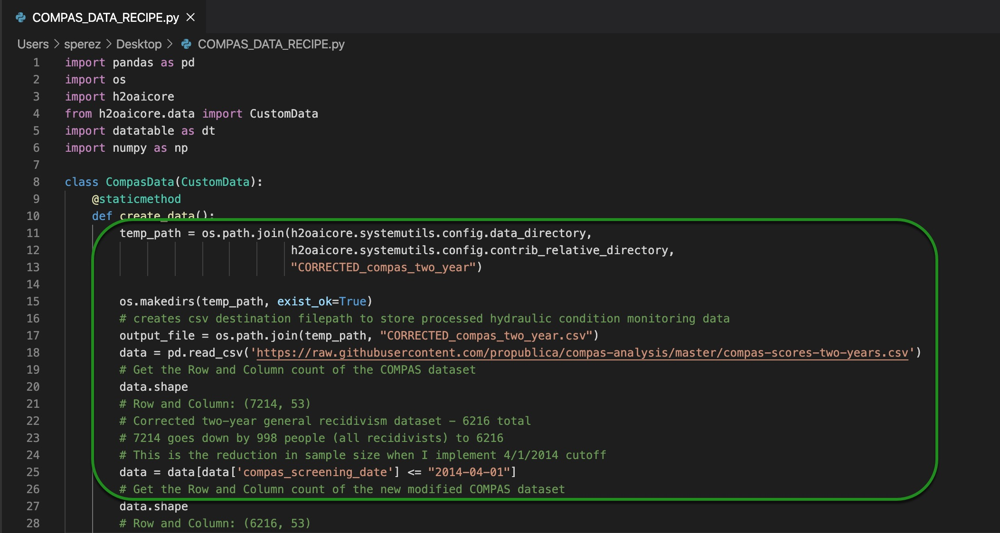

1.  Borenstein also notes the following problem in ProPublica's dataset: "The age variable that ProPublica constructed is not quite accurate. ProPublica calculated age as the difference in years between the point in time when it collected the data, in early April 2016, and the person's date of birth. However, when studying recidivism, one should really use the age of the person at the time of the COMPAS screen date that starts the two year time window. So some people may be up to 25 months younger than the age variable that ProPublica created."[4] To correct this mistake, we had to subtract the c_jail_in column minus dob (date of birth). After correcting the age column, we fixed the age_category column as it is one of the columns we are using to train our model.

In the data recipe (COMPAS_DATA_RECIPE.py) used in task one, the code that addresses the problem above is as follows: 

After correcting the dataset, we made use of the following columns: 

- **sex**: sex of an indiviudal 
- **age_cat**: age category of an individual, possible categories are as follows:  

  - 25 - 45
  - Greater than 45 
  - Less than 25
- **juv_fel_count**: an individual's juvenile felony count 
- **juv_misd_count**: an individual’s juvenile misdemeanor count
- **juv_other_count**: an individual’s juvenile other crimes count 
- **priors_count**: an individual’s prior criminal counts 
- **c_charge_degree**: an individual’s charge degree at the moment of an arrest 
- **c_charge_desc**: an individual's charge description at the moment of an arrest 
- **two_year_recid**: the piece of information on whether an individual was arrested within two years since the last arrest (c_charge_degree and c_charge_desc), the two possible options for the two_year_recid column are 0 and 1 where 0 is false, and 1 is true

We made use of the above columns because they can become good indicators of someone's recidivism probability. The above columns have traditionally been used in the social sciences and AI to predict recidivism probability. The 'two_year_recid' column holds the information on whether someone reoffended within the two-year mark since their last arrest. Since we want to predict whether someone will be arrested within two years since the last arrest, we made 'two_year_recid' our target column. 

We jumped into our currently running model's expert settings because we needed to create a single XGBoost model and set the ensemble level for the final modeling pipeline to 0. Why? To obtain an MLI interpretability report that will be easy to understand when implementing a global versus local behavior analysis. We will discuss this analysis in our next task to see if our model has generated bias despite excluding the race column. 

We turned off all models except for the 'XGBoost GBM Models' because, by doing so, we strictly enforce monotonicity constraints, which in turn makes our model more interpretable. If you want to learn more about 'XGBoost GBM Models,' you can visit the DAI 1.9 documentation on [XGBoost GBM Models](http://docs.h2o.ai/driverless-ai/latest-stable/docs/userguide/expert-settings.html?highlight=xgboost%20gbm%20models#xgboost-gbm-models). 

As noted in task one, we set the interpretability setting to 7. Setting the interpretability to 7 enables monotonicity constraints, significant in our post-analysis. Setting interpretability >= 7 enables monotonicity constraints: simpler feature transformations. If we use an unconstrained model and group fairness metrics, we risk creating group fairness metrics that appear to be reasonable. In other words, monotonicity constraints will allow us to understand and see any instances of discrimination at the individual level. 

Before running our experiment, we enabled "REPRODUCIBLE." Usually, the "REPRODUCIBLE" option is disabled by default. We enabled "REPRODUCIBLE" in our experiment to obtain a high level of precision in our experiment.

By now, our experiment should be done. Let us explore our model now and see if it holds any racial bias.

### References 

[3][ProPublica’s COMPAS Data Revisited](https://www.groundai.com/project/propublicas-compas-data-revisited/1)

[4][ProPublica’s COMPAS Data Revisited](https://www.groundai.com/project/propublicas-compas-data-revisited/1)

## Task 4: A Global Versus Local Behavior Analysis Concept 

Now that our experiment is done, we can generate an MLI report to conduct our global versus local behavior analysis. Click on the "INTERPRET THIS MODEL" option: 

While the several subcomponents of the MLI report are generated, let us better understand this idea of a global behavior versus local behavior analysis concept. 

The analysis is quite simple; we want to explore how our new criminal risk scorer generally behaves (globally); in other words, we want to understand what columns typically drive the model behavior. Looking at the global behavior will reveal what is predicting whether someone will be arrested within the two-year mark since a given arrest.  We are also trying to conduct this local analysis that refers to the idea of seeing that no bias is present at the individual level in these general observations. For example, it could be the case that at the global level, we can have an apparent fair model where decisions are being made with no racial bias. Still, when exploring the model at a local level, we can discover that particular individuals are subject to discrimination and unfairness. As a result, comparing these two levels of behavior can provide us a clear indication of what perhaps needs to change in the dataset or the model itself. For this reason, in the following three tasks, we will use several DAI and surrogate model graphs to compare the global and local behavior in our model predictions and diagnose confounding bias stemming from a latent racist essence in the features we used. Besides, we will answer the following two questions: what biases exist in my model? And what levels of disparity exist between population groups? 

To learn more about this idea of a global behavior versus a local behavior analysis, click [here](https://openreview.net/pdf?id=r1iWHVJ7Z).  

## Task 5: Global Behavior Analysis

At this point, several subcomponents of the MLI report should have already been generated. Your “MLI: Regression and Classification Explanations” page should look similar to this: 

1. In the DAI Model tab, click the transformed Shapley visual. The following should appear: 

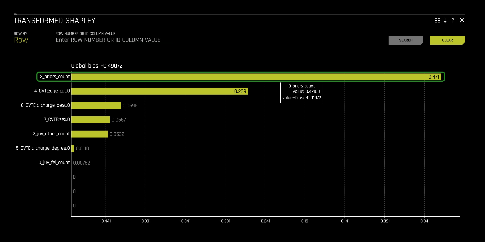

When looking at the transformed Shapley, we can see that the 3_prios_count is a feature created by Driverless AI that positively drives the model behavior. 3_prios_count, being a positive feature, pushes the model's prediction higher on average. 

2. If we click on the summary tab and scroll down where it says, "Most Important Variables for DAI...." we can see the transformed features. You will note that 3_priors_count: 3_priors_count appears at the top among all transformed features. 

At this point, we can see that prior_counts is at the global level driving the model behavior. To solidify this statement, let us see the random forest feature importance and see if prior_counts is at the global level a strong factor of whether someone will be predicted to be arrested within the two-year mark since a given arrest. 

3. Click on the Surrogate Models tab and click on the "RF Feature Importance" visual.

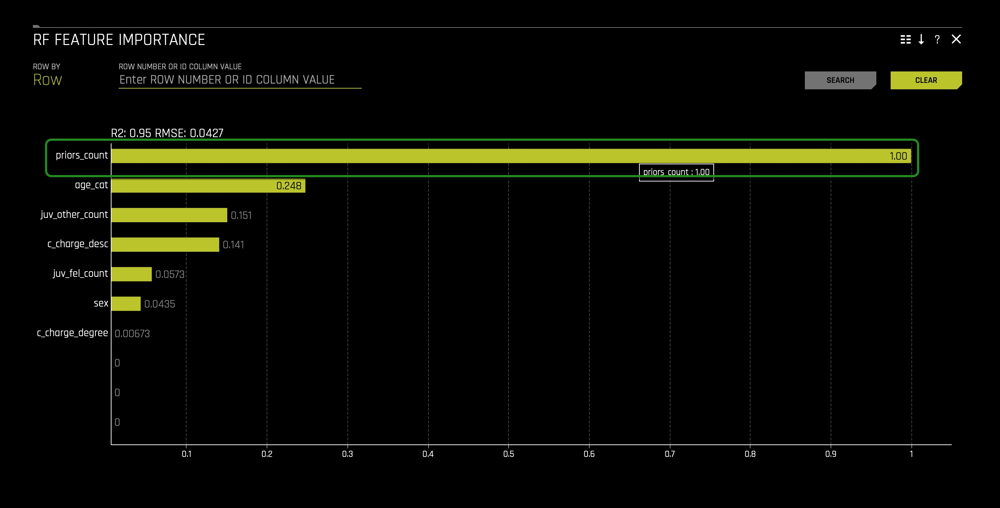

When looking at the rf feature importance horizontal graph, we can see that prior_count is at the top. With this in mind, we can see that the prior count feature is the top influencer in the model. To further solidify the pre-conclusion that prior_count is the top influencer in the model, let us see the decision tree in the surrogate models' tab.

4. Click on the "x" mark at the top right corner of the rf feature importance horizontal graph. 

5. On the surrogate models' tab, click on the decision tree visual. 

The higher a feature appears in a decision tree, the more critical they are in the model prediction system. The frequency that a particular feature appears in a decision tree can also reveal its importance. Additionally, features connected by a branch can show, to an extent, a relationship between the features when making predictions in our model. Hence, when looking at our decision tree, we can note that prio_count appears four times and is the highest feature in the decision tree. Accordingly, it will be appropriate for us to conclude that indeed it seems that at the global level, prior_count is driving the predictions. 

Before moving forward, I will like to note that based on the transformed Shapley, rf feature importance, and decision tree, age is the second most influential feature in the model. And this can present a problem because we don't want age to be a factor when predicting two-year recidivism. 

Going back to our conversation around prior_count, for many, using prior_count in our model will seem like a no problem. Many will argue that using prior-count will make sense given that it tells whether someone has been breaking the law. But, when exploring prior_count in-depth, we discover that prior_count holds a tremendous racial bias.

To better understand this idea of prior_count holding a certain level of racial bias, considered what several members of the National Registry of Exonerations have argued in their 2017 [report](http://www.law.umich.edu/special/exoneration/Documents/Race_and_Wrongful_Convictions.pdf) title: RACE AND WRONGFUL CONVICTIONS IN THE UNITED STATES: 

- “Race is central to every aspect of criminal justice in the United States. The conviction of innocent defendants is no exception. 

  As of October 15, 2016, the National Registry of Exonerations listed 1,900 defendants who were convicted of crimes and later exonerated because they were innocent; 47% of them were African Americans, three times their rate in the population. About 1,900 additional innocent defendants who had been framed and convicted of crimes in 15 large-scale police scandals were cleared in “group exonerations;” the great majority of those defendants were also black. Judging from the cases we know, a substantial majority of innocent people who are convicted of crimes in the United States are African Americans. 

  What explains this stark racial disparity? We study that question by examining exonerations for murder, sexual assault and drug crimes, the three types of crime [that] produce the largest numbers of exonerations. What we see—as so often in considering the role of race in America—is complex and disturbing, familiar but frequently ignored...The causes we have identified run from inevitable consequences of patterns in crime and punishment to deliberate acts of racism, with many stops in between.”[5]

Besides the National Registry of Exonerations, the Washington Post reported the following this past June in their article title: There’s overwhelming evidence that the criminal justice system is racist. Here’s the proof: 

- “[A 2017 study](https://papers.ssrn.com/sol3/papers.cfm?abstract_id=3036726) of about 48,000 criminal cases in Wisconsin showed that white defendants were 25 percent more likely than black defendants to have their most serious charge dismissed in a plea bargain. Among defendants facing misdemeanor charges that could carry a sentence of incarceration, whites were 75 percent more likely to have those charges dropped, dismissed or reduced to a charge that did not include such a punishment.”[6]

The New York Times also reported the above last year. As well, the Washington Post reported in a series of reports and analyses that African Americans across the country are being wrongly arrested and, therefore, adding more wrongly convictions to their prior charge count. As a result, of having wrong charges and a high prior_count African Americans experience the following as reported in the Washington Post: 

- "[A 2008 analysis found](http://citeseerx.ist.psu.edu/viewdoc/download?doi=10.1.1.821.8079&rep=rep1&type=pdf) that black defendants with multiple prior convictions are 28 percent more likely to be charged as “habitual offenders” than white defendants with similar criminal records. The authors conclude that “assessments of dangerousness and culpability are linked to race and ethnicity, even after offense seriousness and prior record are controlled.”[7]

We can see a cycle of unfair charges added to an African American's criminal record with the above in mind. Given these points, we can see that having priors_count at the global level be the most significant deciding factor of a prediction can present problems when we know that the value of priosr_count can result from our existing racist criminal justice system. 

Generally speaking, we can say that our model's global behavior is biased, given how prior counts are derived in the United States (the dataset we are using holds information of people who were arrested in the United States). In a word, it seems that it will be wrong to make use of the priors_count feature in our model, knowing that it will disproportionately affect African Americans. If we were to look at the rf partial dependence plot in the surrogate model's tab, we would discover that as the count of priors_count increases, the probability of being predicted to be arrested within two years since the last arrest also increases. And knowing that African Americans might have high prior count values due to our existing racist criminal justice system, it will be appropriate and moral to drop the priors_count feature. If we were to eliminate priors_count, the age feature would become the most influential feature when predicting recidivism within a two-year mark since a given arrest. Sadly, that will bring a similar problem that will discriminate based on age. Imagine for a moment being predicted to be arrested within two years since the last arrest only because you are young, between 20 - 25 years old; that seems wrong. All things considered, it will also be appropriate to eliminate the age_cat feature as well. 

Now, the two questions that come to mind now are: 

1. What features will be correct to use in our prediction model? 
2. Are the other features currently used in this model free from racial bias? 

In our final analysis in task 8 will explore how the above two questions can be answered. 

### References

[5][RACE AND WRONGFUL CONVICTIONS IN THE UNITED TATES](http://www.law.umich.edu/special/exoneration/Documents/Race_and_Wrongful_Convictions.pdf)

[6][There’s overwhelming evidence that the criminal justice system is racist. Here’s the proof.](https://www.washingtonpost.com/graphics/2020/opinions/systemic-racism-police-evidence-criminal-justice-system/)

[7][There’s racial bias in our police systems. Here’s the proof.](https://www.washingtonpost.com/graphics/2020/opinions/systemic-racism-police-evidence-criminal-justice-system/)

## Task 6: What Biases Exist in My Model? What Levels of Disparity Exist Between Population Groups? 

Now that we know that the global model behavior is biased, let us answer the following two questions: 

- What biases exist in my model?
- What levels of disparity exist between population groups? 

To answer both questions, we will use the disparate impact analysis tool located in the DAI model tab. In the DAI Model tab, click on the disparate impact analysis visual. 

1. Click on the Disparate Impact Variable button and select the **race** option.
2. Click on the Reference Level button and change the reference level to **caucasian**. The following should appear: 

*Note*: We want to analyze possible harmful disparities, and therefore, we are setting the reference level to the population we believe may be receiving better treatment than other groups. Based on the articles presented earlier in this tutorial, we will have Caucasians as the reference level.  

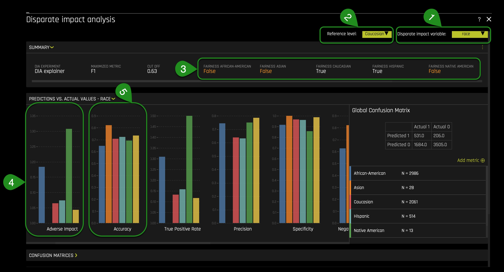

3. In the summary tab, we can see African Americans, in a general sense, are not receiving fairness compared to Caucasians. The orange "False" label under the African American label indicates such wrongness. It appears that in this model, Caucasians and Latinos, in reference to African Americans, are not experiencing unfairness. The orange "True" label under the Caucasian and Hispanic label indicates such truth.

4. Before looking at the disparate impact graph bar, note the following: 

   - **Blue**: African American
   - **Orange**: Asian
   - **Red**: Caucasian 
   - **Heavenly**: Hispanic 
   - **Green**: Native American 
   - **Yellow**: other

When looking at the disparate impact graph bar, we can see that African Americans and Native Americans in this model are experiencing a high level of disparate impact compared to Caucasians. And this doesn't seem right and, by default, will make this model morally wrong because of its nature to adversely impact African Americans and Native Americans. In other words, the two_year_recid predictions of this model will adversely affect African Americans and Native Americans if used in production. 

5. When looking at the accuracy graph bar, we can see that African Americans have the lowest accuracy compared to other groups. This graph and the disparate impact graph would present a considerable social problem if the model were implemented in production. Given that accuracy is the percentage of classifying true cases of two_year_recid, one will expect accuracy to be the same for all groups. Having a low accuracy, in other words, is a red flag because it will mean that the model is not really able to identify true cases of two_year_recid, and that will mean that the model is now in a way no better than random guessing. 

In the graphs, scroll to the left to see the other graphs. The following should appear: 

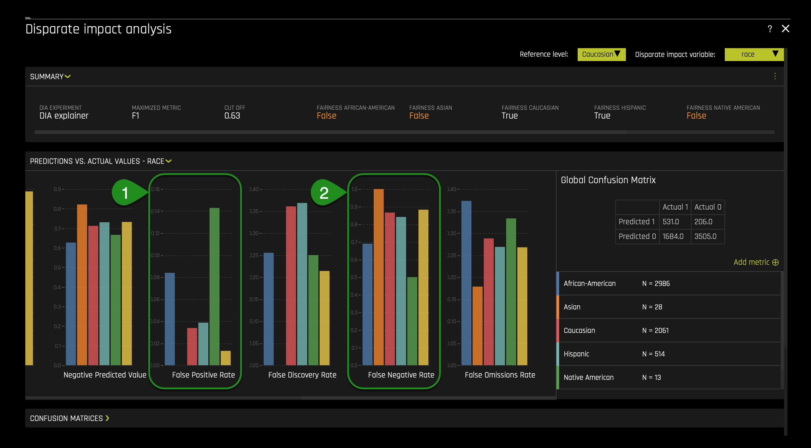

1. When looking at the false positive rate graph bar, we can see that African Americans have a high false-positive rate, a MAJOR red flag. By way of explanation, this is telling us that in this AI prediction model, African Americans, compared to all other groups, are wrongly being predicted to be arrested within two years since their last arrest. From an ethical, legal, and social perspective, this high false-positive rate will be seen as wrong and consequential to society and the legal system. If this model was to be used in production with no knowledge of its bias, it could lead to longer prison times. Why? Because this model would wrongly predict that someone will be arrested again within the two-year mark since the last arrest.

2. When looking at the false-negative rate graph bar, we can see that African Americans have the lowest false-negative rate compared to other groups with a high false-negative rate. These differences in rate can present a high-security issue and favor real criminals. If this model were in production, these high levels of false-negative rates would benefit true cases of two_year_recid.

Moving forward with our disparate impact analysis, let's look at the confusion matrices for the Caucasian and African American groups. Scroll down and open the confusion matrices section. The following should appear: 

The confusion matrices above are structure as follows: 

When looking at the confusion matrices for both African Americans and Caucasians, we can see that the false-positive value differs tremendously between both groups. African Americans have a false positive value of 871, while Caucasians have a false positive value of 500. That's a 371 difference. This difference would harm the African American community if the model were to be used in production. 

Moving forward with our disparate impact analysis, let's look at the group disparity and group parity metrics. Scroll down and open the disparity and group parity metrics section. The following should appear: 

1. Before moving forward with our analysis, let us recall the adverse impact analysis / four-fifths rule. According to the Prevue website, the four-fifths rule can be explained as follows: 

   - "Typically, adverse impact is determined by using the four-fifths or eighty percent rule. The four-fifths or 80% rule is described by the guidelines as "a selection rate for any race, sex, or ethnic group which is less than four-fifths (or 80%) of the rate for the group with the highest rate will generally be regarded by the Federal enforcement agencies as evidence of adverse impact, while a greater than four-fifths rate will generally not be regarded by Federal enforcement agencies as evidence of adverse impact.""[8]

This rule is very up for debate on how this will develop going forward, but for now, we have set the low (unfairness) threshold to .8. But of course, when we are talking about making decisions on whether to send someone to prison, no difference in treatment should be allowed.  But in our efforts to analyze this model, let's see if the model can achieve fairness under a benchmark that will require the model not to treat 80% less favorably the non-white groups than the Caucasian group.

2. In the group disparity section, note that in the Caucasian row, all column values are 1.00000. The reference level in this case will always be 1.00000. The 1.00000 number will be the acceptable and fair reference value we will desire to see among other racial groups in our model. 

3. The adverse impact disparity value for African Americans in this built model is 1.46840. Compared to Caucasians, the difference is .46840. Note that the value is highlighted in orange, and that is because it is out of range. The range is between the high threshold of 1.25 and a low threshold of 0.8. The red flag here is having an increased adverse impact disparity value compared to the reference level or any other group. In other words, this difference is saying that a substantially high rate of wrong predictions exists, which works to the disadvantage of the African American group. 

4. The false-positive rate disparity for African Americans is 1.48404, a .48404 addition to the reference level's false-positive rate disparity value. And this is perhaps the giant red flag because this model is mispredicting African Americans at a 1.48404 rate disparity: the highest rate disparity among all groups. 

5. The false-negative rate disparity for African Americans is 0.49693. In comparison to Caucasians, that's a 0.50307 decrease. This difference results in problems because, in the Caucasian group, we will see a higher rate of false-negatives: a security problem. This difference also presents a wrong double standard wherein one hand, we have the model wrongly predicting more instances of  1 where 1 is a true two_year_recid  in the African American group. And on the other hand, we have the same model predicting higher false-negative instances in the Caucasian group. 

6. In the group parity section, we see that no fairness is achieved across all categories except for the 'negative predicted value parity' column. 

This model will fail the adverse impact analysis / four-fifths rule. If we were to change the rule to a rule where no disparity will be allowed, the model would reflect higher disparity rates across the categories observed above—a much more disturbing disparity. As a result, the appropriate and straightforward answer to the two questions at the beginning of this task will be that the model has a lot of bias, and huge disparities and injustices exist between racial groups, in particular, within the African American community. 

### References

[8][Adverse Impact Analysis / Four-Fifths Rule.](https://www.prevuehr.com/resources/insights/adverse-impact-analysis-four-fifths-rule/)

## Task 7: Local Behavior Analysis

Now that we know that bias is introduced to an extent at the global level let us explore how disparity and bias are generated in particular instances now that we know that huge disparities and injustices exist between racial groups. 

In the DAI Model tab, click on the sensitivity analysis visual, the following should appear: 

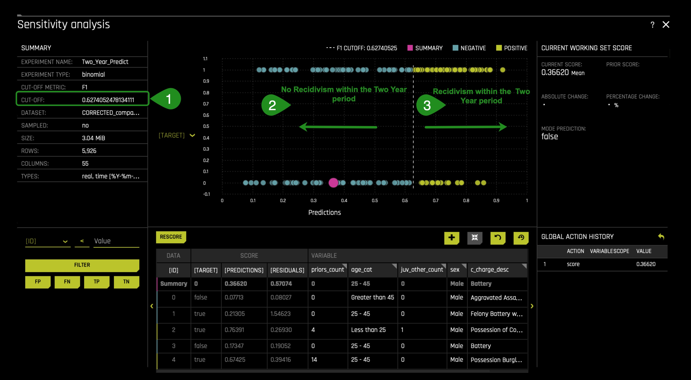

1. Here we see that the cut-off is 0.38840827(dash line), anything below the cut-off will be predicted as a true two_year_recid. Anything above the cut-off will be predicted as a true two_year_recid. 
2. Here the false two_year_recid's are to the left.
3. Here the true two_year_recid's are to the right. 

4. To understand the model's local behavior, let us analyze the false-positive instances in the African American community through what is called a  residual analysis. This analysis will allow us to look at multiple false-positive cases that are super close to the cut-off. And with that, we will modify specific column values of these cases, and we will observe for any changes in prediction. As of now, the table in the sensitivity analysis page doesn't have the race column. Why? Because it was not used during our experiment. We need the race column for our residual analysis because we need to know each case's race. To add the race column, click on the plus icon located at the top right corner of the sensitivity analysis table. In there, look for the race option and click on it as shown on the above image.

5. Click on the SET option 

Scroll to the left of the table, and you will be able to see the rest of the table and the new column added. On the left side, you will see the filter section of the sensitivity analysis page, and in there, filter with the following options: race == African-American. 

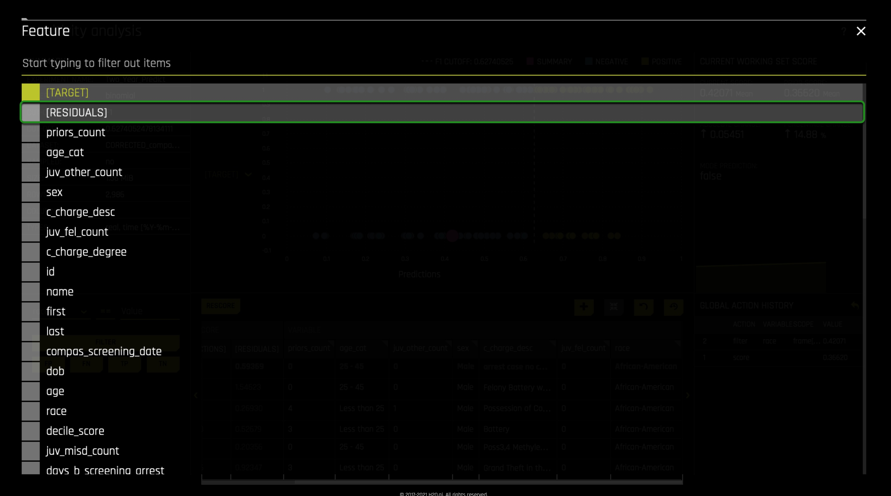

In the sensitivity analysis graph, change the [Target] option to [Residuals]. 

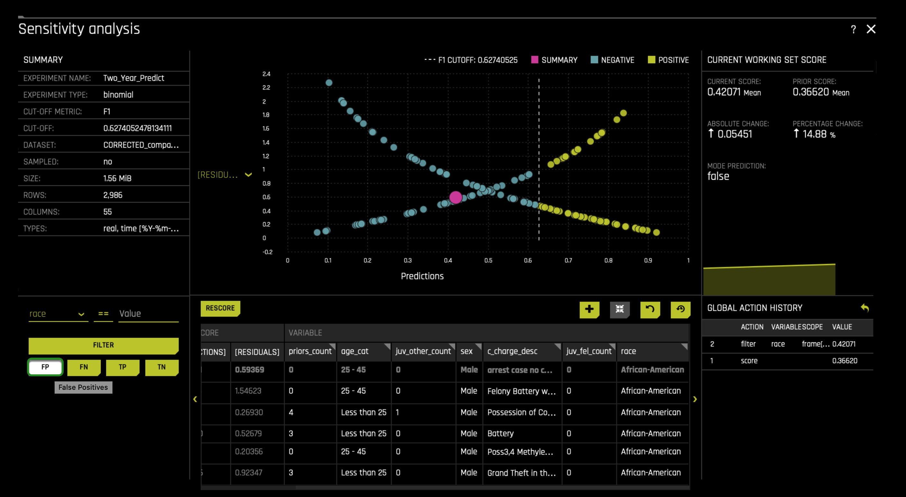

In the filter section, click on the FP option; this will select the African American group's false positives. After clicking the FP option, the graph should look similar to the image above, where the closer you are to the cut-off line, the closer you were in the model to being predicted as a false two_year_recid. 

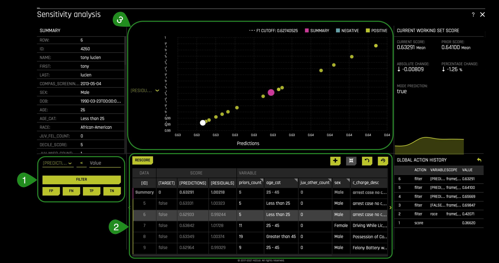

Rather than looking at every instance of false positives in the African American group, let's look at the instances that are super close to the cut-off line and see if the priors_count column is truly driving the model behavior. Reminder: sensitivity analysis enables us to tinker with various data settings to see their weight in a prediction.  

1. To get close to the instances that are close to the cut-off line, I filtered [ID] < 5 (it might be the case that you will have to filter with other options to get close) 
2. The table now represents the five instances that are close to the cut-off line.
3. The graph will now reflect the above table's information showcasing the five instances that are close to the cut-off line.

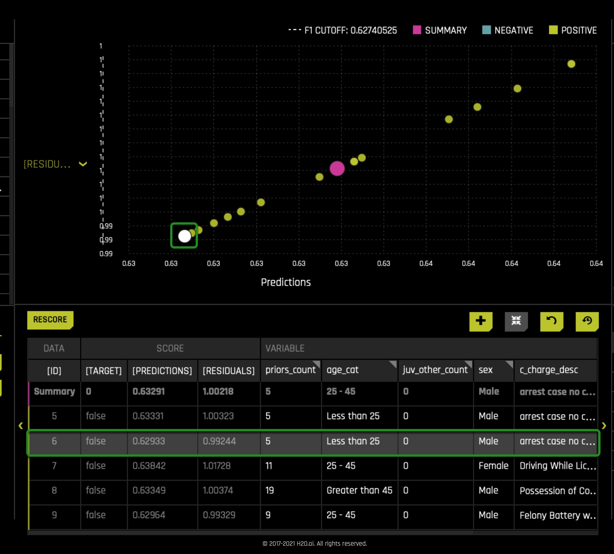

In prediction number 4 ([ID] 4), as highlighted in the image above, we see an African American that was never arrested within the two-year mark, but the model predicted the opposite: a wrong prediction. In this case, we see a male with four prior counts and in the greater than 45 age category. Let's see if having four prior counts was the deciding factor.  

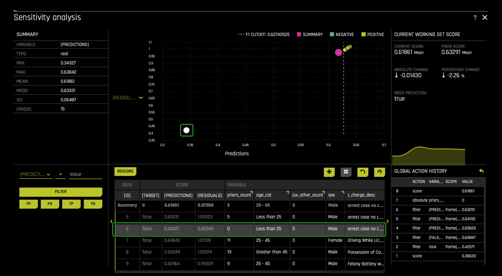

Change the priors_count value from four to zero. Right after, click on the rescore option (on the top left corner where the table is located); something similar to the above page should appear. Here we see that the prediction has been flipped, and as well we come to realize that this person was judged based on his prior counts. It is worth noting that this person perhaps obtained such four prior counts because of racism in our judicial system and, therefore, was predicted by the model as a true two_year_recid. I am not saying that’s true but given our biased judicial system, that’s not hard to believe. It's something to think for now. 

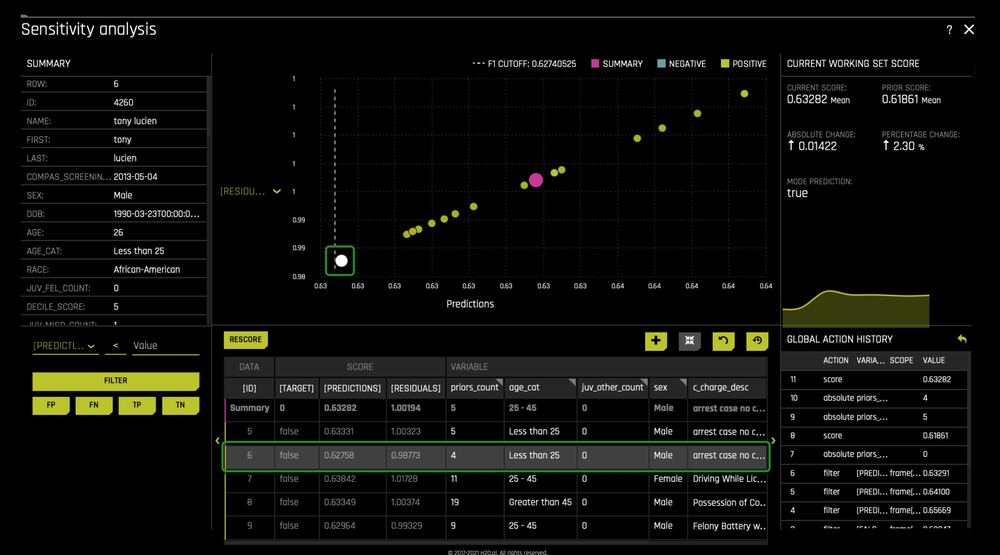

Now let's look if decreasing a priors_count by one will change a prediction. Before moving forward, click the backtrack clock icon on the top right corner where the table is displayed. In prediction number 1 ([ID] 1), let's decrease the prios_count by one. Immediately rescore the graph. Something similar to the image above should appear. Here we see that the prediction was flipped and what is concerning is that the change is drastic. The prediction went from 0.45075 to 0.38016. Imagine that this model is being used, and this person is predicted to be true two_year_recid because of one extra prior count that was possibly wrongly added to the record. The just stated scenario is not hard to believe, given the judicial system's existing bias, especially when we arrest people on the streets.  

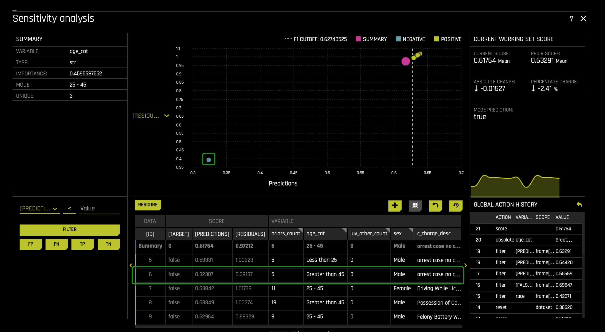

As mentioned above, age was also another factor at the global level, and with that in mind, let's see if that's true for the local level. Click on the backtrack clock icon and modify the age_cat value for prediction number one. Change the age_cat value from Less than 25 to Greater than 45, after, rescore the graph. We see that the prediction is also flipped, which isn't good because we don't want age to determine a true or false two_year_recid. 

With the above, we can conclude that at the local level, we also have a bias in the form of priors_count where priors_count is not a true reflection of someone's true criminal record if we consider the racial bias within the judicial system. We also see that ageism (a type of bias) is introduced to the model when we see that age_cat can determine a true or false two_year_recid. In conclusion, bias exists at the local level.  

## Task 8: The Reciprocal Impact that Should Exist Between AI, the Social Sciences, and Humanities

At this point, many will wonder how we can solve these issues presented at the global and local levels. A solution will be to have the humanities, and social sciences integrated and extend their work to the process of AI model creation. Also, have the AI world consult the humanities and social sciences when we could generate models that profoundly impact people's lives. To understand the reciprocal impact that should exist between AI, the social sciences, and humanities, we will explore five problems that can arise if we were to use our model or similar models made by others. Simultaneously, we will discuss how that reciprocal impact can lead to a more acceptable and fair integration of AI into our daily lives and the judicial system.

**Problem 1: Confrontation Clause**

To start our analysis, consider the opening statement Rebecca Wexler wrote in her New York Times article title When a Computer Program Keeps You in Jail:

- “The criminal justice system is becoming automated. At every stage — from policing and investigations
to bail, evidence, sentencing and parole — computer systems play a role. Artificial intelligence deploys cops on the beat. Audio sensors generate gunshot alerts. Forensic analysts use probabilistic software programs to evaluate fingerprints, faces and DNA. Risk-assessment instruments help to determine who is incarcerated and for how long.

  Technological advancement is, in theory, a welcome development. But in practice, aspects of automation are making the justice system less fair for criminal defendants.

  The root of the problem is that automated criminal justice technologies are largely privately owned and sold for profit. The developers tend to view their technologies as trade secrets. As a result, they often refuse to disclose details about how their tools work, even to criminal defendants and their attorneys, even under a protective order, even in the controlled context of a criminal proceeding or parole hearing.

  Take the case of Glenn Rodríguez. An inmate at the Eastern Correctional Facility in upstate New York, Mr. Rodríguez was denied parole last year despite having a nearly perfect record of rehabilitation. The reason? A high score from a computer system called Compas. The company that makes Compas [considers the weighting of inputs to be proprietary information](http://washingtonmonthly.com/magazine/junejulyaugust-2017/code-of-silence/).”[9] As a result, Mr. Rodríguez wasn’t able to cross-examine the score (evidence) used against his parole denial. 

The above is a clear example of how AI is deciding whether someone will receive parole while not allowing a defendant to cross-examine the evidence. For legal practitioners and other social scientists, this will be in clear violation of the confrontation clause found in the constitution. The confrontation clause is as follows: 

- “The Confrontation Clause of the [Sixth Amendment to the United States Constitution](https://en.wikipedia.org/wiki/Sixth_Amendment_to_the_United_States_Constitution) provides that "in all criminal prosecutions, the accused shall enjoy the right…to be confronted with the [witnesses [evidence]](https://en.wikipedia.org/wiki/Witness) against him." Generally, the right is to have a face-to-face confrontation with witnesses who are offering testimonial evidence against the accused in the form of cross-examination during a trial. The [Fourteenth Amendment](https://en.wikipedia.org/wiki/Fourteenth_Amendment_to_the_United_States_Constitution) makes the right to confrontation applicable to the states and not just the federal government.[1] The right only applies to criminal prosecutions, not civil cases or other proceedings.”[10]

As of now, it isn't very easy to explain an AI model's predictions. And for the most part, the explanations of these AI models cannot be disclosed because they are protected by law. A lack of explanation of how predictions are derived will prevent the recidivism AI model's use if the predictions can't be explained; cross-examination will not be possible. This lack of explainability hasn't stopped courtrooms from using AI models to determine who is incarcerated and for how long. 
To address this problem, AI makers and law practitioners should discuss and work together when building recidivism models. The collaboration will allow for an understanding of why such models will be violating the law and how we can perhaps work around the problem of a lack of explainability. This joint work can also lead to the often practice to consult law practitioners before using models that can have substantial legal consequences. In our case, consulting legal practitioners can allow for a deeper understanding of how perhaps our model can affect the confrontations clause or other parts of the law. 

**Problem 2: Fair and unfair models will still be wrong in the legal field**

Even if we were to build recidivism models that can accurately predict whether someone will be arrested within two years since the last arrest, that will still not exclude the model from being labeled as wrong. Image for one moment that you are in court, and you are given more time behind bars because you have been predicted to be arrested again by this perfect AI model. In a way, you will be punished by something that you haven't committed. According to the law, you can't be punished behind bars for something you haven't done. Will it be wrong to keep someone in jail because you know that person will soon commit another crime? Will it be wrong for you to let that person go because the offense hasn't been committed, but will be quickly committed in the near future? Hence, the argument that fair and unfair models will still be wrong in the legal field. The question now is whether this will be wrong or not. In a way, this is a moral problem that I believe the humanities and social sciences can answer best. If it's the case that members of the social sciences and humanities conclude that it will be wrong, that will impact the AI world in a way that it will make their AI model creations unnecessary. Concerning us, this will affect the possible implementation of our built AI model.

**Problem 3: Unreachable perfect models**

In the world of AI, constant work is being done to achieve perfect AI models. Still, that work many have agreed is useless, given that we will never be able to attain perfect AI models given the complexity of AI model creation. However, we have models that can get pretty close to perfection. The only problem with these models will be that they will hold a certain level of wrongness and unfairness. For many, AI models predicting recidivism and with a small amount of unfairness will be acceptable, given that it will generate a lot of goodness. The question here will be if this argument will justify the existence of a certain level of unfairness in our model. In a way, social scientists can tell us the goods and bad this can generate in society and perhaps have the philosophy field tell us if it will be morally acceptable. Sadly, these interdisciplinarity conversations are often not occurring. Consequently, we lack a moral decision and consciousness on whether to leverage AI's power while allowing for a certain amount of imperfection/unfairness in our model. 

**Problem 4: Defining Fairness**

The AI world lacks a concrete moral definition of what will be considered an excellent fair model. The author's option is that by studying the several existing moral philosophies, we will clearly define fairness in the AI world. That is why more interdisciplinary conversations around AI and the social sciences and humanities are necessary. If we want to integrate AI into several aspects of our daily lives, we need to make sure that such AI will not create or amplify social problems. That is why we need a concrete definition of fairness to force every AI model to abide to the fairness criteria.   

**Problem 5: Prior Criminal Counts**

As discovered, it is clear that someone's prior criminal count can't be a clear reflection of true recidivism. Like prior counts, we also notice that age is another factor that shouldn't be considered when predicting recidivism. Correspondingly, we need to replace these traditionally used recidivism factors and explore for new unbiased features. Thus, we need joint work between AI, the social sciences, and the humanities if we hope to predict multiple recidivism types truly. 

**Final Analysis**

As a final analysis, the AI world is growing and changing our society. We need the social sciences and humanities to solve the problems AI is creating during its creation. This joint work can genuinely be the key to more acceptance of AI into our daily lives while leveraging AI's power. Most of the errors produced by AI models are impacting the most marginalized groups. This dislike needs to change, and the change starts when we work together to understand the several impacts these models can have on the most marginalized groups. Whether people are already integrating the social sciences and humanities to AI, we need to make sure that such integration is speedup because we currently have the wrong following titles in several news sources across the country: 

- When AI in healthcare goes wrong, who is responsible?
- Rise of the racist robots – how AI is learning all our worst impulses
- Racist Data? Human Bias is Infecting AI Development
- Google apologizes after its Vision AI produced racist results
- 600,000 Images Removed from AI Database After Art Project Exposes Racist Bias

### References 

[9][When a Computer Program Keeps You in Jail](https://www.nytimes.com/2017/06/13/opinion/how-computers-are-harming-criminal-justice.html)

[10][Confrontation Clause - Wikipedia](https://en.wikipedia.org/wiki/Confrontation_Clause)

## Next Steps

Check out the next tutorial: [Time Series Tutorial - Retail Sales Forecasting](https://training.h2o.ai/products/tutorial-2a-time-series-recipe-tutorial-retail-sales-forecasting) where you will learn more about:

- Time-series:
- Time-series concepts
- Forecasting
- Experiment settings
- Experiment results summary
- Model interpretability
- Analysis
