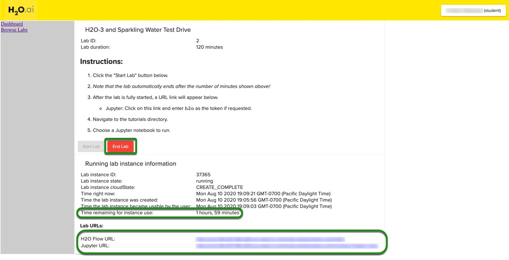

# ML Foundations: Module 3 Session 1: Dive into Supervised Learning with H2O-3 - Regression Case Study Hands-On Assignment in H2O-3 (Part 2)

### Objective

This is **Part 2** of a 2-part exercise wherein you are required to complete a case study pertaining to regression machine learning problems using the open-source machine learning platform, [H2O-3](https://www.h2o.ai/products/h2o/).

For this assignment, you will continue using the subset of the Freddie Mac Single-Family dataset to try to predict the interest rate for a loan using H2O's XGBoost and Deep Learning models. you will explore how to use these models for a regression problem, and then use H2O's grid search to tune the hyper-parameters of both models.
 
**Note: This tutorial has been built on Aquarium, which is H2O.ai's cloud environment providing software access for workshops, conferences, and training. The labs in Aquarium have datasets, experiments, projects, and other content preloaded. If you use your version of H2O-3 or Driverless AI, you will not see preloaded content.**
 
### Prerequisites

- Basic knowledge of Machine Learning and Statistics
- An [Aquarium](https://aquarium.h2o.ai/) Account to access H2O.ai’s software on the AWS Cloud. 
  - Need an [Aquarium](https://aquarium.h2o.ai/) account? Follow the instructions in the next section **Task 1 Create An Account & Log Into Aquarium** to create an account
  - Already have an Aquarium account? Log in and continue to **Task 2 Launch the H2O-3 & Sparkling Water Lab** to begin your exercise!
 
**Note: Aquarium's Driverless AI lab has a license key built-in, so you don't need to request one to use it. Each Driverless AI lab instance will be available to you for two hours, after which it will terminate. No work will be saved. If you need more time to further explore Driverless AI, you can always launch another lab instance or reach out to our sales team via the [contact us form](https://www.h2o.ai/company/contact/).**
 
### Task 1: Create An Account & Log Into Aquarium
 
Navigate to the following site: https://aquarium.h2o.ai/login and do the following: 

1\. create a new account (if you don’t have one) 
2\. log into the site with your credentials.
3\. Navigate to the lab: *H2O-3 and Sparkling Water Test Drive*. Click on Start Lab and wait for your instance to be ready. Once your instance is ready, you will see the following screen

Click on the Jupyter url to start a jupyter notebook or the H2O Flow instance( if required). You can create a new Jupyter notebook and follow the steps defined below.

### Task 2: Case Study- Regression

Open the following tutorial: [1B. Introduction to Machine Learning with H2O-3 - Regression](https://training.h2o.ai/products/1b-introduction-to-machine-learning-with-h2o-3-regression)
 
- In this exercise, you will follow the steps in the above tutorial and use H2O’s XGBoost model to try to predict whether or not a mortgage loan will be delinquent or not.
- You do also have the option to complete the tutorial to earn a badge

### Next Steps

Now that you have completed the above case study you can now proceed on to attempt the **Quiz 1: Session 1: Dive into Supervised Learning with H2O-3 - Classification & Regression Case Studies.**

 

 
